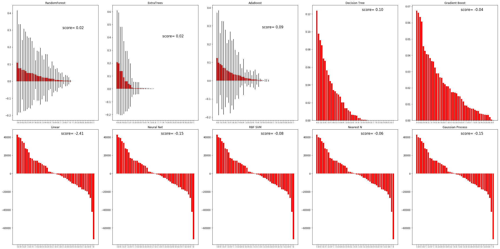

## Preliminaries


```python
# Load pandas
import pandas as pd

# Load numpy
import numpy as np

# Set random seed
np.random.seed(0)
```


```python
%time pd_sur=pd.read_json("Surroundings.json")
%time pd_sur.set_index('store_code',inplace=True)
pd_sur
```

    Wall time: 4.78 s
    Wall time: 1e+03 µs
    Wall time: 0 ns


<div>
<style>
    .dataframe thead tr:only-child th {
        text-align: right;
    }

    .dataframe thead th {
        text-align: left;
    }

    .dataframe tbody tr th {
        vertical-align: top;
    }
</style>
<table border="1" class="dataframe">
  <thead>
    <tr style="text-align: right;">
      <th></th>
      <th>surroundings</th>
    </tr>
    <tr>
      <th>store_code</th>
      <th></th>
    </tr>
  </thead>
  <tbody>
    <tr>
      <th>10055</th>
      <td>{u'subway_station': [], u'department_store': [...</td>
    </tr>
    <tr>
      <th>10077</th>
      <td>{u'subway_station': [], u'department_store': [...</td>
    </tr>
    <tr>
      <th>10079</th>
      <td>{u'subway_station': [], u'department_store': [...</td>
    </tr>
    <tr>
      <th>10086</th>
      <td>{u'subway_station': [], u'department_store': [...</td>
    </tr>
    <tr>
      <th>10111</th>
      <td>{u'subway_station': [], u'department_store': [...</td>
    </tr>
    <tr>
      <th>10377</th>
      <td>{u'subway_station': [], u'department_store': [...</td>
    </tr>
    <tr>
      <th>10441</th>
      <td>{u'subway_station': [], u'department_store': [...</td>
    </tr>
    <tr>
      <th>10545</th>
      <td>{u'subway_station': [], u'department_store': [...</td>
    </tr>
    <tr>
      <th>10548</th>
      <td>{u'subway_station': [], u'department_store': [...</td>
    </tr>
    <tr>
      <th>10672</th>
      <td>{u'subway_station': [], u'department_store': [...</td>
    </tr>
    <tr>
      <th>10814</th>
      <td>{u'subway_station': [], u'department_store': [...</td>
    </tr>
    <tr>
      <th>10820</th>
      <td>{u'subway_station': [], u'department_store': [...</td>
    </tr>
    <tr>
      <th>10871</th>
      <td>{u'subway_station': [{u'rating': 4.3, u'place_...</td>
    </tr>
    <tr>
      <th>10883</th>
      <td>{u'subway_station': [], u'department_store': [...</td>
    </tr>
    <tr>
      <th>10928</th>
      <td>{u'subway_station': [], u'department_store': [...</td>
    </tr>
    <tr>
      <th>10962</th>
      <td>{u'subway_station': [], u'department_store': [...</td>
    </tr>
    <tr>
      <th>10975</th>
      <td>{u'subway_station': [], u'department_store': [...</td>
    </tr>
    <tr>
      <th>10992</th>
      <td>{u'subway_station': [], u'department_store': [...</td>
    </tr>
    <tr>
      <th>11007</th>
      <td>{u'subway_station': [], u'department_store': [...</td>
    </tr>
    <tr>
      <th>11013</th>
      <td>{u'subway_station': [{u'rating': 4.3, u'place_...</td>
    </tr>
    <tr>
      <th>11028</th>
      <td>{u'subway_station': [], u'department_store': [...</td>
    </tr>
    <tr>
      <th>11028</th>
      <td>{u'subway_station': [], u'department_store': [...</td>
    </tr>
    <tr>
      <th>11233</th>
      <td>{u'subway_station': [], u'department_store': [...</td>
    </tr>
    <tr>
      <th>11564</th>
      <td>{u'subway_station': [], u'department_store': [...</td>
    </tr>
    <tr>
      <th>11570</th>
      <td>{u'subway_station': [{u'rating': 4.4, u'place_...</td>
    </tr>
    <tr>
      <th>11582</th>
      <td>{u'subway_station': [], u'department_store': [...</td>
    </tr>
    <tr>
      <th>11603</th>
      <td>{u'subway_station': [{u'rating': 3.8, u'place_...</td>
    </tr>
    <tr>
      <th>11607</th>
      <td>{u'subway_station': [{u'rating': 3.8, u'place_...</td>
    </tr>
    <tr>
      <th>11736</th>
      <td>{u'subway_station': [], u'department_store': [...</td>
    </tr>
    <tr>
      <th>11954</th>
      <td>{u'subway_station': [], u'department_store': [...</td>
    </tr>
    <tr>
      <th>...</th>
      <td>...</td>
    </tr>
    <tr>
      <th>36151</th>
      <td>{u'subway_station': [], u'department_store': [...</td>
    </tr>
    <tr>
      <th>36154</th>
      <td>{u'subway_station': [], u'department_store': [...</td>
    </tr>
    <tr>
      <th>3622</th>
      <td>{u'subway_station': [], u'department_store': [...</td>
    </tr>
    <tr>
      <th>3626</th>
      <td>{u'subway_station': [], u'department_store': [...</td>
    </tr>
    <tr>
      <th>3655</th>
      <td>{u'subway_station': [], u'department_store': [...</td>
    </tr>
    <tr>
      <th>36570</th>
      <td>{u'subway_station': [], u'department_store': [...</td>
    </tr>
    <tr>
      <th>36589</th>
      <td>{u'subway_station': [], u'department_store': [...</td>
    </tr>
    <tr>
      <th>36934</th>
      <td>{u'subway_station': [], u'department_store': [...</td>
    </tr>
    <tr>
      <th>3745</th>
      <td>{u'subway_station': [], u'department_store': [...</td>
    </tr>
    <tr>
      <th>39228</th>
      <td>{u'subway_station': [], u'department_store': [...</td>
    </tr>
    <tr>
      <th>3933</th>
      <td>{u'subway_station': [], u'department_store': [...</td>
    </tr>
    <tr>
      <th>3958</th>
      <td>{u'subway_station': [], u'department_store': [...</td>
    </tr>
    <tr>
      <th>4013</th>
      <td>{u'subway_station': [], u'department_store': [...</td>
    </tr>
    <tr>
      <th>4032</th>
      <td>{u'subway_station': [], u'department_store': [...</td>
    </tr>
    <tr>
      <th>40407</th>
      <td>{u'subway_station': [], u'department_store': [...</td>
    </tr>
    <tr>
      <th>4068</th>
      <td>{u'subway_station': [], u'department_store': [...</td>
    </tr>
    <tr>
      <th>4069</th>
      <td>{u'subway_station': [], u'department_store': [...</td>
    </tr>
    <tr>
      <th>425</th>
      <td>{u'subway_station': [], u'department_store': [...</td>
    </tr>
    <tr>
      <th>4443</th>
      <td>{u'subway_station': [], u'department_store': [...</td>
    </tr>
    <tr>
      <th>44781</th>
      <td>{u'subway_station': [], u'department_store': [...</td>
    </tr>
    <tr>
      <th>4565</th>
      <td>{u'subway_station': [], u'department_store': [...</td>
    </tr>
    <tr>
      <th>45940</th>
      <td>{u'subway_station': [], u'department_store': [...</td>
    </tr>
    <tr>
      <th>46147</th>
      <td>{u'subway_station': [], u'department_store': [...</td>
    </tr>
    <tr>
      <th>46279</th>
      <td>{u'subway_station': [], u'department_store': [...</td>
    </tr>
    <tr>
      <th>46361</th>
      <td>{u'subway_station': [], u'department_store': [...</td>
    </tr>
    <tr>
      <th>46379</th>
      <td>{u'subway_station': [], u'department_store': [...</td>
    </tr>
    <tr>
      <th>46468</th>
      <td>{u'subway_station': [], u'department_store': [...</td>
    </tr>
    <tr>
      <th>46587</th>
      <td>{u'subway_station': [], u'department_store': [...</td>
    </tr>
    <tr>
      <th>46610</th>
      <td>{u'subway_station': [], u'department_store': [...</td>
    </tr>
    <tr>
      <th>47724</th>
      <td>{u'subway_station': [], u'department_store': [...</td>
    </tr>
  </tbody>
</table>
<p>546 rows × 1 columns</p>
</div>


```python
boz = pd_sur['surroundings'].iloc[0]
boz
```


    {u'accounting': [{u'address_components': [{u'long_name': u'6',
         u'short_name': u'6',
         u'types': [u'street_number']},
        {u'long_name': u'Rue de Gen\xe8ve',
         u'short_name': u'Rue de Gen\xe8ve',
         u'types': [u'route']},
        {u'long_name': u'Ch\xeane-Bourg',
         u'short_name': u'Ch\xeane-Bourg',
         u'types': [u'locality', u'political']},
        {u'long_name': u'Gen\xe8ve',
         u'short_name': u'Gen\xe8ve',
         u'types': [u'administrative_area_level_2', u'political']},
        {u'long_name': u'Gen\xe8ve',
         u'short_name': u'GE',
         u'types': [u'administrative_area_level_1', u'political']},
        {u'long_name': u'Switzerland',
         u'short_name': u'CH',
         u'types': [u'country', u'political']},
        {u'long_name': u'1225',
         u'short_name': u'1225',
         u'types': [u'postal_code']}],
       u'formatted_address': u'Rue de Gen\xe8ve 6, 1225 Ch\xeane-Bourg, Switzerland',
       u'icon': u'https://maps.gstatic.com/mapfiles/place_api/icons/generic_business-71.png',
       u'international_phone_number': u'+41 22 348 55 28',
       u'latitude': 46.195035,
       u'longitude': 6.192834800000001,
       u'name': u'Fiduciaire Exacte & Gestion Comptable Isotton Turel S\xe0rl',
       u'opening_hours': {u'open_now': False,
        u'periods': [{u'close': {u'day': 1, u'time': u'1700'},
          u'open': {u'day': 1, u'time': u'0900'}},
         {u'close': {u'day': 2, u'time': u'1700'},
          u'open': {u'day': 2, u'time': u'0900'}},
         {u'close': {u'day': 3, u'time': u'1700'},
          u'open': {u'day': 3, u'time': u'0900'}},
         {u'close': {u'day': 4, u'time': u'1700'},
          u'open': {u'day': 4, u'time': u'0900'}},
         {u'close': {u'day': 5, u'time': u'1700'},
          u'open': {u'day': 5, u'time': u'0900'}}],
        u'weekday_text': [u'Monday: 9:00 AM \u2013 5:00 PM',
         u'Tuesday: 9:00 AM \u2013 5:00 PM',
         u'Wednesday: 9:00 AM \u2013 5:00 PM',
         u'Thursday: 9:00 AM \u2013 5:00 PM',
         u'Friday: 9:00 AM \u2013 5:00 PM',
         u'Saturday: Closed',
         u'Sunday: Closed']},
       u'place_id': u'ChIJySk3ff1vjEcR0luLshdJijg',
       u'types': [u'accounting',
        u'finance',
        u'point_of_interest',
        u'establishment']},
      {u'address_components': [{u'long_name': u'18',
         u'short_name': u'18',
         u'types': [u'street_number']},
        {u'long_name': u'Rue de Gen\xe8ve',
         u'short_name': u'Rue de Gen\xe8ve',
         u'types': [u'route']},
        {u'long_name': u'Geneve - Chene Bourg',
         u'short_name': u'Geneve - Chene Bourg',
         u'types': [u'locality', u'political']},
        {u'long_name': u'Gen\xe8ve',
         u'short_name': u'Gen\xe8ve',
         u'types': [u'administrative_area_level_2', u'political']},
        {u'long_name': u'Gen\xe8ve',
         u'short_name': u'GE',
         u'types': [u'administrative_area_level_1', u'political']},
        {u'long_name': u'Switzerland',
         u'short_name': u'CH',
         u'types': [u'country', u'political']},
        {u'long_name': u'1225',
         u'short_name': u'1225',
         u'types': [u'postal_code']}],
       u'formatted_address': u'Rue de Gen\xe8ve 18, 1225 Geneve - Chene Bourg, Switzerland',
       u'icon': u'https://maps.gstatic.com/mapfiles/place_api/icons/generic_business-71.png',
       u'international_phone_number': u'+41 22 342 27 01',
       u'latitude': 46.194468,
       u'longitude': 6.194001,
       u'name': u'Eurex Suisse',
       u'place_id': u'ChIJWd4DcNt6jEcRfP0dHwMZr88',
       u'types': [u'accounting',
        u'finance',
        u'point_of_interest',
        u'establishment'],
       u'website': u'http://www.eurex.swiss/'},
      {u'address_components': [{u'long_name': u'13',
         u'short_name': u'13',
         u'types': [u'street_number']},
        {u'long_name': u'Rue du Vieux-Ch\xeane',
         u'short_name': u'Rue du Vieux-Ch\xeane',
         u'types': [u'route']},
        {u'long_name': u'Ch\xeane-Bougeries',
         u'short_name': u'Ch\xeane-Bougeries',
         u'types': [u'locality', u'political']},
        {u'long_name': u'Gen\xe8ve',
         u'short_name': u'Gen\xe8ve',
         u'types': [u'administrative_area_level_2', u'political']},
        {u'long_name': u'Gen\xe8ve',
         u'short_name': u'GE',
         u'types': [u'administrative_area_level_1', u'political']},
        {u'long_name': u'Switzerland',
         u'short_name': u'CH',
         u'types': [u'country', u'political']},
        {u'long_name': u'1224',
         u'short_name': u'1224',
         u'types': [u'postal_code']}],
       u'formatted_address': u'Rue du Vieux-Ch\xeane 13, 1224 Ch\xeane-Bougeries, Switzerland',
       u'icon': u'https://maps.gstatic.com/mapfiles/place_api/icons/generic_business-71.png',
       u'international_phone_number': u'+41 79 561 99 39',
       u'latitude': 46.19534460000001,
       u'longitude': 6.191545100000001,
       u'name': u'Compta-Magda S\xe0rl',
       u'opening_hours': {u'open_now': True,
        u'periods': [{u'close': {u'day': 1, u'time': u'1730'},
          u'open': {u'day': 1, u'time': u'0900'}},
         {u'close': {u'day': 2, u'time': u'1730'},
          u'open': {u'day': 2, u'time': u'0900'}},
         {u'close': {u'day': 3, u'time': u'1730'},
          u'open': {u'day': 3, u'time': u'0900'}},
         {u'close': {u'day': 4, u'time': u'1730'},
          u'open': {u'day': 4, u'time': u'0900'}},
         {u'close': {u'day': 5, u'time': u'1730'},
          u'open': {u'day': 5, u'time': u'0900'}}],
        u'weekday_text': [u'Monday: 9:00 AM \u2013 5:30 PM',
         u'Tuesday: 9:00 AM \u2013 5:30 PM',
         u'Wednesday: 9:00 AM \u2013 5:30 PM',
         u'Thursday: 9:00 AM \u2013 5:30 PM',
         u'Friday: 9:00 AM \u2013 5:30 PM',
         u'Saturday: Closed',
         u'Sunday: Closed']},
       u'place_id': u'ChIJE0A1j_1vjEcR1Vv1H1M6hEU',
       u'types': [u'accounting',
        u'finance',
        u'point_of_interest',
        u'establishment'],
       u'website': u'http://www.compta-magda.ch/'}],
     u'airport': [],
     u'amusement_park': [],
     u'aquarium': [],
     u'art_gallery': [{u'address_components': [{u'long_name': u'25',
         u'short_name': u'25',
         u'types': [u'street_number']},
        {u'long_name': u'Rue de Gen\xe8ve',
         u'short_name': u'Rue de Gen\xe8ve',
         u'types': [u'route']},
        {u'long_name': u'Ch\xeane-Bourg',
         u'short_name': u'Ch\xeane-Bourg',
         u'types': [u'locality', u'political']},
        {u'long_name': u'Gen\xe8ve',
         u'short_name': u'Gen\xe8ve',
         u'types': [u'administrative_area_level_2', u'political']},
        {u'long_name': u'Gen\xe8ve',
         u'short_name': u'GE',
         u'types': [u'administrative_area_level_1', u'political']},
        {u'long_name': u'Switzerland',
         u'short_name': u'CH',
         u'types': [u'country', u'political']},
        {u'long_name': u'1225',
         u'short_name': u'1225',
         u'types': [u'postal_code']}],
       u'formatted_address': u'Rue de Gen\xe8ve 25, 1225 Ch\xeane-Bourg, Switzerland',
       u'icon': u'https://maps.gstatic.com/mapfiles/place_api/icons/generic_business-71.png',
       u'latitude': 46.19439349999999,
       u'longitude': 6.1950389,
       u'name': u'One Gee In Fog',
       u'place_id': u'ChIJ7YfhUh1wjEcRT6flX_wm1Lw',
       u'types': [u'art_gallery', u'point_of_interest', u'establishment'],
       u'website': u'http://www.onegeeinfog.com/'}],
     u'atm': [{u'address_components': [{u'long_name': u'18',
         u'short_name': u'18',
         u'types': [u'street_number']},
        {u'long_name': u'Rue de Gen\xe8ve',
         u'short_name': u'Rue de Gen\xe8ve',
         u'types': [u'route']},
        {u'long_name': u'Ch\xeane-Bourg',
         u'short_name': u'Ch\xeane-Bourg',
         u'types': [u'locality', u'political']},
        {u'long_name': u'Gen\xe8ve',
         u'short_name': u'Gen\xe8ve',
         u'types': [u'administrative_area_level_2', u'political']},
        {u'long_name': u'Gen\xe8ve',
         u'short_name': u'GE',
         u'types': [u'administrative_area_level_1', u'political']},
        {u'long_name': u'Switzerland',
         u'short_name': u'CH',
         u'types': [u'country', u'political']},
        {u'long_name': u'1225',
         u'short_name': u'1225',
         u'types': [u'postal_code']}],
       u'formatted_address': u'Rue de Gen\xe8ve 18, 1225 Ch\xeane-Bourg, Switzerland',
       u'icon': u'https://maps.gstatic.com/mapfiles/place_api/icons/bank_dollar-71.png',
       u'international_phone_number': u'+41 22 869 25 88',
       u'latitude': 46.194382,
       u'longitude': 6.194029,
       u'name': u'UBS Financial Services Inc.',
       u'opening_hours': {u'open_now': False,
        u'periods': [{u'close': {u'day': 1, u'time': u'1700'},
          u'open': {u'day': 1, u'time': u'0900'}},
         {u'close': {u'day': 2, u'time': u'1700'},
          u'open': {u'day': 2, u'time': u'0900'}},
         {u'close': {u'day': 3, u'time': u'1700'},
          u'open': {u'day': 3, u'time': u'0900'}},
         {u'close': {u'day': 4, u'time': u'1700'},
          u'open': {u'day': 4, u'time': u'0900'}},
         {u'close': {u'day': 5, u'time': u'1700'},
          u'open': {u'day': 5, u'time': u'0900'}}],
        u'weekday_text': [u'Monday: 9:00 AM \u2013 5:00 PM',
         u'Tuesday: 9:00 AM \u2013 5:00 PM',
         u'Wednesday: 9:00 AM \u2013 5:00 PM',
         u'Thursday: 9:00 AM \u2013 5:00 PM',
         u'Friday: 9:00 AM \u2013 5:00 PM',
         u'Saturday: Closed',
         u'Sunday: Closed']},
       u'place_id': u'ChIJSdtepAJwjEcRVpHJRfIK37M',
       u'rating': 3.1,
       u'reviews': [{u'author_name': u'mar lmt',
         u'author_url': u'https://www.google.com/maps/contrib/106299040952191336446/reviews',
         u'language': u'en',
         u'profile_photo_url': u'https://lh3.googleusercontent.com/-ar4MlvmAIlQ/AAAAAAAAAAI/AAAAAAAAAAA/APJypA2tMIxv0Lq-a7KgUlZ7Xv6KihJSYg/s128-c0x00000000-cc-rp-mo/photo.jpg',
         u'rating': 4,
         u'relative_time_description': u'6 months ago',
         u'text': u'Friendly staff members with excellent English skills',
         u'time': 1487635863},
        {u'author_name': u'olivier haldi',
         u'author_url': u'https://www.google.com/maps/contrib/106758707052016043910/reviews',
         u'language': u'fr',
         u'profile_photo_url': u'https://lh5.googleusercontent.com/-4UZPVaYYY3w/AAAAAAAAAAI/AAAAAAAACV0/poKac_ANCxo/s128-c0x00000000-cc-rp-mo-ba2/photo.jpg',
         u'rating': 3,
         u'relative_time_description': u'2 months ago',
         u'text': u'Bien ',
         u'time': 1498372566},
        {u'author_name': u'Andrea DSM',
         u'author_url': u'https://www.google.com/maps/contrib/103061527405972117584/reviews',
         u'language': u'fr',
         u'profile_photo_url': u'https://lh5.googleusercontent.com/-kWV1du55sxU/AAAAAAAAAAI/AAAAAAAAAAA/APJypA19DhBbSnfwE04FfDK8jMTxn724cg/s128-c0x00000000-cc-rp-mo/photo.jpg',
         u'rating': 3,
         u'relative_time_description': u'2 months ago',
         u'text': u'Bien',
         u'time': 1496396832},
        {u'author_name': u'P Bouvi',
         u'author_url': u'https://www.google.com/maps/contrib/114767731137426061127/reviews',
         u'language': u'fr',
         u'profile_photo_url': u'https://lh5.googleusercontent.com/--V-Rd2XTLWM/AAAAAAAAAAI/AAAAAAAAA7Q/gKzBkBZYNWc/s128-c0x00000000-cc-rp-mo-ba5/photo.jpg',
         u'rating': 3,
         u'relative_time_description': u'6 months ago',
         u'text': u'Dommage pas de parking pour la client\xe8le',
         u'time': 1486253193},
        {u'author_name': u'Malik Nardan',
         u'author_url': u'https://www.google.com/maps/contrib/112316905567200614114/reviews',
         u'language': u'fr',
         u'profile_photo_url': u'https://lh3.googleusercontent.com/-9-Va1cmucqw/AAAAAAAAAAI/AAAAAAAAAsQ/FHcrqk7GLo0/s128-c0x00000000-cc-rp-mo-ba4/photo.jpg',
         u'rating': 4,
         u'relative_time_description': u'3 weeks ago',
         u'text': u'',
         u'time': 1501895004}],
       u'types': [u'bank',
        u'atm',
        u'finance',
        u'point_of_interest',
        u'establishment'],
       u'user_ratings_total': 7,
       u'website': u'https://www.ubs.com/ch/fr.html'}],
     u'bakery': [{u'address_components': [{u'long_name': u'13',
         u'short_name': u'13',
         u'types': [u'street_number']},
        {u'long_name': u'Avenue de Bel-Air',
         u'short_name': u'Avenue de Bel-Air',
         u'types': [u'route']},
        {u'long_name': u'Ch\xeane-Bourg',
         u'short_name': u'Ch\xeane-Bourg',
         u'types': [u'locality', u'political']},
        {u'long_name': u'Gen\xe8ve',
         u'short_name': u'Gen\xe8ve',
         u'types': [u'administrative_area_level_2', u'political']},
        {u'long_name': u'Gen\xe8ve',
         u'short_name': u'GE',
         u'types': [u'administrative_area_level_1', u'political']},
        {u'long_name': u'Switzerland',
         u'short_name': u'CH',
         u'types': [u'country', u'political']},
        {u'long_name': u'1225',
         u'short_name': u'1225',
         u'types': [u'postal_code']}],
       u'formatted_address': u'Avenue de Bel-Air 13, 1225 Ch\xeane-Bourg, Switzerland',
       u'icon': u'https://maps.gstatic.com/mapfiles/place_api/icons/restaurant-71.png',
       u'latitude': 46.19755319999999,
       u'longitude': 6.194383699999999,
       u'name': u'Mconseils SA',
       u'place_id': u'ChIJRz193vxvjEcRwSXLFJqfVl8',
       u'types': [u'bakery',
        u'food',
        u'store',
        u'point_of_interest',
        u'establishment']},
      {u'address_components': [{u'long_name': u'39',
         u'short_name': u'39',
         u'types': [u'street_number']},
        {u'long_name': u'Rue de Ch\xeane-Bougeries',
         u'short_name': u'Rue de Ch\xeane-Bougeries',
         u'types': [u'route']},
        {u'long_name': u'Ch\xeane-Bougeries',
         u'short_name': u'Ch\xeane-Bougeries',
         u'types': [u'locality', u'political']},
        {u'long_name': u'Gen\xe8ve',
         u'short_name': u'Gen\xe8ve',
         u'types': [u'administrative_area_level_2', u'political']},
        {u'long_name': u'Gen\xe8ve',
         u'short_name': u'GE',
         u'types': [u'administrative_area_level_1', u'political']},
        {u'long_name': u'Switzerland',
         u'short_name': u'CH',
         u'types': [u'country', u'political']},
        {u'long_name': u'1224',
         u'short_name': u'1224',
         u'types': [u'postal_code']}],
       u'formatted_address': u'Rue de Ch\xeane-Bougeries 39, 1224 Ch\xeane-Bougeries, Switzerland',
       u'icon': u'https://maps.gstatic.com/mapfiles/place_api/icons/cafe-71.png',
       u'international_phone_number': u'+41 22 310 46 46',
       u'latitude': 46.19589,
       u'longitude': 6.191635000000001,
       u'name': u'O Bom Gosto (Ch\xeane-Bougeries)',
       u'opening_hours': {u'open_now': True,
        u'periods': [{u'close': {u'day': 0, u'time': u'1900'},
          u'open': {u'day': 0, u'time': u'0700'}},
         {u'close': {u'day': 1, u'time': u'1900'},
          u'open': {u'day': 1, u'time': u'0600'}},
         {u'close': {u'day': 2, u'time': u'1900'},
          u'open': {u'day': 2, u'time': u'0600'}},
         {u'close': {u'day': 3, u'time': u'1900'},
          u'open': {u'day': 3, u'time': u'0600'}},
         {u'close': {u'day': 4, u'time': u'1900'},
          u'open': {u'day': 4, u'time': u'0600'}},
         {u'close': {u'day': 5, u'time': u'1900'},
          u'open': {u'day': 5, u'time': u'0600'}}],
        u'weekday_text': [u'Monday: 6:00 AM \u2013 7:00 PM',
         u'Tuesday: 6:00 AM \u2013 7:00 PM',
         u'Wednesday: 6:00 AM \u2013 7:00 PM',
         u'Thursday: 6:00 AM \u2013 7:00 PM',
         u'Friday: 6:00 AM \u2013 7:00 PM',
         u'Saturday: Closed',
         u'Sunday: 7:00 AM \u2013 7:00 PM']},
       u'place_id': u'ChIJOWtflP1vjEcRBdj44o9IUms',
       u'rating': 4.4,
       u'reviews': [{u'author_name': u'Philippe T\xe9minian',
         u'author_url': u'https://www.google.com/maps/contrib/110120997112349050852/reviews',
         u'language': u'en',
         u'profile_photo_url': u'https://lh4.googleusercontent.com/-AXtb20O6J1Y/AAAAAAAAAAI/AAAAAAAAAE8/VR0G0CzepFU/s128-c0x00000000-cc-rp-mo-ba4/photo.jpg',
         u'rating': 4,
         u'relative_time_description': u'a year ago',
         u'text': u'Bon restaurant.',
         u'time': 1458219200},
        {u'author_name': u'Malik Nardan',
         u'author_url': u'https://www.google.com/maps/contrib/112316905567200614114/reviews',
         u'language': u'fr',
         u'profile_photo_url': u'https://lh3.googleusercontent.com/-9-Va1cmucqw/AAAAAAAAAAI/AAAAAAAAAsQ/FHcrqk7GLo0/s128-c0x00000000-cc-rp-mo-ba4/photo.jpg',
         u'rating': 5,
         u'relative_time_description': u'in the last week',
         u'text': u" L'excellence de la p\xe2tisserie portugaise.  ",
         u'time': 1503615974},
        {u'author_name': u'Gustavo CaveTech',
         u'author_url': u'https://www.google.com/maps/contrib/112910075865599061908/reviews',
         u'language': u'fr',
         u'profile_photo_url': u'https://lh4.googleusercontent.com/-U4X-dTTnrqs/AAAAAAAAAAI/AAAAAAAAUeg/pGt2fmXewKo/s128-c0x00000000-cc-rp-mo-ba4/photo.jpg',
         u'rating': 4,
         u'relative_time_description': u'a month ago',
         u'text': u'Le personnel est assez sympa, mais pas tous. On mange bien et on a une tr\xe8s bonne ambiance. ',
         u'time': 1499761380},
        {u'author_name': u'Carla Santos',
         u'author_url': u'https://www.google.com/maps/contrib/106033341080060855084/reviews',
         u'language': u'pt',
         u'profile_photo_url': u'https://lh3.googleusercontent.com/-U0ye12zZ3d4/AAAAAAAAAAI/AAAAAAAAABE/Wpve3tI20ys/s128-c0x00000000-cc-rp-mo-ba2/photo.jpg',
         u'rating': 4,
         u'relative_time_description': u'a month ago',
         u'text': u'Uma t\xedpica pastelaria portuguesa ',
         u'time': 1499888920},
        {u'author_name': u'Johann Python',
         u'author_url': u'https://www.google.com/maps/contrib/116758669004270084357/reviews',
         u'language': u'fr',
         u'profile_photo_url': u'https://lh5.googleusercontent.com/-32mUj1XTmKk/AAAAAAAAAAI/AAAAAAAAADs/OMuLjmS4DvI/s128-c0x00000000-cc-rp-mo/photo.jpg',
         u'rating': 4,
         u'relative_time_description': u'6 months ago',
         u'text': u'Boulangerie Bons sandwichs pas cher',
         u'time': 1487955179}],
       u'types': [u'bakery',
        u'cafe',
        u'food',
        u'store',
        u'point_of_interest',
        u'establishment'],
       u'user_ratings_total': 27,
       u'website': u'http://www.obomgosto.ch/'},
      {u'address_components': [{u'long_name': u'Ch\xeane-Bougeries',
         u'short_name': u'Ch\xeane-Bougeries',
         u'types': [u'locality', u'political']},
        {u'long_name': u'Gen\xe8ve',
         u'short_name': u'Gen\xe8ve',
         u'types': [u'administrative_area_level_2', u'political']},
        {u'long_name': u'Genf',
         u'short_name': u'GE',
         u'types': [u'administrative_area_level_1', u'political']},
        {u'long_name': u'Switzerland',
         u'short_name': u'CH',
         u'types': [u'country', u'political']},
        {u'long_name': u'1224',
         u'short_name': u'1224',
         u'types': [u'postal_code']}],
       u'formatted_address': u'Rue de Ch\xeane-Bougeries 35, 1224 Ch\xeane-Bougeries, 1224 Ch\xeane-Bougeries, Switzerland',
       u'icon': u'https://maps.gstatic.com/mapfiles/place_api/icons/restaurant-71.png',
       u'international_phone_number': u'+41 22 348 53 02',
       u'latitude': 46.1961584,
       u'longitude': 6.1910989,
       u'name': u'Boulangerie \xd4 35 P\xe2tisserie Tea Room Gen\xe8ve',
       u'opening_hours': {u'open_now': True,
        u'periods': [{u'close': {u'day': 0, u'time': u'1800'},
          u'open': {u'day': 0, u'time': u'0600'}},
         {u'close': {u'day': 1, u'time': u'1900'},
          u'open': {u'day': 1, u'time': u'0600'}},
         {u'close': {u'day': 2, u'time': u'1900'},
          u'open': {u'day': 2, u'time': u'0600'}},
         {u'close': {u'day': 3, u'time': u'1900'},
          u'open': {u'day': 3, u'time': u'0600'}},
         {u'close': {u'day': 4, u'time': u'1900'},
          u'open': {u'day': 4, u'time': u'0600'}},
         {u'close': {u'day': 5, u'time': u'1900'},
          u'open': {u'day': 5, u'time': u'0600'}},
         {u'close': {u'day': 6, u'time': u'1800'},
          u'open': {u'day': 6, u'time': u'0600'}}],
        u'weekday_text': [u'Monday: 6:00 AM \u2013 7:00 PM',
         u'Tuesday: 6:00 AM \u2013 7:00 PM',
         u'Wednesday: 6:00 AM \u2013 7:00 PM',
         u'Thursday: 6:00 AM \u2013 7:00 PM',
         u'Friday: 6:00 AM \u2013 7:00 PM',
         u'Saturday: 6:00 AM \u2013 6:00 PM',
         u'Sunday: 6:00 AM \u2013 6:00 PM']},
       u'place_id': u'ChIJW7jN6v1vjEcRZ5HelH8uv48',
       u'rating': 4.7,
       u'reviews': [{u'author_name': u'Gilles Benoit Gonnin',
         u'author_url': u'https://www.google.com/maps/contrib/109925872917117643659/reviews',
         u'language': u'en',
         u'profile_photo_url': u'https://lh5.googleusercontent.com/-Xai3rqd6Kds/AAAAAAAAAAI/AAAAAAAAAAs/_kelUJHmMN4/s128-c0x00000000-cc-rp-mo/photo.jpg',
         u'rating': 5,
         u'relative_time_description': u'6 months ago',
         u'text': u'The BEST bakery in Geneva',
         u'time': 1487335667},
        {u'author_name': u'Le_Motard_Suisse Cbr',
         u'author_url': u'https://www.google.com/maps/contrib/111914928898950052550/reviews',
         u'language': u'fr',
         u'profile_photo_url': u'https://lh4.googleusercontent.com/-gSEc0Cfb2Sc/AAAAAAAAAAI/AAAAAAAAAD8/5kKUaEGo8EU/s128-c0x00000000-cc-rp-mo/photo.jpg',
         u'rating': 4,
         u'relative_time_description': u'3 months ago',
         u'text': u"Excellente boulangerie, tr\xe8s accueillante ! \n\nQuand je suis rentr\xe9 j'ai \xe9t\xe9 accueilli et servi tr\xe8s agr\xe9able ",
         u'time': 1493840369},
        {u'author_name': u'Olivier Laboureur',
         u'author_url': u'https://www.google.com/maps/contrib/111321995106568620183/reviews',
         u'language': u'fr',
         u'profile_photo_url': u'https://lh5.googleusercontent.com/-X2HLnrKYLTk/AAAAAAAAAAI/AAAAAAAAAAA/Ru_0YabA1zM/s128-c0x00000000-cc-rp-mo/photo.jpg',
         u'rating': 5,
         u'relative_time_description': u'6 months ago',
         u'text': u'Le pain au choc pralin\xe9, un d\xe9lice!',
         u'time': 1487429888},
        {u'author_name': u'Ludovic Louis',
         u'author_url': u'https://www.google.com/maps/contrib/105556058435894248926/reviews',
         u'language': u'fr',
         u'profile_photo_url': u'https://lh5.googleusercontent.com/-9YdKNPw5I4s/AAAAAAAAAAI/AAAAAAAARgU/32puPjhWXz8/s128-c0x00000000-cc-rp-mo-ba4/photo.jpg',
         u'rating': 5,
         u'relative_time_description': u'5 months ago',
         u'text': u'Service \xe0 table, accueil chaleureux, lieu propice \xe0 la d\xe9tente. Tr\xe8s bonne quiche aux lardons. ',
         u'time': 1489159325},
        {u'author_name': u'CARLIER GUILLAUME',
         u'author_url': u'https://www.google.com/maps/contrib/109657151184586485638/reviews',
         u'language': u'fr',
         u'profile_photo_url': u'https://lh6.googleusercontent.com/-kGdOO5jc0YQ/AAAAAAAAAAI/AAAAAAAAABA/HGVTz3QbOgM/s128-c0x00000000-cc-rp-mo/photo.jpg',
         u'rating': 5,
         u'relative_time_description': u'6 months ago',
         u'text': u'Un vrai passionn\xe9, avec des produits de qualit\xe9s !!! Foncez sans h\xe9siter. ',
         u'time': 1487357430}],
       u'types': [u'bakery',
        u'cafe',
        u'food',
        u'store',
        u'point_of_interest',
        u'establishment'],
       u'user_ratings_total': 13,
       u'website': u'http://www.petitdej.ch/'}],
     u'bank': [{u'address_components': [{u'long_name': u'24',
         u'short_name': u'24',
         u'types': [u'street_number']},
        {u'long_name': u'Rue du Gothard',
         u'short_name': u'Rue du Gothard',
         u'types': [u'route']},
        {u'long_name': u'Ch\xeane-Bourg',
         u'short_name': u'Ch\xeane-Bourg',
         u'types': [u'locality', u'political']},
        {u'long_name': u'Gen\xe8ve',
         u'short_name': u'Gen\xe8ve',
         u'types': [u'administrative_area_level_2', u'political']},
        {u'long_name': u'Gen\xe8ve',
         u'short_name': u'GE',
         u'types': [u'administrative_area_level_1', u'political']},
        {u'long_name': u'Switzerland',
         u'short_name': u'CH',
         u'types': [u'country', u'political']},
        {u'long_name': u'1225',
         u'short_name': u'1225',
         u'types': [u'postal_code']}],
       u'formatted_address': u'Rue du Gothard 24, 1225 Ch\xeane-Bourg, Switzerland',
       u'icon': u'https://maps.gstatic.com/mapfiles/place_api/icons/bank_dollar-71.png',
       u'latitude': 46.19459620000001,
       u'longitude': 6.1938229,
       u'name': u'UBS AG',
       u'place_id': u'ChIJdyXcowJwjEcRk98VGlGcSZk',
       u'rating': 5,
       u'reviews': [{u'author_name': u'Andre Bossard Azevedo',
         u'author_url': u'https://www.google.com/maps/contrib/110760444695634020403/reviews',
         u'language': u'en',
         u'profile_photo_url': u'https://lh4.googleusercontent.com/-0ZALvG_0oWQ/AAAAAAAAAAI/AAAAAAAAZVk/GsYZfProwiU/s128-c0x00000000-cc-rp-mo-ba4/photo.jpg',
         u'rating': 5,
         u'relative_time_description': u'2 months ago',
         u'text': u'',
         u'time': 1497681483}],
       u'types': [u'bank', u'finance', u'point_of_interest', u'establishment'],
       u'user_ratings_total': 1,
       u'website': u'http://www.ubs.ch/'},
      {u'address_components': [{u'long_name': u'18',
         u'short_name': u'18',
         u'types': [u'street_number']},
        {u'long_name': u'Rue de Gen\xe8ve',
         u'short_name': u'Rue de Gen\xe8ve',
         u'types': [u'route']},
        {u'long_name': u'Ch\xeane-Bourg',
         u'short_name': u'Ch\xeane-Bourg',
         u'types': [u'locality', u'political']},
        {u'long_name': u'Gen\xe8ve',
         u'short_name': u'Gen\xe8ve',
         u'types': [u'administrative_area_level_2', u'political']},
        {u'long_name': u'Gen\xe8ve',
         u'short_name': u'GE',
         u'types': [u'administrative_area_level_1', u'political']},
        {u'long_name': u'Switzerland',
         u'short_name': u'CH',
         u'types': [u'country', u'political']},
        {u'long_name': u'1225',
         u'short_name': u'1225',
         u'types': [u'postal_code']}],
       u'formatted_address': u'Rue de Gen\xe8ve 18, 1225 Ch\xeane-Bourg, Switzerland',
       u'icon': u'https://maps.gstatic.com/mapfiles/place_api/icons/bank_dollar-71.png',
       u'international_phone_number': u'+41 22 869 25 88',
       u'latitude': 46.194382,
       u'longitude': 6.194029,
       u'name': u'UBS Financial Services Inc.',
       u'opening_hours': {u'open_now': False,
        u'periods': [{u'close': {u'day': 1, u'time': u'1700'},
          u'open': {u'day': 1, u'time': u'0900'}},
         {u'close': {u'day': 2, u'time': u'1700'},
          u'open': {u'day': 2, u'time': u'0900'}},
         {u'close': {u'day': 3, u'time': u'1700'},
          u'open': {u'day': 3, u'time': u'0900'}},
         {u'close': {u'day': 4, u'time': u'1700'},
          u'open': {u'day': 4, u'time': u'0900'}},
         {u'close': {u'day': 5, u'time': u'1700'},
          u'open': {u'day': 5, u'time': u'0900'}}],
        u'weekday_text': [u'Monday: 9:00 AM \u2013 5:00 PM',
         u'Tuesday: 9:00 AM \u2013 5:00 PM',
         u'Wednesday: 9:00 AM \u2013 5:00 PM',
         u'Thursday: 9:00 AM \u2013 5:00 PM',
         u'Friday: 9:00 AM \u2013 5:00 PM',
         u'Saturday: Closed',
         u'Sunday: Closed']},
       u'place_id': u'ChIJSdtepAJwjEcRVpHJRfIK37M',
       u'rating': 3.1,
       u'reviews': [{u'author_name': u'mar lmt',
         u'author_url': u'https://www.google.com/maps/contrib/106299040952191336446/reviews',
         u'language': u'en',
         u'profile_photo_url': u'https://lh3.googleusercontent.com/-ar4MlvmAIlQ/AAAAAAAAAAI/AAAAAAAAAAA/APJypA2tMIxv0Lq-a7KgUlZ7Xv6KihJSYg/s128-c0x00000000-cc-rp-mo/photo.jpg',
         u'rating': 4,
         u'relative_time_description': u'6 months ago',
         u'text': u'Friendly staff members with excellent English skills',
         u'time': 1487635863},
        {u'author_name': u'olivier haldi',
         u'author_url': u'https://www.google.com/maps/contrib/106758707052016043910/reviews',
         u'language': u'fr',
         u'profile_photo_url': u'https://lh5.googleusercontent.com/-4UZPVaYYY3w/AAAAAAAAAAI/AAAAAAAACV0/poKac_ANCxo/s128-c0x00000000-cc-rp-mo-ba2/photo.jpg',
         u'rating': 3,
         u'relative_time_description': u'2 months ago',
         u'text': u'Bien ',
         u'time': 1498372566},
        {u'author_name': u'Andrea DSM',
         u'author_url': u'https://www.google.com/maps/contrib/103061527405972117584/reviews',
         u'language': u'fr',
         u'profile_photo_url': u'https://lh5.googleusercontent.com/-kWV1du55sxU/AAAAAAAAAAI/AAAAAAAAAAA/APJypA19DhBbSnfwE04FfDK8jMTxn724cg/s128-c0x00000000-cc-rp-mo/photo.jpg',
         u'rating': 3,
         u'relative_time_description': u'2 months ago',
         u'text': u'Bien',
         u'time': 1496396832},
        {u'author_name': u'P Bouvi',
         u'author_url': u'https://www.google.com/maps/contrib/114767731137426061127/reviews',
         u'language': u'fr',
         u'profile_photo_url': u'https://lh5.googleusercontent.com/--V-Rd2XTLWM/AAAAAAAAAAI/AAAAAAAAA7Q/gKzBkBZYNWc/s128-c0x00000000-cc-rp-mo-ba5/photo.jpg',
         u'rating': 3,
         u'relative_time_description': u'6 months ago',
         u'text': u'Dommage pas de parking pour la client\xe8le',
         u'time': 1486253193},
        {u'author_name': u'Malik Nardan',
         u'author_url': u'https://www.google.com/maps/contrib/112316905567200614114/reviews',
         u'language': u'fr',
         u'profile_photo_url': u'https://lh3.googleusercontent.com/-9-Va1cmucqw/AAAAAAAAAAI/AAAAAAAAAsQ/FHcrqk7GLo0/s128-c0x00000000-cc-rp-mo-ba4/photo.jpg',
         u'rating': 4,
         u'relative_time_description': u'3 weeks ago',
         u'text': u'',
         u'time': 1501895004}],
       u'types': [u'bank',
        u'atm',
        u'finance',
        u'point_of_interest',
        u'establishment'],
       u'user_ratings_total': 7,
       u'website': u'https://www.ubs.com/ch/fr.html'},
      {u'address_components': [{u'long_name': u'21-23',
         u'short_name': u'21-23',
         u'types': [u'street_number']},
        {u'long_name': u'Rue de Gen\xe8ve',
         u'short_name': u'Rue de Gen\xe8ve',
         u'types': [u'route']},
        {u'long_name': u'Ch\xeane-Bourg',
         u'short_name': u'Ch\xeane-Bourg',
         u'types': [u'locality', u'political']},
        {u'long_name': u'Gen\xe8ve',
         u'short_name': u'Gen\xe8ve',
         u'types': [u'administrative_area_level_2', u'political']},
        {u'long_name': u'Gen\xe8ve',
         u'short_name': u'GE',
         u'types': [u'administrative_area_level_1', u'political']},
        {u'long_name': u'Switzerland',
         u'short_name': u'CH',
         u'types': [u'country', u'political']},
        {u'long_name': u'1225',
         u'short_name': u'1225',
         u'types': [u'postal_code']}],
       u'formatted_address': u'Rue de Gen\xe8ve 21-23, 1225 Ch\xeane-Bourg, Switzerland',
       u'icon': u'https://maps.gstatic.com/mapfiles/place_api/icons/bank_dollar-71.png',
       u'international_phone_number': u'+41 848 845 400',
       u'latitude': 46.194413,
       u'longitude': 6.194814000000001,
       u'name': u'Banque Migros',
       u'opening_hours': {u'open_now': False,
        u'periods': [{u'close': {u'day': 1, u'time': u'1700'},
          u'open': {u'day': 1, u'time': u'0900'}},
         {u'close': {u'day': 2, u'time': u'1700'},
          u'open': {u'day': 2, u'time': u'0900'}},
         {u'close': {u'day': 3, u'time': u'1700'},
          u'open': {u'day': 3, u'time': u'0900'}},
         {u'close': {u'day': 4, u'time': u'1700'},
          u'open': {u'day': 4, u'time': u'0900'}},
         {u'close': {u'day': 5, u'time': u'1700'},
          u'open': {u'day': 5, u'time': u'0900'}}],
        u'weekday_text': [u'Monday: 9:00 AM \u2013 5:00 PM',
         u'Tuesday: 9:00 AM \u2013 5:00 PM',
         u'Wednesday: 9:00 AM \u2013 5:00 PM',
         u'Thursday: 9:00 AM \u2013 5:00 PM',
         u'Friday: 9:00 AM \u2013 5:00 PM',
         u'Saturday: Closed',
         u'Sunday: Closed']},
       u'place_id': u'ChIJXwx1bR1wjEcR2GQiM30AtP4',
       u'rating': 4.5,
       u'reviews': [{u'author_name': u'Andre Bossard Azevedo',
         u'author_url': u'https://www.google.com/maps/contrib/110760444695634020403/reviews',
         u'language': u'en',
         u'profile_photo_url': u'https://lh4.googleusercontent.com/-0ZALvG_0oWQ/AAAAAAAAAAI/AAAAAAAAZVk/GsYZfProwiU/s128-c0x00000000-cc-rp-mo-ba4/photo.jpg',
         u'rating': 4,
         u'relative_time_description': u'2 months ago',
         u'text': u'',
         u'time': 1497681612},
        {u'author_name': u'Bernard Santoux',
         u'author_url': u'https://www.google.com/maps/contrib/104273259649206146185/reviews',
         u'language': u'fr',
         u'profile_photo_url': u'https://lh3.googleusercontent.com/-BYnvIeEVty8/AAAAAAAAAAI/AAAAAAAAAAA/APJypA3BdLm028QgODGShxT6dF_PnEglyg/s128-c0x00000000-cc-rp-mo-ba3/photo.jpg',
         u'rating': 5,
         u'relative_time_description': u'9 months ago',
         u'text': u'',
         u'time': 1479676370}],
       u'types': [u'bank', u'finance', u'point_of_interest', u'establishment'],
       u'user_ratings_total': 2,
       u'website': u'https://www.banquemigros.ch/'}],
     u'bar': [{u'address_components': [{u'long_name': u'1',
         u'short_name': u'1',
         u'types': [u'street_number']},
        {u'long_name': u'Rue de Gen\xe8ve',
         u'short_name': u'Rue de Gen\xe8ve',
         u'types': [u'route']},
        {u'long_name': u'Ch\xeane-Bourg',
         u'short_name': u'Ch\xeane-Bourg',
         u'types': [u'locality', u'political']},
        {u'long_name': u'Gen\xe8ve',
         u'short_name': u'Gen\xe8ve',
         u'types': [u'administrative_area_level_2', u'political']},
        {u'long_name': u'Gen\xe8ve',
         u'short_name': u'GE',
         u'types': [u'administrative_area_level_1', u'political']},
        {u'long_name': u'Switzerland',
         u'short_name': u'CH',
         u'types': [u'country', u'political']},
        {u'long_name': u'1225',
         u'short_name': u'1225',
         u'types': [u'postal_code']}],
       u'formatted_address': u'Rue de Gen\xe8ve 1, 1225 Ch\xeane-Bourg, Switzerland',
       u'icon': u'https://maps.gstatic.com/mapfiles/place_api/icons/restaurant-71.png',
       u'international_phone_number': u'+41 22 348 21 20',
       u'latitude': 46.19588419999999,
       u'longitude': 6.192010400000001,
       u'name': u'Restaurant Grand-Ch\xeane',
       u'opening_hours': {u'open_now': True,
        u'periods': [{u'close': {u'day': 1, u'time': u'0100'},
          u'open': {u'day': 0, u'time': u'0730'}},
         {u'close': {u'day': 2, u'time': u'0100'},
          u'open': {u'day': 1, u'time': u'0730'}},
         {u'close': {u'day': 3, u'time': u'0100'},
          u'open': {u'day': 2, u'time': u'0730'}},
         {u'close': {u'day': 4, u'time': u'0100'},
          u'open': {u'day': 3, u'time': u'0730'}},
         {u'close': {u'day': 5, u'time': u'0100'},
          u'open': {u'day': 4, u'time': u'0730'}},
         {u'close': {u'day': 6, u'time': u'0100'},
          u'open': {u'day': 5, u'time': u'0730'}},
         {u'close': {u'day': 0, u'time': u'0100'},
          u'open': {u'day': 6, u'time': u'0730'}}],
        u'weekday_text': [u'Monday: 7:30 AM \u2013 1:00 AM',
         u'Tuesday: 7:30 AM \u2013 1:00 AM',
         u'Wednesday: 7:30 AM \u2013 1:00 AM',
         u'Thursday: 7:30 AM \u2013 1:00 AM',
         u'Friday: 7:30 AM \u2013 1:00 AM',
         u'Saturday: 7:30 AM \u2013 1:00 AM',
         u'Sunday: 7:30 AM \u2013 1:00 AM']},
       u'place_id': u'ChIJ8xHdm_1vjEcRWSjtRZtcVro',
       u'rating': 3.5,
       u'reviews': [{u'author_name': u'Paul Gabbott',
         u'author_url': u'https://www.google.com/maps/contrib/105779972285500191678/reviews',
         u'language': u'en',
         u'profile_photo_url': u'https://lh5.googleusercontent.com/-f55XBlTbUxc/AAAAAAAAAAI/AAAAAAAAM4A/QPrC4jIwSRQ/s128-c0x00000000-cc-rp-mo-ba3/photo.jpg',
         u'rating': 5,
         u'relative_time_description': u'4 months ago',
         u'text': u"Amazing entrecote de beouf and an even more amazing price. One of the best steaks I've had in Switzerland.",
         u'time': 1491771474},
        {u'author_name': u'Sheila Koller',
         u'author_url': u'https://www.google.com/maps/contrib/101130650357904472244/reviews',
         u'language': u'fr',
         u'profile_photo_url': u'https://lh5.googleusercontent.com/-TM3bDg-1774/AAAAAAAAAAI/AAAAAAAAA3w/H3HajVZoVJk/s128-c0x00000000-cc-rp-mo-ba4/photo.jpg',
         u'rating': 3,
         u'relative_time_description': u'2 months ago',
         u'text': u"Personnel sympathique mais stress\xe9s.\nCordon bleu br\xfbl\xe9 et insipide.. mauvaise pr\xe9sentation.\nLes l\xe9gumes d'accompagnement...presque pas cuites...\nPrix surfait..",
         u'time': 1497459024},
        {u'author_name': u'Fr\xe9d\xe9ric Purro',
         u'author_url': u'https://www.google.com/maps/contrib/110161431272520105483/reviews',
         u'language': u'fr',
         u'profile_photo_url': u'https://lh5.googleusercontent.com/-pJjz7txC56k/AAAAAAAAAAI/AAAAAAAAAAA/APJypA2FOG5-NRkWFiCI550uJZeK4DPjtw/s128-c0x00000000-cc-rp-mo-ba4/photo.jpg',
         u'rating': 4,
         u'relative_time_description': u'3 months ago',
         u'text': u'Restaurant sympa avec un personnel souriant . Des menus du jour tr\xe8s correct. ',
         u'time': 1495956307},
        {u'author_name': u'Mathieu Gatto',
         u'author_url': u'https://www.google.com/maps/contrib/106805781059333655307/reviews',
         u'language': u'fr',
         u'profile_photo_url': u'https://lh6.googleusercontent.com/-iSbmNWWuQV0/AAAAAAAAAAI/AAAAAAAAAAA/APJypA38Sp8om48zrl7En3fuKHycEl0Mzw/s128-c0x00000000-cc-rp-mo-ba2/photo.jpg',
         u'rating': 4,
         u'relative_time_description': u'5 months ago',
         u'text': u'Lieu fr\xe9quent\xe9 par des locaux. Les plats sont bons et pas trop cher. Parfois un peu long si il y a du monde.',
         u'time': 1488630429},
        {u'author_name': u'Fran\xe7oise M\xe9troz',
         u'author_url': u'https://www.google.com/maps/contrib/105437827434893570557/reviews',
         u'language': u'fr',
         u'profile_photo_url': u'https://lh4.googleusercontent.com/-IgGgXDMz1bI/AAAAAAAAAAI/AAAAAAAAB2A/94qDuI3D92s/s128-c0x00000000-cc-rp-mo-ba3/photo.jpg',
         u'rating': 3,
         u'relative_time_description': u'a month ago',
         u'text': u'On y mange bien, mais tr\xe8s bruyant ',
         u'time': 1499926051}],
       u'types': [u'restaurant',
        u'bar',
        u'food',
        u'point_of_interest',
        u'establishment'],
       u'user_ratings_total': 28}],
     u'beauty_salon': [{u'address_components': [{u'long_name': u'4',
         u'short_name': u'4',
         u'types': [u'street_number']},
        {u'long_name': u'Rue de Gen\xe8ve',
         u'short_name': u'Rue de Gen\xe8ve',
         u'types': [u'route']},
        {u'long_name': u'Ch\xeane-Bourg',
         u'short_name': u'Ch\xeane-Bourg',
         u'types': [u'locality', u'political']},
        {u'long_name': u'Gen\xe8ve',
         u'short_name': u'Gen\xe8ve',
         u'types': [u'administrative_area_level_2', u'political']},
        {u'long_name': u'Gen\xe8ve',
         u'short_name': u'GE',
         u'types': [u'administrative_area_level_1', u'political']},
        {u'long_name': u'Switzerland',
         u'short_name': u'CH',
         u'types': [u'country', u'political']},
        {u'long_name': u'1225',
         u'short_name': u'1225',
         u'types': [u'postal_code']}],
       u'formatted_address': u'Rue de Gen\xe8ve 4, 1225 Ch\xeane-Bourg, Switzerland',
       u'icon': u'https://maps.gstatic.com/mapfiles/place_api/icons/generic_business-71.png',
       u'international_phone_number': u'+41 22 788 79 69',
       u'latitude': 46.1952103,
       u'longitude': 6.192416199999999,
       u'name': u'Jade Beaute, Nguyen',
       u'opening_hours': {u'open_now': True,
        u'periods': [{u'close': {u'day': 1, u'time': u'1800'},
          u'open': {u'day': 1, u'time': u'0900'}},
         {u'close': {u'day': 2, u'time': u'1800'},
          u'open': {u'day': 2, u'time': u'0900'}},
         {u'close': {u'day': 3, u'time': u'1800'},
          u'open': {u'day': 3, u'time': u'0900'}},
         {u'close': {u'day': 4, u'time': u'1800'},
          u'open': {u'day': 4, u'time': u'0900'}},
         {u'close': {u'day': 5, u'time': u'1800'},
          u'open': {u'day': 5, u'time': u'0900'}},
         {u'close': {u'day': 6, u'time': u'1800'},
          u'open': {u'day': 6, u'time': u'0900'}}],
        u'weekday_text': [u'Monday: 9:00 AM \u2013 6:00 PM',
         u'Tuesday: 9:00 AM \u2013 6:00 PM',
         u'Wednesday: 9:00 AM \u2013 6:00 PM',
         u'Thursday: 9:00 AM \u2013 6:00 PM',
         u'Friday: 9:00 AM \u2013 6:00 PM',
         u'Saturday: 9:00 AM \u2013 6:00 PM',
         u'Sunday: Closed']},
       u'place_id': u'ChIJQX0xf_1vjEcRb3nniibfdv0',
       u'rating': 4,
       u'reviews': [{u'author_name': u'Eladia Ballmann',
         u'author_url': u'https://www.google.com/maps/contrib/110477275346647766169/reviews',
         u'language': u'fr',
         u'profile_photo_url': u'https://lh5.googleusercontent.com/-3ksdRzSHfHQ/AAAAAAAAAAI/AAAAAAAAAAA/APJypA0PQ38Sh_ZvZfnjtU-m3lhGkvwFVg/s128-c0x00000000-cc-rp-mo-ba3/photo.jpg',
         u'rating': 4,
         u'relative_time_description': u'a year ago',
         u'text': u"Super qualit\xe9 prix pour le soin des pieds. Personnel tr\xe8s polies et attentionn\xe9e. Pour l'\xe9pilation il ne faut pas \xeatre d\xe9licate.",
         u'time': 1469310023}],
       u'types': [u'beauty_salon', u'point_of_interest', u'establishment'],
       u'user_ratings_total': 1,
       u'website': u'http://www.jadebeaute.com/'},
      {u'address_components': [{u'long_name': u'5',
         u'short_name': u'5',
         u'types': [u'street_number']},
        {u'long_name': u'Rue du P\xe9age',
         u'short_name': u'Rue du P\xe9age',
         u'types': [u'route']},
        {u'long_name': u'Ch\xeane-Bourg',
         u'short_name': u'Ch\xeane-Bourg',
         u'types': [u'locality', u'political']},
        {u'long_name': u'Gen\xe8ve',
         u'short_name': u'Gen\xe8ve',
         u'types': [u'administrative_area_level_2', u'political']},
        {u'long_name': u'Gen\xe8ve',
         u'short_name': u'GE',
         u'types': [u'administrative_area_level_1', u'political']},
        {u'long_name': u'Switzerland',
         u'short_name': u'CH',
         u'types': [u'country', u'political']},
        {u'long_name': u'1225',
         u'short_name': u'1225',
         u'types': [u'postal_code']}],
       u'formatted_address': u'Rue du P\xe9age 5, 1225 Ch\xeane-Bourg, Switzerland',
       u'icon': u'https://maps.gstatic.com/mapfiles/place_api/icons/generic_business-71.png',
       u'international_phone_number': u'+41 79 626 23 65',
       u'latitude': 46.1951509,
       u'longitude': 6.191925299999999,
       u'name': u'Onglerie Mich\xe8le',
       u'opening_hours': {u'open_now': True,
        u'periods': [{u'close': {u'day': 1, u'time': u'1800'},
          u'open': {u'day': 1, u'time': u'1000'}},
         {u'close': {u'day': 2, u'time': u'1800'},
          u'open': {u'day': 2, u'time': u'1000'}},
         {u'close': {u'day': 3, u'time': u'1800'},
          u'open': {u'day': 3, u'time': u'1000'}},
         {u'close': {u'day': 4, u'time': u'1800'},
          u'open': {u'day': 4, u'time': u'1000'}},
         {u'close': {u'day': 5, u'time': u'1800'},
          u'open': {u'day': 5, u'time': u'1000'}},
         {u'close': {u'day': 6, u'time': u'1400'},
          u'open': {u'day': 6, u'time': u'1000'}}],
        u'weekday_text': [u'Monday: 10:00 AM \u2013 6:00 PM',
         u'Tuesday: 10:00 AM \u2013 6:00 PM',
         u'Wednesday: 10:00 AM \u2013 6:00 PM',
         u'Thursday: 10:00 AM \u2013 6:00 PM',
         u'Friday: 10:00 AM \u2013 6:00 PM',
         u'Saturday: 10:00 AM \u2013 2:00 PM',
         u'Sunday: Closed']},
       u'place_id': u'ChIJpfgrh_1vjEcRg0Pib7g1uIE',
       u'types': [u'hair_care',
        u'beauty_salon',
        u'point_of_interest',
        u'establishment']},
      {u'address_components': [{u'long_name': u'8',
         u'short_name': u'8',
         u'types': [u'street_number']},
        {u'long_name': u'Rue de Gen\xe8ve',
         u'short_name': u'Rue de Gen\xe8ve',
         u'types': [u'route']},
        {u'long_name': u'Ch\xeane-Bourg',
         u'short_name': u'Ch\xeane-Bourg',
         u'types': [u'locality', u'political']},
        {u'long_name': u'Gen\xe8ve',
         u'short_name': u'Gen\xe8ve',
         u'types': [u'administrative_area_level_2', u'political']},
        {u'long_name': u'Gen\xe8ve',
         u'short_name': u'GE',
         u'types': [u'administrative_area_level_1', u'political']},
        {u'long_name': u'Switzerland',
         u'short_name': u'CH',
         u'types': [u'country', u'political']},
        {u'long_name': u'1225',
         u'short_name': u'1225',
         u'types': [u'postal_code']}],
       u'formatted_address': u'Rue de Gen\xe8ve 8, 1225 Ch\xeane-Bourg, Switzerland',
       u'icon': u'https://maps.gstatic.com/mapfiles/place_api/icons/generic_business-71.png',
       u'international_phone_number': u'+41 79 233 51 25',
       u'latitude': 46.1948925,
       u'longitude': 6.1929676,
       u'name': u'Sysy Nails',
       u'place_id': u'ChIJt8BJnQJwjEcRxJuVWPGQsoM',
       u'types': [u'hair_care',
        u'beauty_salon',
        u'point_of_interest',
        u'establishment']},
      {u'address_components': [{u'long_name': u'5',
         u'short_name': u'5',
         u'types': [u'street_number']},
        {u'long_name': u'Avenue Petit-Senn',
         u'short_name': u'Avenue Petit-Senn',
         u'types': [u'route']},
        {u'long_name': u'Ch\xeane-Bourg',
         u'short_name': u'Ch\xeane-Bourg',
         u'types': [u'locality', u'political']},
        {u'long_name': u'Gen\xe8ve',
         u'short_name': u'Gen\xe8ve',
         u'types': [u'administrative_area_level_2', u'political']},
        {u'long_name': u'Gen\xe8ve',
         u'short_name': u'GE',
         u'types': [u'administrative_area_level_1', u'political']},
        {u'long_name': u'Switzerland',
         u'short_name': u'CH',
         u'types': [u'country', u'political']},
        {u'long_name': u'1225',
         u'short_name': u'1225',
         u'types': [u'postal_code']}],
       u'formatted_address': u'Avenue Petit-Senn 5, 1225 Ch\xeane-Bourg, Switzerland',
       u'icon': u'https://maps.gstatic.com/mapfiles/place_api/icons/generic_business-71.png',
       u'international_phone_number': u'+41 22 348 52 48',
       u'latitude': 46.1943174,
       u'longitude': 6.1930326,
       u'name': u'Mrs. Jamila Birchall Podologue',
       u'place_id': u'ChIJB-CPkAJwjEcRqMJvH_ZnFkI',
       u'types': [u'beauty_salon', u'point_of_interest', u'establishment']}],
     u'bicycle_store': [{u'address_components': [{u'long_name': u'3',
         u'short_name': u'3',
         u'types': [u'street_number']},
        {u'long_name': u'Rue de Gen\xe8ve',
         u'short_name': u'Rue de Gen\xe8ve',
         u'types': [u'route']},
        {u'long_name': u'Ch\xeane-Bourg',
         u'short_name': u'Ch\xeane-Bourg',
         u'types': [u'locality', u'political']},
        {u'long_name': u'Gen\xe8ve',
         u'short_name': u'Gen\xe8ve',
         u'types': [u'administrative_area_level_2', u'political']},
        {u'long_name': u'Gen\xe8ve',
         u'short_name': u'GE',
         u'types': [u'administrative_area_level_1', u'political']},
        {u'long_name': u'Switzerland',
         u'short_name': u'CH',
         u'types': [u'country', u'political']},
        {u'long_name': u'1225',
         u'short_name': u'1225',
         u'types': [u'postal_code']}],
       u'formatted_address': u'Rue de Gen\xe8ve 3, 1225 Ch\xeane-Bourg, Switzerland',
       u'icon': u'https://maps.gstatic.com/mapfiles/place_api/icons/shopping-71.png',
       u'international_phone_number': u'+41 22 349 57 65',
       u'latitude': 46.1956846,
       u'longitude': 6.1925287,
       u'name': u'Velo LODER',
       u'opening_hours': {u'open_now': True,
        u'periods': [{u'close': {u'day': 2, u'time': u'1200'},
          u'open': {u'day': 2, u'time': u'0800'}},
         {u'close': {u'day': 2, u'time': u'1900'},
          u'open': {u'day': 2, u'time': u'1400'}},
         {u'close': {u'day': 3, u'time': u'1200'},
          u'open': {u'day': 3, u'time': u'0800'}},
         {u'close': {u'day': 3, u'time': u'1900'},
          u'open': {u'day': 3, u'time': u'1400'}},
         {u'close': {u'day': 4, u'time': u'1200'},
          u'open': {u'day': 4, u'time': u'0800'}},
         {u'close': {u'day': 4, u'time': u'1900'},
          u'open': {u'day': 4, u'time': u'1400'}},
         {u'close': {u'day': 5, u'time': u'1200'},
          u'open': {u'day': 5, u'time': u'0800'}},
         {u'close': {u'day': 5, u'time': u'1900'},
          u'open': {u'day': 5, u'time': u'1400'}},
         {u'close': {u'day': 6, u'time': u'1300'},
          u'open': {u'day': 6, u'time': u'0900'}}],
        u'weekday_text': [u'Monday: Closed',
         u'Tuesday: 8:00 AM \u2013 12:00 PM, 2:00 \u2013 7:00 PM',
         u'Wednesday: 8:00 AM \u2013 12:00 PM, 2:00 \u2013 7:00 PM',
         u'Thursday: 8:00 AM \u2013 12:00 PM, 2:00 \u2013 7:00 PM',
         u'Friday: 8:00 AM \u2013 12:00 PM, 2:00 \u2013 7:00 PM',
         u'Saturday: 9:00 AM \u2013 1:00 PM',
         u'Sunday: Closed']},
       u'place_id': u'ChIJcZe7d_1vjEcR2ufn9eAJYTo',
       u'rating': 3.8,
       u'reviews': [{u'author_name': u'Andrew Miller',
         u'author_url': u'https://www.google.com/maps/contrib/108799943028524976512/reviews',
         u'language': u'en',
         u'profile_photo_url': u'https://lh3.googleusercontent.com/-q5fR7-rDMIs/AAAAAAAAAAI/AAAAAAAAABA/p7DicZr26sU/s128-c0x00000000-cc-rp-mo/photo.jpg',
         u'rating': 1,
         u'relative_time_description': u'3 months ago',
         u'text': u'Completely over-priced rip-off. Changed components without first calling me to get the go-ahead. Unfriendly and dis-interested. Act as though they are doing you a favour when you step into their shop. Will never use them again, and strongly recommend against them.',
         u'time': 1494227115},
        {u'author_name': u'David Fuchs',
         u'author_url': u'https://www.google.com/maps/contrib/117976080831303356938/reviews',
         u'language': u'fr',
         u'profile_photo_url': u'https://lh4.googleusercontent.com/-d-r0a-LnVqA/AAAAAAAAAAI/AAAAAAAABVA/XpCVse5UGok/s128-c0x00000000-cc-rp-mo-ba2/photo.jpg',
         u'rating': 5,
         u'relative_time_description': u'a year ago',
         u'text': u"Pour moi le le meilleur magasin de v\xe9lo, tenu par un professionnel de la discipline toujours a l'\xe9coute de vos envies, avec du tr\xe8s bon mat\xe9rielles, je n'ai jamais \xe9t\xe9 d\xe9\xe7u.    ",
         u'time': 1446420762},
        {u'author_name': u'Guillaume de Candolle',
         u'author_url': u'https://www.google.com/maps/contrib/107824115915176036307/reviews',
         u'language': u'fr',
         u'profile_photo_url': u'https://lh3.googleusercontent.com/-BdqySVlwruI/AAAAAAAAAAI/AAAAAAAAACg/LRcsxjqTKrQ/s128-c0x00000000-cc-rp-mo/photo.jpg',
         u'rating': 5,
         u'relative_time_description': u'2 months ago',
         u'text': u'',
         u'time': 1496767287},
        {u'author_name': u'Famille Spicher',
         u'author_url': u'https://www.google.com/maps/contrib/116202670207879741162/reviews',
         u'language': u'fr',
         u'profile_photo_url': u'https://lh5.googleusercontent.com/-r-vzGM9Asdc/AAAAAAAAAAI/AAAAAAAAAAc/WuGBfspRDuM/s128-c0x00000000-cc-rp-mo/photo.jpg',
         u'rating': 5,
         u'relative_time_description': u'5 months ago',
         u'text': u'',
         u'time': 1490290025},
        {u'author_name': u'Ewilson Traunig',
         u'author_url': u'https://www.google.com/maps/contrib/105404187007823126965/reviews',
         u'language': u'fr',
         u'profile_photo_url': u'https://lh5.googleusercontent.com/-y01DZm9uPAo/AAAAAAAAAAI/AAAAAAAAAAA/APJypA1fRXZBZoaw1aLDnkMFvBETxjkp2w/s128-c0x00000000-cc-rp-mo/photo.jpg',
         u'rating': 3,
         u'relative_time_description': u'6 months ago',
         u'text': u'',
         u'time': 1488182516}],
       u'types': [u'bicycle_store',
        u'store',
        u'point_of_interest',
        u'establishment'],
       u'user_ratings_total': 5,
       u'website': u'http://www.veloloder.com'}],
     u'book_store': [],
     u'bowling_alley': [],
     u'bus_station': [{u'address_components': [{u'long_name': u'Switzerland',
         u'short_name': u'CH',
         u'types': [u'country', u'political']},
        {u'long_name': u'Ch\xeane-Bourg',
         u'short_name': u'Ch\xeane-Bourg',
         u'types': [u'locality', u'political']},
        {u'long_name': u'Gen\xe8ve',
         u'short_name': u'Gen\xe8ve',
         u'types': [u'administrative_area_level_2', u'political']},
        {u'long_name': u'Geneva',
         u'short_name': u'GE',
         u'types': [u'administrative_area_level_1', u'political']},
        {u'long_name': u'1225',
         u'short_name': u'1225',
         u'types': [u'postal_code']}],
       u'formatted_address': u'1225 Ch\xeane-Bourg, Switzerland',
       u'icon': u'https://maps.gstatic.com/mapfiles/place_api/icons/bus-71.png',
       u'latitude': 46.197612,
       u'longitude': 6.19481,
       u'name': u'Ch\xeane-Bourg, La Mousse',
       u'place_id': u'ChIJua072vxvjEcRWeHQkLeaycU',
       u'types': [u'bus_station',
        u'transit_station',
        u'point_of_interest',
        u'establishment']},
      {u'address_components': [{u'long_name': u'Switzerland',
         u'short_name': u'CH',
         u'types': [u'country', u'political']},
        {u'long_name': u'Ch\xeane-Bourg',
         u'short_name': u'Ch\xeane-Bourg',
         u'types': [u'locality', u'political']},
        {u'long_name': u'Gen\xe8ve',
         u'short_name': u'Gen\xe8ve',
         u'types': [u'administrative_area_level_2', u'political']},
        {u'long_name': u'Geneva',
         u'short_name': u'GE',
         u'types': [u'administrative_area_level_1', u'political']},
        {u'long_name': u'1225',
         u'short_name': u'1225',
         u'types': [u'postal_code']}],
       u'formatted_address': u'1225 Ch\xeane-Bourg, Switzerland',
       u'icon': u'https://maps.gstatic.com/mapfiles/place_api/icons/generic_business-71.png',
       u'latitude': 46.19536399999999,
       u'longitude': 6.192476999999999,
       u'name': u'Ch\xeane-Bourg, Place Favre',
       u'place_id': u'ChIJK1ndeP1vjEcRSynnAzu3SEs',
       u'rating': 3,
       u'reviews': [{u'author_name': u'Hannah Snaith',
         u'author_url': u'https://www.google.com/maps/contrib/109985189181032056024/reviews',
         u'language': u'en',
         u'profile_photo_url': u'https://lh3.googleusercontent.com/-Mo8wpiqjnGE/AAAAAAAAAAI/AAAAAAAASRY/_Wyjz9HXa1E/s128-c0x00000000-cc-rp-mo/photo.jpg',
         u'rating': 1,
         u'relative_time_description': u'10 months ago',
         u'text': u'',
         u'time': 1477291637},
        {u'author_name': u'Will B',
         u'author_url': u'https://www.google.com/maps/contrib/116272337336869605574/reviews',
         u'language': u'fr',
         u'profile_photo_url': u'https://lh3.googleusercontent.com/-91e8LFjVuQY/AAAAAAAAAAI/AAAAAAAAIqY/Fo5H_sTOgqs/s128-c0x00000000-cc-rp-mo-ba3/photo.jpg',
         u'rating': 5,
         u'relative_time_description': u'5 months ago',
         u'text': u'',
         u'time': 1490281362}],
       u'types': [u'transit_station',
        u'light_rail_station',
        u'bus_station',
        u'point_of_interest',
        u'establishment'],
       u'user_ratings_total': 2}],
     u'cafe': [{u'address_components': [{u'long_name': u'12',
         u'short_name': u'12',
         u'types': [u'street_number']},
        {u'long_name': u'Avenue de Bel-Air',
         u'short_name': u'Avenue de Bel-Air',
         u'types': [u'route']},
        {u'long_name': u'Ch\xeane-Bourg',
         u'short_name': u'Ch\xeane-Bourg',
         u'types': [u'locality', u'political']},
        {u'long_name': u'Gen\xe8ve',
         u'short_name': u'Gen\xe8ve',
         u'types': [u'administrative_area_level_2', u'political']},
        {u'long_name': u'Gen\xe8ve',
         u'short_name': u'GE',
         u'types': [u'administrative_area_level_1', u'political']},
        {u'long_name': u'Switzerland',
         u'short_name': u'CH',
         u'types': [u'country', u'political']},
        {u'long_name': u'1225',
         u'short_name': u'1225',
         u'types': [u'postal_code']}],
       u'formatted_address': u'Avenue de Bel-Air 12, 1225 Ch\xeane-Bourg, Switzerland',
       u'icon': u'https://maps.gstatic.com/mapfiles/place_api/icons/restaurant-71.png',
       u'international_phone_number': u'+41 58 573 44 30',
       u'latitude': 46.1964356,
       u'longitude': 6.194201899999999,
       u'name': u'Migros Restaurant',
       u'opening_hours': {u'open_now': False,
        u'periods': [{u'close': {u'day': 1, u'time': u'1700'},
          u'open': {u'day': 1, u'time': u'0730'}},
         {u'close': {u'day': 2, u'time': u'1700'},
          u'open': {u'day': 2, u'time': u'0730'}},
         {u'close': {u'day': 3, u'time': u'1700'},
          u'open': {u'day': 3, u'time': u'0730'}},
         {u'close': {u'day': 4, u'time': u'1700'},
          u'open': {u'day': 4, u'time': u'0730'}},
         {u'close': {u'day': 5, u'time': u'1700'},
          u'open': {u'day': 5, u'time': u'0730'}},
         {u'close': {u'day': 6, u'time': u'1800'},
          u'open': {u'day': 6, u'time': u'0730'}}],
        u'weekday_text': [u'Monday: 7:30 AM \u2013 5:00 PM',
         u'Tuesday: 7:30 AM \u2013 5:00 PM',
         u'Wednesday: 7:30 AM \u2013 5:00 PM',
         u'Thursday: 7:30 AM \u2013 5:00 PM',
         u'Friday: 7:30 AM \u2013 5:00 PM',
         u'Saturday: 7:30 AM \u2013 6:00 PM',
         u'Sunday: Closed']},
       u'place_id': u'ChIJwdA6PP1vjEcRGV9rdDYdEdM',
       u'rating': 4.5,
       u'reviews': [{u'author_name': u'Malik Nardan',
         u'author_url': u'https://www.google.com/maps/contrib/112316905567200614114/reviews',
         u'language': u'fr',
         u'profile_photo_url': u'https://lh3.googleusercontent.com/-9-Va1cmucqw/AAAAAAAAAAI/AAAAAAAAAsQ/FHcrqk7GLo0/s128-c0x00000000-cc-rp-mo-ba4/photo.jpg',
         u'rating': 4,
         u'relative_time_description': u'3 weeks ago',
         u'text': u'',
         u'time': 1501895404},
        {u'author_name': u'Veridiana Fernandes',
         u'author_url': u'https://www.google.com/maps/contrib/113318427079396888394/reviews',
         u'language': u'fr',
         u'profile_photo_url': u'https://lh3.googleusercontent.com/-UuZ5SUTOvmc/AAAAAAAAAAI/AAAAAAAAAAA/APJypA0gKO76wwywgUR8DbSY6a3afek9WA/s128-c0x00000000-cc-rp-mo-ba3/photo.jpg',
         u'rating': 5,
         u'relative_time_description': u'a month ago',
         u'text': u'',
         u'time': 1500405332}],
       u'types': [u'restaurant',
        u'cafe',
        u'food',
        u'point_of_interest',
        u'establishment'],
       u'user_ratings_total': 2,
       u'website': u'https://filialen.migros.ch/de/migros-restaurant-chene-bourg'},
      {u'address_components': [{u'long_name': u'11',
         u'short_name': u'11',
         u'types': [u'street_number']},
        {u'long_name': u'Avenue de Bel-Air',
         u'short_name': u'Avenue de Bel-Air',
         u'types': [u'route']},
        {u'long_name': u'Ch\xeane-Bourg',
         u'short_name': u'Ch\xeane-Bourg',
         u'types': [u'locality', u'political']},
        {u'long_name': u'Gen\xe8ve',
         u'short_name': u'Gen\xe8ve',
         u'types': [u'administrative_area_level_2', u'political']},
        {u'long_name': u'Gen\xe8ve',
         u'short_name': u'GE',
         u'types': [u'administrative_area_level_1', u'political']},
        {u'long_name': u'Switzerland',
         u'short_name': u'CH',
         u'types': [u'country', u'political']},
        {u'long_name': u'1225',
         u'short_name': u'1225',
         u'types': [u'postal_code']}],
       u'formatted_address': u'Avenue de Bel-Air 11, 1225 Ch\xeane-Bourg, Switzerland',
       u'icon': u'https://maps.gstatic.com/mapfiles/place_api/icons/cafe-71.png',
       u'latitude': 46.1969978,
       u'longitude': 6.1940441,
       u'name': u'La Bulle - Espace Autog\xe9r\xe9',
       u'place_id': u'ChIJWeWyGP1vjEcRjG9CYnZsCik',
       u'types': [u'cafe', u'food', u'point_of_interest', u'establishment'],
       u'website': u'http://association-labulle.ch/'},
      {u'address_components': [{u'long_name': u'39',
         u'short_name': u'39',
         u'types': [u'street_number']},
        {u'long_name': u'Rue de Ch\xeane-Bougeries',
         u'short_name': u'Rue de Ch\xeane-Bougeries',
         u'types': [u'route']},
        {u'long_name': u'Ch\xeane-Bougeries',
         u'short_name': u'Ch\xeane-Bougeries',
         u'types': [u'locality', u'political']},
        {u'long_name': u'Gen\xe8ve',
         u'short_name': u'Gen\xe8ve',
         u'types': [u'administrative_area_level_2', u'political']},
        {u'long_name': u'Gen\xe8ve',
         u'short_name': u'GE',
         u'types': [u'administrative_area_level_1', u'political']},
        {u'long_name': u'Switzerland',
         u'short_name': u'CH',
         u'types': [u'country', u'political']},
        {u'long_name': u'1224',
         u'short_name': u'1224',
         u'types': [u'postal_code']}],
       u'formatted_address': u'Rue de Ch\xeane-Bougeries 39, 1224 Ch\xeane-Bougeries, Switzerland',
       u'icon': u'https://maps.gstatic.com/mapfiles/place_api/icons/cafe-71.png',
       u'international_phone_number': u'+41 22 310 46 46',
       u'latitude': 46.19589,
       u'longitude': 6.191635000000001,
       u'name': u'O Bom Gosto (Ch\xeane-Bougeries)',
       u'opening_hours': {u'open_now': True,
        u'periods': [{u'close': {u'day': 0, u'time': u'1900'},
          u'open': {u'day': 0, u'time': u'0700'}},
         {u'close': {u'day': 1, u'time': u'1900'},
          u'open': {u'day': 1, u'time': u'0600'}},
         {u'close': {u'day': 2, u'time': u'1900'},
          u'open': {u'day': 2, u'time': u'0600'}},
         {u'close': {u'day': 3, u'time': u'1900'},
          u'open': {u'day': 3, u'time': u'0600'}},
         {u'close': {u'day': 4, u'time': u'1900'},
          u'open': {u'day': 4, u'time': u'0600'}},
         {u'close': {u'day': 5, u'time': u'1900'},
          u'open': {u'day': 5, u'time': u'0600'}}],
        u'weekday_text': [u'Monday: 6:00 AM \u2013 7:00 PM',
         u'Tuesday: 6:00 AM \u2013 7:00 PM',
         u'Wednesday: 6:00 AM \u2013 7:00 PM',
         u'Thursday: 6:00 AM \u2013 7:00 PM',
         u'Friday: 6:00 AM \u2013 7:00 PM',
         u'Saturday: Closed',
         u'Sunday: 7:00 AM \u2013 7:00 PM']},
       u'place_id': u'ChIJOWtflP1vjEcRBdj44o9IUms',
       u'rating': 4.4,
       u'reviews': [{u'author_name': u'Philippe T\xe9minian',
         u'author_url': u'https://www.google.com/maps/contrib/110120997112349050852/reviews',
         u'language': u'en',
         u'profile_photo_url': u'https://lh4.googleusercontent.com/-AXtb20O6J1Y/AAAAAAAAAAI/AAAAAAAAAE8/VR0G0CzepFU/s128-c0x00000000-cc-rp-mo-ba4/photo.jpg',
         u'rating': 4,
         u'relative_time_description': u'a year ago',
         u'text': u'Bon restaurant.',
         u'time': 1458219200},
        {u'author_name': u'Malik Nardan',
         u'author_url': u'https://www.google.com/maps/contrib/112316905567200614114/reviews',
         u'language': u'fr',
         u'profile_photo_url': u'https://lh3.googleusercontent.com/-9-Va1cmucqw/AAAAAAAAAAI/AAAAAAAAAsQ/FHcrqk7GLo0/s128-c0x00000000-cc-rp-mo-ba4/photo.jpg',
         u'rating': 5,
         u'relative_time_description': u'in the last week',
         u'text': u" L'excellence de la p\xe2tisserie portugaise.  ",
         u'time': 1503615974},
        {u'author_name': u'Gustavo CaveTech',
         u'author_url': u'https://www.google.com/maps/contrib/112910075865599061908/reviews',
         u'language': u'fr',
         u'profile_photo_url': u'https://lh4.googleusercontent.com/-U4X-dTTnrqs/AAAAAAAAAAI/AAAAAAAAUeg/pGt2fmXewKo/s128-c0x00000000-cc-rp-mo-ba4/photo.jpg',
         u'rating': 4,
         u'relative_time_description': u'a month ago',
         u'text': u'Le personnel est assez sympa, mais pas tous. On mange bien et on a une tr\xe8s bonne ambiance. ',
         u'time': 1499761380},
        {u'author_name': u'Carla Santos',
         u'author_url': u'https://www.google.com/maps/contrib/106033341080060855084/reviews',
         u'language': u'pt',
         u'profile_photo_url': u'https://lh3.googleusercontent.com/-U0ye12zZ3d4/AAAAAAAAAAI/AAAAAAAAABE/Wpve3tI20ys/s128-c0x00000000-cc-rp-mo-ba2/photo.jpg',
         u'rating': 4,
         u'relative_time_description': u'a month ago',
         u'text': u'Uma t\xedpica pastelaria portuguesa ',
         u'time': 1499888920},
        {u'author_name': u'Johann Python',
         u'author_url': u'https://www.google.com/maps/contrib/116758669004270084357/reviews',
         u'language': u'fr',
         u'profile_photo_url': u'https://lh5.googleusercontent.com/-32mUj1XTmKk/AAAAAAAAAAI/AAAAAAAAADs/OMuLjmS4DvI/s128-c0x00000000-cc-rp-mo/photo.jpg',
         u'rating': 4,
         u'relative_time_description': u'6 months ago',
         u'text': u'Boulangerie Bons sandwichs pas cher',
         u'time': 1487955179}],
       u'types': [u'bakery',
        u'cafe',
        u'food',
        u'store',
        u'point_of_interest',
        u'establishment'],
       u'user_ratings_total': 27,
       u'website': u'http://www.obomgosto.ch/'},
      {u'address_components': [{u'long_name': u'Ch\xeane-Bougeries',
         u'short_name': u'Ch\xeane-Bougeries',
         u'types': [u'locality', u'political']},
        {u'long_name': u'Gen\xe8ve',
         u'short_name': u'Gen\xe8ve',
         u'types': [u'administrative_area_level_2', u'political']},
        {u'long_name': u'Genf',
         u'short_name': u'GE',
         u'types': [u'administrative_area_level_1', u'political']},
        {u'long_name': u'Switzerland',
         u'short_name': u'CH',
         u'types': [u'country', u'political']},
        {u'long_name': u'1224',
         u'short_name': u'1224',
         u'types': [u'postal_code']}],
       u'formatted_address': u'Rue de Ch\xeane-Bougeries 35, 1224 Ch\xeane-Bougeries, 1224 Ch\xeane-Bougeries, Switzerland',
       u'icon': u'https://maps.gstatic.com/mapfiles/place_api/icons/restaurant-71.png',
       u'international_phone_number': u'+41 22 348 53 02',
       u'latitude': 46.1961584,
       u'longitude': 6.1910989,
       u'name': u'Boulangerie \xd4 35 P\xe2tisserie Tea Room Gen\xe8ve',
       u'opening_hours': {u'open_now': True,
        u'periods': [{u'close': {u'day': 0, u'time': u'1800'},
          u'open': {u'day': 0, u'time': u'0600'}},
         {u'close': {u'day': 1, u'time': u'1900'},
          u'open': {u'day': 1, u'time': u'0600'}},
         {u'close': {u'day': 2, u'time': u'1900'},
          u'open': {u'day': 2, u'time': u'0600'}},
         {u'close': {u'day': 3, u'time': u'1900'},
          u'open': {u'day': 3, u'time': u'0600'}},
         {u'close': {u'day': 4, u'time': u'1900'},
          u'open': {u'day': 4, u'time': u'0600'}},
         {u'close': {u'day': 5, u'time': u'1900'},
          u'open': {u'day': 5, u'time': u'0600'}},
         {u'close': {u'day': 6, u'time': u'1800'},
          u'open': {u'day': 6, u'time': u'0600'}}],
        u'weekday_text': [u'Monday: 6:00 AM \u2013 7:00 PM',
         u'Tuesday: 6:00 AM \u2013 7:00 PM',
         u'Wednesday: 6:00 AM \u2013 7:00 PM',
         u'Thursday: 6:00 AM \u2013 7:00 PM',
         u'Friday: 6:00 AM \u2013 7:00 PM',
         u'Saturday: 6:00 AM \u2013 6:00 PM',
         u'Sunday: 6:00 AM \u2013 6:00 PM']},
       u'place_id': u'ChIJW7jN6v1vjEcRZ5HelH8uv48',
       u'rating': 4.7,
       u'reviews': [{u'author_name': u'Gilles Benoit Gonnin',
         u'author_url': u'https://www.google.com/maps/contrib/109925872917117643659/reviews',
         u'language': u'en',
         u'profile_photo_url': u'https://lh5.googleusercontent.com/-Xai3rqd6Kds/AAAAAAAAAAI/AAAAAAAAAAs/_kelUJHmMN4/s128-c0x00000000-cc-rp-mo/photo.jpg',
         u'rating': 5,
         u'relative_time_description': u'6 months ago',
         u'text': u'The BEST bakery in Geneva',
         u'time': 1487335667},
        {u'author_name': u'Le_Motard_Suisse Cbr',
         u'author_url': u'https://www.google.com/maps/contrib/111914928898950052550/reviews',
         u'language': u'fr',
         u'profile_photo_url': u'https://lh4.googleusercontent.com/-gSEc0Cfb2Sc/AAAAAAAAAAI/AAAAAAAAAD8/5kKUaEGo8EU/s128-c0x00000000-cc-rp-mo/photo.jpg',
         u'rating': 4,
         u'relative_time_description': u'3 months ago',
         u'text': u"Excellente boulangerie, tr\xe8s accueillante ! \n\nQuand je suis rentr\xe9 j'ai \xe9t\xe9 accueilli et servi tr\xe8s agr\xe9able ",
         u'time': 1493840369},
        {u'author_name': u'Olivier Laboureur',
         u'author_url': u'https://www.google.com/maps/contrib/111321995106568620183/reviews',
         u'language': u'fr',
         u'profile_photo_url': u'https://lh5.googleusercontent.com/-X2HLnrKYLTk/AAAAAAAAAAI/AAAAAAAAAAA/Ru_0YabA1zM/s128-c0x00000000-cc-rp-mo/photo.jpg',
         u'rating': 5,
         u'relative_time_description': u'6 months ago',
         u'text': u'Le pain au choc pralin\xe9, un d\xe9lice!',
         u'time': 1487429888},
        {u'author_name': u'Ludovic Louis',
         u'author_url': u'https://www.google.com/maps/contrib/105556058435894248926/reviews',
         u'language': u'fr',
         u'profile_photo_url': u'https://lh5.googleusercontent.com/-9YdKNPw5I4s/AAAAAAAAAAI/AAAAAAAARgU/32puPjhWXz8/s128-c0x00000000-cc-rp-mo-ba4/photo.jpg',
         u'rating': 5,
         u'relative_time_description': u'5 months ago',
         u'text': u'Service \xe0 table, accueil chaleureux, lieu propice \xe0 la d\xe9tente. Tr\xe8s bonne quiche aux lardons. ',
         u'time': 1489159325},
        {u'author_name': u'CARLIER GUILLAUME',
         u'author_url': u'https://www.google.com/maps/contrib/109657151184586485638/reviews',
         u'language': u'fr',
         u'profile_photo_url': u'https://lh6.googleusercontent.com/-kGdOO5jc0YQ/AAAAAAAAAAI/AAAAAAAAABA/HGVTz3QbOgM/s128-c0x00000000-cc-rp-mo/photo.jpg',
         u'rating': 5,
         u'relative_time_description': u'6 months ago',
         u'text': u'Un vrai passionn\xe9, avec des produits de qualit\xe9s !!! Foncez sans h\xe9siter. ',
         u'time': 1487357430}],
       u'types': [u'bakery',
        u'cafe',
        u'food',
        u'store',
        u'point_of_interest',
        u'establishment'],
       u'user_ratings_total': 13,
       u'website': u'http://www.petitdej.ch/'},
      {u'address_components': [{u'long_name': u'Ch\xeane-Bourg',
         u'short_name': u'Ch\xeane-Bourg',
         u'types': [u'locality', u'political']},
        {u'long_name': u'Gen\xe8ve',
         u'short_name': u'Gen\xe8ve',
         u'types': [u'administrative_area_level_2', u'political']},
        {u'long_name': u'Geneva',
         u'short_name': u'GE',
         u'types': [u'administrative_area_level_1', u'political']},
        {u'long_name': u'Switzerland',
         u'short_name': u'CH',
         u'types': [u'country', u'political']},
        {u'long_name': u'1225',
         u'short_name': u'1225',
         u'types': [u'postal_code']}],
       u'formatted_address': u'1225 Ch\xeane-Bourg, Switzerland',
       u'icon': u'https://maps.gstatic.com/mapfiles/place_api/icons/cafe-71.png',
       u'latitude': 46.1954058,
       u'longitude': 6.1937547,
       u'name': u'Glace De Ch\xeane',
       u'opening_hours': {u'open_now': True,
        u'periods': [{u'close': {u'day': 0, u'time': u'2300'},
          u'open': {u'day': 0, u'time': u'1200'}},
         {u'close': {u'day': 1, u'time': u'2300'},
          u'open': {u'day': 1, u'time': u'1200'}},
         {u'close': {u'day': 2, u'time': u'2300'},
          u'open': {u'day': 2, u'time': u'1200'}},
         {u'close': {u'day': 3, u'time': u'2300'},
          u'open': {u'day': 3, u'time': u'1200'}},
         {u'close': {u'day': 4, u'time': u'2300'},
          u'open': {u'day': 4, u'time': u'1200'}},
         {u'close': {u'day': 5, u'time': u'2300'},
          u'open': {u'day': 5, u'time': u'1200'}},
         {u'close': {u'day': 6, u'time': u'2300'},
          u'open': {u'day': 6, u'time': u'1200'}}],
        u'weekday_text': [u'Monday: 12:00 \u2013 11:00 PM',
         u'Tuesday: 12:00 \u2013 11:00 PM',
         u'Wednesday: 12:00 \u2013 11:00 PM',
         u'Thursday: 12:00 \u2013 11:00 PM',
         u'Friday: 12:00 \u2013 11:00 PM',
         u'Saturday: 12:00 \u2013 11:00 PM',
         u'Sunday: 12:00 \u2013 11:00 PM']},
       u'place_id': u'ChIJlUh9Xf1vjEcRJdzOaNOdBXg',
       u'rating': 5,
       u'reviews': [{u'author_name': u'Malik Nardan',
         u'author_url': u'https://www.google.com/maps/contrib/112316905567200614114/reviews',
         u'language': u'fr',
         u'profile_photo_url': u'https://lh3.googleusercontent.com/-9-Va1cmucqw/AAAAAAAAAAI/AAAAAAAAAsQ/FHcrqk7GLo0/s128-c0x00000000-cc-rp-mo-ba4/photo.jpg',
         u'rating': 5,
         u'relative_time_description': u'4 weeks ago',
         u'text': u'Tr\xe8s sympa et pas trop cher',
         u'time': 1501429355}],
       u'types': [u'cafe', u'food', u'point_of_interest', u'establishment'],
       u'user_ratings_total': 1},
      {u'address_components': [{u'long_name': u'2',
         u'short_name': u'2',
         u'types': [u'street_number']},
        {u'long_name': u'Place de la Gare',
         u'short_name': u'Place de la Gare',
         u'types': [u'route']},
        {u'long_name': u'Ch\xeane-Bourg',
         u'short_name': u'Ch\xeane-Bourg',
         u'types': [u'locality', u'political']},
        {u'long_name': u'Gen\xe8ve',
         u'short_name': u'Gen\xe8ve',
         u'types': [u'administrative_area_level_2', u'political']},
        {u'long_name': u'Gen\xe8ve',
         u'short_name': u'GE',
         u'types': [u'administrative_area_level_1', u'political']},
        {u'long_name': u'Switzerland',
         u'short_name': u'CH',
         u'types': [u'country', u'political']},
        {u'long_name': u'1225',
         u'short_name': u'1225',
         u'types': [u'postal_code']}],
       u'formatted_address': u'Place de la Gare 2, 1225 Ch\xeane-Bourg, Switzerland',
       u'icon': u'https://maps.gstatic.com/mapfiles/place_api/icons/cafe-71.png',
       u'latitude': 46.196078,
       u'longitude': 6.196046999999999,
       u'name': u'Caf\xe9 La Bricole Sarl',
       u'place_id': u'ChIJJ3Kgx-JvjEcRDWR_0gx_DYw',
       u'types': [u'cafe', u'food', u'point_of_interest', u'establishment']}],
     u'campground': [],
     u'car_dealer': [],
     u'car_rental': [],
     u'car_repair': [{u'address_components': [{u'long_name': u'4',
         u'short_name': u'4',
         u'types': [u'street_number']},
        {u'long_name': u'Rue du Gothard',
         u'short_name': u'Rue du Gothard',
         u'types': [u'route']},
        {u'long_name': u'Ch\xeane-Bourg',
         u'short_name': u'Ch\xeane-Bourg',
         u'types': [u'locality', u'political']},
        {u'long_name': u'Gen\xe8ve',
         u'short_name': u'Gen\xe8ve',
         u'types': [u'administrative_area_level_2', u'political']},
        {u'long_name': u'Gen\xe8ve',
         u'short_name': u'GE',
         u'types': [u'administrative_area_level_1', u'political']},
        {u'long_name': u'Switzerland',
         u'short_name': u'CH',
         u'types': [u'country', u'political']},
        {u'long_name': u'1225',
         u'short_name': u'1225',
         u'types': [u'postal_code']}],
       u'formatted_address': u'Rue du Gothard 4, 1225 Ch\xeane-Bourg, Switzerland',
       u'icon': u'https://maps.gstatic.com/mapfiles/place_api/icons/generic_business-71.png',
       u'international_phone_number': u'+41 22 348 45 79',
       u'latitude': 46.194949,
       u'longitude': 6.191631799999999,
       u'name': u'Garage du Gothard',
       u'place_id': u'ChIJA8NreAJwjEcRuECbE8EE37M',
       u'types': [u'car_repair', u'point_of_interest', u'establishment']},
      {u'address_components': [{u'long_name': u'28',
         u'short_name': u'28',
         u'types': [u'street_number']},
        {u'long_name': u'Avenue Fran\xe7ois-Adolphe-Grison',
         u'short_name': u'Avenue Fran\xe7ois-Adolphe-Grison',
         u'types': [u'route']},
        {u'long_name': u'Ch\xeane-Bourg',
         u'short_name': u'Ch\xeane-Bourg',
         u'types': [u'locality', u'political']},
        {u'long_name': u'Gen\xe8ve',
         u'short_name': u'Gen\xe8ve',
         u'types': [u'administrative_area_level_2', u'political']},
        {u'long_name': u'Gen\xe8ve',
         u'short_name': u'GE',
         u'types': [u'administrative_area_level_1', u'political']},
        {u'long_name': u'Switzerland',
         u'short_name': u'CH',
         u'types': [u'country', u'political']},
        {u'long_name': u'1225',
         u'short_name': u'1225',
         u'types': [u'postal_code']}],
       u'formatted_address': u'Avenue Fran\xe7ois-Adolphe-Grison 28, 1225 Ch\xeane-Bourg, Switzerland',
       u'icon': u'https://maps.gstatic.com/mapfiles/place_api/icons/generic_business-71.png',
       u'international_phone_number': u'+41 22 348 81 85',
       u'latitude': 46.1958218,
       u'longitude': 6.195424200000001,
       u'name': u'Mr. Francesco Arcidiacono',
       u'place_id': u'ChIJcaxLtOJvjEcRMgiMUcErGeY',
       u'types': [u'car_repair', u'point_of_interest', u'establishment']}],
     u'car_wash': [],
     u'casino': [],
     u'cemetery': [],
     u'church': [],
     u'city_hall': [],
     u'clothing_store': [{u'address_components': [{u'long_name': u'2',
         u'short_name': u'2',
         u'types': [u'street_number']},
        {u'long_name': u'Place de la Gare',
         u'short_name': u'Place de la Gare',
         u'types': [u'route']},
        {u'long_name': u'Ch\xeane-Bourg',
         u'short_name': u'Ch\xeane-Bourg',
         u'types': [u'locality', u'political']},
        {u'long_name': u'Gen\xe8ve',
         u'short_name': u'Gen\xe8ve',
         u'types': [u'administrative_area_level_2', u'political']},
        {u'long_name': u'Gen\xe8ve',
         u'short_name': u'GE',
         u'types': [u'administrative_area_level_1', u'political']},
        {u'long_name': u'Switzerland',
         u'short_name': u'CH',
         u'types': [u'country', u'political']},
        {u'long_name': u'1225',
         u'short_name': u'1225',
         u'types': [u'postal_code']}],
       u'formatted_address': u'Place de la Gare 2, 1225 Ch\xeane-Bourg, Switzerland',
       u'icon': u'https://maps.gstatic.com/mapfiles/place_api/icons/shopping-71.png',
       u'international_phone_number': u'+41 58 878 52 20',
       u'latitude': 46.1957662,
       u'longitude': 6.1964178,
       u'name': u'Pharmacie SUN STORE Ch\xeane-Bourg, Gen\xe8ve',
       u'opening_hours': {u'open_now': True,
        u'periods': [{u'close': {u'day': 1, u'time': u'1900'},
          u'open': {u'day': 1, u'time': u'0830'}},
         {u'close': {u'day': 2, u'time': u'1900'},
          u'open': {u'day': 2, u'time': u'0830'}},
         {u'close': {u'day': 3, u'time': u'1900'},
          u'open': {u'day': 3, u'time': u'0830'}},
         {u'close': {u'day': 4, u'time': u'1900'},
          u'open': {u'day': 4, u'time': u'0830'}},
         {u'close': {u'day': 5, u'time': u'1900'},
          u'open': {u'day': 5, u'time': u'0830'}},
         {u'close': {u'day': 6, u'time': u'1800'},
          u'open': {u'day': 6, u'time': u'0800'}}],
        u'weekday_text': [u'Monday: 8:30 AM \u2013 7:00 PM',
         u'Tuesday: 8:30 AM \u2013 7:00 PM',
         u'Wednesday: 8:30 AM \u2013 7:00 PM',
         u'Thursday: 8:30 AM \u2013 7:00 PM',
         u'Friday: 8:30 AM \u2013 7:00 PM',
         u'Saturday: 8:00 AM \u2013 6:00 PM',
         u'Sunday: Closed']},
       u'place_id': u'ChIJJ3Kgx-JvjEcRv51dE6X9Ri8',
       u'types': [u'pharmacy',
        u'health',
        u'clothing_store',
        u'store',
        u'point_of_interest',
        u'establishment'],
       u'website': u'https://www.sunstore.ch/sun-store-chene-bourg'},
      {u'address_components': [{u'long_name': u'2',
         u'short_name': u'2',
         u'types': [u'street_number']},
        {u'long_name': u'Place de la Gare',
         u'short_name': u'Place de la Gare',
         u'types': [u'route']},
        {u'long_name': u'Ch\xeane-Bourg',
         u'short_name': u'Ch\xeane-Bourg',
         u'types': [u'locality', u'political']},
        {u'long_name': u'Gen\xe8ve',
         u'short_name': u'Gen\xe8ve',
         u'types': [u'administrative_area_level_2', u'political']},
        {u'long_name': u'Gen\xe8ve',
         u'short_name': u'GE',
         u'types': [u'administrative_area_level_1', u'political']},
        {u'long_name': u'Switzerland',
         u'short_name': u'CH',
         u'types': [u'country', u'political']},
        {u'long_name': u'1225',
         u'short_name': u'1225',
         u'types': [u'postal_code']}],
       u'formatted_address': u'Place de la Gare 2, 1225 Ch\xeane-Bourg, Switzerland',
       u'icon': u'https://maps.gstatic.com/mapfiles/place_api/icons/shopping-71.png',
       u'international_phone_number': u'+41 22 349 22 83',
       u'latitude': 46.196070399999996,
       u'longitude': 6.1961666,
       u'name': u'Boutique Pom-Pom',
       u'place_id': u'ChIJJ3Kgx-JvjEcR_PEyYhfZ9bM',
       u'rating': 5,
       u'reviews': [{u'author_name': u'A Google User',
         u'language': u'en',
         u'rating': 5,
         u'relative_time_description': u'5 years ago',
         u'text': u'',
         u'time': 1330673584}],
       u'types': [u'clothing_store',
        u'store',
        u'point_of_interest',
        u'establishment'],
       u'user_ratings_total': 1},
      {u'address_components': [{u'long_name': u'3',
         u'short_name': u'3',
         u'types': [u'street_number']},
        {u'long_name': u'Rue Peillonnex',
         u'short_name': u'Rue Peillonnex',
         u'types': [u'route']},
        {u'long_name': u'Ch\xeane-Bourg',
         u'short_name': u'Ch\xeane-Bourg',
         u'types': [u'locality', u'political']},
        {u'long_name': u'Gen\xe8ve',
         u'short_name': u'Gen\xe8ve',
         u'types': [u'administrative_area_level_2', u'political']},
        {u'long_name': u'Gen\xe8ve',
         u'short_name': u'GE',
         u'types': [u'administrative_area_level_1', u'political']},
        {u'long_name': u'Switzerland',
         u'short_name': u'CH',
         u'types': [u'country', u'political']},
        {u'long_name': u'1225',
         u'short_name': u'1225',
         u'types': [u'postal_code']}],
       u'formatted_address': u'Rue Peillonnex 3, 1225 Ch\xeane-Bourg, Switzerland',
       u'icon': u'https://maps.gstatic.com/mapfiles/place_api/icons/generic_business-71.png',
       u'international_phone_number': u'+41 76 778 49 86',
       u'latitude': 46.19450740000001,
       u'longitude': 6.1953608,
       u'name': u'Atelier de Retouche A \xe0 Z',
       u'opening_hours': {u'open_now': True,
        u'periods': [{u'close': {u'day': 1, u'time': u'1830'},
          u'open': {u'day': 1, u'time': u'1330'}},
         {u'close': {u'day': 2, u'time': u'1830'},
          u'open': {u'day': 2, u'time': u'0900'}},
         {u'close': {u'day': 3, u'time': u'1830'},
          u'open': {u'day': 3, u'time': u'0900'}},
         {u'close': {u'day': 4, u'time': u'1830'},
          u'open': {u'day': 4, u'time': u'0900'}},
         {u'close': {u'day': 5, u'time': u'1830'},
          u'open': {u'day': 5, u'time': u'0900'}},
         {u'close': {u'day': 6, u'time': u'1330'},
          u'open': {u'day': 6, u'time': u'0900'}}],
        u'weekday_text': [u'Monday: 1:30 \u2013 6:30 PM',
         u'Tuesday: 9:00 AM \u2013 6:30 PM',
         u'Wednesday: 9:00 AM \u2013 6:30 PM',
         u'Thursday: 9:00 AM \u2013 6:30 PM',
         u'Friday: 9:00 AM \u2013 6:30 PM',
         u'Saturday: 9:00 AM \u2013 1:30 PM',
         u'Sunday: Closed']},
       u'place_id': u'ChIJc_pOUR1wjEcRUzDdh7QQrl8',
       u'rating': 5,
       u'reviews': [{u'author_name': u'ardita zeqiri',
         u'author_url': u'https://www.google.com/maps/contrib/100685502256352720996/reviews',
         u'language': u'fr',
         u'profile_photo_url': u'https://lh5.googleusercontent.com/-obkNoof1_mE/AAAAAAAAAAI/AAAAAAAAAQU/y5JOS95olIk/s128-c0x00000000-cc-rp-mo/photo.jpg',
         u'rating': 5,
         u'relative_time_description': u'a month ago',
         u'text': u'Travail imp\xe9cable \xe0 la mesure, la couturi\xe8re est m\xe9ticuleuse, accueillante et professionnelle',
         u'time': 1500308395}],
       u'types': [u'clothing_store',
        u'store',
        u'point_of_interest',
        u'establishment'],
       u'user_ratings_total': 1,
       u'website': u'http://az-retouche.ch/'}],
     u'convenience_store': [],
     u'courthouse': [],
     u'dentist': [{u'address_components': [{u'long_name': u'3',
         u'short_name': u'3',
         u'types': [u'street_number']},
        {u'long_name': u'Avenue Fran\xe7ois-Adolphe-Grison',
         u'short_name': u'Avenue Fran\xe7ois-Adolphe-Grison',
         u'types': [u'route']},
        {u'long_name': u'Ch\xeane-Bourg',
         u'short_name': u'Ch\xeane-Bourg',
         u'types': [u'locality', u'political']},
        {u'long_name': u'Gen\xe8ve',
         u'short_name': u'Gen\xe8ve',
         u'types': [u'administrative_area_level_2', u'political']},
        {u'long_name': u'Gen\xe8ve',
         u'short_name': u'GE',
         u'types': [u'administrative_area_level_1', u'political']},
        {u'long_name': u'Switzerland',
         u'short_name': u'CH',
         u'types': [u'country', u'political']},
        {u'long_name': u'1225',
         u'short_name': u'1225',
         u'types': [u'postal_code']}],
       u'formatted_address': u'Avenue Fran\xe7ois-Adolphe-Grison 3, 1225 Ch\xeane-Bourg, Switzerland',
       u'icon': u'https://maps.gstatic.com/mapfiles/place_api/icons/generic_business-71.png',
       u'international_phone_number': u'+41 22 348 61 11',
       u'latitude': 46.1955413,
       u'longitude': 6.194688800000001,
       u'name': u'Mr. Dr. L\xe9opold Kun Dentiste',
       u'place_id': u'ChIJ9RwaTv1vjEcRXYsFxKaZHjY',
       u'types': [u'dentist', u'health', u'point_of_interest', u'establishment']},
      {u'address_components': [{u'long_name': u'4',
         u'short_name': u'4',
         u'types': [u'street_number']},
        {u'long_name': u'Rue Fran\xe7ois-Perr\xe9ard',
         u'short_name': u'Rue Fran\xe7ois-Perr\xe9ard',
         u'types': [u'route']},
        {u'long_name': u'Ch\xeane-Bourg',
         u'short_name': u'Ch\xeane-Bourg',
         u'types': [u'locality', u'political']},
        {u'long_name': u'Gen\xe8ve',
         u'short_name': u'Gen\xe8ve',
         u'types': [u'administrative_area_level_2', u'political']},
        {u'long_name': u'Gen\xe8ve',
         u'short_name': u'GE',
         u'types': [u'administrative_area_level_1', u'political']},
        {u'long_name': u'Switzerland',
         u'short_name': u'CH',
         u'types': [u'country', u'political']},
        {u'long_name': u'1225',
         u'short_name': u'1225',
         u'types': [u'postal_code']}],
       u'formatted_address': u'Rue Fran\xe7ois-Perr\xe9ard 4, 1225 Ch\xeane-Bourg, Switzerland',
       u'icon': u'https://maps.gstatic.com/mapfiles/place_api/icons/generic_business-71.png',
       u'international_phone_number': u'+41 22 839 79 00',
       u'latitude': 46.195457,
       u'longitude': 6.1968413,
       u'name': u'Unident SA',
       u'place_id': u'ChIJsxftveJvjEcRdQVaPPplsLY',
       u'types': [u'dentist', u'health', u'point_of_interest', u'establishment'],
       u'website': u'http://www.unident.ch/de/disinfection-of-dental-instruments/'},
      {u'address_components': [{u'long_name': u'38',
         u'short_name': u'38',
         u'types': [u'street_number']},
        {u'long_name': u'Rue de Ch\xeane-Bougeries',
         u'short_name': u'Rue de Ch\xeane-Bougeries',
         u'types': [u'route']},
        {u'long_name': u'Ch\xeane-Bougeries',
         u'short_name': u'Ch\xeane-Bougeries',
         u'types': [u'locality', u'political']},
        {u'long_name': u'Gen\xe8ve',
         u'short_name': u'Gen\xe8ve',
         u'types': [u'administrative_area_level_2', u'political']},
        {u'long_name': u'Gen\xe8ve',
         u'short_name': u'GE',
         u'types': [u'administrative_area_level_1', u'political']},
        {u'long_name': u'Switzerland',
         u'short_name': u'CH',
         u'types': [u'country', u'political']},
        {u'long_name': u'1224',
         u'short_name': u'1224',
         u'types': [u'postal_code']}],
       u'formatted_address': u'Rue de Ch\xeane-Bougeries 38, 1224 Ch\xeane-Bougeries, Switzerland',
       u'icon': u'https://maps.gstatic.com/mapfiles/place_api/icons/generic_business-71.png',
       u'international_phone_number': u'+41 22 349 60 46',
       u'latitude': 46.1957687,
       u'longitude': 6.1912489,
       u'name': u'Dres.med.dent. Sauvin',
       u'place_id': u'ChIJJ3iIkf1vjEcR7x7va3HsvAQ',
       u'types': [u'dentist', u'health', u'point_of_interest', u'establishment']}],
     u'department_store': [],
     u'doctor': [{u'address_components': [{u'long_name': u'17',
         u'short_name': u'17',
         u'types': [u'street_number']},
        {u'long_name': u'Rue du Gothard',
         u'short_name': u'Rue du Gothard',
         u'types': [u'route']},
        {u'long_name': u'Ch\xeane-Bourg',
         u'short_name': u'Ch\xeane-Bourg',
         u'types': [u'locality', u'political']},
        {u'long_name': u'Gen\xe8ve',
         u'short_name': u'Gen\xe8ve',
         u'types': [u'administrative_area_level_2', u'political']},
        {u'long_name': u'Gen\xe8ve',
         u'short_name': u'GE',
         u'types': [u'administrative_area_level_1', u'political']},
        {u'long_name': u'Switzerland',
         u'short_name': u'CH',
         u'types': [u'country', u'political']},
        {u'long_name': u'1225',
         u'short_name': u'1225',
         u'types': [u'postal_code']}],
       u'formatted_address': u'Rue du Gothard 17, 1225 Ch\xeane-Bourg, Switzerland',
       u'icon': u'https://maps.gstatic.com/mapfiles/place_api/icons/generic_business-71.png',
       u'international_phone_number': u'+41 22 348 13 55',
       u'latitude': 46.1947412,
       u'longitude': 6.1928635,
       u'name': u'Dr. med. Marie-Jeanne Burnier, Facharzt FMH f\xfcr Kinder- u. Jugendmedizin',
       u'place_id': u'ChIJ20BPgwJwjEcRP14yCrQAYdk',
       u'types': [u'doctor', u'health', u'point_of_interest', u'establishment']},
      {u'address_components': [{u'long_name': u'1',
         u'short_name': u'1',
         u'types': [u'street_number']},
        {u'long_name': u'Parc Dinu-Lipatti',
         u'short_name': u'Parc Dinu-Lipatti',
         u'types': [u'route']},
        {u'long_name': u'Ch\xeane-Bourg',
         u'short_name': u'Ch\xeane-Bourg',
         u'types': [u'locality', u'political']},
        {u'long_name': u'Gen\xe8ve',
         u'short_name': u'Gen\xe8ve',
         u'types': [u'administrative_area_level_2', u'political']},
        {u'long_name': u'Gen\xe8ve',
         u'short_name': u'GE',
         u'types': [u'administrative_area_level_1', u'political']},
        {u'long_name': u'Switzerland',
         u'short_name': u'CH',
         u'types': [u'country', u'political']},
        {u'long_name': u'1225',
         u'short_name': u'1225',
         u'types': [u'postal_code']}],
       u'formatted_address': u'Parc Dinu-Lipatti 1, 1225 Ch\xeane-Bourg, Switzerland',
       u'icon': u'https://maps.gstatic.com/mapfiles/place_api/icons/generic_business-71.png',
       u'international_phone_number': u'+41 22 348 50 28',
       u'latitude': 46.19599969999999,
       u'longitude': 6.19302,
       u'name': u'Mr. Dr m\xe9d. Yves Gaudin',
       u'place_id': u'ChIJ30tUcv1vjEcRmoqMuQ9mTXA',
       u'rating': 5,
       u'reviews': [{u'author_name': u'Sandra Campos',
         u'author_url': u'https://www.google.com/maps/contrib/105011683272089621387/reviews',
         u'language': u'fr',
         u'profile_photo_url': u'https://lh5.googleusercontent.com/-hIyiy-gTWgs/AAAAAAAAAAI/AAAAAAAAAIk/IGXESoFdByw/s128-c0x00000000-cc-rp-mo/photo.jpg',
         u'rating': 5,
         u'relative_time_description': u'3 months ago',
         u'text': u'',
         u'time': 1494226971}],
       u'types': [u'doctor', u'health', u'point_of_interest', u'establishment'],
       u'user_ratings_total': 1},
      {u'address_components': [{u'long_name': u'7',
         u'short_name': u'7',
         u'types': [u'street_number']},
        {u'long_name': u'Chemin des Ormes',
         u'short_name': u'Chemin des Ormes',
         u'types': [u'route']},
        {u'long_name': u'Ch\xeane-Bourg',
         u'short_name': u'Ch\xeane-Bourg',
         u'types': [u'locality', u'political']},
        {u'long_name': u'Gen\xe8ve',
         u'short_name': u'Gen\xe8ve',
         u'types': [u'administrative_area_level_2', u'political']},
        {u'long_name': u'Gen\xe8ve',
         u'short_name': u'GE',
         u'types': [u'administrative_area_level_1', u'political']},
        {u'long_name': u'Switzerland',
         u'short_name': u'CH',
         u'types': [u'country', u'political']},
        {u'long_name': u'1225',
         u'short_name': u'1225',
         u'types': [u'postal_code']}],
       u'formatted_address': u'Chemin des Ormes 7, 1225 Ch\xeane-Bourg, Switzerland',
       u'icon': u'https://maps.gstatic.com/mapfiles/place_api/icons/generic_business-71.png',
       u'international_phone_number': u'+41 22 349 59 59',
       u'latitude': 46.19844,
       u'longitude': 6.194013999999999,
       u'name': u'Mr. Gilles Brand Podologue',
       u'place_id': u'ChIJ3yi97PxvjEcRfVWDOLvuc0g',
       u'types': [u'doctor', u'health', u'point_of_interest', u'establishment'],
       u'website': u'http://podologie-chene-bourg.ch/'},
      {u'address_components': [{u'long_name': u'18',
         u'short_name': u'18',
         u'types': [u'street_number']},
        {u'long_name': u'Rue de Gen\xe8ve',
         u'short_name': u'Rue de Gen\xe8ve',
         u'types': [u'route']},
        {u'long_name': u'Ch\xeane-Bourg',
         u'short_name': u'Ch\xeane-Bourg',
         u'types': [u'locality', u'political']},
        {u'long_name': u'Gen\xe8ve',
         u'short_name': u'Gen\xe8ve',
         u'types': [u'administrative_area_level_2', u'political']},
        {u'long_name': u'Gen\xe8ve',
         u'short_name': u'GE',
         u'types': [u'administrative_area_level_1', u'political']},
        {u'long_name': u'Switzerland',
         u'short_name': u'CH',
         u'types': [u'country', u'political']},
        {u'long_name': u'1225',
         u'short_name': u'1225',
         u'types': [u'postal_code']}],
       u'formatted_address': u'Rue de Gen\xe8ve 18, 1225 Ch\xeane-Bourg, Switzerland',
       u'icon': u'https://maps.gstatic.com/mapfiles/place_api/icons/generic_business-71.png',
       u'international_phone_number': u'+41 22 348 21 21',
       u'latitude': 46.1943824,
       u'longitude': 6.1940287,
       u'name': u'Mr. Dr m\xe9d. Jean-Luc Desaules',
       u'place_id': u'ChIJNyBnpAJwjEcRzlRTan7VMO4',
       u'rating': 5,
       u'reviews': [{u'author_name': u'sandy jims',
         u'author_url': u'https://www.google.com/maps/contrib/113485752664329806482/reviews',
         u'language': u'fr',
         u'profile_photo_url': u'https://lh6.googleusercontent.com/-odk3SekLDxU/AAAAAAAAAAI/AAAAAAAAAAA/APJypA1HK_EHKdrYvY-rbomNL7yz7LT4rQ/s128-c0x00000000-cc-rp-mo/photo.jpg',
         u'rating': 5,
         u'relative_time_description': u'3 months ago',
         u'text': u'',
         u'time': 1494490518},
        {u'author_name': u'Daniel Scaldino',
         u'author_url': u'https://www.google.com/maps/contrib/109066240139152159086/reviews',
         u'language': u'fr',
         u'profile_photo_url': u'https://lh6.googleusercontent.com/-wiMH2j_tUaU/AAAAAAAAAAI/AAAAAAAAECk/vvTT1j8xtK0/s128-c0x00000000-cc-rp-mo/photo.jpg',
         u'rating': 5,
         u'relative_time_description': u'a year ago',
         u'text': u'',
         u'time': 1460627635},
        {u'author_name': u'Jose Lopes Pereira',
         u'author_url': u'https://www.google.com/maps/contrib/104334366689493604480/reviews',
         u'language': u'fr',
         u'profile_photo_url': u'https://lh5.googleusercontent.com/-vggnYog5CI4/AAAAAAAAAAI/AAAAAAAAAvA/m0BlT0eSmjc/s128-c0x00000000-cc-rp-mo/photo.jpg',
         u'rating': 5,
         u'relative_time_description': u'a year ago',
         u'text': u'',
         u'time': 1448987128}],
       u'types': [u'doctor', u'health', u'point_of_interest', u'establishment'],
       u'user_ratings_total': 3},
      {u'address_components': [{u'long_name': u'7',
         u'short_name': u'7',
         u'types': [u'street_number']},
        {u'long_name': u'Chemin des Ormes',
         u'short_name': u'Chemin des Ormes',
         u'types': [u'route']},
        {u'long_name': u'Ch\xeane-Bourg',
         u'short_name': u'Ch\xeane-Bourg',
         u'types': [u'locality', u'political']},
        {u'long_name': u'Gen\xe8ve',
         u'short_name': u'Gen\xe8ve',
         u'types': [u'administrative_area_level_2', u'political']},
        {u'long_name': u'Gen\xe8ve',
         u'short_name': u'GE',
         u'types': [u'administrative_area_level_1', u'political']},
        {u'long_name': u'Switzerland',
         u'short_name': u'CH',
         u'types': [u'country', u'political']},
        {u'long_name': u'1225',
         u'short_name': u'1225',
         u'types': [u'postal_code']}],
       u'formatted_address': u'Chemin des Ormes 7, 1225 Ch\xeane-Bourg, Switzerland',
       u'icon': u'https://maps.gstatic.com/mapfiles/place_api/icons/generic_business-71.png',
       u'international_phone_number': u'+41 22 349 59 59',
       u'latitude': 46.1984684,
       u'longitude': 6.194021900000001,
       u'name': u'Podologue - Gilles Brand',
       u'place_id': u'ChIJ3yi97PxvjEcRdvR7XiXzYXw',
       u'types': [u'doctor', u'health', u'point_of_interest', u'establishment'],
       u'website': u'http://www.podologie-chene-bourg.ch/'},
      {u'address_components': [{u'long_name': u'17',
         u'short_name': u'17',
         u'types': [u'street_number']},
        {u'long_name': u'Avenue de Bel-Air',
         u'short_name': u'Avenue de Bel-Air',
         u'types': [u'route']},
        {u'long_name': u'Ch\xeane-Bourg',
         u'short_name': u'Ch\xeane-Bourg',
         u'types': [u'locality', u'political']},
        {u'long_name': u'Gen\xe8ve',
         u'short_name': u'Gen\xe8ve',
         u'types': [u'administrative_area_level_2', u'political']},
        {u'long_name': u'Gen\xe8ve',
         u'short_name': u'GE',
         u'types': [u'administrative_area_level_1', u'political']},
        {u'long_name': u'Switzerland',
         u'short_name': u'CH',
         u'types': [u'country', u'political']},
        {u'long_name': u'1225',
         u'short_name': u'1225',
         u'types': [u'postal_code']}],
       u'formatted_address': u'Avenue de Bel-Air 17, 1225 Ch\xeane-Bourg, Switzerland',
       u'icon': u'https://maps.gstatic.com/mapfiles/place_api/icons/generic_business-71.png',
       u'international_phone_number': u'+41 22 348 59 19',
       u'latitude': 46.1977677,
       u'longitude': 6.1948135,
       u'name': u'Dr. med. Claudia Schmeer, Fach\xe4rztin f\xfcr Innere Medizin FMH',
       u'place_id': u'ChIJ74_y2vxvjEcR0GGcTy4EX8M',
       u'types': [u'doctor', u'health', u'point_of_interest', u'establishment']},
      {u'address_components': [{u'long_name': u'2',
         u'short_name': u'2',
         u'types': [u'street_number']},
        {u'long_name': u'Rue de Gen\xe8ve',
         u'short_name': u'Rue de Gen\xe8ve',
         u'types': [u'route']},
        {u'long_name': u'Ch\xeane-Bourg',
         u'short_name': u'Ch\xeane-Bourg',
         u'types': [u'locality', u'political']},
        {u'long_name': u'Gen\xe8ve',
         u'short_name': u'Gen\xe8ve',
         u'types': [u'administrative_area_level_2', u'political']},
        {u'long_name': u'Gen\xe8ve',
         u'short_name': u'GE',
         u'types': [u'administrative_area_level_1', u'political']},
        {u'long_name': u'Switzerland',
         u'short_name': u'CH',
         u'types': [u'country', u'political']},
        {u'long_name': u'1225',
         u'short_name': u'1225',
         u'types': [u'postal_code']}],
       u'formatted_address': u'Rue de Gen\xe8ve 2, 1225 Ch\xeane-Bourg, Switzerland',
       u'icon': u'https://maps.gstatic.com/mapfiles/place_api/icons/generic_business-71.png',
       u'international_phone_number': u'+41 22 869 00 30',
       u'latitude': 46.19525839999999,
       u'longitude': 6.1923625,
       u'name': u'Mrs. Marcela Martin Psychiatre',
       u'place_id': u'ChIJC6BIgv1vjEcRXjlESkm1mgA',
       u'rating': 3,
       u'reviews': [{u'author_name': u'Pinki Huber.marletaz',
         u'author_url': u'https://www.google.com/maps/contrib/102795118570409254727/reviews',
         u'language': u'fr',
         u'profile_photo_url': u'https://lh4.googleusercontent.com/-J_zYT7heI2c/AAAAAAAAAAI/AAAAAAAAACg/uKIXolZHYKA/s128-c0x00000000-cc-rp-mo/photo.jpg',
         u'rating': 3,
         u'relative_time_description': u'4 years ago',
         u'text': u'',
         u'time': 1358807579}],
       u'types': [u'doctor', u'health', u'point_of_interest', u'establishment'],
       u'user_ratings_total': 1},
      {u'address_components': [{u'long_name': u'14',
         u'short_name': u'14',
         u'types': [u'street_number']},
        {u'long_name': u'Rue Fran\xe7ois-Perr\xe9ard',
         u'short_name': u'Rue Fran\xe7ois-Perr\xe9ard',
         u'types': [u'route']},
        {u'long_name': u'Ch\xeane-Bourg',
         u'short_name': u'Ch\xeane-Bourg',
         u'types': [u'locality', u'political']},
        {u'long_name': u'Gen\xe8ve',
         u'short_name': u'Gen\xe8ve',
         u'types': [u'administrative_area_level_2', u'political']},
        {u'long_name': u'Gen\xe8ve',
         u'short_name': u'GE',
         u'types': [u'administrative_area_level_1', u'political']},
        {u'long_name': u'Switzerland',
         u'short_name': u'CH',
         u'types': [u'country', u'political']},
        {u'long_name': u'1225',
         u'short_name': u'1225',
         u'types': [u'postal_code']}],
       u'formatted_address': u'Rue Fran\xe7ois-Perr\xe9ard 14, 1225 Ch\xeane-Bourg, Switzerland',
       u'icon': u'https://maps.gstatic.com/mapfiles/place_api/icons/generic_business-71.png',
       u'international_phone_number': u'+41 22 349 29 20',
       u'latitude': 46.1957599,
       u'longitude': 6.1967814,
       u'name': u'Mr. Dr.med. Fran\xe7ois Poget',
       u'place_id': u'ChIJLRPbveJvjEcR4yoHmLLGcYU',
       u'types': [u'doctor', u'health', u'point_of_interest', u'establishment']},
      {u'address_components': [{u'long_name': u'20',
         u'short_name': u'20',
         u'types': [u'street_number']},
        {u'long_name': u'Rue Fran\xe7ois-Perr\xe9ard',
         u'short_name': u'Rue Fran\xe7ois-Perr\xe9ard',
         u'types': [u'route']},
        {u'long_name': u'Ch\xeane-Bourg',
         u'short_name': u'Ch\xeane-Bourg',
         u'types': [u'locality', u'political']},
        {u'long_name': u'Gen\xe8ve',
         u'short_name': u'Gen\xe8ve',
         u'types': [u'administrative_area_level_2', u'political']},
        {u'long_name': u'Gen\xe8ve',
         u'short_name': u'GE',
         u'types': [u'administrative_area_level_1', u'political']},
        {u'long_name': u'Switzerland',
         u'short_name': u'CH',
         u'types': [u'country', u'political']},
        {u'long_name': u'1225',
         u'short_name': u'1225',
         u'types': [u'postal_code']}],
       u'formatted_address': u'Rue Fran\xe7ois-Perr\xe9ard 20, 1225 Ch\xeane-Bourg, Switzerland',
       u'icon': u'https://maps.gstatic.com/mapfiles/place_api/icons/generic_business-71.png',
       u'international_phone_number': u'+41 22 349 41 00',
       u'latitude': 46.19605050000001,
       u'longitude': 6.196426900000001,
       u'name': u'Dr. med. Parviz Iranchahr, Facharzt FMH',
       u'place_id': u'ChIJx6xswOJvjEcRs79D731Kjp8',
       u'types': [u'doctor', u'health', u'point_of_interest', u'establishment']},
      {u'address_components': [{u'long_name': u'14',
         u'short_name': u'14',
         u'types': [u'street_number']},
        {u'long_name': u'Rue Fran\xe7ois-Perr\xe9ard',
         u'short_name': u'Rue Fran\xe7ois-Perr\xe9ard',
         u'types': [u'route']},
        {u'long_name': u'Ch\xeane-Bourg',
         u'short_name': u'Ch\xeane-Bourg',
         u'types': [u'locality', u'political']},
        {u'long_name': u'Gen\xe8ve',
         u'short_name': u'Gen\xe8ve',
         u'types': [u'administrative_area_level_2', u'political']},
        {u'long_name': u'Gen\xe8ve',
         u'short_name': u'GE',
         u'types': [u'administrative_area_level_1', u'political']},
        {u'long_name': u'Switzerland',
         u'short_name': u'CH',
         u'types': [u'country', u'political']},
        {u'long_name': u'1225',
         u'short_name': u'1225',
         u'types': [u'postal_code']}],
       u'formatted_address': u'Rue Fran\xe7ois-Perr\xe9ard 14, 1225 Ch\xeane-Bourg, Switzerland',
       u'icon': u'https://maps.gstatic.com/mapfiles/place_api/icons/generic_business-71.png',
       u'international_phone_number': u'+41 22 348 28 10',
       u'latitude': 46.1957599,
       u'longitude': 6.1967814,
       u'name': u'Mr. Dr.med. Christophe Andrey',
       u'place_id': u'ChIJLRPbveJvjEcRPJ7JSzLg_aE',
       u'types': [u'doctor', u'health', u'point_of_interest', u'establishment']},
      {u'address_components': [{u'long_name': u'18',
         u'short_name': u'18',
         u'types': [u'street_number']},
        {u'long_name': u'Rue de Gen\xe8ve',
         u'short_name': u'Rue de Gen\xe8ve',
         u'types': [u'route']},
        {u'long_name': u'Ch\xeane-Bourg',
         u'short_name': u'Ch\xeane-Bourg',
         u'types': [u'locality', u'political']},
        {u'long_name': u'Gen\xe8ve',
         u'short_name': u'Gen\xe8ve',
         u'types': [u'administrative_area_level_2', u'political']},
        {u'long_name': u'Gen\xe8ve',
         u'short_name': u'GE',
         u'types': [u'administrative_area_level_1', u'political']},
        {u'long_name': u'Switzerland',
         u'short_name': u'CH',
         u'types': [u'country', u'political']},
        {u'long_name': u'1225',
         u'short_name': u'1225',
         u'types': [u'postal_code']}],
       u'formatted_address': u'Rue de Gen\xe8ve 18, 1225 Ch\xeane-Bourg, Switzerland',
       u'icon': u'https://maps.gstatic.com/mapfiles/place_api/icons/generic_business-71.png',
       u'international_phone_number': u'+41 22 349 76 66',
       u'latitude': 46.1944187,
       u'longitude': 6.194016899999998,
       u'name': u'Dr. med. Gillian Friedli, Facharzt FMH f\xfcr Kinder- u. Jugendmedizin',
       u'place_id': u'ChIJNyBnpAJwjEcRcPPFh0DKdmQ',
       u'types': [u'doctor', u'health', u'point_of_interest', u'establishment']},
      {u'address_components': [{u'long_name': u'16',
         u'short_name': u'16',
         u'types': [u'street_number']},
        {u'long_name': u'Rue Fran\xe7ois-Perr\xe9ard',
         u'short_name': u'Rue Fran\xe7ois-Perr\xe9ard',
         u'types': [u'route']},
        {u'long_name': u'Ch\xeane-Bourg',
         u'short_name': u'Ch\xeane-Bourg',
         u'types': [u'locality', u'political']},
        {u'long_name': u'Gen\xe8ve',
         u'short_name': u'Gen\xe8ve',
         u'types': [u'administrative_area_level_2', u'political']},
        {u'long_name': u'Gen\xe8ve',
         u'short_name': u'GE',
         u'types': [u'administrative_area_level_1', u'political']},
        {u'long_name': u'Switzerland',
         u'short_name': u'CH',
         u'types': [u'country', u'political']},
        {u'long_name': u'1225',
         u'short_name': u'1225',
         u'types': [u'postal_code']}],
       u'formatted_address': u'Rue Fran\xe7ois-Perr\xe9ard 16, 1225 Ch\xeane-Bourg, Switzerland',
       u'icon': u'https://maps.gstatic.com/mapfiles/place_api/icons/generic_business-71.png',
       u'international_phone_number': u'+41 22 349 09 32',
       u'latitude': 46.1957599,
       u'longitude': 6.1968614,
       u'name': u'Mrs. Dr.med. Olga Peganova Psychiatre',
       u'place_id': u'ChIJDxPbveJvjEcRKwi_e1gX2mw',
       u'types': [u'doctor', u'health', u'point_of_interest', u'establishment']},
      {u'address_components': [{u'long_name': u'22',
         u'short_name': u'22',
         u'types': [u'street_number']},
        {u'long_name': u'Rue de Gen\xe8ve',
         u'short_name': u'Rue de Gen\xe8ve',
         u'types': [u'route']},
        {u'long_name': u'Ch\xeane-Bourg',
         u'short_name': u'Ch\xeane-Bourg',
         u'types': [u'locality', u'political']},
        {u'long_name': u'Gen\xe8ve',
         u'short_name': u'Gen\xe8ve',
         u'types': [u'administrative_area_level_2', u'political']},
        {u'long_name': u'Gen\xe8ve',
         u'short_name': u'GE',
         u'types': [u'administrative_area_level_1', u'political']},
        {u'long_name': u'Switzerland',
         u'short_name': u'CH',
         u'types': [u'country', u'political']},
        {u'long_name': u'1225',
         u'short_name': u'1225',
         u'types': [u'postal_code']}],
       u'formatted_address': u'Rue de Gen\xe8ve 22, 1225 Ch\xeane-Bourg, Switzerland',
       u'icon': u'https://maps.gstatic.com/mapfiles/place_api/icons/generic_business-71.png',
       u'international_phone_number': u'+41 22 860 08 50',
       u'latitude': 46.1943305,
       u'longitude': 6.1942601,
       u'name': u'Margaret Mettraux',
       u'place_id': u'ChIJdT2OrwJwjEcRUuK7YcoEP1o',
       u'types': [u'doctor', u'health', u'point_of_interest', u'establishment']},
      {u'address_components': [{u'long_name': u'15',
         u'short_name': u'15',
         u'types': [u'street_number']},
        {u'long_name': u'Chemin du Pont-de-Ville',
         u'short_name': u'Chemin du Pont-de-Ville',
         u'types': [u'route']},
        {u'long_name': u'Ch\xeane-Bougeries',
         u'short_name': u'Ch\xeane-Bougeries',
         u'types': [u'locality', u'political']},
        {u'long_name': u'Gen\xe8ve',
         u'short_name': u'Gen\xe8ve',
         u'types': [u'administrative_area_level_2', u'political']},
        {u'long_name': u'Gen\xe8ve',
         u'short_name': u'GE',
         u'types': [u'administrative_area_level_1', u'political']},
        {u'long_name': u'Switzerland',
         u'short_name': u'CH',
         u'types': [u'country', u'political']},
        {u'long_name': u'1224',
         u'short_name': u'1224',
         u'types': [u'postal_code']}],
       u'formatted_address': u'Chemin du Pont-de-Ville 15, 1224 Ch\xeane-Bougeries, Switzerland',
       u'icon': u'https://maps.gstatic.com/mapfiles/place_api/icons/generic_business-71.png',
       u'international_phone_number': u'+41 22 823 03 80',
       u'latitude': 46.1974065,
       u'longitude': 6.191692199999999,
       u'name': u'Mrs. Dr.med. Catherine Greder',
       u'place_id': u'ChIJ5SeutP1vjEcR1_y8qeMKopE',
       u'types': [u'doctor', u'health', u'point_of_interest', u'establishment']},
      {u'address_components': [{u'long_name': u'20',
         u'short_name': u'20',
         u'types': [u'street_number']},
        {u'long_name': u'Rue de Gen\xe8ve',
         u'short_name': u'Rue de Gen\xe8ve',
         u'types': [u'route']},
        {u'long_name': u'Ch\xeane-Bourg',
         u'short_name': u'Ch\xeane-Bourg',
         u'types': [u'locality', u'political']},
        {u'long_name': u'Gen\xe8ve',
         u'short_name': u'Gen\xe8ve',
         u'types': [u'administrative_area_level_2', u'political']},
        {u'long_name': u'Gen\xe8ve',
         u'short_name': u'GE',
         u'types': [u'administrative_area_level_1', u'political']},
        {u'long_name': u'Switzerland',
         u'short_name': u'CH',
         u'types': [u'country', u'political']},
        {u'long_name': u'1225',
         u'short_name': u'1225',
         u'types': [u'postal_code']}],
       u'formatted_address': u'Rue de Gen\xe8ve 20, 1225 Ch\xeane-Bourg, Switzerland',
       u'icon': u'https://maps.gstatic.com/mapfiles/place_api/icons/generic_business-71.png',
       u'international_phone_number': u'+41 22 349 66 66',
       u'latitude': 46.1943305,
       u'longitude': 6.1942601,
       u'name': u'Dr. med. Dominique Jargy, Arzt f\xfcr Allgemeinmedizin',
       u'place_id': u'ChIJ7yOVrwJwjEcRjTci_CikFQ4',
       u'types': [u'doctor', u'health', u'point_of_interest', u'establishment']},
      {u'address_components': [{u'long_name': u'22',
         u'short_name': u'22',
         u'types': [u'street_number']},
        {u'long_name': u'Rue de Gen\xe8ve',
         u'short_name': u'Rue de Gen\xe8ve',
         u'types': [u'route']},
        {u'long_name': u'Ch\xeane-Bourg',
         u'short_name': u'Ch\xeane-Bourg',
         u'types': [u'locality', u'political']},
        {u'long_name': u'Gen\xe8ve',
         u'short_name': u'Gen\xe8ve',
         u'types': [u'administrative_area_level_2', u'political']},
        {u'long_name': u'Gen\xe8ve',
         u'short_name': u'GE',
         u'types': [u'administrative_area_level_1', u'political']},
        {u'long_name': u'Switzerland',
         u'short_name': u'CH',
         u'types': [u'country', u'political']},
        {u'long_name': u'1225',
         u'short_name': u'1225',
         u'types': [u'postal_code']}],
       u'formatted_address': u'Rue de Gen\xe8ve 22, 1225 Ch\xeane-Bourg, Switzerland',
       u'icon': u'https://maps.gstatic.com/mapfiles/place_api/icons/generic_business-71.png',
       u'international_phone_number': u'+41 22 860 08 50',
       u'latitude': 46.1943305,
       u'longitude': 6.1942601,
       u'name': u'Dr. med. Andr\xe9 Dosso, Facharzt FMH f\xfcr Ophthtalmologie',
       u'place_id': u'ChIJdT2OrwJwjEcREQwbuj5Uh2U',
       u'rating': 5,
       u'reviews': [{u'author_name': u'Jean Claude Soulima Samouillo',
         u'author_url': u'https://www.google.com/maps/contrib/115900237702610239687/reviews',
         u'language': u'fr',
         u'profile_photo_url': u'https://lh5.googleusercontent.com/-ADmWKp0dYos/AAAAAAAAAAI/AAAAAAAAAAA/APJypA2xT3K3OCW_cnYnFGnKA31dfKlqdA/s128-c0x00000000-cc-rp-mo/photo.jpg',
         u'rating': 5,
         u'relative_time_description': u'2 months ago',
         u'text': u'Tr\xe8s bon chirurgien en ophtalmologie...',
         u'time': 1496584103}],
       u'types': [u'doctor', u'health', u'point_of_interest', u'establishment'],
       u'user_ratings_total': 1},
      {u'address_components': [{u'long_name': u'2',
         u'short_name': u'2',
         u'types': [u'street_number']},
        {u'long_name': u'Rue de Gen\xe8ve',
         u'short_name': u'Rue de Gen\xe8ve',
         u'types': [u'route']},
        {u'long_name': u'Ch\xeane-Bourg',
         u'short_name': u'Ch\xeane-Bourg',
         u'types': [u'locality', u'political']},
        {u'long_name': u'Gen\xe8ve',
         u'short_name': u'Gen\xe8ve',
         u'types': [u'administrative_area_level_2', u'political']},
        {u'long_name': u'Gen\xe8ve',
         u'short_name': u'GE',
         u'types': [u'administrative_area_level_1', u'political']},
        {u'long_name': u'Switzerland',
         u'short_name': u'CH',
         u'types': [u'country', u'political']},
        {u'long_name': u'1225',
         u'short_name': u'1225',
         u'types': [u'postal_code']}],
       u'formatted_address': u'Rue de Gen\xe8ve 2, 1225 Ch\xeane-Bourg, Switzerland',
       u'icon': u'https://maps.gstatic.com/mapfiles/place_api/icons/generic_business-71.png',
       u'international_phone_number': u'+41 22 869 00 38',
       u'latitude': 46.19525839999999,
       u'longitude': 6.1923625,
       u'name': u'Mr. Jean-Louis Martin',
       u'place_id': u'ChIJC6BIgv1vjEcRHr8OQywO4F4',
       u'types': [u'doctor', u'health', u'point_of_interest', u'establishment']},
      {u'address_components': [{u'long_name': u'13',
         u'short_name': u'13',
         u'types': [u'street_number']},
        {u'long_name': u'Rue du Gothard',
         u'short_name': u'Rue du Gothard',
         u'types': [u'route']},
        {u'long_name': u'Ch\xeane-Bourg',
         u'short_name': u'Ch\xeane-Bourg',
         u'types': [u'locality', u'political']},
        {u'long_name': u'Gen\xe8ve',
         u'short_name': u'Gen\xe8ve',
         u'types': [u'administrative_area_level_2', u'political']},
        {u'long_name': u'Gen\xe8ve',
         u'short_name': u'GE',
         u'types': [u'administrative_area_level_1', u'political']},
        {u'long_name': u'Switzerland',
         u'short_name': u'CH',
         u'types': [u'country', u'political']},
        {u'long_name': u'1225',
         u'short_name': u'1225',
         u'types': [u'postal_code']}],
       u'formatted_address': u'Rue du Gothard 13, 1225 Ch\xeane-Bourg, Switzerland',
       u'icon': u'https://maps.gstatic.com/mapfiles/place_api/icons/generic_business-71.png',
       u'international_phone_number': u'+41 22 827 15 35',
       u'latitude': 46.1947362,
       u'longitude': 6.1919648,
       u'name': u'Mrs. Dr.med. Angela Bertoli',
       u'place_id': u'ChIJ49YqfP1vjEcRaHRINHBg6A8',
       u'rating': 4,
       u'reviews': [{u'author_name': u'Iolanda Sorrentino',
         u'author_url': u'https://www.google.com/maps/contrib/107463782849182279608/reviews',
         u'language': u'it',
         u'profile_photo_url': u'https://lh5.googleusercontent.com/-mQTFg3rE6UA/AAAAAAAAAAI/AAAAAAAAAAA/APJypA0iJ4uUDzQd46p2pMZcAzNIqaUzdw/s128-c0x00000000-cc-rp-mo/photo.jpg',
         u'rating': 4,
         u'relative_time_description': u'2 weeks ago',
         u'text': u'',
         u'time': 1502351224}],
       u'types': [u'doctor', u'health', u'point_of_interest', u'establishment'],
       u'user_ratings_total': 1},
      {u'address_components': [{u'long_name': u'15',
         u'short_name': u'15',
         u'types': [u'street_number']},
        {u'long_name': u'Chemin du Pont-de-Ville',
         u'short_name': u'Chemin du Pont-de-Ville',
         u'types': [u'route']},
        {u'long_name': u'Ch\xeane-Bougeries',
         u'short_name': u'Ch\xeane-Bougeries',
         u'types': [u'locality', u'political']},
        {u'long_name': u'Gen\xe8ve',
         u'short_name': u'Gen\xe8ve',
         u'types': [u'administrative_area_level_2', u'political']},
        {u'long_name': u'Gen\xe8ve',
         u'short_name': u'GE',
         u'types': [u'administrative_area_level_1', u'political']},
        {u'long_name': u'Switzerland',
         u'short_name': u'CH',
         u'types': [u'country', u'political']},
        {u'long_name': u'1224',
         u'short_name': u'1224',
         u'types': [u'postal_code']}],
       u'formatted_address': u'Chemin du Pont-de-Ville 15, 1224 Ch\xeane-Bougeries, Switzerland',
       u'icon': u'https://maps.gstatic.com/mapfiles/place_api/icons/generic_business-71.png',
       u'international_phone_number': u'+41 22 348 75 00',
       u'latitude': 46.1974065,
       u'longitude': 6.191692199999999,
       u'name': u'Mrs. Dr.med. V. Dayer-Zamora',
       u'place_id': u'ChIJ5SeutP1vjEcRsU1Pl76_exY',
       u'types': [u'doctor', u'health', u'point_of_interest', u'establishment']},
      {u'address_components': [{u'long_name': u'8',
         u'short_name': u'8',
         u'types': [u'street_number']},
        {u'long_name': u'Chemin de la Fontaine',
         u'short_name': u'Chemin de la Fontaine',
         u'types': [u'route']},
        {u'long_name': u'Ch\xeane-Bougeries',
         u'short_name': u'Ch\xeane-Bougeries',
         u'types': [u'locality', u'political']},
        {u'long_name': u'Gen\xe8ve',
         u'short_name': u'Gen\xe8ve',
         u'types': [u'administrative_area_level_2', u'political']},
        {u'long_name': u'Gen\xe8ve',
         u'short_name': u'GE',
         u'types': [u'administrative_area_level_1', u'political']},
        {u'long_name': u'Switzerland',
         u'short_name': u'CH',
         u'types': [u'country', u'political']},
        {u'long_name': u'1224',
         u'short_name': u'1224',
         u'types': [u'postal_code']}],
       u'formatted_address': u'Chemin de la Fontaine 8, 1224 Ch\xeane-Bougeries, Switzerland',
       u'icon': u'https://maps.gstatic.com/mapfiles/place_api/icons/generic_business-71.png',
       u'international_phone_number': u'+41 22 860 11 57',
       u'latitude': 46.19691359999999,
       u'longitude': 6.1910557,
       u'name': u'Mr. Dr. Marc Gil',
       u'place_id': u'ChIJNcuRyP1vjEcR8A0Q0WXyFsU',
       u'rating': 4,
       u'reviews': [{u'author_name': u'misipunki misipunki',
         u'author_url': u'https://www.google.com/maps/contrib/111340091492009688616/reviews',
         u'language': u'fr',
         u'profile_photo_url': u'https://lh5.googleusercontent.com/-ReD0TKTOclc/AAAAAAAAAAI/AAAAAAAAAAA/APJypA0bG2wUUwgGQjQhOKd1wtt-O2AGvw/s128-c0x00000000-cc-rp-mo/photo.jpg',
         u'rating': 4,
         u'relative_time_description': u'a year ago',
         u'text': u'',
         u'time': 1460460161}],
       u'types': [u'doctor', u'health', u'point_of_interest', u'establishment'],
       u'user_ratings_total': 1}],
     u'electrician': [{u'address_components': [{u'long_name': u'3',
         u'short_name': u'3',
         u'types': [u'street_number']},
        {u'long_name': u'Rue de Gen\xe8ve',
         u'short_name': u'Rue de Gen\xe8ve',
         u'types': [u'route']},
        {u'long_name': u'Ch\xeane-Bourg',
         u'short_name': u'Ch\xeane-Bourg',
         u'types': [u'locality', u'political']},
        {u'long_name': u'Gen\xe8ve',
         u'short_name': u'Gen\xe8ve',
         u'types': [u'administrative_area_level_2', u'political']},
        {u'long_name': u'Gen\xe8ve',
         u'short_name': u'GE',
         u'types': [u'administrative_area_level_1', u'political']},
        {u'long_name': u'Switzerland',
         u'short_name': u'CH',
         u'types': [u'country', u'political']},
        {u'long_name': u'1225',
         u'short_name': u'1225',
         u'types': [u'postal_code']}],
       u'formatted_address': u'Rue de Gen\xe8ve 3, 1225 Ch\xeane-Bourg, Switzerland',
       u'icon': u'https://maps.gstatic.com/mapfiles/place_api/icons/generic_business-71.png',
       u'international_phone_number': u'+41 22 348 33 55',
       u'latitude': 46.19574919999999,
       u'longitude': 6.192339100000001,
       u'name': u'Locatelli Max SA',
       u'opening_hours': {u'open_now': False,
        u'periods': [{u'close': {u'day': 1, u'time': u'1630'},
          u'open': {u'day': 1, u'time': u'0730'}},
         {u'close': {u'day': 2, u'time': u'1630'},
          u'open': {u'day': 2, u'time': u'0730'}},
         {u'close': {u'day': 3, u'time': u'1630'},
          u'open': {u'day': 3, u'time': u'0730'}},
         {u'close': {u'day': 4, u'time': u'1630'},
          u'open': {u'day': 4, u'time': u'0730'}},
         {u'close': {u'day': 5, u'time': u'1630'},
          u'open': {u'day': 5, u'time': u'0730'}}],
        u'weekday_text': [u'Monday: 7:30 AM \u2013 4:30 PM',
         u'Tuesday: 7:30 AM \u2013 4:30 PM',
         u'Wednesday: 7:30 AM \u2013 4:30 PM',
         u'Thursday: 7:30 AM \u2013 4:30 PM',
         u'Friday: 7:30 AM \u2013 4:30 PM',
         u'Saturday: Closed',
         u'Sunday: Closed']},
       u'place_id': u'ChIJM-llnf1vjEcRiI_yeTDtqfQ',
       u'rating': 1,
       u'reviews': [{u'author_name': u'Olivier Vnc',
         u'author_url': u'https://www.google.com/maps/contrib/108320937518316315563/reviews',
         u'language': u'fr',
         u'profile_photo_url': u'https://lh4.googleusercontent.com/-WDuLGkZr2e8/AAAAAAAAAAI/AAAAAAAAAAA/APJypA2d3bSJRpNrggyqd3RCVRaCeMx_hg/s128-c0x00000000-cc-rp-mo/photo.jpg',
         u'rating': 1,
         u'relative_time_description': u'a year ago',
         u'text': u'Facture du mat\xe9riel non pos\xe9 et non fourni (car d\xe9j\xe0 existant).\nRelation client\xe8le inexistante. \nAllez voir ailleurs.',
         u'time': 1464511330}],
       u'types': [u'electrician', u'point_of_interest', u'establishment'],
       u'user_ratings_total': 1,
       u'website': u'http://www.locatellimax.ch/'},
      {u'address_components': [{u'long_name': u'3',
         u'short_name': u'3',
         u'types': [u'street_number']},
        {u'long_name': u'Avenue de Bel-Air',
         u'short_name': u'Avenue de Bel-Air',
         u'types': [u'route']},
        {u'long_name': u'Ch\xeane-Bourg',
         u'short_name': u'Ch\xeane-Bourg',
         u'types': [u'locality', u'political']},
        {u'long_name': u'Gen\xe8ve',
         u'short_name': u'Gen\xe8ve',
         u'types': [u'administrative_area_level_2', u'political']},
        {u'long_name': u'Gen\xe8ve',
         u'short_name': u'GE',
         u'types': [u'administrative_area_level_1', u'political']},
        {u'long_name': u'Switzerland',
         u'short_name': u'CH',
         u'types': [u'country', u'political']},
        {u'long_name': u'1225',
         u'short_name': u'1225',
         u'types': [u'postal_code']}],
       u'formatted_address': u'Avenue de Bel-Air 3, 1225 Ch\xeane-Bourg, Switzerland',
       u'icon': u'https://maps.gstatic.com/mapfiles/place_api/icons/generic_business-71.png',
       u'international_phone_number': u'+41 22 301 03 01',
       u'latitude': 46.195828,
       u'longitude': 6.1924169,
       u'name': u'Serge Locatelli SA',
       u'opening_hours': {u'open_now': False,
        u'periods': [{u'close': {u'day': 1, u'time': u'1630'},
          u'open': {u'day': 1, u'time': u'0730'}},
         {u'close': {u'day': 2, u'time': u'1630'},
          u'open': {u'day': 2, u'time': u'0730'}},
         {u'close': {u'day': 3, u'time': u'1630'},
          u'open': {u'day': 3, u'time': u'0730'}},
         {u'close': {u'day': 4, u'time': u'1630'},
          u'open': {u'day': 4, u'time': u'0730'}},
         {u'close': {u'day': 5, u'time': u'1630'},
          u'open': {u'day': 5, u'time': u'0730'}}],
        u'weekday_text': [u'Monday: 7:30 AM \u2013 4:30 PM',
         u'Tuesday: 7:30 AM \u2013 4:30 PM',
         u'Wednesday: 7:30 AM \u2013 4:30 PM',
         u'Thursday: 7:30 AM \u2013 4:30 PM',
         u'Friday: 7:30 AM \u2013 4:30 PM',
         u'Saturday: Closed',
         u'Sunday: Closed']},
       u'place_id': u'ChIJy9wK0v1vjEcRq-V0BtiF53Q',
       u'types': [u'electrician', u'point_of_interest', u'establishment'],
       u'website': u'http://www.sergelocatelli.ch/'}],
     u'electronics_store': [{u'address_components': [{u'long_name': u'2',
         u'short_name': u'2',
         u'types': [u'street_number']},
        {u'long_name': u'Rue de Gen\xe8ve',
         u'short_name': u'Rue de Gen\xe8ve',
         u'types': [u'route']},
        {u'long_name': u'Ch\xeane-Bourg',
         u'short_name': u'Ch\xeane-Bourg',
         u'types': [u'locality', u'political']},
        {u'long_name': u'Gen\xe8ve',
         u'short_name': u'Gen\xe8ve',
         u'types': [u'administrative_area_level_2', u'political']},
        {u'long_name': u'Gen\xe8ve',
         u'short_name': u'GE',
         u'types': [u'administrative_area_level_1', u'political']},
        {u'long_name': u'Switzerland',
         u'short_name': u'CH',
         u'types': [u'country', u'political']},
        {u'long_name': u'1225',
         u'short_name': u'1225',
         u'types': [u'postal_code']}],
       u'formatted_address': u'Rue de Gen\xe8ve 2, 1225 Ch\xeane-Bourg, Switzerland',
       u'icon': u'https://maps.gstatic.com/mapfiles/place_api/icons/generic_business-71.png',
       u'international_phone_number': u'+41 22 348 57 38',
       u'latitude': 46.19525839999999,
       u'longitude': 6.1923625,
       u'name': u'Cyber-Link, Linker J\xe9r\xf4me',
       u'opening_hours': {u'open_now': True,
        u'periods': [{u'close': {u'day': 1, u'time': u'0000'},
          u'open': {u'day': 0, u'time': u'1200'}},
         {u'close': {u'day': 2, u'time': u'0000'},
          u'open': {u'day': 1, u'time': u'1100'}},
         {u'close': {u'day': 3, u'time': u'0000'},
          u'open': {u'day': 2, u'time': u'1100'}},
         {u'close': {u'day': 4, u'time': u'0000'},
          u'open': {u'day': 3, u'time': u'1100'}},
         {u'close': {u'day': 5, u'time': u'0000'},
          u'open': {u'day': 4, u'time': u'1100'}},
         {u'close': {u'day': 6, u'time': u'0200'},
          u'open': {u'day': 5, u'time': u'1100'}},
         {u'close': {u'day': 0, u'time': u'0200'},
          u'open': {u'day': 6, u'time': u'1100'}}],
        u'weekday_text': [u'Monday: 11:00 AM \u2013 12:00 AM',
         u'Tuesday: 11:00 AM \u2013 12:00 AM',
         u'Wednesday: 11:00 AM \u2013 12:00 AM',
         u'Thursday: 11:00 AM \u2013 12:00 AM',
         u'Friday: 11:00 AM \u2013 2:00 AM',
         u'Saturday: 11:00 AM \u2013 2:00 AM',
         u'Sunday: 12:00 PM \u2013 12:00 AM']},
       u'place_id': u'ChIJB9wYgv1vjEcR_zu-Z54aoyo',
       u'types': [u'electronics_store',
        u'store',
        u'point_of_interest',
        u'establishment']},
      {u'address_components': [{u'long_name': u'3',
         u'short_name': u'3',
         u'types': [u'street_number']},
        {u'long_name': u'Rue de Gen\xe8ve',
         u'short_name': u'Rue de Gen\xe8ve',
         u'types': [u'route']},
        {u'long_name': u'Ch\xeane-Bourg',
         u'short_name': u'Ch\xeane-Bourg',
         u'types': [u'locality', u'political']},
        {u'long_name': u'Gen\xe8ve',
         u'short_name': u'Gen\xe8ve',
         u'types': [u'administrative_area_level_2', u'political']},
        {u'long_name': u'Gen\xe8ve',
         u'short_name': u'GE',
         u'types': [u'administrative_area_level_1', u'political']},
        {u'long_name': u'Switzerland',
         u'short_name': u'CH',
         u'types': [u'country', u'political']},
        {u'long_name': u'1225',
         u'short_name': u'1225',
         u'types': [u'postal_code']}],
       u'formatted_address': u'Rue de Gen\xe8ve 3, 1225 Ch\xeane-Bourg, Switzerland',
       u'icon': u'https://maps.gstatic.com/mapfiles/place_api/icons/shopping-71.png',
       u'international_phone_number': u'+41 22 348 88 80',
       u'latitude': 46.19574919999999,
       u'longitude': 6.192339100000001,
       u'name': u'Agena, Droz',
       u'opening_hours': {u'open_now': False,
        u'periods': [{u'close': {u'day': 1, u'time': u'1700'},
          u'open': {u'day': 1, u'time': u'0830'}},
         {u'close': {u'day': 2, u'time': u'1700'},
          u'open': {u'day': 2, u'time': u'0830'}},
         {u'close': {u'day': 3, u'time': u'1700'},
          u'open': {u'day': 3, u'time': u'0830'}},
         {u'close': {u'day': 4, u'time': u'1700'},
          u'open': {u'day': 4, u'time': u'0830'}},
         {u'close': {u'day': 5, u'time': u'1700'},
          u'open': {u'day': 5, u'time': u'0830'}}],
        u'weekday_text': [u'Monday: 8:30 AM \u2013 5:00 PM',
         u'Tuesday: 8:30 AM \u2013 5:00 PM',
         u'Wednesday: 8:30 AM \u2013 5:00 PM',
         u'Thursday: 8:30 AM \u2013 5:00 PM',
         u'Friday: 8:30 AM \u2013 5:00 PM',
         u'Saturday: Closed',
         u'Sunday: Closed']},
       u'place_id': u'ChIJM-llnf1vjEcR3s1E5tIq7P0',
       u'types': [u'electronics_store',
        u'food',
        u'store',
        u'point_of_interest',
        u'establishment'],
       u'website': u'http://www.agena.ch/'},
      {u'address_components': [{u'long_name': u'2',
         u'short_name': u'2',
         u'types': [u'street_number']},
        {u'long_name': u'Place de la Gare',
         u'short_name': u'Place de la Gare',
         u'types': [u'route']},
        {u'long_name': u'Ch\xeane-Bourg',
         u'short_name': u'Ch\xeane-Bourg',
         u'types': [u'locality', u'political']},
        {u'long_name': u'Gen\xe8ve',
         u'short_name': u'Gen\xe8ve',
         u'types': [u'administrative_area_level_2', u'political']},
        {u'long_name': u'Gen\xe8ve',
         u'short_name': u'GE',
         u'types': [u'administrative_area_level_1', u'political']},
        {u'long_name': u'Switzerland',
         u'short_name': u'CH',
         u'types': [u'country', u'political']},
        {u'long_name': u'1225',
         u'short_name': u'1225',
         u'types': [u'postal_code']}],
       u'formatted_address': u'Place de la Gare 2, 1225 Ch\xeane-Bourg, Switzerland',
       u'icon': u'https://maps.gstatic.com/mapfiles/place_api/icons/shopping-71.png',
       u'international_phone_number': u'+41 58 573 45 50',
       u'latitude': 46.1959691,
       u'longitude': 6.196661899999999,
       u'name': u'melectronics',
       u'opening_hours': {u'open_now': True,
        u'periods': [{u'close': {u'day': 1, u'time': u'1900'},
          u'open': {u'day': 1, u'time': u'0830'}},
         {u'close': {u'day': 2, u'time': u'1900'},
          u'open': {u'day': 2, u'time': u'0830'}},
         {u'close': {u'day': 3, u'time': u'1900'},
          u'open': {u'day': 3, u'time': u'0830'}},
         {u'close': {u'day': 4, u'time': u'1900'},
          u'open': {u'day': 4, u'time': u'0830'}},
         {u'close': {u'day': 5, u'time': u'1900'},
          u'open': {u'day': 5, u'time': u'0830'}},
         {u'close': {u'day': 6, u'time': u'1800'},
          u'open': {u'day': 6, u'time': u'0800'}}],
        u'weekday_text': [u'Monday: 8:30 AM \u2013 7:00 PM',
         u'Tuesday: 8:30 AM \u2013 7:00 PM',
         u'Wednesday: 8:30 AM \u2013 7:00 PM',
         u'Thursday: 8:30 AM \u2013 7:00 PM',
         u'Friday: 8:30 AM \u2013 7:00 PM',
         u'Saturday: 8:00 AM \u2013 6:00 PM',
         u'Sunday: Closed']},
       u'place_id': u'ChIJ8UlKv-JvjEcR5-bI8qXxyDA',
       u'rating': 4,
       u'reviews': [{u'author_name': u'brigitte gabor',
         u'author_url': u'https://www.google.com/maps/contrib/112539118765641632611/reviews',
         u'language': u'fr',
         u'profile_photo_url': u'https://lh5.googleusercontent.com/-u77E2wbJAxE/AAAAAAAAAAI/AAAAAAAAHJI/fVRjpsAF3jE/s128-c0x00000000-cc-rp-mo-ba2/photo.jpg',
         u'rating': 4,
         u'relative_time_description': u'3 weeks ago',
         u'text': u'',
         u'time': 1501853144},
        {u'author_name': u'Coralie Lafarges',
         u'author_url': u'https://www.google.com/maps/contrib/101185426695488985948/reviews',
         u'language': u'fr',
         u'profile_photo_url': u'https://lh6.googleusercontent.com/-kCp60Oj-izU/AAAAAAAAAAI/AAAAAAAAEv8/ylmtd_9Kxj4/s128-c0x00000000-cc-rp-mo-ba3/photo.jpg',
         u'rating': 4,
         u'relative_time_description': u'a year ago',
         u'text': u'',
         u'time': 1462559430}],
       u'types': [u'electronics_store',
        u'home_goods_store',
        u'store',
        u'point_of_interest',
        u'establishment'],
       u'user_ratings_total': 2,
       u'website': u'https://filialen.migros.ch/melectronics/de/#/melectronics-chene-bourg-marche-specialise/0045190'},
      {u'address_components': [{u'long_name': u'5',
         u'short_name': u'5',
         u'types': [u'street_number']},
        {u'long_name': u'Avenue Fran\xe7ois-Adolphe-Grison',
         u'short_name': u'Avenue Fran\xe7ois-Adolphe-Grison',
         u'types': [u'route']},
        {u'long_name': u'Ch\xeane-Bourg',
         u'short_name': u'Ch\xeane-Bourg',
         u'types': [u'locality', u'political']},
        {u'long_name': u'Gen\xe8ve',
         u'short_name': u'Gen\xe8ve',
         u'types': [u'administrative_area_level_2', u'political']},
        {u'long_name': u'Gen\xe8ve',
         u'short_name': u'GE',
         u'types': [u'administrative_area_level_1', u'political']},
        {u'long_name': u'Switzerland',
         u'short_name': u'CH',
         u'types': [u'country', u'political']},
        {u'long_name': u'1225',
         u'short_name': u'1225',
         u'types': [u'postal_code']}],
       u'formatted_address': u'Avenue Fran\xe7ois-Adolphe-Grison 5, 1225 Ch\xeane-Bourg, Switzerland',
       u'icon': u'https://maps.gstatic.com/mapfiles/place_api/icons/shopping-71.png',
       u'international_phone_number': u'+41 22 349 15 40',
       u'latitude': 46.1957248,
       u'longitude': 6.1948254,
       u'name': u'Canepa',
       u'place_id': u'ChIJhwKZTv1vjEcRvY1_t4TEKGw',
       u'types': [u'electronics_store',
        u'store',
        u'point_of_interest',
        u'establishment']}],
     u'embassy': [],
     u'fire_station': [],
     u'florist': [{u'address_components': [{u'long_name': u'21',
         u'short_name': u'21',
         u'types': [u'street_number']},
        {u'long_name': u'Rue de Gen\xe8ve',
         u'short_name': u'Rue de Gen\xe8ve',
         u'types': [u'route']},
        {u'long_name': u'Ch\xeane-Bourg',
         u'short_name': u'Ch\xeane-Bourg',
         u'types': [u'locality', u'political']},
        {u'long_name': u'Gen\xe8ve',
         u'short_name': u'Gen\xe8ve',
         u'types': [u'administrative_area_level_2', u'political']},
        {u'long_name': u'Gen\xe8ve',
         u'short_name': u'GE',
         u'types': [u'administrative_area_level_1', u'political']},
        {u'long_name': u'Switzerland',
         u'short_name': u'CH',
         u'types': [u'country', u'political']},
        {u'long_name': u'1225',
         u'short_name': u'1225',
         u'types': [u'postal_code']}],
       u'formatted_address': u'Rue de Gen\xe8ve 21, 1225 Ch\xeane-Bourg, Switzerland',
       u'icon': u'https://maps.gstatic.com/mapfiles/place_api/icons/shopping-71.png',
       u'international_phone_number': u'+41 22 860 05 22',
       u'latitude': 46.1945827,
       u'longitude': 6.194389399999999,
       u'name': u'Le Bac \xe0 Fleurs, C\xe9line Pinto',
       u'opening_hours': {u'open_now': True,
        u'periods': [{u'close': {u'day': 1, u'time': u'1830'},
          u'open': {u'day': 1, u'time': u'0900'}},
         {u'close': {u'day': 2, u'time': u'1830'},
          u'open': {u'day': 2, u'time': u'0900'}},
         {u'close': {u'day': 4, u'time': u'1830'},
          u'open': {u'day': 4, u'time': u'0900'}},
         {u'close': {u'day': 5, u'time': u'1830'},
          u'open': {u'day': 5, u'time': u'0900'}},
         {u'close': {u'day': 6, u'time': u'1300'},
          u'open': {u'day': 6, u'time': u'0900'}}],
        u'weekday_text': [u'Monday: 9:00 AM \u2013 6:30 PM',
         u'Tuesday: 9:00 AM \u2013 6:30 PM',
         u'Wednesday: Closed',
         u'Thursday: 9:00 AM \u2013 6:30 PM',
         u'Friday: 9:00 AM \u2013 6:30 PM',
         u'Saturday: 9:00 AM \u2013 1:00 PM',
         u'Sunday: Closed']},
       u'place_id': u'ChIJZVLdrgJwjEcRSMnk87AoOzo',
       u'types': [u'florist', u'store', u'point_of_interest', u'establishment'],
       u'website': u'http://www.lebac-fleurs.ch/'}],
     u'funeral_home': [],
     u'furniture_store': [{u'address_components': [{u'long_name': u'3',
         u'short_name': u'3',
         u'types': [u'street_number']},
        {u'long_name': u'Rue de Gen\xe8ve',
         u'short_name': u'Rue de Gen\xe8ve',
         u'types': [u'route']},
        {u'long_name': u'Ch\xeane-Bourg',
         u'short_name': u'Ch\xeane-Bourg',
         u'types': [u'locality', u'political']},
        {u'long_name': u'Gen\xe8ve',
         u'short_name': u'Gen\xe8ve',
         u'types': [u'administrative_area_level_2', u'political']},
        {u'long_name': u'Gen\xe8ve',
         u'short_name': u'GE',
         u'types': [u'administrative_area_level_1', u'political']},
        {u'long_name': u'Switzerland',
         u'short_name': u'CH',
         u'types': [u'country', u'political']},
        {u'long_name': u'1225',
         u'short_name': u'1225',
         u'types': [u'postal_code']}],
       u'formatted_address': u'Rue de Gen\xe8ve 3, 1225 Ch\xeane-Bourg, Switzerland',
       u'icon': u'https://maps.gstatic.com/mapfiles/place_api/icons/generic_business-71.png',
       u'international_phone_number': u'+41 79 240 67 06',
       u'latitude': 46.195723,
       u'longitude': 6.192314,
       u'name': u'Locatelli Dorian, Lucifero Diffusione',
       u'opening_hours': {u'open_now': True,
        u'periods': [{u'close': {u'day': 2, u'time': u'1830'},
          u'open': {u'day': 2, u'time': u'1430'}},
         {u'close': {u'day': 3, u'time': u'1830'},
          u'open': {u'day': 3, u'time': u'1430'}},
         {u'close': {u'day': 4, u'time': u'1830'},
          u'open': {u'day': 4, u'time': u'1430'}},
         {u'close': {u'day': 5, u'time': u'1830'},
          u'open': {u'day': 5, u'time': u'1430'}},
         {u'close': {u'day': 6, u'time': u'1500'},
          u'open': {u'day': 6, u'time': u'1100'}}],
        u'weekday_text': [u'Monday: Closed',
         u'Tuesday: 2:30 \u2013 6:30 PM',
         u'Wednesday: 2:30 \u2013 6:30 PM',
         u'Thursday: 2:30 \u2013 6:30 PM',
         u'Friday: 2:30 \u2013 6:30 PM',
         u'Saturday: 11:00 AM \u2013 3:00 PM',
         u'Sunday: Closed']},
       u'place_id': u'ChIJM-llnf1vjEcRexqMirIaAiY',
       u'types': [u'furniture_store',
        u'home_goods_store',
        u'store',
        u'point_of_interest',
        u'establishment'],
       u'website': u'http://www.lucifero.ch/'},
      {u'address_components': [{u'long_name': u'Rue Edouard-Baud',
         u'short_name': u'Rue Edouard-Baud',
         u'types': [u'route']},
        {u'long_name': u'Ch\xeane-Bourg',
         u'short_name': u'Ch\xeane-Bourg',
         u'types': [u'locality', u'political']},
        {u'long_name': u'Gen\xe8ve',
         u'short_name': u'Gen\xe8ve',
         u'types': [u'administrative_area_level_2', u'political']},
        {u'long_name': u'Gen\xe8ve',
         u'short_name': u'GE',
         u'types': [u'administrative_area_level_1', u'political']},
        {u'long_name': u'Switzerland',
         u'short_name': u'CH',
         u'types': [u'country', u'political']},
        {u'long_name': u'1225',
         u'short_name': u'1225',
         u'types': [u'postal_code']}],
       u'formatted_address': u'Rue Edouard-Baud, 1225 Ch\xeane-Bourg, Switzerland',
       u'icon': u'https://maps.gstatic.com/mapfiles/place_api/icons/shopping-71.png',
       u'international_phone_number': u'+41 22 869 23 23',
       u'latitude': 46.1965534,
       u'longitude': 6.1948221,
       u'name': u'Eug\xe8ne Baud',
       u'opening_hours': {u'open_now': True,
        u'periods': [{u'close': {u'day': 1, u'time': u'1900'},
          u'open': {u'day': 1, u'time': u'0800'}},
         {u'close': {u'day': 2, u'time': u'1900'},
          u'open': {u'day': 2, u'time': u'0800'}},
         {u'close': {u'day': 3, u'time': u'1900'},
          u'open': {u'day': 3, u'time': u'0800'}},
         {u'close': {u'day': 4, u'time': u'1900'},
          u'open': {u'day': 4, u'time': u'0800'}},
         {u'close': {u'day': 5, u'time': u'1900'},
          u'open': {u'day': 5, u'time': u'0800'}},
         {u'close': {u'day': 6, u'time': u'1800'},
          u'open': {u'day': 6, u'time': u'0800'}}],
        u'weekday_text': [u'Monday: 8:00 AM \u2013 7:00 PM',
         u'Tuesday: 8:00 AM \u2013 7:00 PM',
         u'Wednesday: 8:00 AM \u2013 7:00 PM',
         u'Thursday: 8:00 AM \u2013 7:00 PM',
         u'Friday: 8:00 AM \u2013 7:00 PM',
         u'Saturday: 8:00 AM \u2013 6:00 PM',
         u'Sunday: Closed']},
       u'place_id': u'ChIJEYU6Ov1vjEcRu69cIRAxZ8Y',
       u'rating': 4.8,
       u'reviews': [{u'author_name': u'Marechal vanessa',
         u'author_url': u'https://www.google.com/maps/contrib/101587264463089743885/reviews',
         u'language': u'fr',
         u'profile_photo_url': u'https://lh6.googleusercontent.com/-TwPlEID4qIE/AAAAAAAAAAI/AAAAAAAAAAA/APJypA2r0jdv6LvKR2JRCZ0QHythYjHrog/s128-c0x00000000-cc-rp-mo/photo.jpg',
         u'rating': 5,
         u'relative_time_description': u'2 months ago',
         u'text': u'Tr\xe8s bonne quincaillerie, tr\xe8s compl\xe8te et personnes comp\xe9tentes.',
         u'time': 1496389940},
        {u'author_name': u'olivier haldi',
         u'author_url': u'https://www.google.com/maps/contrib/106758707052016043910/reviews',
         u'language': u'fr',
         u'profile_photo_url': u'https://lh5.googleusercontent.com/-4UZPVaYYY3w/AAAAAAAAAAI/AAAAAAAACV0/poKac_ANCxo/s128-c0x00000000-cc-rp-mo-ba2/photo.jpg',
         u'rating': 4,
         u'relative_time_description': u'2 years ago',
         u'text': u'Qualit\xe9 ',
         u'time': 1438322794},
        {u'author_name': u'Andre Bossard Azevedo',
         u'author_url': u'https://www.google.com/maps/contrib/110760444695634020403/reviews',
         u'language': u'en',
         u'profile_photo_url': u'https://lh4.googleusercontent.com/-0ZALvG_0oWQ/AAAAAAAAAAI/AAAAAAAAZVk/GsYZfProwiU/s128-c0x00000000-cc-rp-mo-ba4/photo.jpg',
         u'rating': 5,
         u'relative_time_description': u'2 months ago',
         u'text': u'',
         u'time': 1497681392},
        {u'author_name': u'Ludovic Chazal',
         u'author_url': u'https://www.google.com/maps/contrib/103757292125627205430/reviews',
         u'language': u'fr',
         u'profile_photo_url': u'https://lh4.googleusercontent.com/-lR6jdh1Yu2I/AAAAAAAAAAI/AAAAAAAAAAA/APJypA1xPKan5nHsta2KAeIvwcKUWbIZYw/s128-c0x00000000-cc-rp-mo/photo.jpg',
         u'rating': 5,
         u'relative_time_description': u'a month ago',
         u'text': u'',
         u'time': 1500647571},
        {u'author_name': u'Bernard Santoux',
         u'author_url': u'https://www.google.com/maps/contrib/104273259649206146185/reviews',
         u'language': u'fr',
         u'profile_photo_url': u'https://lh3.googleusercontent.com/-BYnvIeEVty8/AAAAAAAAAAI/AAAAAAAAAAA/APJypA3BdLm028QgODGShxT6dF_PnEglyg/s128-c0x00000000-cc-rp-mo-ba3/photo.jpg',
         u'rating': 5,
         u'relative_time_description': u'9 months ago',
         u'text': u'',
         u'time': 1479676385}],
       u'types': [u'furniture_store',
        u'hardware_store',
        u'home_goods_store',
        u'store',
        u'point_of_interest',
        u'establishment'],
       u'user_ratings_total': 5,
       u'website': u'http://www.eugene-baud.ch/'},
      {u'address_components': [{u'long_name': u'2',
         u'short_name': u'2',
         u'types': [u'street_number']},
        {u'long_name': u'Place de la Gare',
         u'short_name': u'Place de la Gare',
         u'types': [u'route']},
        {u'long_name': u'Ch\xeane-Bourg',
         u'short_name': u'Ch\xeane-Bourg',
         u'types': [u'locality', u'political']},
        {u'long_name': u'Gen\xe8ve',
         u'short_name': u'Gen\xe8ve',
         u'types': [u'administrative_area_level_2', u'political']},
        {u'long_name': u'Gen\xe8ve',
         u'short_name': u'GE',
         u'types': [u'administrative_area_level_1', u'political']},
        {u'long_name': u'Switzerland',
         u'short_name': u'CH',
         u'types': [u'country', u'political']},
        {u'long_name': u'1225',
         u'short_name': u'1225',
         u'types': [u'postal_code']}],
       u'formatted_address': u'Place de la Gare 2, 1225 Ch\xeane-Bourg, Switzerland',
       u'icon': u'https://maps.gstatic.com/mapfiles/place_api/icons/shopping-71.png',
       u'international_phone_number': u'+41 58 573 45 50',
       u'latitude': 46.1959691,
       u'longitude': 6.196661899999999,
       u'name': u'Do it + Garden',
       u'opening_hours': {u'open_now': True,
        u'periods': [{u'close': {u'day': 1, u'time': u'1900'},
          u'open': {u'day': 1, u'time': u'0830'}},
         {u'close': {u'day': 2, u'time': u'1900'},
          u'open': {u'day': 2, u'time': u'0830'}},
         {u'close': {u'day': 3, u'time': u'1900'},
          u'open': {u'day': 3, u'time': u'0830'}},
         {u'close': {u'day': 4, u'time': u'1900'},
          u'open': {u'day': 4, u'time': u'0830'}},
         {u'close': {u'day': 5, u'time': u'1900'},
          u'open': {u'day': 5, u'time': u'0830'}},
         {u'close': {u'day': 6, u'time': u'1800'},
          u'open': {u'day': 6, u'time': u'0800'}}],
        u'weekday_text': [u'Monday: 8:30 AM \u2013 7:00 PM',
         u'Tuesday: 8:30 AM \u2013 7:00 PM',
         u'Wednesday: 8:30 AM \u2013 7:00 PM',
         u'Thursday: 8:30 AM \u2013 7:00 PM',
         u'Friday: 8:30 AM \u2013 7:00 PM',
         u'Saturday: 8:00 AM \u2013 6:00 PM',
         u'Sunday: Closed']},
       u'place_id': u'ChIJMcHBxuJvjEcR205_6X3HqoE',
       u'rating': 4.5,
       u'reviews': [{u'author_name': u'Fabien Iannak',
         u'author_url': u'https://www.google.com/maps/contrib/103859313910465365201/reviews',
         u'language': u'en',
         u'profile_photo_url': u'https://lh6.googleusercontent.com/-w6uA-poMEiY/AAAAAAAAAAI/AAAAAAAABIA/ZvS8IyJHzmY/s128-c0x00000000-cc-rp-mo-ba2/photo.jpg',
         u'rating': 4,
         u'relative_time_description': u'a year ago',
         u'text': u'Parking facile ',
         u'time': 1463664451},
        {u'author_name': u'Malik Nardan',
         u'author_url': u'https://www.google.com/maps/contrib/112316905567200614114/reviews',
         u'language': u'fr',
         u'profile_photo_url': u'https://lh3.googleusercontent.com/-9-Va1cmucqw/AAAAAAAAAAI/AAAAAAAAAsQ/FHcrqk7GLo0/s128-c0x00000000-cc-rp-mo-ba4/photo.jpg',
         u'rating': 5,
         u'relative_time_description': u'2 weeks ago',
         u'text': u"Superbe \xe9quipe o top. \nOn trouve tous se qu'on veux et on est tr\xe8s bien conseill\xe9.\nDommage qu'il va fermer \U0001f622",
         u'time': 1502316198},
        {u'author_name': u'Carlo Moro',
         u'author_url': u'https://www.google.com/maps/contrib/106449615584635234993/reviews',
         u'language': u'fr',
         u'profile_photo_url': u'https://lh5.googleusercontent.com/-Og6yWkqh9Dg/AAAAAAAAAAI/AAAAAAAAACo/4vK8xO5ozKU/s128-c0x00000000-cc-rp-mo-ba3/photo.jpg',
         u'rating': 4,
         u'relative_time_description': u'3 weeks ago',
         u'text': u'Vendeurs tr\xe8s accueillants et de bon conseils ',
         u'time': 1502078300},
        {u'author_name': u'olivier haldi',
         u'author_url': u'https://www.google.com/maps/contrib/106758707052016043910/reviews',
         u'language': u'fr',
         u'profile_photo_url': u'https://lh5.googleusercontent.com/-4UZPVaYYY3w/AAAAAAAAAAI/AAAAAAAACV0/poKac_ANCxo/s128-c0x00000000-cc-rp-mo-ba2/photo.jpg',
         u'rating': 4,
         u'relative_time_description': u'2 years ago',
         u'text': u'Tr\xe8s bien ',
         u'time': 1438322778},
        {u'author_name': u'Mario Lerjen',
         u'author_url': u'https://www.google.com/maps/contrib/117862176671081115784/reviews',
         u'language': u'fr',
         u'profile_photo_url': u'https://lh3.googleusercontent.com/-FRsLp51Y57A/AAAAAAAAAAI/AAAAAAAAAAA/APJypA1rqPlBl1hO8z2hlyNk2r3N53x3Tg/s128-c0x00000000-cc-rp-mo/photo.jpg',
         u'rating': 4,
         u'relative_time_description': u'a month ago',
         u'text': u'',
         u'time': 1499348359}],
       u'types': [u'hardware_store',
        u'furniture_store',
        u'home_goods_store',
        u'store',
        u'point_of_interest',
        u'establishment'],
       u'user_ratings_total': 10,
       u'website': u'https://filialen.migros.ch/doitgarden/de/#/do-it-garden-chene-bourg-marche-specialise/0045190'},
      {u'address_components': [{u'long_name': u'18',
         u'short_name': u'18',
         u'types': [u'street_number']},
        {u'long_name': u'Chemin de la Mousse',
         u'short_name': u'Chemin de la Mousse',
         u'types': [u'route']},
        {u'long_name': u'Ch\xeane-Bourg',
         u'short_name': u'Ch\xeane-Bourg',
         u'types': [u'locality', u'political']},
        {u'long_name': u'Gen\xe8ve',
         u'short_name': u'Gen\xe8ve',
         u'types': [u'administrative_area_level_2', u'political']},
        {u'long_name': u'Gen\xe8ve',
         u'short_name': u'GE',
         u'types': [u'administrative_area_level_1', u'political']},
        {u'long_name': u'Switzerland',
         u'short_name': u'CH',
         u'types': [u'country', u'political']},
        {u'long_name': u'1225',
         u'short_name': u'1225',
         u'types': [u'postal_code']}],
       u'formatted_address': u'Chemin de la Mousse 18, 1225 Ch\xeane-Bourg, Switzerland',
       u'icon': u'https://maps.gstatic.com/mapfiles/place_api/icons/shopping-71.png',
       u'international_phone_number': u'+41 22 743 27 85',
       u'latitude': 46.1970409,
       u'longitude': 6.196882899999999,
       u'name': u'Accessoires Cuisine',
       u'opening_hours': {u'open_now': True,
        u'periods': [{u'close': {u'day': 1, u'time': u'1730'},
          u'open': {u'day': 1, u'time': u'0900'}},
         {u'close': {u'day': 2, u'time': u'1730'},
          u'open': {u'day': 2, u'time': u'0900'}},
         {u'close': {u'day': 3, u'time': u'1730'},
          u'open': {u'day': 3, u'time': u'0900'}},
         {u'close': {u'day': 4, u'time': u'1730'},
          u'open': {u'day': 4, u'time': u'0900'}},
         {u'close': {u'day': 5, u'time': u'1730'},
          u'open': {u'day': 5, u'time': u'0900'}}],
        u'weekday_text': [u'Monday: 9:00 AM \u2013 5:30 PM',
         u'Tuesday: 9:00 AM \u2013 5:30 PM',
         u'Wednesday: 9:00 AM \u2013 5:30 PM',
         u'Thursday: 9:00 AM \u2013 5:30 PM',
         u'Friday: 9:00 AM \u2013 5:30 PM',
         u'Saturday: Closed',
         u'Sunday: Closed']},
       u'place_id': u'ChIJ3ffZ3-JvjEcRsoT7K-voFOQ',
       u'types': [u'furniture_store',
        u'home_goods_store',
        u'store',
        u'point_of_interest',
        u'establishment'],
       u'website': u'http://www.axelou.ch/'},
      {u'address_components': [{u'long_name': u'23',
         u'short_name': u'23',
         u'types': [u'street_number']},
        {u'long_name': u'Rue de Gen\xe8ve',
         u'short_name': u'Rue de Gen\xe8ve',
         u'types': [u'route']},
        {u'long_name': u'Ch\xeane-Bourg',
         u'short_name': u'Ch\xeane-Bourg',
         u'types': [u'locality', u'political']},
        {u'long_name': u'Gen\xe8ve',
         u'short_name': u'Gen\xe8ve',
         u'types': [u'administrative_area_level_2', u'political']},
        {u'long_name': u'Gen\xe8ve',
         u'short_name': u'GE',
         u'types': [u'administrative_area_level_1', u'political']},
        {u'long_name': u'Switzerland',
         u'short_name': u'CH',
         u'types': [u'country', u'political']},
        {u'long_name': u'1225',
         u'short_name': u'1225',
         u'types': [u'postal_code']}],
       u'formatted_address': u'Rue de Gen\xe8ve 23, 1225 Ch\xeane-Bourg, Switzerland',
       u'icon': u'https://maps.gstatic.com/mapfiles/place_api/icons/shopping-71.png',
       u'international_phone_number': u'+41 22 860 08 36',
       u'latitude': 46.1944195,
       u'longitude': 6.1949476,
       u'name': u'Maison du sommeil',
       u'place_id': u'ChIJ6QnSUh1wjEcRWpxo33f3V3g',
       u'rating': 1,
       u'reviews': [{u'author_name': u'Iannis Blank',
         u'author_url': u'https://www.google.com/maps/contrib/100187668374269493550/reviews',
         u'language': u'fr',
         u'profile_photo_url': u'https://lh3.googleusercontent.com/-MYCes2qccj0/AAAAAAAAAAI/AAAAAAAAAC4/2bliGTF15so/s128-c0x00000000-cc-rp-mo-ba2/photo.jpg',
         u'rating': 1,
         u'relative_time_description': u'a year ago',
         u'text': u'',
         u'time': 1455200024}],
       u'types': [u'furniture_store',
        u'home_goods_store',
        u'store',
        u'point_of_interest',
        u'establishment'],
       u'user_ratings_total': 1,
       u'website': u'http://www.maison-sommeil-geneve.ch/'},
      {u'address_components': [{u'long_name': u'18',
         u'short_name': u'18',
         u'types': [u'street_number']},
        {u'long_name': u'Chemin de la Mousse',
         u'short_name': u'Chemin de la Mousse',
         u'types': [u'route']},
        {u'long_name': u'Ch\xeane-Bourg',
         u'short_name': u'Ch\xeane-Bourg',
         u'types': [u'locality', u'political']},
        {u'long_name': u'Gen\xe8ve',
         u'short_name': u'Gen\xe8ve',
         u'types': [u'administrative_area_level_2', u'political']},
        {u'long_name': u'Gen\xe8ve',
         u'short_name': u'GE',
         u'types': [u'administrative_area_level_1', u'political']},
        {u'long_name': u'Switzerland',
         u'short_name': u'CH',
         u'types': [u'country', u'political']},
        {u'long_name': u'1225',
         u'short_name': u'1225',
         u'types': [u'postal_code']}],
       u'formatted_address': u'Chemin de la Mousse 18, 1225 Ch\xeane-Bourg, Switzerland',
       u'icon': u'https://maps.gstatic.com/mapfiles/place_api/icons/shopping-71.png',
       u'international_phone_number': u'+41 22 329 35 68',
       u'latitude': 46.1970409,
       u'longitude': 6.196882899999999,
       u'name': u'Axelou S\xe0rl Cuisiniste Canton Gen\xe8ve',
       u'opening_hours': {u'open_now': True,
        u'periods': [{u'close': {u'day': 1, u'time': u'1730'},
          u'open': {u'day': 1, u'time': u'0830'}},
         {u'close': {u'day': 2, u'time': u'1730'},
          u'open': {u'day': 2, u'time': u'0830'}},
         {u'close': {u'day': 3, u'time': u'1730'},
          u'open': {u'day': 3, u'time': u'0830'}},
         {u'close': {u'day': 4, u'time': u'1730'},
          u'open': {u'day': 4, u'time': u'0830'}},
         {u'close': {u'day': 5, u'time': u'1730'},
          u'open': {u'day': 5, u'time': u'0830'}}],
        u'weekday_text': [u'Monday: 8:30 AM \u2013 5:30 PM',
         u'Tuesday: 8:30 AM \u2013 5:30 PM',
         u'Wednesday: 8:30 AM \u2013 5:30 PM',
         u'Thursday: 8:30 AM \u2013 5:30 PM',
         u'Friday: 8:30 AM \u2013 5:30 PM',
         u'Saturday: Closed',
         u'Sunday: Closed']},
       u'place_id': u'ChIJ3ffZ3-JvjEcR6tUmmTlEiJM',
       u'rating': 4,
       u'reviews': [{u'author_name': u'Guillaume Gard',
         u'author_url': u'https://www.google.com/maps/contrib/112252364081312713537/reviews',
         u'language': u'en',
         u'profile_photo_url': u'https://lh6.googleusercontent.com/-bv8Jdugp5pw/AAAAAAAAAAI/AAAAAAAAl5o/P1AAlC3lAZY/s128-c0x00000000-cc-rp-mo-ba4/photo.jpg',
         u'rating': 4,
         u'relative_time_description': u'a year ago',
         u'text': u'They made a good job! They are reactive and professional.',
         u'time': 1457862699}],
       u'types': [u'general_contractor',
        u'furniture_store',
        u'home_goods_store',
        u'store',
        u'point_of_interest',
        u'establishment'],
       u'user_ratings_total': 1,
       u'website': u'http://www.axelou.ch/'}],
     u'gas_station': [{u'address_components': [{u'long_name': u'12',
         u'short_name': u'12',
         u'types': [u'street_number']},
        {u'long_name': u'Avenue de Bel-Air',
         u'short_name': u'Avenue de Bel-Air',
         u'types': [u'route']},
        {u'long_name': u'Ch\xeane-Bourg',
         u'short_name': u'Ch\xeane-Bourg',
         u'types': [u'locality', u'political']},
        {u'long_name': u'Gen\xe8ve',
         u'short_name': u'Gen\xe8ve',
         u'types': [u'administrative_area_level_2', u'political']},
        {u'long_name': u'Gen\xe8ve',
         u'short_name': u'GE',
         u'types': [u'administrative_area_level_1', u'political']},
        {u'long_name': u'Switzerland',
         u'short_name': u'CH',
         u'types': [u'country', u'political']},
        {u'long_name': u'1225',
         u'short_name': u'1225',
         u'types': [u'postal_code']}],
       u'formatted_address': u'Avenue de Bel-Air 12, 1225 Ch\xeane-Bourg, Switzerland',
       u'icon': u'https://maps.gstatic.com/mapfiles/place_api/icons/gas_station-71.png',
       u'international_phone_number': u'+41 22 348 09 61',
       u'latitude': 46.1966038,
       u'longitude': 6.194103600000001,
       u'name': u'Migrol Service',
       u'opening_hours': {u'open_now': True,
        u'periods': [{u'close': {u'day': 1, u'time': u'1900'},
          u'open': {u'day': 1, u'time': u'0800'}},
         {u'close': {u'day': 2, u'time': u'1900'},
          u'open': {u'day': 2, u'time': u'0800'}},
         {u'close': {u'day': 3, u'time': u'1900'},
          u'open': {u'day': 3, u'time': u'0800'}},
         {u'close': {u'day': 4, u'time': u'1900'},
          u'open': {u'day': 4, u'time': u'0800'}},
         {u'close': {u'day': 5, u'time': u'1900'},
          u'open': {u'day': 5, u'time': u'0800'}},
         {u'close': {u'day': 6, u'time': u'1900'},
          u'open': {u'day': 6, u'time': u'0800'}}],
        u'weekday_text': [u'Monday: 8:00 AM \u2013 7:00 PM',
         u'Tuesday: 8:00 AM \u2013 7:00 PM',
         u'Wednesday: 8:00 AM \u2013 7:00 PM',
         u'Thursday: 8:00 AM \u2013 7:00 PM',
         u'Friday: 8:00 AM \u2013 7:00 PM',
         u'Saturday: 8:00 AM \u2013 7:00 PM',
         u'Sunday: Closed']},
       u'place_id': u'ChIJtyAlPP1vjEcRE-AUBQl6b5Y',
       u'types': [u'gas_station', u'point_of_interest', u'establishment'],
       u'website': u'http://www.migrol.ch/'},
      {u'address_components': [{u'long_name': u'12',
         u'short_name': u'12',
         u'types': [u'street_number']},
        {u'long_name': u'Avenue de Bel-Air',
         u'short_name': u'Avenue de Bel-Air',
         u'types': [u'route']},
        {u'long_name': u'Ch\xeane-Bourg',
         u'short_name': u'Ch\xeane-Bourg',
         u'types': [u'locality', u'political']},
        {u'long_name': u'Gen\xe8ve',
         u'short_name': u'Gen\xe8ve',
         u'types': [u'administrative_area_level_2', u'political']},
        {u'long_name': u'Gen\xe8ve',
         u'short_name': u'GE',
         u'types': [u'administrative_area_level_1', u'political']},
        {u'long_name': u'Switzerland',
         u'short_name': u'CH',
         u'types': [u'country', u'political']},
        {u'long_name': u'1225',
         u'short_name': u'1225',
         u'types': [u'postal_code']}],
       u'formatted_address': u'1225, Avenue de Bel-Air 12, 1225 Ch\xeane-Bourg, Switzerland',
       u'icon': u'https://maps.gstatic.com/mapfiles/place_api/icons/gas_station-71.png',
       u'latitude': 46.1965088,
       u'longitude': 6.193945800000001,
       u'name': u'MIGROL',
       u'place_id': u'ChIJPzU7Fv1vjEcR8y6QrSTHvSA',
       u'types': [u'gas_station', u'point_of_interest', u'establishment']},
      {u'address_components': [{u'long_name': u'5',
         u'short_name': u'5',
         u'types': [u'street_number']},
        {u'long_name': u'Rue de Gen\xe8ve',
         u'short_name': u'Rue de Gen\xe8ve',
         u'types': [u'route']},
        {u'long_name': u'Ch\xeane-Bourg',
         u'short_name': u'Ch\xeane-Bourg',
         u'types': [u'locality', u'political']},
        {u'long_name': u'Gen\xe8ve',
         u'short_name': u'Gen\xe8ve',
         u'types': [u'administrative_area_level_2', u'political']},
        {u'long_name': u'Gen\xe8ve',
         u'short_name': u'GE',
         u'types': [u'administrative_area_level_1', u'political']},
        {u'long_name': u'Switzerland',
         u'short_name': u'CH',
         u'types': [u'country', u'political']},
        {u'long_name': u'1225',
         u'short_name': u'1225',
         u'types': [u'postal_code']}],
       u'formatted_address': u'Rue de Gen\xe8ve 5, 1225 Ch\xeane-Bourg, Switzerland',
       u'icon': u'https://maps.gstatic.com/mapfiles/place_api/icons/gas_station-71.png',
       u'international_phone_number': u'+41 22 348 61 38',
       u'latitude': 46.1954606,
       u'longitude': 6.192634399999999,
       u'name': u'Garage Masson Sa',
       u'place_id': u'ChIJRVGYef1vjEcRaJwJhTHHjQ8',
       u'types': [u'gas_station', u'point_of_interest', u'establishment']},
      {u'address_components': [{u'long_name': u'10',
         u'short_name': u'10',
         u'types': [u'street_number']},
        {u'long_name': u'Rue de Gen\xe8ve',
         u'short_name': u'Rue de Gen\xe8ve',
         u'types': [u'route']},
        {u'long_name': u'Ch\xeane-Bourg',
         u'short_name': u'Ch\xeane-Bourg',
         u'types': [u'locality', u'political']},
        {u'long_name': u'Gen\xe8ve',
         u'short_name': u'Gen\xe8ve',
         u'types': [u'administrative_area_level_2', u'political']},
        {u'long_name': u'Gen\xe8ve',
         u'short_name': u'GE',
         u'types': [u'administrative_area_level_1', u'political']},
        {u'long_name': u'Switzerland',
         u'short_name': u'CH',
         u'types': [u'country', u'political']},
        {u'long_name': u'1225',
         u'short_name': u'1225',
         u'types': [u'postal_code']}],
       u'formatted_address': u'Rue de Gen\xe8ve 10, 1225 Ch\xeane-Bourg, Switzerland',
       u'icon': u'https://maps.gstatic.com/mapfiles/place_api/icons/gas_station-71.png',
       u'international_phone_number': u'+41 22 349 52 29',
       u'latitude': 46.1948941,
       u'longitude': 6.193110099999999,
       u'name': u'Station de la Place, do Canto Rego Fernando',
       u'place_id': u'ChIJsyTznQJwjEcRJGl-S7e49Oc',
       u'rating': 5,
       u'reviews': [{u'author_name': u'Daniel Domingues',
         u'author_url': u'https://www.google.com/maps/contrib/115307386009540179042/reviews',
         u'language': u'pt-PT',
         u'profile_photo_url': u'https://lh6.googleusercontent.com/-X4bKNHsyqEY/AAAAAAAAAAI/AAAAAAAAK-I/71yv5-Ttr4g/s128-c0x00000000-cc-rp-mo/photo.jpg',
         u'rating': 5,
         u'relative_time_description': u'a year ago',
         u'text': u'',
         u'time': 1466502631}],
       u'types': [u'gas_station', u'point_of_interest', u'establishment'],
       u'user_ratings_total': 1}],
     u'gym': [{u'address_components': [{u'long_name': u'20',
         u'short_name': u'20',
         u'types': [u'street_number']},
        {u'long_name': u'Rue du Gothard',
         u'short_name': u'Rue du Gothard',
         u'types': [u'route']},
        {u'long_name': u'Ch\xeane-Bourg',
         u'short_name': u'Ch\xeane-Bourg',
         u'types': [u'locality', u'political']},
        {u'long_name': u'Gen\xe8ve',
         u'short_name': u'Gen\xe8ve',
         u'types': [u'administrative_area_level_2', u'political']},
        {u'long_name': u'Gen\xe8ve',
         u'short_name': u'GE',
         u'types': [u'administrative_area_level_1', u'political']},
        {u'long_name': u'Switzerland',
         u'short_name': u'CH',
         u'types': [u'country', u'political']},
        {u'long_name': u'1225',
         u'short_name': u'1225',
         u'types': [u'postal_code']}],
       u'formatted_address': u'Rue du Gothard 20, 1225 Ch\xeane-Bourg, Switzerland',
       u'icon': u'https://maps.gstatic.com/mapfiles/place_api/icons/school-71.png',
       u'international_phone_number': u'+41 79 305 21 84',
       u'latitude': 46.19460549999999,
       u'longitude': 6.1925176,
       u'name': u'Yogapractice',
       u'opening_hours': {u'open_now': False,
        u'periods': [{u'close': {u'day': 4, u'time': u'2030'},
          u'open': {u'day': 4, u'time': u'1900'}}],
        u'weekday_text': [u'Monday: Closed',
         u'Tuesday: Closed',
         u'Wednesday: Closed',
         u'Thursday: 7:00 \u2013 8:30 PM',
         u'Friday: Closed',
         u'Saturday: Closed',
         u'Sunday: Closed']},
       u'place_id': u'ChIJCTWHhgJwjEcRY_pJOr1xMUs',
       u'types': [u'gym', u'health', u'point_of_interest', u'establishment']},
      {u'address_components': [{u'long_name': u'20',
         u'short_name': u'20',
         u'types': [u'street_number']},
        {u'long_name': u'Rue de Gen\xe8ve',
         u'short_name': u'Rue de Gen\xe8ve',
         u'types': [u'route']},
        {u'long_name': u'Ch\xeane-Bourg',
         u'short_name': u'Ch\xeane-Bourg',
         u'types': [u'locality', u'political']},
        {u'long_name': u'Gen\xe8ve',
         u'short_name': u'Gen\xe8ve',
         u'types': [u'administrative_area_level_2', u'political']},
        {u'long_name': u'Gen\xe8ve',
         u'short_name': u'GE',
         u'types': [u'administrative_area_level_1', u'political']},
        {u'long_name': u'Switzerland',
         u'short_name': u'CH',
         u'types': [u'country', u'political']},
        {u'long_name': u'1225',
         u'short_name': u'1225',
         u'types': [u'postal_code']}],
       u'formatted_address': u'Rue de Gen\xe8ve 20, 1225 Ch\xeane-Bourg, Switzerland',
       u'icon': u'https://maps.gstatic.com/mapfiles/place_api/icons/doctor-71.png',
       u'international_phone_number': u'+41 22 349 66 66',
       u'latitude': 46.1943136,
       u'longitude': 6.1943153,
       u'name': u'Centre M\xe9dical De Ch\xeane-Bourg Cmcb',
       u'opening_hours': {u'open_now': True,
        u'periods': [{u'close': {u'day': 0, u'time': u'1700'},
          u'open': {u'day': 0, u'time': u'1000'}},
         {u'close': {u'day': 1, u'time': u'1900'},
          u'open': {u'day': 1, u'time': u'0730'}},
         {u'close': {u'day': 2, u'time': u'1900'},
          u'open': {u'day': 2, u'time': u'0730'}},
         {u'close': {u'day': 3, u'time': u'1900'},
          u'open': {u'day': 3, u'time': u'0730'}},
         {u'close': {u'day': 4, u'time': u'1900'},
          u'open': {u'day': 4, u'time': u'0730'}},
         {u'close': {u'day': 5, u'time': u'1900'},
          u'open': {u'day': 5, u'time': u'0730'}},
         {u'close': {u'day': 6, u'time': u'1700'},
          u'open': {u'day': 6, u'time': u'0800'}}],
        u'weekday_text': [u'Monday: 7:30 AM \u2013 7:00 PM',
         u'Tuesday: 7:30 AM \u2013 7:00 PM',
         u'Wednesday: 7:30 AM \u2013 7:00 PM',
         u'Thursday: 7:30 AM \u2013 7:00 PM',
         u'Friday: 7:30 AM \u2013 7:00 PM',
         u'Saturday: 8:00 AM \u2013 5:00 PM',
         u'Sunday: 10:00 AM \u2013 5:00 PM']},
       u'place_id': u'ChIJ7yOVrwJwjEcRnsFQsZEShhg',
       u'rating': 5,
       u'reviews': [{u'author_name': u'pat king',
         u'author_url': u'https://www.google.com/maps/contrib/116814589155814884219/reviews',
         u'language': u'fr',
         u'profile_photo_url': u'https://lh6.googleusercontent.com/-wHohOXD2NWE/AAAAAAAAAAI/AAAAAAAAAAA/APJypA3IvyTCLSbpAjCouX9_XN1LO8t62Q/s128-c0x00000000-cc-rp-mo/photo.jpg',
         u'rating': 5,
         u'relative_time_description': u'6 months ago',
         u'text': u'au top',
         u'time': 1487254881},
        {u'author_name': u'Gomes Jos\xe9',
         u'author_url': u'https://www.google.com/maps/contrib/111519615058176375080/reviews',
         u'language': u'fr',
         u'profile_photo_url': u'https://lh5.googleusercontent.com/-XKco8lQEvrE/AAAAAAAAAAI/AAAAAAAAAAs/vR_UrAAtKyA/s128-c0x00000000-cc-rp-mo/photo.jpg',
         u'rating': 5,
         u'relative_time_description': u'11 months ago',
         u'text': u'',
         u'time': 1473015725}],
       u'types': [u'gym',
        u'hospital',
        u'insurance_agency',
        u'spa',
        u'health',
        u'point_of_interest',
        u'establishment'],
       u'user_ratings_total': 2,
       u'website': u'http://www.cmedcb.ch/'},
      {u'address_components': [{u'long_name': u'20',
         u'short_name': u'20',
         u'types': [u'street_number']},
        {u'long_name': u'Rue du Gothard',
         u'short_name': u'Rue du Gothard',
         u'types': [u'route']},
        {u'long_name': u'Ch\xeane-Bourg',
         u'short_name': u'Ch\xeane-Bourg',
         u'types': [u'locality', u'political']},
        {u'long_name': u'Gen\xe8ve',
         u'short_name': u'Gen\xe8ve',
         u'types': [u'administrative_area_level_2', u'political']},
        {u'long_name': u'Gen\xe8ve',
         u'short_name': u'GE',
         u'types': [u'administrative_area_level_1', u'political']},
        {u'long_name': u'Switzerland',
         u'short_name': u'CH',
         u'types': [u'country', u'political']},
        {u'long_name': u'1225',
         u'short_name': u'1225',
         u'types': [u'postal_code']}],
       u'formatted_address': u'Rue du Gothard 20, 1225 Ch\xeane-Bourg, Switzerland',
       u'icon': u'https://maps.gstatic.com/mapfiles/place_api/icons/generic_business-71.png',
       u'international_phone_number': u'+41 79 692 53 11',
       u'latitude': 46.19451329999999,
       u'longitude': 6.192846799999999,
       u'name': u'NATIVE YOGA',
       u'place_id': u'ChIJ3fYqhQJwjEcR3mQlOVht3gg',
       u'types': [u'gym', u'health', u'point_of_interest', u'establishment'],
       u'website': u'http://www.nativeyoga.ch/'}],
     u'hair_care': [{u'address_components': [{u'long_name': u'9',
         u'short_name': u'9',
         u'types': [u'street_number']},
        {u'long_name': u'Parc Dinu-Lipatti',
         u'short_name': u'Parc Dinu-Lipatti',
         u'types': [u'route']},
        {u'long_name': u'Ch\xeane-Bourg',
         u'short_name': u'Ch\xeane-Bourg',
         u'types': [u'locality', u'political']},
        {u'long_name': u'Gen\xe8ve',
         u'short_name': u'Gen\xe8ve',
         u'types': [u'administrative_area_level_2', u'political']},
        {u'long_name': u'Gen\xe8ve',
         u'short_name': u'GE',
         u'types': [u'administrative_area_level_1', u'political']},
        {u'long_name': u'Switzerland',
         u'short_name': u'CH',
         u'types': [u'country', u'political']},
        {u'long_name': u'1225',
         u'short_name': u'1225',
         u'types': [u'postal_code']}],
       u'formatted_address': u'Parc Dinu-Lipatti 9, 1225 Ch\xeane-Bourg, Switzerland',
       u'icon': u'https://maps.gstatic.com/mapfiles/place_api/icons/generic_business-71.png',
       u'international_phone_number': u'+41 22 348 35 19',
       u'latitude': 46.19669469999999,
       u'longitude': 6.1924081,
       u'name': u'Nathalie Fran\xe7ois Coiffure',
       u'place_id': u'ChIJXZNFpv1vjEcRDZsk29jbvfQ',
       u'rating': 4,
       u'reviews': [{u'author_name': u'Veridiana Fernandes',
         u'author_url': u'https://www.google.com/maps/contrib/113318427079396888394/reviews',
         u'language': u'fr',
         u'profile_photo_url': u'https://lh3.googleusercontent.com/-UuZ5SUTOvmc/AAAAAAAAAAI/AAAAAAAAAAA/APJypA0gKO76wwywgUR8DbSY6a3afek9WA/s128-c0x00000000-cc-rp-mo-ba3/photo.jpg',
         u'rating': 4,
         u'relative_time_description': u'a month ago',
         u'text': u'',
         u'time': 1500405291}],
       u'types': [u'hair_care', u'health', u'point_of_interest', u'establishment'],
       u'user_ratings_total': 1},
      {u'address_components': [{u'long_name': u'6',
         u'short_name': u'6',
         u'types': [u'street_number']},
        {u'long_name': u'Rue de Gen\xe8ve',
         u'short_name': u'Rue de Gen\xe8ve',
         u'types': [u'route']},
        {u'long_name': u'Ch\xeane-Bourg CH',
         u'short_name': u'Ch\xeane-Bourg CH',
         u'types': [u'locality', u'political']},
        {u'long_name': u'Gen\xe8ve',
         u'short_name': u'Gen\xe8ve',
         u'types': [u'administrative_area_level_2', u'political']},
        {u'long_name': u'Gen\xe8ve',
         u'short_name': u'GE',
         u'types': [u'administrative_area_level_1', u'political']},
        {u'long_name': u'Switzerland',
         u'short_name': u'CH',
         u'types': [u'country', u'political']},
        {u'long_name': u'1225',
         u'short_name': u'1225',
         u'types': [u'postal_code']}],
       u'formatted_address': u'Rue de Gen\xe8ve 6, 1225 Ch\xeane-Bourg CH, Switzerland',
       u'icon': u'https://maps.gstatic.com/mapfiles/place_api/icons/generic_business-71.png',
       u'international_phone_number': u'+41 22 348 31 26',
       u'latitude': 46.195035,
       u'longitude': 6.192834800000001,
       u'name': u'Jack Holt - Les Ateliers Coiffure',
       u'opening_hours': {u'open_now': True,
        u'periods': [{u'close': {u'day': 2, u'time': u'1900'},
          u'open': {u'day': 2, u'time': u'0900'}},
         {u'close': {u'day': 3, u'time': u'1900'},
          u'open': {u'day': 3, u'time': u'0900'}},
         {u'close': {u'day': 4, u'time': u'1900'},
          u'open': {u'day': 4, u'time': u'0900'}},
         {u'close': {u'day': 5, u'time': u'1900'},
          u'open': {u'day': 5, u'time': u'0900'}},
         {u'close': {u'day': 6, u'time': u'1700'},
          u'open': {u'day': 6, u'time': u'0800'}}],
        u'weekday_text': [u'Monday: Closed',
         u'Tuesday: 9:00 AM \u2013 7:00 PM',
         u'Wednesday: 9:00 AM \u2013 7:00 PM',
         u'Thursday: 9:00 AM \u2013 7:00 PM',
         u'Friday: 9:00 AM \u2013 7:00 PM',
         u'Saturday: 8:00 AM \u2013 5:00 PM',
         u'Sunday: Closed']},
       u'place_id': u'ChIJ52Nyff1vjEcReOSlNUDIF4M',
       u'rating': 5,
       u'reviews': [{u'author_name': u'Jerome Fernandes',
         u'author_url': u'https://www.google.com/maps/contrib/101486201293593104793/reviews',
         u'language': u'fr',
         u'profile_photo_url': u'https://lh6.googleusercontent.com/-WXNB_mri9Cs/AAAAAAAAAAI/AAAAAAAAAAA/APJypA0lbujEbzzOFNMu_841ZgPAsr_3mQ/s128-c0x00000000-cc-rp-mo/photo.jpg',
         u'rating': 5,
         u'relative_time_description': u'5 months ago',
         u'text': u'',
         u'time': 1489994373},
        {u'author_name': u'Ismael Almeida',
         u'author_url': u'https://www.google.com/maps/contrib/106898078132665988970/reviews',
         u'language': u'fr',
         u'profile_photo_url': u'https://lh4.googleusercontent.com/-SpKtg7z--G4/AAAAAAAAAAI/AAAAAAAAEwQ/3SF5ESXM1ZE/s128-c0x00000000-cc-rp-mo-ba3/photo.jpg',
         u'rating': 5,
         u'relative_time_description': u'a year ago',
         u'text': u'',
         u'time': 1471338804}],
       u'types': [u'hair_care', u'point_of_interest', u'establishment'],
       u'user_ratings_total': 2,
       u'website': u'http://www.jackholt.fr/'},
      {u'address_components': [{u'long_name': u'21',
         u'short_name': u'21',
         u'types': [u'street_number']},
        {u'long_name': u'Rue de Gen\xe8ve',
         u'short_name': u'Rue de Gen\xe8ve',
         u'types': [u'route']},
        {u'long_name': u'Ch\xeane-Bourg',
         u'short_name': u'Ch\xeane-Bourg',
         u'types': [u'locality', u'political']},
        {u'long_name': u'Gen\xe8ve',
         u'short_name': u'Gen\xe8ve',
         u'types': [u'administrative_area_level_2', u'political']},
        {u'long_name': u'Gen\xe8ve',
         u'short_name': u'GE',
         u'types': [u'administrative_area_level_1', u'political']},
        {u'long_name': u'Switzerland',
         u'short_name': u'CH',
         u'types': [u'country', u'political']},
        {u'long_name': u'1225',
         u'short_name': u'1225',
         u'types': [u'postal_code']}],
       u'formatted_address': u'Rue de Gen\xe8ve 21, 1225 Ch\xeane-Bourg, Switzerland',
       u'icon': u'https://maps.gstatic.com/mapfiles/place_api/icons/generic_business-71.png',
       u'international_phone_number': u'+41 22 860 98 00',
       u'latitude': 46.1946408,
       u'longitude': 6.194238800000001,
       u'name': u'Franck Provost Coiffure',
       u'opening_hours': {u'open_now': True,
        u'periods': [{u'close': {u'day': 2, u'time': u'1900'},
          u'open': {u'day': 2, u'time': u'0900'}},
         {u'close': {u'day': 3, u'time': u'1900'},
          u'open': {u'day': 3, u'time': u'0900'}},
         {u'close': {u'day': 4, u'time': u'1900'},
          u'open': {u'day': 4, u'time': u'0900'}},
         {u'close': {u'day': 5, u'time': u'1900'},
          u'open': {u'day': 5, u'time': u'0900'}},
         {u'close': {u'day': 6, u'time': u'1700'},
          u'open': {u'day': 6, u'time': u'0900'}}],
        u'weekday_text': [u'Monday: Closed',
         u'Tuesday: 9:00 AM \u2013 7:00 PM',
         u'Wednesday: 9:00 AM \u2013 7:00 PM',
         u'Thursday: 9:00 AM \u2013 7:00 PM',
         u'Friday: 9:00 AM \u2013 7:00 PM',
         u'Saturday: 9:00 AM \u2013 5:00 PM',
         u'Sunday: Closed']},
       u'place_id': u'ChIJMwMhrQJwjEcRiPVCxnZnqfI',
       u'rating': 4.8,
       u'reviews': [{u'author_name': u'Deborah Drouin',
         u'author_url': u'https://www.google.com/maps/contrib/109279481293879362191/reviews',
         u'language': u'fr',
         u'profile_photo_url': u'https://lh4.googleusercontent.com/-4pRYj-oS9E4/AAAAAAAAAAI/AAAAAAAAAAA/APJypA1_dJsitRccUViq2R1rTWkWr3KksQ/s128-c0x00000000-cc-rp-mo/photo.jpg',
         u'rating': 5,
         u'relative_time_description': u'in the last week',
         u'text': u"J'ai eu la chance d'\xeatre coiff\xe9 par les mains experte d'Antoine qui conna\xeet parfaitement son travail je suis pour la 1er fois ressorti satisfaite Antoine et un coiffeur exceptionnel \xe0 l'\xe9coute et professionnel .",
         u'time': 1503778003},
        {u'author_name': u'joanne revillod',
         u'author_url': u'https://www.google.com/maps/contrib/101206300895626283919/reviews',
         u'language': u'fr',
         u'profile_photo_url': u'https://lh5.googleusercontent.com/-C8yBTIFHjVc/AAAAAAAAAAI/AAAAAAAAAAA/APJypA27p2xvsHP3p0lkvf9UvQNmUXzZCg/s128-c0x00000000-cc-rp-mo/photo.jpg',
         u'rating': 5,
         u'relative_time_description': u'a week ago',
         u'text': u"Antoine est un coiffeur tr\xe8s professionnel et tr\xe8s \xe0 l'\xe9coute. Je n'ai jamais \xe9t\xe9 d\xe9\xe7u et je recommande ce salon.",
         u'time': 1503405953},
        {u'author_name': u'Rita FERRARI',
         u'author_url': u'https://www.google.com/maps/contrib/109190202044265812371/reviews',
         u'language': u'fr',
         u'profile_photo_url': u'https://lh5.googleusercontent.com/-FB1DXSVNb_4/AAAAAAAAAAI/AAAAAAAAAAA/APJypA32sMTaBwfyeNIxVXgjRSvVPjSYZg/s128-c0x00000000-cc-rp-mo/photo.jpg',
         u'rating': 5,
         u'relative_time_description': u'a month ago',
         u'text': u"Un grand merci \xe0 toute l'\xe9quipe pour l'accueil mais surtout \xe0 Antoine pour son professionnalisme!!! Ravie de ses conseils et du r\xe9sultat de son travail! On ne peut que remarquer que c'est un passionn\xe9...je le recommande vivement!!!! Rita Ferrari.",
         u'time': 1500660611},
        {u'author_name': u'Virginie Ga',
         u'author_url': u'https://www.google.com/maps/contrib/117620751391508445731/reviews',
         u'language': u'fr',
         u'profile_photo_url': u'https://lh6.googleusercontent.com/-yoknBUQM9T8/AAAAAAAAAAI/AAAAAAAAAAA/APJypA3EtatPYYvjWATuhlKQaKiNWO4XKg/s128-c0x00000000-cc-rp-mo/photo.jpg',
         u'rating': 5,
         u'relative_time_description': u'4 months ago',
         u'text': u"J'ai \xe9t\xe9 tr\xe8s bien accueilli dans ce salon. Equipe sympathique et on m'a donn\xe9 de bons conseils pour la coupe et la couleur. J'y retourne r\xe9guli\xe8rement.",
         u'time': 1492683318},
        {u'author_name': u'Rose Nateghi',
         u'author_url': u'https://www.google.com/maps/contrib/100133403497034544511/reviews',
         u'language': u'fr',
         u'profile_photo_url': u'https://lh5.googleusercontent.com/-PBl6K_jtKPg/AAAAAAAAAAI/AAAAAAAAAAA/APJypA2fJ8lHaGIE4Z-40Ns01E_Qc-oJKA/s128-c0x00000000-cc-rp-mo/photo.jpg',
         u'rating': 1,
         u'relative_time_description': u'4 months ago',
         u'text': u'C\'est terrible!!!!! J\'ai demand\xe9 un balayage , le coiffeur a br\xfbl\xe9 tous mes cheveux !!!! \U0001f62dil a pos\xe9 bcp trop longue le produit sur mes cheveux , mes cheveux devenu \xe9lastique et cass\xe9!!! le coiffeur n\'a rien compris \xe0 ma demande.\nMes cheveux n\'ont m\xeame pas \xe9t\xe9 coup\xe9 de mani\xe8re "\xc9gal".Ils ne sont pas du tout professionnels!!!',
         u'time': 1492350355}],
       u'types': [u'hair_care', u'point_of_interest', u'establishment'],
       u'user_ratings_total': 22,
       u'website': u'http://www.franckprovost.com/salon-1379/coiffeur/rue-de-geneve-21-1225-chene-bourg-geneve'},
      {u'address_components': [{u'long_name': u'5',
         u'short_name': u'5',
         u'types': [u'street_number']},
        {u'long_name': u'Rue du P\xe9age',
         u'short_name': u'Rue du P\xe9age',
         u'types': [u'route']},
        {u'long_name': u'Ch\xeane-Bourg',
         u'short_name': u'Ch\xeane-Bourg',
         u'types': [u'locality', u'political']},
        {u'long_name': u'Gen\xe8ve',
         u'short_name': u'Gen\xe8ve',
         u'types': [u'administrative_area_level_2', u'political']},
        {u'long_name': u'Gen\xe8ve',
         u'short_name': u'GE',
         u'types': [u'administrative_area_level_1', u'political']},
        {u'long_name': u'Switzerland',
         u'short_name': u'CH',
         u'types': [u'country', u'political']},
        {u'long_name': u'1225',
         u'short_name': u'1225',
         u'types': [u'postal_code']}],
       u'formatted_address': u'Rue du P\xe9age 5, 1225 Ch\xeane-Bourg, Switzerland',
       u'icon': u'https://maps.gstatic.com/mapfiles/place_api/icons/generic_business-71.png',
       u'international_phone_number': u'+41 79 626 23 65',
       u'latitude': 46.1951509,
       u'longitude': 6.191925299999999,
       u'name': u'Onglerie Mich\xe8le',
       u'opening_hours': {u'open_now': True,
        u'periods': [{u'close': {u'day': 1, u'time': u'1800'},
          u'open': {u'day': 1, u'time': u'1000'}},
         {u'close': {u'day': 2, u'time': u'1800'},
          u'open': {u'day': 2, u'time': u'1000'}},
         {u'close': {u'day': 3, u'time': u'1800'},
          u'open': {u'day': 3, u'time': u'1000'}},
         {u'close': {u'day': 4, u'time': u'1800'},
          u'open': {u'day': 4, u'time': u'1000'}},
         {u'close': {u'day': 5, u'time': u'1800'},
          u'open': {u'day': 5, u'time': u'1000'}},
         {u'close': {u'day': 6, u'time': u'1400'},
          u'open': {u'day': 6, u'time': u'1000'}}],
        u'weekday_text': [u'Monday: 10:00 AM \u2013 6:00 PM',
         u'Tuesday: 10:00 AM \u2013 6:00 PM',
         u'Wednesday: 10:00 AM \u2013 6:00 PM',
         u'Thursday: 10:00 AM \u2013 6:00 PM',
         u'Friday: 10:00 AM \u2013 6:00 PM',
         u'Saturday: 10:00 AM \u2013 2:00 PM',
         u'Sunday: Closed']},
       u'place_id': u'ChIJpfgrh_1vjEcRg0Pib7g1uIE',
       u'types': [u'hair_care',
        u'beauty_salon',
        u'point_of_interest',
        u'establishment']},
      {u'address_components': [{u'long_name': u'8',
         u'short_name': u'8',
         u'types': [u'street_number']},
        {u'long_name': u'Rue de Gen\xe8ve',
         u'short_name': u'Rue de Gen\xe8ve',
         u'types': [u'route']},
        {u'long_name': u'Ch\xeane-Bourg',
         u'short_name': u'Ch\xeane-Bourg',
         u'types': [u'locality', u'political']},
        {u'long_name': u'Gen\xe8ve',
         u'short_name': u'Gen\xe8ve',
         u'types': [u'administrative_area_level_2', u'political']},
        {u'long_name': u'Gen\xe8ve',
         u'short_name': u'GE',
         u'types': [u'administrative_area_level_1', u'political']},
        {u'long_name': u'Switzerland',
         u'short_name': u'CH',
         u'types': [u'country', u'political']},
        {u'long_name': u'1225',
         u'short_name': u'1225',
         u'types': [u'postal_code']}],
       u'formatted_address': u'Rue de Gen\xe8ve 8, 1225 Ch\xeane-Bourg, Switzerland',
       u'icon': u'https://maps.gstatic.com/mapfiles/place_api/icons/generic_business-71.png',
       u'international_phone_number': u'+41 79 233 51 25',
       u'latitude': 46.1948925,
       u'longitude': 6.1929676,
       u'name': u'Sysy Nails',
       u'place_id': u'ChIJt8BJnQJwjEcRxJuVWPGQsoM',
       u'types': [u'hair_care',
        u'beauty_salon',
        u'point_of_interest',
        u'establishment']},
      {u'address_components': [{u'long_name': u'6',
         u'short_name': u'6',
         u'types': [u'street_number']},
        {u'long_name': u'Rue du Gothard',
         u'short_name': u'Rue du Gothard',
         u'types': [u'route']},
        {u'long_name': u'Ch\xeane-Bourg',
         u'short_name': u'Ch\xeane-Bourg',
         u'types': [u'locality', u'political']},
        {u'long_name': u'Gen\xe8ve',
         u'short_name': u'Gen\xe8ve',
         u'types': [u'administrative_area_level_2', u'political']},
        {u'long_name': u'Gen\xe8ve',
         u'short_name': u'GE',
         u'types': [u'administrative_area_level_1', u'political']},
        {u'long_name': u'Switzerland',
         u'short_name': u'CH',
         u'types': [u'country', u'political']},
        {u'long_name': u'1225',
         u'short_name': u'1225',
         u'types': [u'postal_code']}],
       u'formatted_address': u'Rue du Gothard 6, 1225 Ch\xeane-Bourg, Switzerland',
       u'icon': u'https://maps.gstatic.com/mapfiles/place_api/icons/generic_business-71.png',
       u'international_phone_number': u'+41 22 349 95 81',
       u'latitude': 46.19485249999999,
       u'longitude': 6.1917896,
       u'name': u'Salon de coiffure Vieux-Bourg',
       u'place_id': u'ChIJg3LbeAJwjEcR3Kyf4nY5Ez8',
       u'types': [u'hair_care', u'point_of_interest', u'establishment']}],
     u'hardware_store': [{u'address_components': [{u'long_name': u'Rue Edouard-Baud',
         u'short_name': u'Rue Edouard-Baud',
         u'types': [u'route']},
        {u'long_name': u'Ch\xeane-Bourg',
         u'short_name': u'Ch\xeane-Bourg',
         u'types': [u'locality', u'political']},
        {u'long_name': u'Gen\xe8ve',
         u'short_name': u'Gen\xe8ve',
         u'types': [u'administrative_area_level_2', u'political']},
        {u'long_name': u'Gen\xe8ve',
         u'short_name': u'GE',
         u'types': [u'administrative_area_level_1', u'political']},
        {u'long_name': u'Switzerland',
         u'short_name': u'CH',
         u'types': [u'country', u'political']},
        {u'long_name': u'1225',
         u'short_name': u'1225',
         u'types': [u'postal_code']}],
       u'formatted_address': u'Rue Edouard-Baud, 1225 Ch\xeane-Bourg, Switzerland',
       u'icon': u'https://maps.gstatic.com/mapfiles/place_api/icons/shopping-71.png',
       u'international_phone_number': u'+41 22 869 23 23',
       u'latitude': 46.1965534,
       u'longitude': 6.1948221,
       u'name': u'Eug\xe8ne Baud',
       u'opening_hours': {u'open_now': True,
        u'periods': [{u'close': {u'day': 1, u'time': u'1900'},
          u'open': {u'day': 1, u'time': u'0800'}},
         {u'close': {u'day': 2, u'time': u'1900'},
          u'open': {u'day': 2, u'time': u'0800'}},
         {u'close': {u'day': 3, u'time': u'1900'},
          u'open': {u'day': 3, u'time': u'0800'}},
         {u'close': {u'day': 4, u'time': u'1900'},
          u'open': {u'day': 4, u'time': u'0800'}},
         {u'close': {u'day': 5, u'time': u'1900'},
          u'open': {u'day': 5, u'time': u'0800'}},
         {u'close': {u'day': 6, u'time': u'1800'},
          u'open': {u'day': 6, u'time': u'0800'}}],
        u'weekday_text': [u'Monday: 8:00 AM \u2013 7:00 PM',
         u'Tuesday: 8:00 AM \u2013 7:00 PM',
         u'Wednesday: 8:00 AM \u2013 7:00 PM',
         u'Thursday: 8:00 AM \u2013 7:00 PM',
         u'Friday: 8:00 AM \u2013 7:00 PM',
         u'Saturday: 8:00 AM \u2013 6:00 PM',
         u'Sunday: Closed']},
       u'place_id': u'ChIJEYU6Ov1vjEcRu69cIRAxZ8Y',
       u'rating': 4.8,
       u'reviews': [{u'author_name': u'Marechal vanessa',
         u'author_url': u'https://www.google.com/maps/contrib/101587264463089743885/reviews',
         u'language': u'fr',
         u'profile_photo_url': u'https://lh6.googleusercontent.com/-TwPlEID4qIE/AAAAAAAAAAI/AAAAAAAAAAA/APJypA2r0jdv6LvKR2JRCZ0QHythYjHrog/s128-c0x00000000-cc-rp-mo/photo.jpg',
         u'rating': 5,
         u'relative_time_description': u'2 months ago',
         u'text': u'Tr\xe8s bonne quincaillerie, tr\xe8s compl\xe8te et personnes comp\xe9tentes.',
         u'time': 1496389940},
        {u'author_name': u'olivier haldi',
         u'author_url': u'https://www.google.com/maps/contrib/106758707052016043910/reviews',
         u'language': u'fr',
         u'profile_photo_url': u'https://lh5.googleusercontent.com/-4UZPVaYYY3w/AAAAAAAAAAI/AAAAAAAACV0/poKac_ANCxo/s128-c0x00000000-cc-rp-mo-ba2/photo.jpg',
         u'rating': 4,
         u'relative_time_description': u'2 years ago',
         u'text': u'Qualit\xe9 ',
         u'time': 1438322794},
        {u'author_name': u'Andre Bossard Azevedo',
         u'author_url': u'https://www.google.com/maps/contrib/110760444695634020403/reviews',
         u'language': u'en',
         u'profile_photo_url': u'https://lh4.googleusercontent.com/-0ZALvG_0oWQ/AAAAAAAAAAI/AAAAAAAAZVk/GsYZfProwiU/s128-c0x00000000-cc-rp-mo-ba4/photo.jpg',
         u'rating': 5,
         u'relative_time_description': u'2 months ago',
         u'text': u'',
         u'time': 1497681392},
        {u'author_name': u'Ludovic Chazal',
         u'author_url': u'https://www.google.com/maps/contrib/103757292125627205430/reviews',
         u'language': u'fr',
         u'profile_photo_url': u'https://lh4.googleusercontent.com/-lR6jdh1Yu2I/AAAAAAAAAAI/AAAAAAAAAAA/APJypA1xPKan5nHsta2KAeIvwcKUWbIZYw/s128-c0x00000000-cc-rp-mo/photo.jpg',
         u'rating': 5,
         u'relative_time_description': u'a month ago',
         u'text': u'',
         u'time': 1500647571},
        {u'author_name': u'Bernard Santoux',
         u'author_url': u'https://www.google.com/maps/contrib/104273259649206146185/reviews',
         u'language': u'fr',
         u'profile_photo_url': u'https://lh3.googleusercontent.com/-BYnvIeEVty8/AAAAAAAAAAI/AAAAAAAAAAA/APJypA3BdLm028QgODGShxT6dF_PnEglyg/s128-c0x00000000-cc-rp-mo-ba3/photo.jpg',
         u'rating': 5,
         u'relative_time_description': u'9 months ago',
         u'text': u'',
         u'time': 1479676385}],
       u'types': [u'furniture_store',
        u'hardware_store',
        u'home_goods_store',
        u'store',
        u'point_of_interest',
        u'establishment'],
       u'user_ratings_total': 5,
       u'website': u'http://www.eugene-baud.ch/'},
      {u'address_components': [{u'long_name': u'2',
         u'short_name': u'2',
         u'types': [u'street_number']},
        {u'long_name': u'Place de la Gare',
         u'short_name': u'Place de la Gare',
         u'types': [u'route']},
        {u'long_name': u'Ch\xeane-Bourg',
         u'short_name': u'Ch\xeane-Bourg',
         u'types': [u'locality', u'political']},
        {u'long_name': u'Gen\xe8ve',
         u'short_name': u'Gen\xe8ve',
         u'types': [u'administrative_area_level_2', u'political']},
        {u'long_name': u'Gen\xe8ve',
         u'short_name': u'GE',
         u'types': [u'administrative_area_level_1', u'political']},
        {u'long_name': u'Switzerland',
         u'short_name': u'CH',
         u'types': [u'country', u'political']},
        {u'long_name': u'1225',
         u'short_name': u'1225',
         u'types': [u'postal_code']}],
       u'formatted_address': u'Place de la Gare 2, 1225 Ch\xeane-Bourg, Switzerland',
       u'icon': u'https://maps.gstatic.com/mapfiles/place_api/icons/shopping-71.png',
       u'international_phone_number': u'+41 58 573 45 50',
       u'latitude': 46.1959691,
       u'longitude': 6.196661899999999,
       u'name': u'Do it + Garden',
       u'opening_hours': {u'open_now': True,
        u'periods': [{u'close': {u'day': 1, u'time': u'1900'},
          u'open': {u'day': 1, u'time': u'0830'}},
         {u'close': {u'day': 2, u'time': u'1900'},
          u'open': {u'day': 2, u'time': u'0830'}},
         {u'close': {u'day': 3, u'time': u'1900'},
          u'open': {u'day': 3, u'time': u'0830'}},
         {u'close': {u'day': 4, u'time': u'1900'},
          u'open': {u'day': 4, u'time': u'0830'}},
         {u'close': {u'day': 5, u'time': u'1900'},
          u'open': {u'day': 5, u'time': u'0830'}},
         {u'close': {u'day': 6, u'time': u'1800'},
          u'open': {u'day': 6, u'time': u'0800'}}],
        u'weekday_text': [u'Monday: 8:30 AM \u2013 7:00 PM',
         u'Tuesday: 8:30 AM \u2013 7:00 PM',
         u'Wednesday: 8:30 AM \u2013 7:00 PM',
         u'Thursday: 8:30 AM \u2013 7:00 PM',
         u'Friday: 8:30 AM \u2013 7:00 PM',
         u'Saturday: 8:00 AM \u2013 6:00 PM',
         u'Sunday: Closed']},
       u'place_id': u'ChIJMcHBxuJvjEcR205_6X3HqoE',
       u'rating': 4.5,
       u'reviews': [{u'author_name': u'Fabien Iannak',
         u'author_url': u'https://www.google.com/maps/contrib/103859313910465365201/reviews',
         u'language': u'en',
         u'profile_photo_url': u'https://lh6.googleusercontent.com/-w6uA-poMEiY/AAAAAAAAAAI/AAAAAAAABIA/ZvS8IyJHzmY/s128-c0x00000000-cc-rp-mo-ba2/photo.jpg',
         u'rating': 4,
         u'relative_time_description': u'a year ago',
         u'text': u'Parking facile ',
         u'time': 1463664451},
        {u'author_name': u'Malik Nardan',
         u'author_url': u'https://www.google.com/maps/contrib/112316905567200614114/reviews',
         u'language': u'fr',
         u'profile_photo_url': u'https://lh3.googleusercontent.com/-9-Va1cmucqw/AAAAAAAAAAI/AAAAAAAAAsQ/FHcrqk7GLo0/s128-c0x00000000-cc-rp-mo-ba4/photo.jpg',
         u'rating': 5,
         u'relative_time_description': u'2 weeks ago',
         u'text': u"Superbe \xe9quipe o top. \nOn trouve tous se qu'on veux et on est tr\xe8s bien conseill\xe9.\nDommage qu'il va fermer \U0001f622",
         u'time': 1502316198},
        {u'author_name': u'Carlo Moro',
         u'author_url': u'https://www.google.com/maps/contrib/106449615584635234993/reviews',
         u'language': u'fr',
         u'profile_photo_url': u'https://lh5.googleusercontent.com/-Og6yWkqh9Dg/AAAAAAAAAAI/AAAAAAAAACo/4vK8xO5ozKU/s128-c0x00000000-cc-rp-mo-ba3/photo.jpg',
         u'rating': 4,
         u'relative_time_description': u'3 weeks ago',
         u'text': u'Vendeurs tr\xe8s accueillants et de bon conseils ',
         u'time': 1502078300},
        {u'author_name': u'olivier haldi',
         u'author_url': u'https://www.google.com/maps/contrib/106758707052016043910/reviews',
         u'language': u'fr',
         u'profile_photo_url': u'https://lh5.googleusercontent.com/-4UZPVaYYY3w/AAAAAAAAAAI/AAAAAAAACV0/poKac_ANCxo/s128-c0x00000000-cc-rp-mo-ba2/photo.jpg',
         u'rating': 4,
         u'relative_time_description': u'2 years ago',
         u'text': u'Tr\xe8s bien ',
         u'time': 1438322778},
        {u'author_name': u'Mario Lerjen',
         u'author_url': u'https://www.google.com/maps/contrib/117862176671081115784/reviews',
         u'language': u'fr',
         u'profile_photo_url': u'https://lh3.googleusercontent.com/-FRsLp51Y57A/AAAAAAAAAAI/AAAAAAAAAAA/APJypA1rqPlBl1hO8z2hlyNk2r3N53x3Tg/s128-c0x00000000-cc-rp-mo/photo.jpg',
         u'rating': 4,
         u'relative_time_description': u'a month ago',
         u'text': u'',
         u'time': 1499348359}],
       u'types': [u'hardware_store',
        u'furniture_store',
        u'home_goods_store',
        u'store',
        u'point_of_interest',
        u'establishment'],
       u'user_ratings_total': 10,
       u'website': u'https://filialen.migros.ch/doitgarden/de/#/do-it-garden-chene-bourg-marche-specialise/0045190'}],
     u'hindu_temple': [],
     u'home_goods_store': [{u'address_components': [{u'long_name': u'3',
         u'short_name': u'3',
         u'types': [u'street_number']},
        {u'long_name': u'Rue de Gen\xe8ve',
         u'short_name': u'Rue de Gen\xe8ve',
         u'types': [u'route']},
        {u'long_name': u'Ch\xeane-Bourg',
         u'short_name': u'Ch\xeane-Bourg',
         u'types': [u'locality', u'political']},
        {u'long_name': u'Gen\xe8ve',
         u'short_name': u'Gen\xe8ve',
         u'types': [u'administrative_area_level_2', u'political']},
        {u'long_name': u'Gen\xe8ve',
         u'short_name': u'GE',
         u'types': [u'administrative_area_level_1', u'political']},
        {u'long_name': u'Switzerland',
         u'short_name': u'CH',
         u'types': [u'country', u'political']},
        {u'long_name': u'1225',
         u'short_name': u'1225',
         u'types': [u'postal_code']}],
       u'formatted_address': u'Rue de Gen\xe8ve 3, 1225 Ch\xeane-Bourg, Switzerland',
       u'icon': u'https://maps.gstatic.com/mapfiles/place_api/icons/generic_business-71.png',
       u'international_phone_number': u'+41 79 240 67 06',
       u'latitude': 46.195723,
       u'longitude': 6.192314,
       u'name': u'Locatelli Dorian, Lucifero Diffusione',
       u'opening_hours': {u'open_now': True,
        u'periods': [{u'close': {u'day': 2, u'time': u'1830'},
          u'open': {u'day': 2, u'time': u'1430'}},
         {u'close': {u'day': 3, u'time': u'1830'},
          u'open': {u'day': 3, u'time': u'1430'}},
         {u'close': {u'day': 4, u'time': u'1830'},
          u'open': {u'day': 4, u'time': u'1430'}},
         {u'close': {u'day': 5, u'time': u'1830'},
          u'open': {u'day': 5, u'time': u'1430'}},
         {u'close': {u'day': 6, u'time': u'1500'},
          u'open': {u'day': 6, u'time': u'1100'}}],
        u'weekday_text': [u'Monday: Closed',
         u'Tuesday: 2:30 \u2013 6:30 PM',
         u'Wednesday: 2:30 \u2013 6:30 PM',
         u'Thursday: 2:30 \u2013 6:30 PM',
         u'Friday: 2:30 \u2013 6:30 PM',
         u'Saturday: 11:00 AM \u2013 3:00 PM',
         u'Sunday: Closed']},
       u'place_id': u'ChIJM-llnf1vjEcRexqMirIaAiY',
       u'types': [u'furniture_store',
        u'home_goods_store',
        u'store',
        u'point_of_interest',
        u'establishment'],
       u'website': u'http://www.lucifero.ch/'},
      {u'address_components': [{u'long_name': u'Rue Edouard-Baud',
         u'short_name': u'Rue Edouard-Baud',
         u'types': [u'route']},
        {u'long_name': u'Ch\xeane-Bourg',
         u'short_name': u'Ch\xeane-Bourg',
         u'types': [u'locality', u'political']},
        {u'long_name': u'Gen\xe8ve',
         u'short_name': u'Gen\xe8ve',
         u'types': [u'administrative_area_level_2', u'political']},
        {u'long_name': u'Gen\xe8ve',
         u'short_name': u'GE',
         u'types': [u'administrative_area_level_1', u'political']},
        {u'long_name': u'Switzerland',
         u'short_name': u'CH',
         u'types': [u'country', u'political']},
        {u'long_name': u'1225',
         u'short_name': u'1225',
         u'types': [u'postal_code']}],
       u'formatted_address': u'Rue Edouard-Baud, 1225 Ch\xeane-Bourg, Switzerland',
       u'icon': u'https://maps.gstatic.com/mapfiles/place_api/icons/shopping-71.png',
       u'international_phone_number': u'+41 22 869 23 23',
       u'latitude': 46.1965534,
       u'longitude': 6.1948221,
       u'name': u'Eug\xe8ne Baud',
       u'opening_hours': {u'open_now': True,
        u'periods': [{u'close': {u'day': 1, u'time': u'1900'},
          u'open': {u'day': 1, u'time': u'0800'}},
         {u'close': {u'day': 2, u'time': u'1900'},
          u'open': {u'day': 2, u'time': u'0800'}},
         {u'close': {u'day': 3, u'time': u'1900'},
          u'open': {u'day': 3, u'time': u'0800'}},
         {u'close': {u'day': 4, u'time': u'1900'},
          u'open': {u'day': 4, u'time': u'0800'}},
         {u'close': {u'day': 5, u'time': u'1900'},
          u'open': {u'day': 5, u'time': u'0800'}},
         {u'close': {u'day': 6, u'time': u'1800'},
          u'open': {u'day': 6, u'time': u'0800'}}],
        u'weekday_text': [u'Monday: 8:00 AM \u2013 7:00 PM',
         u'Tuesday: 8:00 AM \u2013 7:00 PM',
         u'Wednesday: 8:00 AM \u2013 7:00 PM',
         u'Thursday: 8:00 AM \u2013 7:00 PM',
         u'Friday: 8:00 AM \u2013 7:00 PM',
         u'Saturday: 8:00 AM \u2013 6:00 PM',
         u'Sunday: Closed']},
       u'place_id': u'ChIJEYU6Ov1vjEcRu69cIRAxZ8Y',
       u'rating': 4.8,
       u'reviews': [{u'author_name': u'Marechal vanessa',
         u'author_url': u'https://www.google.com/maps/contrib/101587264463089743885/reviews',
         u'language': u'fr',
         u'profile_photo_url': u'https://lh6.googleusercontent.com/-TwPlEID4qIE/AAAAAAAAAAI/AAAAAAAAAAA/APJypA2r0jdv6LvKR2JRCZ0QHythYjHrog/s128-c0x00000000-cc-rp-mo/photo.jpg',
         u'rating': 5,
         u'relative_time_description': u'2 months ago',
         u'text': u'Tr\xe8s bonne quincaillerie, tr\xe8s compl\xe8te et personnes comp\xe9tentes.',
         u'time': 1496389940},
        {u'author_name': u'olivier haldi',
         u'author_url': u'https://www.google.com/maps/contrib/106758707052016043910/reviews',
         u'language': u'fr',
         u'profile_photo_url': u'https://lh5.googleusercontent.com/-4UZPVaYYY3w/AAAAAAAAAAI/AAAAAAAACV0/poKac_ANCxo/s128-c0x00000000-cc-rp-mo-ba2/photo.jpg',
         u'rating': 4,
         u'relative_time_description': u'2 years ago',
         u'text': u'Qualit\xe9 ',
         u'time': 1438322794},
        {u'author_name': u'Andre Bossard Azevedo',
         u'author_url': u'https://www.google.com/maps/contrib/110760444695634020403/reviews',
         u'language': u'en',
         u'profile_photo_url': u'https://lh4.googleusercontent.com/-0ZALvG_0oWQ/AAAAAAAAAAI/AAAAAAAAZVk/GsYZfProwiU/s128-c0x00000000-cc-rp-mo-ba4/photo.jpg',
         u'rating': 5,
         u'relative_time_description': u'2 months ago',
         u'text': u'',
         u'time': 1497681392},
        {u'author_name': u'Ludovic Chazal',
         u'author_url': u'https://www.google.com/maps/contrib/103757292125627205430/reviews',
         u'language': u'fr',
         u'profile_photo_url': u'https://lh4.googleusercontent.com/-lR6jdh1Yu2I/AAAAAAAAAAI/AAAAAAAAAAA/APJypA1xPKan5nHsta2KAeIvwcKUWbIZYw/s128-c0x00000000-cc-rp-mo/photo.jpg',
         u'rating': 5,
         u'relative_time_description': u'a month ago',
         u'text': u'',
         u'time': 1500647571},
        {u'author_name': u'Bernard Santoux',
         u'author_url': u'https://www.google.com/maps/contrib/104273259649206146185/reviews',
         u'language': u'fr',
         u'profile_photo_url': u'https://lh3.googleusercontent.com/-BYnvIeEVty8/AAAAAAAAAAI/AAAAAAAAAAA/APJypA3BdLm028QgODGShxT6dF_PnEglyg/s128-c0x00000000-cc-rp-mo-ba3/photo.jpg',
         u'rating': 5,
         u'relative_time_description': u'9 months ago',
         u'text': u'',
         u'time': 1479676385}],
       u'types': [u'furniture_store',
        u'hardware_store',
        u'home_goods_store',
        u'store',
        u'point_of_interest',
        u'establishment'],
       u'user_ratings_total': 5,
       u'website': u'http://www.eugene-baud.ch/'},
      {u'address_components': [{u'long_name': u'2',
         u'short_name': u'2',
         u'types': [u'street_number']},
        {u'long_name': u'Place de la Gare',
         u'short_name': u'Place de la Gare',
         u'types': [u'route']},
        {u'long_name': u'Ch\xeane-Bourg',
         u'short_name': u'Ch\xeane-Bourg',
         u'types': [u'locality', u'political']},
        {u'long_name': u'Gen\xe8ve',
         u'short_name': u'Gen\xe8ve',
         u'types': [u'administrative_area_level_2', u'political']},
        {u'long_name': u'Gen\xe8ve',
         u'short_name': u'GE',
         u'types': [u'administrative_area_level_1', u'political']},
        {u'long_name': u'Switzerland',
         u'short_name': u'CH',
         u'types': [u'country', u'political']},
        {u'long_name': u'1225',
         u'short_name': u'1225',
         u'types': [u'postal_code']}],
       u'formatted_address': u'Place de la Gare 2, 1225 Ch\xeane-Bourg, Switzerland',
       u'icon': u'https://maps.gstatic.com/mapfiles/place_api/icons/shopping-71.png',
       u'international_phone_number': u'+41 58 573 45 50',
       u'latitude': 46.1959691,
       u'longitude': 6.196661899999999,
       u'name': u'Do it + Garden',
       u'opening_hours': {u'open_now': True,
        u'periods': [{u'close': {u'day': 1, u'time': u'1900'},
          u'open': {u'day': 1, u'time': u'0830'}},
         {u'close': {u'day': 2, u'time': u'1900'},
          u'open': {u'day': 2, u'time': u'0830'}},
         {u'close': {u'day': 3, u'time': u'1900'},
          u'open': {u'day': 3, u'time': u'0830'}},
         {u'close': {u'day': 4, u'time': u'1900'},
          u'open': {u'day': 4, u'time': u'0830'}},
         {u'close': {u'day': 5, u'time': u'1900'},
          u'open': {u'day': 5, u'time': u'0830'}},
         {u'close': {u'day': 6, u'time': u'1800'},
          u'open': {u'day': 6, u'time': u'0800'}}],
        u'weekday_text': [u'Monday: 8:30 AM \u2013 7:00 PM',
         u'Tuesday: 8:30 AM \u2013 7:00 PM',
         u'Wednesday: 8:30 AM \u2013 7:00 PM',
         u'Thursday: 8:30 AM \u2013 7:00 PM',
         u'Friday: 8:30 AM \u2013 7:00 PM',
         u'Saturday: 8:00 AM \u2013 6:00 PM',
         u'Sunday: Closed']},
       u'place_id': u'ChIJMcHBxuJvjEcR205_6X3HqoE',
       u'rating': 4.5,
       u'reviews': [{u'author_name': u'Fabien Iannak',
         u'author_url': u'https://www.google.com/maps/contrib/103859313910465365201/reviews',
         u'language': u'en',
         u'profile_photo_url': u'https://lh6.googleusercontent.com/-w6uA-poMEiY/AAAAAAAAAAI/AAAAAAAABIA/ZvS8IyJHzmY/s128-c0x00000000-cc-rp-mo-ba2/photo.jpg',
         u'rating': 4,
         u'relative_time_description': u'a year ago',
         u'text': u'Parking facile ',
         u'time': 1463664451},
        {u'author_name': u'Malik Nardan',
         u'author_url': u'https://www.google.com/maps/contrib/112316905567200614114/reviews',
         u'language': u'fr',
         u'profile_photo_url': u'https://lh3.googleusercontent.com/-9-Va1cmucqw/AAAAAAAAAAI/AAAAAAAAAsQ/FHcrqk7GLo0/s128-c0x00000000-cc-rp-mo-ba4/photo.jpg',
         u'rating': 5,
         u'relative_time_description': u'2 weeks ago',
         u'text': u"Superbe \xe9quipe o top. \nOn trouve tous se qu'on veux et on est tr\xe8s bien conseill\xe9.\nDommage qu'il va fermer \U0001f622",
         u'time': 1502316198},
        {u'author_name': u'Carlo Moro',
         u'author_url': u'https://www.google.com/maps/contrib/106449615584635234993/reviews',
         u'language': u'fr',
         u'profile_photo_url': u'https://lh5.googleusercontent.com/-Og6yWkqh9Dg/AAAAAAAAAAI/AAAAAAAAACo/4vK8xO5ozKU/s128-c0x00000000-cc-rp-mo-ba3/photo.jpg',
         u'rating': 4,
         u'relative_time_description': u'3 weeks ago',
         u'text': u'Vendeurs tr\xe8s accueillants et de bon conseils ',
         u'time': 1502078300},
        {u'author_name': u'olivier haldi',
         u'author_url': u'https://www.google.com/maps/contrib/106758707052016043910/reviews',
         u'language': u'fr',
         u'profile_photo_url': u'https://lh5.googleusercontent.com/-4UZPVaYYY3w/AAAAAAAAAAI/AAAAAAAACV0/poKac_ANCxo/s128-c0x00000000-cc-rp-mo-ba2/photo.jpg',
         u'rating': 4,
         u'relative_time_description': u'2 years ago',
         u'text': u'Tr\xe8s bien ',
         u'time': 1438322778},
        {u'author_name': u'Mario Lerjen',
         u'author_url': u'https://www.google.com/maps/contrib/117862176671081115784/reviews',
         u'language': u'fr',
         u'profile_photo_url': u'https://lh3.googleusercontent.com/-FRsLp51Y57A/AAAAAAAAAAI/AAAAAAAAAAA/APJypA1rqPlBl1hO8z2hlyNk2r3N53x3Tg/s128-c0x00000000-cc-rp-mo/photo.jpg',
         u'rating': 4,
         u'relative_time_description': u'a month ago',
         u'text': u'',
         u'time': 1499348359}],
       u'types': [u'hardware_store',
        u'furniture_store',
        u'home_goods_store',
        u'store',
        u'point_of_interest',
        u'establishment'],
       u'user_ratings_total': 10,
       u'website': u'https://filialen.migros.ch/doitgarden/de/#/do-it-garden-chene-bourg-marche-specialise/0045190'},
      {u'address_components': [{u'long_name': u'2',
         u'short_name': u'2',
         u'types': [u'street_number']},
        {u'long_name': u'Place de la Gare',
         u'short_name': u'Place de la Gare',
         u'types': [u'route']},
        {u'long_name': u'Ch\xeane-Bourg',
         u'short_name': u'Ch\xeane-Bourg',
         u'types': [u'locality', u'political']},
        {u'long_name': u'Gen\xe8ve',
         u'short_name': u'Gen\xe8ve',
         u'types': [u'administrative_area_level_2', u'political']},
        {u'long_name': u'Gen\xe8ve',
         u'short_name': u'GE',
         u'types': [u'administrative_area_level_1', u'political']},
        {u'long_name': u'Switzerland',
         u'short_name': u'CH',
         u'types': [u'country', u'political']},
        {u'long_name': u'1225',
         u'short_name': u'1225',
         u'types': [u'postal_code']}],
       u'formatted_address': u'Place de la Gare 2, 1225 Ch\xeane-Bourg, Switzerland',
       u'icon': u'https://maps.gstatic.com/mapfiles/place_api/icons/shopping-71.png',
       u'international_phone_number': u'+41 58 573 45 50',
       u'latitude': 46.1959691,
       u'longitude': 6.196661899999999,
       u'name': u'melectronics',
       u'opening_hours': {u'open_now': True,
        u'periods': [{u'close': {u'day': 1, u'time': u'1900'},
          u'open': {u'day': 1, u'time': u'0830'}},
         {u'close': {u'day': 2, u'time': u'1900'},
          u'open': {u'day': 2, u'time': u'0830'}},
         {u'close': {u'day': 3, u'time': u'1900'},
          u'open': {u'day': 3, u'time': u'0830'}},
         {u'close': {u'day': 4, u'time': u'1900'},
          u'open': {u'day': 4, u'time': u'0830'}},
         {u'close': {u'day': 5, u'time': u'1900'},
          u'open': {u'day': 5, u'time': u'0830'}},
         {u'close': {u'day': 6, u'time': u'1800'},
          u'open': {u'day': 6, u'time': u'0800'}}],
        u'weekday_text': [u'Monday: 8:30 AM \u2013 7:00 PM',
         u'Tuesday: 8:30 AM \u2013 7:00 PM',
         u'Wednesday: 8:30 AM \u2013 7:00 PM',
         u'Thursday: 8:30 AM \u2013 7:00 PM',
         u'Friday: 8:30 AM \u2013 7:00 PM',
         u'Saturday: 8:00 AM \u2013 6:00 PM',
         u'Sunday: Closed']},
       u'place_id': u'ChIJ8UlKv-JvjEcR5-bI8qXxyDA',
       u'rating': 4,
       u'reviews': [{u'author_name': u'brigitte gabor',
         u'author_url': u'https://www.google.com/maps/contrib/112539118765641632611/reviews',
         u'language': u'fr',
         u'profile_photo_url': u'https://lh5.googleusercontent.com/-u77E2wbJAxE/AAAAAAAAAAI/AAAAAAAAHJI/fVRjpsAF3jE/s128-c0x00000000-cc-rp-mo-ba2/photo.jpg',
         u'rating': 4,
         u'relative_time_description': u'3 weeks ago',
         u'text': u'',
         u'time': 1501853144},
        {u'author_name': u'Coralie Lafarges',
         u'author_url': u'https://www.google.com/maps/contrib/101185426695488985948/reviews',
         u'language': u'fr',
         u'profile_photo_url': u'https://lh6.googleusercontent.com/-kCp60Oj-izU/AAAAAAAAAAI/AAAAAAAAEv8/ylmtd_9Kxj4/s128-c0x00000000-cc-rp-mo-ba3/photo.jpg',
         u'rating': 4,
         u'relative_time_description': u'a year ago',
         u'text': u'',
         u'time': 1462559430}],
       u'types': [u'electronics_store',
        u'home_goods_store',
        u'store',
        u'point_of_interest',
        u'establishment'],
       u'user_ratings_total': 2,
       u'website': u'https://filialen.migros.ch/melectronics/de/#/melectronics-chene-bourg-marche-specialise/0045190'},
      {u'address_components': [{u'long_name': u'18',
         u'short_name': u'18',
         u'types': [u'street_number']},
        {u'long_name': u'Chemin de la Mousse',
         u'short_name': u'Chemin de la Mousse',
         u'types': [u'route']},
        {u'long_name': u'Ch\xeane-Bourg',
         u'short_name': u'Ch\xeane-Bourg',
         u'types': [u'locality', u'political']},
        {u'long_name': u'Gen\xe8ve',
         u'short_name': u'Gen\xe8ve',
         u'types': [u'administrative_area_level_2', u'political']},
        {u'long_name': u'Gen\xe8ve',
         u'short_name': u'GE',
         u'types': [u'administrative_area_level_1', u'political']},
        {u'long_name': u'Switzerland',
         u'short_name': u'CH',
         u'types': [u'country', u'political']},
        {u'long_name': u'1225',
         u'short_name': u'1225',
         u'types': [u'postal_code']}],
       u'formatted_address': u'Chemin de la Mousse 18, 1225 Ch\xeane-Bourg, Switzerland',
       u'icon': u'https://maps.gstatic.com/mapfiles/place_api/icons/shopping-71.png',
       u'international_phone_number': u'+41 22 743 27 85',
       u'latitude': 46.1970409,
       u'longitude': 6.196882899999999,
       u'name': u'Accessoires Cuisine',
       u'opening_hours': {u'open_now': True,
        u'periods': [{u'close': {u'day': 1, u'time': u'1730'},
          u'open': {u'day': 1, u'time': u'0900'}},
         {u'close': {u'day': 2, u'time': u'1730'},
          u'open': {u'day': 2, u'time': u'0900'}},
         {u'close': {u'day': 3, u'time': u'1730'},
          u'open': {u'day': 3, u'time': u'0900'}},
         {u'close': {u'day': 4, u'time': u'1730'},
          u'open': {u'day': 4, u'time': u'0900'}},
         {u'close': {u'day': 5, u'time': u'1730'},
          u'open': {u'day': 5, u'time': u'0900'}}],
        u'weekday_text': [u'Monday: 9:00 AM \u2013 5:30 PM',
         u'Tuesday: 9:00 AM \u2013 5:30 PM',
         u'Wednesday: 9:00 AM \u2013 5:30 PM',
         u'Thursday: 9:00 AM \u2013 5:30 PM',
         u'Friday: 9:00 AM \u2013 5:30 PM',
         u'Saturday: Closed',
         u'Sunday: Closed']},
       u'place_id': u'ChIJ3ffZ3-JvjEcRsoT7K-voFOQ',
       u'types': [u'furniture_store',
        u'home_goods_store',
        u'store',
        u'point_of_interest',
        u'establishment'],
       u'website': u'http://www.axelou.ch/'},
      {u'address_components': [{u'long_name': u'23',
         u'short_name': u'23',
         u'types': [u'street_number']},
        {u'long_name': u'Rue de Gen\xe8ve',
         u'short_name': u'Rue de Gen\xe8ve',
         u'types': [u'route']},
        {u'long_name': u'Ch\xeane-Bourg',
         u'short_name': u'Ch\xeane-Bourg',
         u'types': [u'locality', u'political']},
        {u'long_name': u'Gen\xe8ve',
         u'short_name': u'Gen\xe8ve',
         u'types': [u'administrative_area_level_2', u'political']},
        {u'long_name': u'Gen\xe8ve',
         u'short_name': u'GE',
         u'types': [u'administrative_area_level_1', u'political']},
        {u'long_name': u'Switzerland',
         u'short_name': u'CH',
         u'types': [u'country', u'political']},
        {u'long_name': u'1225',
         u'short_name': u'1225',
         u'types': [u'postal_code']}],
       u'formatted_address': u'Rue de Gen\xe8ve 23, 1225 Ch\xeane-Bourg, Switzerland',
       u'icon': u'https://maps.gstatic.com/mapfiles/place_api/icons/shopping-71.png',
       u'international_phone_number': u'+41 22 860 08 36',
       u'latitude': 46.1944195,
       u'longitude': 6.1949476,
       u'name': u'Maison du sommeil',
       u'place_id': u'ChIJ6QnSUh1wjEcRWpxo33f3V3g',
       u'rating': 1,
       u'reviews': [{u'author_name': u'Iannis Blank',
         u'author_url': u'https://www.google.com/maps/contrib/100187668374269493550/reviews',
         u'language': u'fr',
         u'profile_photo_url': u'https://lh3.googleusercontent.com/-MYCes2qccj0/AAAAAAAAAAI/AAAAAAAAAC4/2bliGTF15so/s128-c0x00000000-cc-rp-mo-ba2/photo.jpg',
         u'rating': 1,
         u'relative_time_description': u'a year ago',
         u'text': u'',
         u'time': 1455200024}],
       u'types': [u'furniture_store',
        u'home_goods_store',
        u'store',
        u'point_of_interest',
        u'establishment'],
       u'user_ratings_total': 1,
       u'website': u'http://www.maison-sommeil-geneve.ch/'},
      {u'address_components': [{u'long_name': u'18',
         u'short_name': u'18',
         u'types': [u'street_number']},
        {u'long_name': u'Chemin de la Mousse',
         u'short_name': u'Chemin de la Mousse',
         u'types': [u'route']},
        {u'long_name': u'Ch\xeane-Bourg',
         u'short_name': u'Ch\xeane-Bourg',
         u'types': [u'locality', u'political']},
        {u'long_name': u'Gen\xe8ve',
         u'short_name': u'Gen\xe8ve',
         u'types': [u'administrative_area_level_2', u'political']},
        {u'long_name': u'Gen\xe8ve',
         u'short_name': u'GE',
         u'types': [u'administrative_area_level_1', u'political']},
        {u'long_name': u'Switzerland',
         u'short_name': u'CH',
         u'types': [u'country', u'political']},
        {u'long_name': u'1225',
         u'short_name': u'1225',
         u'types': [u'postal_code']}],
       u'formatted_address': u'Chemin de la Mousse 18, 1225 Ch\xeane-Bourg, Switzerland',
       u'icon': u'https://maps.gstatic.com/mapfiles/place_api/icons/shopping-71.png',
       u'international_phone_number': u'+41 22 329 35 68',
       u'latitude': 46.1970409,
       u'longitude': 6.196882899999999,
       u'name': u'Axelou S\xe0rl Cuisiniste Canton Gen\xe8ve',
       u'opening_hours': {u'open_now': True,
        u'periods': [{u'close': {u'day': 1, u'time': u'1730'},
          u'open': {u'day': 1, u'time': u'0830'}},
         {u'close': {u'day': 2, u'time': u'1730'},
          u'open': {u'day': 2, u'time': u'0830'}},
         {u'close': {u'day': 3, u'time': u'1730'},
          u'open': {u'day': 3, u'time': u'0830'}},
         {u'close': {u'day': 4, u'time': u'1730'},
          u'open': {u'day': 4, u'time': u'0830'}},
         {u'close': {u'day': 5, u'time': u'1730'},
          u'open': {u'day': 5, u'time': u'0830'}}],
        u'weekday_text': [u'Monday: 8:30 AM \u2013 5:30 PM',
         u'Tuesday: 8:30 AM \u2013 5:30 PM',
         u'Wednesday: 8:30 AM \u2013 5:30 PM',
         u'Thursday: 8:30 AM \u2013 5:30 PM',
         u'Friday: 8:30 AM \u2013 5:30 PM',
         u'Saturday: Closed',
         u'Sunday: Closed']},
       u'place_id': u'ChIJ3ffZ3-JvjEcR6tUmmTlEiJM',
       u'rating': 4,
       u'reviews': [{u'author_name': u'Guillaume Gard',
         u'author_url': u'https://www.google.com/maps/contrib/112252364081312713537/reviews',
         u'language': u'en',
         u'profile_photo_url': u'https://lh6.googleusercontent.com/-bv8Jdugp5pw/AAAAAAAAAAI/AAAAAAAAl5o/P1AAlC3lAZY/s128-c0x00000000-cc-rp-mo-ba4/photo.jpg',
         u'rating': 4,
         u'relative_time_description': u'a year ago',
         u'text': u'They made a good job! They are reactive and professional.',
         u'time': 1457862699}],
       u'types': [u'general_contractor',
        u'furniture_store',
        u'home_goods_store',
        u'store',
        u'point_of_interest',
        u'establishment'],
       u'user_ratings_total': 1,
       u'website': u'http://www.axelou.ch/'}],
     u'hospital': [{u'address_components': [{u'long_name': u'20',
         u'short_name': u'20',
         u'types': [u'street_number']},
        {u'long_name': u'Rue de Gen\xe8ve',
         u'short_name': u'Rue de Gen\xe8ve',
         u'types': [u'route']},
        {u'long_name': u'Ch\xeane-Bourg',
         u'short_name': u'Ch\xeane-Bourg',
         u'types': [u'locality', u'political']},
        {u'long_name': u'Gen\xe8ve',
         u'short_name': u'Gen\xe8ve',
         u'types': [u'administrative_area_level_2', u'political']},
        {u'long_name': u'Gen\xe8ve',
         u'short_name': u'GE',
         u'types': [u'administrative_area_level_1', u'political']},
        {u'long_name': u'Switzerland',
         u'short_name': u'CH',
         u'types': [u'country', u'political']},
        {u'long_name': u'1225',
         u'short_name': u'1225',
         u'types': [u'postal_code']}],
       u'formatted_address': u'Rue de Gen\xe8ve 20, 1225 Ch\xeane-Bourg, Switzerland',
       u'icon': u'https://maps.gstatic.com/mapfiles/place_api/icons/doctor-71.png',
       u'international_phone_number': u'+41 22 349 66 66',
       u'latitude': 46.1943136,
       u'longitude': 6.1943153,
       u'name': u'Centre M\xe9dical De Ch\xeane-Bourg Cmcb',
       u'opening_hours': {u'open_now': True,
        u'periods': [{u'close': {u'day': 0, u'time': u'1700'},
          u'open': {u'day': 0, u'time': u'1000'}},
         {u'close': {u'day': 1, u'time': u'1900'},
          u'open': {u'day': 1, u'time': u'0730'}},
         {u'close': {u'day': 2, u'time': u'1900'},
          u'open': {u'day': 2, u'time': u'0730'}},
         {u'close': {u'day': 3, u'time': u'1900'},
          u'open': {u'day': 3, u'time': u'0730'}},
         {u'close': {u'day': 4, u'time': u'1900'},
          u'open': {u'day': 4, u'time': u'0730'}},
         {u'close': {u'day': 5, u'time': u'1900'},
          u'open': {u'day': 5, u'time': u'0730'}},
         {u'close': {u'day': 6, u'time': u'1700'},
          u'open': {u'day': 6, u'time': u'0800'}}],
        u'weekday_text': [u'Monday: 7:30 AM \u2013 7:00 PM',
         u'Tuesday: 7:30 AM \u2013 7:00 PM',
         u'Wednesday: 7:30 AM \u2013 7:00 PM',
         u'Thursday: 7:30 AM \u2013 7:00 PM',
         u'Friday: 7:30 AM \u2013 7:00 PM',
         u'Saturday: 8:00 AM \u2013 5:00 PM',
         u'Sunday: 10:00 AM \u2013 5:00 PM']},
       u'place_id': u'ChIJ7yOVrwJwjEcRnsFQsZEShhg',
       u'rating': 5,
       u'reviews': [{u'author_name': u'pat king',
         u'author_url': u'https://www.google.com/maps/contrib/116814589155814884219/reviews',
         u'language': u'fr',
         u'profile_photo_url': u'https://lh6.googleusercontent.com/-wHohOXD2NWE/AAAAAAAAAAI/AAAAAAAAAAA/APJypA3IvyTCLSbpAjCouX9_XN1LO8t62Q/s128-c0x00000000-cc-rp-mo/photo.jpg',
         u'rating': 5,
         u'relative_time_description': u'6 months ago',
         u'text': u'au top',
         u'time': 1487254881},
        {u'author_name': u'Gomes Jos\xe9',
         u'author_url': u'https://www.google.com/maps/contrib/111519615058176375080/reviews',
         u'language': u'fr',
         u'profile_photo_url': u'https://lh5.googleusercontent.com/-XKco8lQEvrE/AAAAAAAAAAI/AAAAAAAAAAs/vR_UrAAtKyA/s128-c0x00000000-cc-rp-mo/photo.jpg',
         u'rating': 5,
         u'relative_time_description': u'11 months ago',
         u'text': u'',
         u'time': 1473015725}],
       u'types': [u'gym',
        u'hospital',
        u'insurance_agency',
        u'spa',
        u'health',
        u'point_of_interest',
        u'establishment'],
       u'user_ratings_total': 2,
       u'website': u'http://www.cmedcb.ch/'}],
     u'insurance_agency': [{u'address_components': [{u'long_name': u'20',
         u'short_name': u'20',
         u'types': [u'street_number']},
        {u'long_name': u'Rue de Gen\xe8ve',
         u'short_name': u'Rue de Gen\xe8ve',
         u'types': [u'route']},
        {u'long_name': u'Ch\xeane-Bourg',
         u'short_name': u'Ch\xeane-Bourg',
         u'types': [u'locality', u'political']},
        {u'long_name': u'Gen\xe8ve',
         u'short_name': u'Gen\xe8ve',
         u'types': [u'administrative_area_level_2', u'political']},
        {u'long_name': u'Gen\xe8ve',
         u'short_name': u'GE',
         u'types': [u'administrative_area_level_1', u'political']},
        {u'long_name': u'Switzerland',
         u'short_name': u'CH',
         u'types': [u'country', u'political']},
        {u'long_name': u'1225',
         u'short_name': u'1225',
         u'types': [u'postal_code']}],
       u'formatted_address': u'Rue de Gen\xe8ve 20, 1225 Ch\xeane-Bourg, Switzerland',
       u'icon': u'https://maps.gstatic.com/mapfiles/place_api/icons/doctor-71.png',
       u'international_phone_number': u'+41 22 349 66 66',
       u'latitude': 46.1943136,
       u'longitude': 6.1943153,
       u'name': u'Centre M\xe9dical De Ch\xeane-Bourg Cmcb',
       u'opening_hours': {u'open_now': True,
        u'periods': [{u'close': {u'day': 0, u'time': u'1700'},
          u'open': {u'day': 0, u'time': u'1000'}},
         {u'close': {u'day': 1, u'time': u'1900'},
          u'open': {u'day': 1, u'time': u'0730'}},
         {u'close': {u'day': 2, u'time': u'1900'},
          u'open': {u'day': 2, u'time': u'0730'}},
         {u'close': {u'day': 3, u'time': u'1900'},
          u'open': {u'day': 3, u'time': u'0730'}},
         {u'close': {u'day': 4, u'time': u'1900'},
          u'open': {u'day': 4, u'time': u'0730'}},
         {u'close': {u'day': 5, u'time': u'1900'},
          u'open': {u'day': 5, u'time': u'0730'}},
         {u'close': {u'day': 6, u'time': u'1700'},
          u'open': {u'day': 6, u'time': u'0800'}}],
        u'weekday_text': [u'Monday: 7:30 AM \u2013 7:00 PM',
         u'Tuesday: 7:30 AM \u2013 7:00 PM',
         u'Wednesday: 7:30 AM \u2013 7:00 PM',
         u'Thursday: 7:30 AM \u2013 7:00 PM',
         u'Friday: 7:30 AM \u2013 7:00 PM',
         u'Saturday: 8:00 AM \u2013 5:00 PM',
         u'Sunday: 10:00 AM \u2013 5:00 PM']},
       u'place_id': u'ChIJ7yOVrwJwjEcRnsFQsZEShhg',
       u'rating': 5,
       u'reviews': [{u'author_name': u'pat king',
         u'author_url': u'https://www.google.com/maps/contrib/116814589155814884219/reviews',
         u'language': u'fr',
         u'profile_photo_url': u'https://lh6.googleusercontent.com/-wHohOXD2NWE/AAAAAAAAAAI/AAAAAAAAAAA/APJypA3IvyTCLSbpAjCouX9_XN1LO8t62Q/s128-c0x00000000-cc-rp-mo/photo.jpg',
         u'rating': 5,
         u'relative_time_description': u'6 months ago',
         u'text': u'au top',
         u'time': 1487254881},
        {u'author_name': u'Gomes Jos\xe9',
         u'author_url': u'https://www.google.com/maps/contrib/111519615058176375080/reviews',
         u'language': u'fr',
         u'profile_photo_url': u'https://lh5.googleusercontent.com/-XKco8lQEvrE/AAAAAAAAAAI/AAAAAAAAAAs/vR_UrAAtKyA/s128-c0x00000000-cc-rp-mo/photo.jpg',
         u'rating': 5,
         u'relative_time_description': u'11 months ago',
         u'text': u'',
         u'time': 1473015725}],
       u'types': [u'gym',
        u'hospital',
        u'insurance_agency',
        u'spa',
        u'health',
        u'point_of_interest',
        u'establishment'],
       u'user_ratings_total': 2,
       u'website': u'http://www.cmedcb.ch/'},
      {u'address_components': [{u'long_name': u'8',
         u'short_name': u'8',
         u'types': [u'street_number']},
        {u'long_name': u'Chemin de la Fontaine',
         u'short_name': u'Chemin de la Fontaine',
         u'types': [u'route']},
        {u'long_name': u'Ch\xeane-Bougeries',
         u'short_name': u'Ch\xeane-Bougeries',
         u'types': [u'locality', u'political']},
        {u'long_name': u'Gen\xe8ve',
         u'short_name': u'Gen\xe8ve',
         u'types': [u'administrative_area_level_2', u'political']},
        {u'long_name': u'Gen\xe8ve',
         u'short_name': u'GE',
         u'types': [u'administrative_area_level_1', u'political']},
        {u'long_name': u'Switzerland',
         u'short_name': u'CH',
         u'types': [u'country', u'political']},
        {u'long_name': u'1224',
         u'short_name': u'1224',
         u'types': [u'postal_code']}],
       u'formatted_address': u'Chemin de la Fontaine 8, 1224 Ch\xeane-Bougeries, Switzerland',
       u'icon': u'https://maps.gstatic.com/mapfiles/place_api/icons/generic_business-71.png',
       u'international_phone_number': u'+41 22 342 00 70',
       u'latitude': 46.19691359999999,
       u'longitude': 6.1910557,
       u'name': u'Davia Conseil S\xe0rl',
       u'opening_hours': {u'open_now': False,
        u'periods': [{u'close': {u'day': 1, u'time': u'1600'},
          u'open': {u'day': 1, u'time': u'0830'}},
         {u'close': {u'day': 2, u'time': u'1600'},
          u'open': {u'day': 2, u'time': u'0830'}},
         {u'close': {u'day': 3, u'time': u'1600'},
          u'open': {u'day': 3, u'time': u'0830'}},
         {u'close': {u'day': 4, u'time': u'1600'},
          u'open': {u'day': 4, u'time': u'0830'}},
         {u'close': {u'day': 5, u'time': u'1230'},
          u'open': {u'day': 5, u'time': u'0830'}}],
        u'weekday_text': [u'Monday: 8:30 AM \u2013 4:00 PM',
         u'Tuesday: 8:30 AM \u2013 4:00 PM',
         u'Wednesday: 8:30 AM \u2013 4:00 PM',
         u'Thursday: 8:30 AM \u2013 4:00 PM',
         u'Friday: 8:30 AM \u2013 12:30 PM',
         u'Saturday: Closed',
         u'Sunday: Closed']},
       u'place_id': u'ChIJO6YcVsl7jEcRyU916ZPmayo',
       u'types': [u'insurance_agency',
        u'finance',
        u'point_of_interest',
        u'establishment'],
       u'website': u'http://www.daviaconseil.com/'}],
     u'jewelry_store': [],
     u'laundry': [{u'address_components': [{u'long_name': u'1',
         u'short_name': u'1',
         u'types': [u'street_number']},
        {u'long_name': u'Rue de Gen\xe8ve',
         u'short_name': u'Rue de Gen\xe8ve',
         u'types': [u'route']},
        {u'long_name': u'Ch\xeane-Bourg',
         u'short_name': u'Ch\xeane-Bourg',
         u'types': [u'locality', u'political']},
        {u'long_name': u'Gen\xe8ve',
         u'short_name': u'Gen\xe8ve',
         u'types': [u'administrative_area_level_2', u'political']},
        {u'long_name': u'Gen\xe8ve',
         u'short_name': u'GE',
         u'types': [u'administrative_area_level_1', u'political']},
        {u'long_name': u'Switzerland',
         u'short_name': u'CH',
         u'types': [u'country', u'political']},
        {u'long_name': u'1225',
         u'short_name': u'1225',
         u'types': [u'postal_code']}],
       u'formatted_address': u'Rue de Gen\xe8ve 1, 1225 Ch\xeane-Bourg, Switzerland',
       u'icon': u'https://maps.gstatic.com/mapfiles/place_api/icons/generic_business-71.png',
       u'international_phone_number': u'+41 22 348 25 00',
       u'latitude': 46.1958247,
       u'longitude': 6.1919879,
       u'name': u'Pressing du Vieux-Ch\xeane S.A.',
       u'place_id': u'ChIJLQQ_nP1vjEcRzaqhZ4oTFkw',
       u'types': [u'laundry', u'point_of_interest', u'establishment'],
       u'website': u'http://www.pressing-blanchisserie-geneve.com/'}],
     u'lawyer': [],
     u'library': [],
     u'liquor_store': [{u'address_components': [{u'long_name': u'Ch\xeane-Bourg',
         u'short_name': u'Ch\xeane-Bourg',
         u'types': [u'locality', u'political']},
        {u'long_name': u'Gen\xe8ve',
         u'short_name': u'Gen\xe8ve',
         u'types': [u'administrative_area_level_2', u'political']},
        {u'long_name': u'Genf',
         u'short_name': u'GE',
         u'types': [u'administrative_area_level_1', u'political']},
        {u'long_name': u'Switzerland',
         u'short_name': u'CH',
         u'types': [u'country', u'political']},
        {u'long_name': u'1225',
         u'short_name': u'1225',
         u'types': [u'postal_code']}],
       u'formatted_address': u'7 Rue Dr-Georges-Aud\xe9oud, 1225 Ch\xeane-Bourg, Switzerland',
       u'icon': u'https://maps.gstatic.com/mapfiles/place_api/icons/shopping-71.png',
       u'international_phone_number': u'+41 22 349 38 15',
       u'latitude': 46.19608030000001,
       u'longitude': 6.194582500000001,
       u'name': u'La Cave Guyot - Maison de vins depuis 1919',
       u'opening_hours': {u'open_now': True,
        u'periods': [{u'close': {u'day': 1, u'time': u'1900'},
          u'open': {u'day': 1, u'time': u'0900'}},
         {u'close': {u'day': 2, u'time': u'1900'},
          u'open': {u'day': 2, u'time': u'0900'}},
         {u'close': {u'day': 3, u'time': u'1900'},
          u'open': {u'day': 3, u'time': u'0900'}},
         {u'close': {u'day': 4, u'time': u'1900'},
          u'open': {u'day': 4, u'time': u'0900'}},
         {u'close': {u'day': 5, u'time': u'1900'},
          u'open': {u'day': 5, u'time': u'0900'}},
         {u'close': {u'day': 6, u'time': u'1800'},
          u'open': {u'day': 6, u'time': u'0900'}}],
        u'weekday_text': [u'Monday: 9:00 AM \u2013 7:00 PM',
         u'Tuesday: 9:00 AM \u2013 7:00 PM',
         u'Wednesday: 9:00 AM \u2013 7:00 PM',
         u'Thursday: 9:00 AM \u2013 7:00 PM',
         u'Friday: 9:00 AM \u2013 7:00 PM',
         u'Saturday: 9:00 AM \u2013 6:00 PM',
         u'Sunday: Closed']},
       u'place_id': u'ChIJh58FSf1vjEcR_jvCnjxGK0E',
       u'rating': 5,
       u'reviews': [{u'author_name': u'Andre Bossard Azevedo',
         u'author_url': u'https://www.google.com/maps/contrib/110760444695634020403/reviews',
         u'language': u'en',
         u'profile_photo_url': u'https://lh4.googleusercontent.com/-0ZALvG_0oWQ/AAAAAAAAAAI/AAAAAAAAZVk/GsYZfProwiU/s128-c0x00000000-cc-rp-mo-ba4/photo.jpg',
         u'rating': 5,
         u'relative_time_description': u'2 months ago',
         u'text': u'Very good wine selection. From time to time they organise wine tasting events and help you to discover new wines. ',
         u'time': 1497681348},
        {u'author_name': u'Veridiana Fernandes',
         u'author_url': u'https://www.google.com/maps/contrib/113318427079396888394/reviews',
         u'language': u'fr',
         u'profile_photo_url': u'https://lh3.googleusercontent.com/-UuZ5SUTOvmc/AAAAAAAAAAI/AAAAAAAAAAA/APJypA0gKO76wwywgUR8DbSY6a3afek9WA/s128-c0x00000000-cc-rp-mo-ba3/photo.jpg',
         u'rating': 5,
         u'relative_time_description': u'a month ago',
         u'text': u'',
         u'time': 1500405363},
        {u'author_name': u'david tournant',
         u'author_url': u'https://www.google.com/maps/contrib/106375737434098522534/reviews',
         u'language': u'fr',
         u'profile_photo_url': u'https://lh6.googleusercontent.com/-HQuetNnJpkU/AAAAAAAAAAI/AAAAAAAAAAA/APJypA18E5H9cPWT4eBUz6XFK8IDxWejGw/s128-c0x00000000-cc-rp-mo/photo.jpg',
         u'rating': 5,
         u'relative_time_description': u'2 months ago',
         u'text': u'',
         u'time': 1496582819}],
       u'types': [u'liquor_store',
        u'store',
        u'point_of_interest',
        u'establishment'],
       u'user_ratings_total': 3,
       u'website': u'http://www.guyot-maisondevins.ch/'}],
     u'local_government_office': [],
     u'locksmith': [],
     u'lodging': [],
     u'meal_delivery': [],
     u'meal_takeaway': [],
     u'mosque': [],
     u'movie_rental': [],
     u'movie_theater': [],
     u'moving_company': [{u'address_components': [{u'long_name': u'5',
         u'short_name': u'5',
         u'types': [u'street_number']},
        {u'long_name': u'Rue du P\xe9age',
         u'short_name': u'Rue du P\xe9age',
         u'types': [u'route']},
        {u'long_name': u'Ch\xeane-Bourg',
         u'short_name': u'Ch\xeane-Bourg',
         u'types': [u'locality', u'political']},
        {u'long_name': u'Gen\xe8ve',
         u'short_name': u'Gen\xe8ve',
         u'types': [u'administrative_area_level_2', u'political']},
        {u'long_name': u'Gen\xe8ve',
         u'short_name': u'GE',
         u'types': [u'administrative_area_level_1', u'political']},
        {u'long_name': u'Switzerland',
         u'short_name': u'CH',
         u'types': [u'country', u'political']},
        {u'long_name': u'1225',
         u'short_name': u'1225',
         u'types': [u'postal_code']}],
       u'formatted_address': u'Rue du P\xe9age 5, 1225 Ch\xeane-Bourg, Switzerland',
       u'icon': u'https://maps.gstatic.com/mapfiles/place_api/icons/generic_business-71.png',
       u'international_phone_number': u'+41 79 944 38 92',
       u'latitude': 46.1951509,
       u'longitude': 6.191925299999999,
       u'name': u'Styl-in SA',
       u'place_id': u'ChIJ3_Ezgf1vjEcR99ARLwaHwGM',
       u'types': [u'moving_company', u'point_of_interest', u'establishment'],
       u'website': u'https://demenagementstyl.com/'}],
     u'museum': [],
     u'night_club': [],
     u'painter': [{u'address_components': [{u'long_name': u'5',
         u'short_name': u'5',
         u'types': [u'street_number']},
        {u'long_name': u'Avenue R.-P.-Dechevrens',
         u'short_name': u'Avenue R.-P.-Dechevrens',
         u'types': [u'route']},
        {u'long_name': u'Ch\xeane-Bourg',
         u'short_name': u'Ch\xeane-Bourg',
         u'types': [u'locality', u'political']},
        {u'long_name': u'Gen\xe8ve',
         u'short_name': u'Gen\xe8ve',
         u'types': [u'administrative_area_level_2', u'political']},
        {u'long_name': u'Gen\xe8ve',
         u'short_name': u'GE',
         u'types': [u'administrative_area_level_1', u'political']},
        {u'long_name': u'Switzerland',
         u'short_name': u'CH',
         u'types': [u'country', u'political']},
        {u'long_name': u'1225',
         u'short_name': u'1225',
         u'types': [u'postal_code']}],
       u'formatted_address': u'Avenue R.-P.-Dechevrens 5, 1225 Ch\xeane-Bourg, Switzerland',
       u'icon': u'https://maps.gstatic.com/mapfiles/place_api/icons/generic_business-71.png',
       u'international_phone_number': u'+41 22 349 81 72',
       u'latitude': 46.19571939999999,
       u'longitude': 6.1937131,
       u'name': u'la Joie de Peindre',
       u'place_id': u'ChIJ_Z25af1vjEcRecSGS9EXlhw',
       u'types': [u'painter', u'point_of_interest', u'establishment'],
       u'website': u'http://www.apec-ge.ch/JoiePeindre01.html'},
      {u'address_components': [{u'long_name': u'6',
         u'short_name': u'6',
         u'types': [u'street_number']},
        {u'long_name': u'Rue de Gen\xe8ve',
         u'short_name': u'Rue de Gen\xe8ve',
         u'types': [u'route']},
        {u'long_name': u'Ch\xeane-Bourg',
         u'short_name': u'Ch\xeane-Bourg',
         u'types': [u'locality', u'political']},
        {u'long_name': u'Gen\xe8ve',
         u'short_name': u'Gen\xe8ve',
         u'types': [u'administrative_area_level_2', u'political']},
        {u'long_name': u'Gen\xe8ve',
         u'short_name': u'GE',
         u'types': [u'administrative_area_level_1', u'political']},
        {u'long_name': u'Switzerland',
         u'short_name': u'CH',
         u'types': [u'country', u'political']},
        {u'long_name': u'1225',
         u'short_name': u'1225',
         u'types': [u'postal_code']}],
       u'formatted_address': u'Rue de Gen\xe8ve 6, 1225 Ch\xeane-Bourg, Switzerland',
       u'icon': u'https://maps.gstatic.com/mapfiles/place_api/icons/generic_business-71.png',
       u'international_phone_number': u'+41 22 771 00 29',
       u'latitude': 46.19503,
       u'longitude': 6.192829999999999,
       u'name': u'Batisa S\xe0rl - Ch\xeane-Bourg',
       u'opening_hours': {u'open_now': True,
        u'periods': [{u'close': {u'day': 1, u'time': u'1200'},
          u'open': {u'day': 1, u'time': u'0800'}},
         {u'close': {u'day': 1, u'time': u'1800'},
          u'open': {u'day': 1, u'time': u'1400'}},
         {u'close': {u'day': 2, u'time': u'1200'},
          u'open': {u'day': 2, u'time': u'0800'}},
         {u'close': {u'day': 2, u'time': u'1800'},
          u'open': {u'day': 2, u'time': u'1400'}},
         {u'close': {u'day': 3, u'time': u'1200'},
          u'open': {u'day': 3, u'time': u'0800'}},
         {u'close': {u'day': 3, u'time': u'1800'},
          u'open': {u'day': 3, u'time': u'1400'}},
         {u'close': {u'day': 4, u'time': u'1200'},
          u'open': {u'day': 4, u'time': u'0800'}},
         {u'close': {u'day': 4, u'time': u'1800'},
          u'open': {u'day': 4, u'time': u'1400'}},
         {u'close': {u'day': 5, u'time': u'1200'},
          u'open': {u'day': 5, u'time': u'0800'}},
         {u'close': {u'day': 5, u'time': u'1800'},
          u'open': {u'day': 5, u'time': u'1400'}}],
        u'weekday_text': [u'Monday: 8:00 AM \u2013 12:00 PM, 2:00 \u2013 6:00 PM',
         u'Tuesday: 8:00 AM \u2013 12:00 PM, 2:00 \u2013 6:00 PM',
         u'Wednesday: 8:00 AM \u2013 12:00 PM, 2:00 \u2013 6:00 PM',
         u'Thursday: 8:00 AM \u2013 12:00 PM, 2:00 \u2013 6:00 PM',
         u'Friday: 8:00 AM \u2013 12:00 PM, 2:00 \u2013 6:00 PM',
         u'Saturday: Closed',
         u'Sunday: Closed']},
       u'place_id': u'ChIJ52Nyff1vjEcRKDlp0-Be00w',
       u'rating': 5,
       u'reviews': [{u'author_name': u'Mehmet Mehmeti',
         u'author_url': u'https://www.google.com/maps/contrib/113274658742847852886/reviews',
         u'language': u'en',
         u'profile_photo_url': u'https://lh3.googleusercontent.com/-MAb94shhd30/AAAAAAAAAAI/AAAAAAAAAPM/gT0qd24FpRY/s128-c0x00000000-cc-rp-mo/photo.jpg',
         u'rating': 5,
         u'relative_time_description': u'3 months ago',
         u'text': u'',
         u'time': 1493742313},
        {u'author_name': u'DRIA FEN\xcaTRES',
         u'author_url': u'https://www.google.com/maps/contrib/112605906135006783175/reviews',
         u'language': u'fr',
         u'profile_photo_url': u'https://lh3.googleusercontent.com/-8FpwaDOggEQ/AAAAAAAAAAI/AAAAAAAAAE4/CF046vOpUYc/s128-c0x00000000-cc-rp-mo/photo.jpg',
         u'rating': 5,
         u'relative_time_description': u'3 months ago',
         u'text': u'',
         u'time': 1493741818}],
       u'types': [u'painter',
        u'general_contractor',
        u'point_of_interest',
        u'establishment'],
       u'user_ratings_total': 2,
       u'website': u'http://www.batisa-renovation.ch/'}],
     u'park': [],
     u'parking': [{u'address_components': [{u'long_name': u'19',
         u'short_name': u'19',
         u'types': [u'street_number']},
        {u'long_name': u'Rue du Gothard',
         u'short_name': u'Rue du Gothard',
         u'types': [u'route']},
        {u'long_name': u'Ch\xeane-Bourg',
         u'short_name': u'Ch\xeane-Bourg',
         u'types': [u'locality', u'political']},
        {u'long_name': u'Gen\xe8ve',
         u'short_name': u'Gen\xe8ve',
         u'types': [u'administrative_area_level_2', u'political']},
        {u'long_name': u'Gen\xe8ve',
         u'short_name': u'GE',
         u'types': [u'administrative_area_level_1', u'political']},
        {u'long_name': u'Switzerland',
         u'short_name': u'CH',
         u'types': [u'country', u'political']},
        {u'long_name': u'1225',
         u'short_name': u'1225',
         u'types': [u'postal_code']}],
       u'formatted_address': u'Rue du Gothard 19, 1225 Ch\xeane-Bourg, Switzerland',
       u'icon': u'https://maps.gstatic.com/mapfiles/place_api/icons/generic_business-71.png',
       u'latitude': 46.1947492,
       u'longitude': 6.193022699999999,
       u'name': u'Parking',
       u'place_id': u'ChIJ_z_snAJwjEcRHOyatsWjlPg',
       u'types': [u'parking', u'point_of_interest', u'establishment']}],
     u'pet_store': [],
     u'pharmacy': [{u'address_components': [{u'long_name': u'2',
         u'short_name': u'2',
         u'types': [u'street_number']},
        {u'long_name': u'Place de la Gare',
         u'short_name': u'Place de la Gare',
         u'types': [u'route']},
        {u'long_name': u'Ch\xeane-Bourg',
         u'short_name': u'Ch\xeane-Bourg',
         u'types': [u'locality', u'political']},
        {u'long_name': u'Gen\xe8ve',
         u'short_name': u'Gen\xe8ve',
         u'types': [u'administrative_area_level_2', u'political']},
        {u'long_name': u'Gen\xe8ve',
         u'short_name': u'GE',
         u'types': [u'administrative_area_level_1', u'political']},
        {u'long_name': u'Switzerland',
         u'short_name': u'CH',
         u'types': [u'country', u'political']},
        {u'long_name': u'1225',
         u'short_name': u'1225',
         u'types': [u'postal_code']}],
       u'formatted_address': u'Place de la Gare 2, 1225 Ch\xeane-Bourg, Switzerland',
       u'icon': u'https://maps.gstatic.com/mapfiles/place_api/icons/shopping-71.png',
       u'international_phone_number': u'+41 58 878 52 20',
       u'latitude': 46.1957662,
       u'longitude': 6.1964178,
       u'name': u'Pharmacie SUN STORE Ch\xeane-Bourg, Gen\xe8ve',
       u'opening_hours': {u'open_now': True,
        u'periods': [{u'close': {u'day': 1, u'time': u'1900'},
          u'open': {u'day': 1, u'time': u'0830'}},
         {u'close': {u'day': 2, u'time': u'1900'},
          u'open': {u'day': 2, u'time': u'0830'}},
         {u'close': {u'day': 3, u'time': u'1900'},
          u'open': {u'day': 3, u'time': u'0830'}},
         {u'close': {u'day': 4, u'time': u'1900'},
          u'open': {u'day': 4, u'time': u'0830'}},
         {u'close': {u'day': 5, u'time': u'1900'},
          u'open': {u'day': 5, u'time': u'0830'}},
         {u'close': {u'day': 6, u'time': u'1800'},
          u'open': {u'day': 6, u'time': u'0800'}}],
        u'weekday_text': [u'Monday: 8:30 AM \u2013 7:00 PM',
         u'Tuesday: 8:30 AM \u2013 7:00 PM',
         u'Wednesday: 8:30 AM \u2013 7:00 PM',
         u'Thursday: 8:30 AM \u2013 7:00 PM',
         u'Friday: 8:30 AM \u2013 7:00 PM',
         u'Saturday: 8:00 AM \u2013 6:00 PM',
         u'Sunday: Closed']},
       u'place_id': u'ChIJJ3Kgx-JvjEcRv51dE6X9Ri8',
       u'types': [u'pharmacy',
        u'health',
        u'clothing_store',
        u'store',
        u'point_of_interest',
        u'establishment'],
       u'website': u'https://www.sunstore.ch/sun-store-chene-bourg'},
      {u'address_components': [{u'long_name': u'16',
         u'short_name': u'16',
         u'types': [u'street_number']},
        {u'long_name': u'Rue de Gen\xe8ve',
         u'short_name': u'Rue de Gen\xe8ve',
         u'types': [u'route']},
        {u'long_name': u'Ch\xeane-Bourg',
         u'short_name': u'Ch\xeane-Bourg',
         u'types': [u'locality', u'political']},
        {u'long_name': u'Gen\xe8ve',
         u'short_name': u'Gen\xe8ve',
         u'types': [u'administrative_area_level_2', u'political']},
        {u'long_name': u'Gen\xe8ve',
         u'short_name': u'GE',
         u'types': [u'administrative_area_level_1', u'political']},
        {u'long_name': u'Switzerland',
         u'short_name': u'CH',
         u'types': [u'country', u'political']},
        {u'long_name': u'1225',
         u'short_name': u'1225',
         u'types': [u'postal_code']}],
       u'formatted_address': u'Rue de Gen\xe8ve 16, 1225 Ch\xeane-Bourg, Switzerland',
       u'icon': u'https://maps.gstatic.com/mapfiles/place_api/icons/shopping-71.png',
       u'international_phone_number': u'+41 58 878 25 90',
       u'latitude': 46.1944522,
       u'longitude': 6.193832700000001,
       u'name': u'Pharmacie Amavita Ch\xeane-Bourg, Gen\xe8ve',
       u'opening_hours': {u'open_now': True,
        u'periods': [{u'close': {u'day': 1, u'time': u'1900'},
          u'open': {u'day': 1, u'time': u'0800'}},
         {u'close': {u'day': 2, u'time': u'1900'},
          u'open': {u'day': 2, u'time': u'0800'}},
         {u'close': {u'day': 3, u'time': u'1900'},
          u'open': {u'day': 3, u'time': u'0800'}},
         {u'close': {u'day': 4, u'time': u'1900'},
          u'open': {u'day': 4, u'time': u'0800'}},
         {u'close': {u'day': 5, u'time': u'1900'},
          u'open': {u'day': 5, u'time': u'0800'}},
         {u'close': {u'day': 6, u'time': u'1700'},
          u'open': {u'day': 6, u'time': u'0830'}}],
        u'weekday_text': [u'Monday: 8:00 AM \u2013 7:00 PM',
         u'Tuesday: 8:00 AM \u2013 7:00 PM',
         u'Wednesday: 8:00 AM \u2013 7:00 PM',
         u'Thursday: 8:00 AM \u2013 7:00 PM',
         u'Friday: 8:00 AM \u2013 7:00 PM',
         u'Saturday: 8:30 AM \u2013 5:00 PM',
         u'Sunday: Closed']},
       u'place_id': u'ChIJteCTVv1vjEcRljMU3RszzYc',
       u'rating': 5,
       u'reviews': [{u'author_name': u'Marinette L.',
         u'author_url': u'https://www.google.com/maps/contrib/100986032256613272680/reviews',
         u'language': u'fr',
         u'profile_photo_url': u'https://lh5.googleusercontent.com/-RapG62V04FQ/AAAAAAAAAAI/AAAAAAAAAAA/APJypA1-D7Gws-nFwzq_Q-SstyXUvenhnA/s128-c0x00000000-cc-rp-mo-ba3/photo.jpg',
         u'rating': 5,
         u'relative_time_description': u'4 months ago',
         u'text': u"Super personnel qualifi\xe9, agr\xe9able, serviable et accueillant! J'en fais ma pharmacie principale pour mes ordonnances et plus.",
         u'time': 1493642384},
        {u'author_name': u'Malik Nardan',
         u'author_url': u'https://www.google.com/maps/contrib/112316905567200614114/reviews',
         u'language': u'it',
         u'profile_photo_url': u'https://lh3.googleusercontent.com/-9-Va1cmucqw/AAAAAAAAAAI/AAAAAAAAAsQ/FHcrqk7GLo0/s128-c0x00000000-cc-rp-mo-ba4/photo.jpg',
         u'rating': 5,
         u'relative_time_description': u'3 weeks ago',
         u'text': u'O top',
         u'time': 1501895155},
        {u'author_name': u'Marianne Zwahlen',
         u'author_url': u'https://www.google.com/maps/contrib/100992322981259789493/reviews',
         u'language': u'fr',
         u'profile_photo_url': u'https://lh4.googleusercontent.com/-GoL-hzu8XYg/AAAAAAAAAAI/AAAAAAAAAAA/APJypA1XfrlS3y07QsGgkXH9a3KM86YrRA/s128-c0x00000000-cc-rp-mo/photo.jpg',
         u'rating': 5,
         u'relative_time_description': u'9 months ago',
         u'text': u'',
         u'time': 1480441517}],
       u'types': [u'pharmacy',
        u'health',
        u'store',
        u'point_of_interest',
        u'establishment'],
       u'user_ratings_total': 3,
       u'website': u'https://www.amavita.ch/amavita-chene-bourg'},
      {u'address_components': [{u'long_name': u'38',
         u'short_name': u'38',
         u'types': [u'street_number']},
        {u'long_name': u'Rue de Ch\xeane-Bougeries',
         u'short_name': u'Rue de Ch\xeane-Bougeries',
         u'types': [u'route']},
        {u'long_name': u'Ch\xeane-Bougeries',
         u'short_name': u'Ch\xeane-Bougeries',
         u'types': [u'locality', u'political']},
        {u'long_name': u'Gen\xe8ve',
         u'short_name': u'Gen\xe8ve',
         u'types': [u'administrative_area_level_2', u'political']},
        {u'long_name': u'Gen\xe8ve',
         u'short_name': u'GE',
         u'types': [u'administrative_area_level_1', u'political']},
        {u'long_name': u'Switzerland',
         u'short_name': u'CH',
         u'types': [u'country', u'political']},
        {u'long_name': u'1224',
         u'short_name': u'1224',
         u'types': [u'postal_code']}],
       u'formatted_address': u'Rue de Ch\xeane-Bougeries 38, 1224 Ch\xeane-Bougeries, Switzerland',
       u'icon': u'https://maps.gstatic.com/mapfiles/place_api/icons/shopping-71.png',
       u'international_phone_number': u'+41 22 860 26 60',
       u'latitude': 46.19578790000001,
       u'longitude': 6.191154600000001,
       u'name': u'Pharmacie de Ch\xeane Bougeries, Hamsag Yvan et Marina',
       u'opening_hours': {u'open_now': True,
        u'periods': [{u'close': {u'day': 1, u'time': u'1900'},
          u'open': {u'day': 1, u'time': u'0800'}},
         {u'close': {u'day': 2, u'time': u'1900'},
          u'open': {u'day': 2, u'time': u'0800'}},
         {u'close': {u'day': 3, u'time': u'1900'},
          u'open': {u'day': 3, u'time': u'0800'}},
         {u'close': {u'day': 4, u'time': u'1900'},
          u'open': {u'day': 4, u'time': u'0800'}},
         {u'close': {u'day': 5, u'time': u'1900'},
          u'open': {u'day': 5, u'time': u'0800'}},
         {u'close': {u'day': 6, u'time': u'1800'},
          u'open': {u'day': 6, u'time': u'0830'}}],
        u'weekday_text': [u'Monday: 8:00 AM \u2013 7:00 PM',
         u'Tuesday: 8:00 AM \u2013 7:00 PM',
         u'Wednesday: 8:00 AM \u2013 7:00 PM',
         u'Thursday: 8:00 AM \u2013 7:00 PM',
         u'Friday: 8:00 AM \u2013 7:00 PM',
         u'Saturday: 8:30 AM \u2013 6:00 PM',
         u'Sunday: Closed']},
       u'place_id': u'ChIJJ3iIkf1vjEcRUXOUJIICEe0',
       u'rating': 3.8,
       u'reviews': [{u'author_name': u'Marino Delmi',
         u'author_url': u'https://www.google.com/maps/contrib/100885110988712345008/reviews',
         u'language': u'fr',
         u'profile_photo_url': u'https://lh4.googleusercontent.com/-QhPJR6QCVeU/AAAAAAAAAAI/AAAAAAAAAAA/APJypA3bwdhkKnuZxDNcDxaepw4YQIBUQA/s128-c0x00000000-cc-rp-mo-ba3/photo.jpg',
         u'rating': 4,
         u'relative_time_description': u'6 months ago',
         u'text': u'Tr\xe8s bon service.',
         u'time': 1487014532},
        {u'author_name': u'Serena De Maio',
         u'author_url': u'https://www.google.com/maps/contrib/109670709956968454298/reviews',
         u'language': u'en',
         u'profile_photo_url': u'https://lh5.googleusercontent.com/-aKVQEX6BXjU/AAAAAAAAAAI/AAAAAAAAAEs/2zjfNINPbxs/s128-c0x00000000-cc-rp-mo/photo.jpg',
         u'rating': 5,
         u'relative_time_description': u'3 weeks ago',
         u'text': u'',
         u'time': 1502189822},
        {u'author_name': u'A Google User',
         u'language': u'en',
         u'rating': 1,
         u'relative_time_description': u'6 years ago',
         u'text': u'',
         u'time': 1306583264},
        {u'author_name': u'Dorys Karina Zambrano Cevallos',
         u'author_url': u'https://www.google.com/maps/contrib/113905387061130177532/reviews',
         u'language': u'fr',
         u'profile_photo_url': u'https://lh5.googleusercontent.com/-5TrTcC1-aw0/AAAAAAAAAAI/AAAAAAAAAB8/tx3xnGkIzV8/s128-c0x00000000-cc-rp-mo/photo.jpg',
         u'rating': 5,
         u'relative_time_description': u'a year ago',
         u'text': u'',
         u'time': 1453729475}],
       u'types': [u'pharmacy',
        u'health',
        u'store',
        u'point_of_interest',
        u'establishment'],
       u'user_ratings_total': 4,
       u'website': u'http://www.pharmaciedechenebougeries.ch/contact/'}],
     u'physiotherapist': [{u'address_components': [{u'long_name': u'16',
         u'short_name': u'16',
         u'types': [u'street_number']},
        {u'long_name': u'Rue Fran\xe7ois-Perr\xe9ard',
         u'short_name': u'Rue Fran\xe7ois-Perr\xe9ard',
         u'types': [u'route']},
        {u'long_name': u'Ch\xeane-Bourg',
         u'short_name': u'Ch\xeane-Bourg',
         u'types': [u'locality', u'political']},
        {u'long_name': u'Gen\xe8ve',
         u'short_name': u'Gen\xe8ve',
         u'types': [u'administrative_area_level_2', u'political']},
        {u'long_name': u'Gen\xe8ve',
         u'short_name': u'GE',
         u'types': [u'administrative_area_level_1', u'political']},
        {u'long_name': u'Switzerland',
         u'short_name': u'CH',
         u'types': [u'country', u'political']},
        {u'long_name': u'1225',
         u'short_name': u'1225',
         u'types': [u'postal_code']}],
       u'formatted_address': u'Rue Fran\xe7ois-Perr\xe9ard 16, 1225 Ch\xeane-Bourg, Switzerland',
       u'icon': u'https://maps.gstatic.com/mapfiles/place_api/icons/generic_business-71.png',
       u'international_phone_number': u'+41 22 348 96 77',
       u'latitude': 46.1957599,
       u'longitude': 6.1968614,
       u'name': u'Mrs. Marl\xe8ne Bissat Physioth\xe9rapie',
       u'place_id': u'ChIJDxPbveJvjEcRHN05HBC4Onc',
       u'types': [u'physiotherapist',
        u'health',
        u'point_of_interest',
        u'establishment']},
      {u'address_components': [{u'long_name': u'2',
         u'short_name': u'2',
         u'types': [u'street_number']},
        {u'long_name': u'Rue de Gen\xe8ve',
         u'short_name': u'Rue de Gen\xe8ve',
         u'types': [u'route']},
        {u'long_name': u'Ch\xeane-Bourg',
         u'short_name': u'Ch\xeane-Bourg',
         u'types': [u'locality', u'political']},
        {u'long_name': u'Gen\xe8ve',
         u'short_name': u'Gen\xe8ve',
         u'types': [u'administrative_area_level_2', u'political']},
        {u'long_name': u'Gen\xe8ve',
         u'short_name': u'GE',
         u'types': [u'administrative_area_level_1', u'political']},
        {u'long_name': u'Switzerland',
         u'short_name': u'CH',
         u'types': [u'country', u'political']},
        {u'long_name': u'1225',
         u'short_name': u'1225',
         u'types': [u'postal_code']}],
       u'formatted_address': u'Rue de Gen\xe8ve 2, 1225 Ch\xeane-Bourg, Switzerland',
       u'icon': u'https://maps.gstatic.com/mapfiles/place_api/icons/generic_business-71.png',
       u'international_phone_number': u'+41 22 860 19 48',
       u'latitude': 46.19525839999999,
       u'longitude': 6.1923625,
       u'name': u'Mrs. Claudine Marcant-Pittet Physioth\xe9rapie',
       u'place_id': u'ChIJC6BIgv1vjEcRZB-Q5quzovs',
       u'types': [u'physiotherapist',
        u'health',
        u'point_of_interest',
        u'establishment']},
      {u'address_components': [{u'long_name': u'15',
         u'short_name': u'15',
         u'types': [u'street_number']},
        {u'long_name': u'Chemin du Pont-de-Ville',
         u'short_name': u'Chemin du Pont-de-Ville',
         u'types': [u'route']},
        {u'long_name': u'Ch\xeane-Bougeries',
         u'short_name': u'Ch\xeane-Bougeries',
         u'types': [u'locality', u'political']},
        {u'long_name': u'Gen\xe8ve',
         u'short_name': u'Gen\xe8ve',
         u'types': [u'administrative_area_level_2', u'political']},
        {u'long_name': u'Gen\xe8ve',
         u'short_name': u'GE',
         u'types': [u'administrative_area_level_1', u'political']},
        {u'long_name': u'Switzerland',
         u'short_name': u'CH',
         u'types': [u'country', u'political']},
        {u'long_name': u'1224',
         u'short_name': u'1224',
         u'types': [u'postal_code']}],
       u'formatted_address': u'Chemin du Pont-de-Ville 15, 1224 Ch\xeane-Bougeries, Switzerland',
       u'icon': u'https://maps.gstatic.com/mapfiles/place_api/icons/generic_business-71.png',
       u'international_phone_number': u'+41 22 349 56 24',
       u'latitude': 46.1974249,
       u'longitude': 6.191713599999999,
       u'name': u'Hugo Marti, Physioth\xe9rapeute',
       u'place_id': u'ChIJ5SeutP1vjEcR1QH24fZq3GY',
       u'types': [u'physiotherapist',
        u'health',
        u'point_of_interest',
        u'establishment']},
      {u'address_components': [{u'long_name': u'15',
         u'short_name': u'15',
         u'types': [u'street_number']},
        {u'long_name': u'Chemin du Pont-de-Ville',
         u'short_name': u'Chemin du Pont-de-Ville',
         u'types': [u'route']},
        {u'long_name': u'Ch\xeane-Bougeries',
         u'short_name': u'Ch\xeane-Bougeries',
         u'types': [u'locality', u'political']},
        {u'long_name': u'Gen\xe8ve',
         u'short_name': u'Gen\xe8ve',
         u'types': [u'administrative_area_level_2', u'political']},
        {u'long_name': u'Gen\xe8ve',
         u'short_name': u'GE',
         u'types': [u'administrative_area_level_1', u'political']},
        {u'long_name': u'Switzerland',
         u'short_name': u'CH',
         u'types': [u'country', u'political']},
        {u'long_name': u'1224',
         u'short_name': u'1224',
         u'types': [u'postal_code']}],
       u'formatted_address': u'Chemin du Pont-de-Ville 15, 1224 Ch\xeane-Bougeries, Switzerland',
       u'icon': u'https://maps.gstatic.com/mapfiles/place_api/icons/generic_business-71.png',
       u'international_phone_number': u'+41 22 349 56 24',
       u'latitude': 46.1974065,
       u'longitude': 6.191692199999999,
       u'name': u'Mrs. No\xeblle Greffoz Drainage lymphatique',
       u'place_id': u'ChIJ5SeutP1vjEcR6FPSCTx_tlo',
       u'rating': 5,
       u'reviews': [{u'author_name': u'Hugo Marti',
         u'author_url': u'https://www.google.com/maps/contrib/106467246375988352653/reviews',
         u'language': u'fr',
         u'profile_photo_url': u'https://lh4.googleusercontent.com/-YXCU9Bs5hwE/AAAAAAAAAAI/AAAAAAAAAAA/APJypA32FuVn84Y1_ZkCJQ6-4oRG5shKLQ/s128-c0x00000000-cc-rp-mo/photo.jpg',
         u'rating': 5,
         u'relative_time_description': u'10 months ago',
         u'text': u'',
         u'time': 1475926270}],
       u'types': [u'physiotherapist',
        u'health',
        u'point_of_interest',
        u'establishment'],
       u'user_ratings_total': 1},
      {u'address_components': [{u'long_name': u'22',
         u'short_name': u'22',
         u'types': [u'street_number']},
        {u'long_name': u'Rue du Gothard',
         u'short_name': u'Rue du Gothard',
         u'types': [u'route']},
        {u'long_name': u'Ch\xeane-Bourg',
         u'short_name': u'Ch\xeane-Bourg',
         u'types': [u'locality', u'political']},
        {u'long_name': u'Gen\xe8ve',
         u'short_name': u'Gen\xe8ve',
         u'types': [u'administrative_area_level_2', u'political']},
        {u'long_name': u'Gen\xe8ve',
         u'short_name': u'GE',
         u'types': [u'administrative_area_level_1', u'political']},
        {u'long_name': u'Switzerland',
         u'short_name': u'CH',
         u'types': [u'country', u'political']},
        {u'long_name': u'1225',
         u'short_name': u'1225',
         u'types': [u'postal_code']}],
       u'formatted_address': u'Rue du Gothard 22, 1225 Ch\xeane-Bourg, Switzerland',
       u'icon': u'https://maps.gstatic.com/mapfiles/place_api/icons/generic_business-71.png',
       u'international_phone_number': u'+41 22 348 92 40',
       u'latitude': 46.19454379999999,
       u'longitude': 6.193113999999999,
       u'name': u'Mrs. Fabienne Duvivier',
       u'place_id': u'ChIJowe_mwJwjEcRAJGNtZsJQ1g',
       u'types': [u'physiotherapist',
        u'health',
        u'point_of_interest',
        u'establishment']},
      {u'address_components': [{u'long_name': u'16',
         u'short_name': u'16',
         u'types': [u'street_number']},
        {u'long_name': u'Rue Fran\xe7ois-Perr\xe9ard',
         u'short_name': u'Rue Fran\xe7ois-Perr\xe9ard',
         u'types': [u'route']},
        {u'long_name': u'Ch\xeane-Bourg',
         u'short_name': u'Ch\xeane-Bourg',
         u'types': [u'locality', u'political']},
        {u'long_name': u'Gen\xe8ve',
         u'short_name': u'Gen\xe8ve',
         u'types': [u'administrative_area_level_2', u'political']},
        {u'long_name': u'Gen\xe8ve',
         u'short_name': u'GE',
         u'types': [u'administrative_area_level_1', u'political']},
        {u'long_name': u'Switzerland',
         u'short_name': u'CH',
         u'types': [u'country', u'political']},
        {u'long_name': u'1225',
         u'short_name': u'1225',
         u'types': [u'postal_code']}],
       u'formatted_address': u'Rue Fran\xe7ois-Perr\xe9ard 16, 1225 Ch\xeane-Bourg, Switzerland',
       u'icon': u'https://maps.gstatic.com/mapfiles/place_api/icons/generic_business-71.png',
       u'international_phone_number': u'+41 22 348 92 40',
       u'latitude': 46.1957599,
       u'longitude': 6.1968614,
       u'name': u'Janine Radonicic, Physioth\xe9rapeute',
       u'place_id': u'ChIJDxPbveJvjEcRPYYfMd5ZjbU',
       u'types': [u'physiotherapist',
        u'health',
        u'point_of_interest',
        u'establishment']}],
     u'plumber': [],
     u'police': [],
     u'post_office': [{u'address_components': [{u'long_name': u'22',
         u'short_name': u'22',
         u'types': [u'street_number']},
        {u'long_name': u'Rue du Gothard',
         u'short_name': u'Rue du Gothard',
         u'types': [u'route']},
        {u'long_name': u'Ch\xeane-Bourg',
         u'short_name': u'Ch\xeane-Bourg',
         u'types': [u'locality', u'political']},
        {u'long_name': u'Gen\xe8ve',
         u'short_name': u'Gen\xe8ve',
         u'types': [u'administrative_area_level_2', u'political']},
        {u'long_name': u'Gen\xe8ve',
         u'short_name': u'GE',
         u'types': [u'administrative_area_level_1', u'political']},
        {u'long_name': u'Switzerland',
         u'short_name': u'CH',
         u'types': [u'country', u'political']},
        {u'long_name': u'1225',
         u'short_name': u'1225',
         u'types': [u'postal_code']}],
       u'formatted_address': u'Rue du Gothard 22, 1225 Ch\xeane-Bourg, Switzerland',
       u'icon': u'https://maps.gstatic.com/mapfiles/place_api/icons/post_office-71.png',
       u'international_phone_number': u'+41 848 888 888',
       u'latitude': 46.194375,
       u'longitude': 6.192698,
       u'name': u'Office de poste',
       u'opening_hours': {u'open_now': True,
        u'periods': [{u'close': {u'day': 1, u'time': u'1200'},
          u'open': {u'day': 1, u'time': u'0800'}},
         {u'close': {u'day': 1, u'time': u'1800'},
          u'open': {u'day': 1, u'time': u'1400'}},
         {u'close': {u'day': 2, u'time': u'1200'},
          u'open': {u'day': 2, u'time': u'0800'}},
         {u'close': {u'day': 2, u'time': u'1800'},
          u'open': {u'day': 2, u'time': u'1400'}},
         {u'close': {u'day': 3, u'time': u'1200'},
          u'open': {u'day': 3, u'time': u'0800'}},
         {u'close': {u'day': 3, u'time': u'1800'},
          u'open': {u'day': 3, u'time': u'1400'}},
         {u'close': {u'day': 4, u'time': u'1200'},
          u'open': {u'day': 4, u'time': u'0800'}},
         {u'close': {u'day': 4, u'time': u'1800'},
          u'open': {u'day': 4, u'time': u'1400'}},
         {u'close': {u'day': 5, u'time': u'1200'},
          u'open': {u'day': 5, u'time': u'0800'}},
         {u'close': {u'day': 5, u'time': u'1800'},
          u'open': {u'day': 5, u'time': u'1400'}},
         {u'close': {u'day': 6, u'time': u'1100'},
          u'open': {u'day': 6, u'time': u'0900'}}],
        u'weekday_text': [u'Monday: 8:00 AM \u2013 12:00 PM, 2:00 \u2013 6:00 PM',
         u'Tuesday: 8:00 AM \u2013 12:00 PM, 2:00 \u2013 6:00 PM',
         u'Wednesday: 8:00 AM \u2013 12:00 PM, 2:00 \u2013 6:00 PM',
         u'Thursday: 8:00 AM \u2013 12:00 PM, 2:00 \u2013 6:00 PM',
         u'Friday: 8:00 AM \u2013 12:00 PM, 2:00 \u2013 6:00 PM',
         u'Saturday: 9:00 \u2013 11:00 AM',
         u'Sunday: Closed']},
       u'place_id': u'ChIJ2w-IjwJwjEcRr0KCjz8kgT0',
       u'rating': 4.5,
       u'reviews': [{u'author_name': u'George Marti',
         u'author_url': u'https://www.google.com/maps/contrib/104751652968210114494/reviews',
         u'language': u'fr',
         u'profile_photo_url': u'https://lh5.googleusercontent.com/-mCGD74-jRlk/AAAAAAAAAAI/AAAAAAAAABw/QAfNjUXiLME/s128-c0x00000000-cc-rp-mo/photo.jpg',
         u'rating': 4,
         u'relative_time_description': u'9 months ago',
         u'text': u'',
         u'time': 1480278900},
        {u'author_name': u'Bernard Santoux',
         u'author_url': u'https://www.google.com/maps/contrib/104273259649206146185/reviews',
         u'language': u'fr',
         u'profile_photo_url': u'https://lh3.googleusercontent.com/-BYnvIeEVty8/AAAAAAAAAAI/AAAAAAAAAAA/APJypA3BdLm028QgODGShxT6dF_PnEglyg/s128-c0x00000000-cc-rp-mo-ba3/photo.jpg',
         u'rating': 5,
         u'relative_time_description': u'9 months ago',
         u'text': u'',
         u'time': 1479676286}],
       u'types': [u'post_office',
        u'finance',
        u'point_of_interest',
        u'establishment'],
       u'user_ratings_total': 2,
       u'website': u'https://places.post.ch/poi/-/-/-/-/001PST_001114272'}],
     u'real_estate_agency': [{u'address_components': [{u'long_name': u'2',
         u'short_name': u'2',
         u'types': [u'street_number']},
        {u'long_name': u'Rue de Gen\xe8ve',
         u'short_name': u'Rue de Gen\xe8ve',
         u'types': [u'route']},
        {u'long_name': u'Ch\xeane-Bourg',
         u'short_name': u'Ch\xeane-Bourg',
         u'types': [u'locality', u'political']},
        {u'long_name': u'Gen\xe8ve',
         u'short_name': u'Gen\xe8ve',
         u'types': [u'administrative_area_level_2', u'political']},
        {u'long_name': u'Gen\xe8ve',
         u'short_name': u'GE',
         u'types': [u'administrative_area_level_1', u'political']},
        {u'long_name': u'Switzerland',
         u'short_name': u'CH',
         u'types': [u'country', u'political']},
        {u'long_name': u'1225',
         u'short_name': u'1225',
         u'types': [u'postal_code']}],
       u'formatted_address': u'Rue de Gen\xe8ve 2, 1225 Ch\xeane-Bourg, Switzerland',
       u'icon': u'https://maps.gstatic.com/mapfiles/place_api/icons/generic_business-71.png',
       u'international_phone_number': u'+41 22 348 06 00',
       u'latitude': 46.19525839999999,
       u'longitude': 6.1923625,
       u'name': u'Imogroup Leman',
       u'opening_hours': {u'open_now': True,
        u'periods': [{u'close': {u'day': 1, u'time': u'1200'},
          u'open': {u'day': 1, u'time': u'0800'}},
         {u'close': {u'day': 1, u'time': u'1800'},
          u'open': {u'day': 1, u'time': u'1400'}},
         {u'close': {u'day': 2, u'time': u'1800'},
          u'open': {u'day': 2, u'time': u'1400'}},
         {u'close': {u'day': 3, u'time': u'1800'},
          u'open': {u'day': 3, u'time': u'1400'}},
         {u'close': {u'day': 4, u'time': u'1800'},
          u'open': {u'day': 4, u'time': u'1400'}},
         {u'close': {u'day': 5, u'time': u'1800'},
          u'open': {u'day': 5, u'time': u'1400'}}],
        u'weekday_text': [u'Monday: 8:00 AM \u2013 12:00 PM, 2:00 \u2013 6:00 PM',
         u'Tuesday: 2:00 \u2013 6:00 PM',
         u'Wednesday: 2:00 \u2013 6:00 PM',
         u'Thursday: 2:00 \u2013 6:00 PM',
         u'Friday: 2:00 \u2013 6:00 PM',
         u'Saturday: Closed',
         u'Sunday: Closed']},
       u'place_id': u'ChIJYdqueP1vjEcR8vXnn9CER0Y',
       u'types': [u'real_estate_agency', u'point_of_interest', u'establishment'],
       u'website': u'http://www.imogroup-leman.com/'},
      {u'address_components': [{u'long_name': u'17',
         u'short_name': u'17',
         u'types': [u'street_number']},
        {u'long_name': u'Rue du Gothard',
         u'short_name': u'Rue du Gothard',
         u'types': [u'route']},
        {u'long_name': u'Ch\xeane-Bourg',
         u'short_name': u'Ch\xeane-Bourg',
         u'types': [u'locality', u'political']},
        {u'long_name': u'Gen\xe8ve',
         u'short_name': u'Gen\xe8ve',
         u'types': [u'administrative_area_level_2', u'political']},
        {u'long_name': u'Gen\xe8ve',
         u'short_name': u'GE',
         u'types': [u'administrative_area_level_1', u'political']},
        {u'long_name': u'Switzerland',
         u'short_name': u'CH',
         u'types': [u'country', u'political']},
        {u'long_name': u'1225',
         u'short_name': u'1225',
         u'types': [u'postal_code']}],
       u'formatted_address': u'Rue du Gothard 17, 1225 Ch\xeane-Bourg, Switzerland',
       u'icon': u'https://maps.gstatic.com/mapfiles/place_api/icons/generic_business-71.png',
       u'international_phone_number': u'+41 22 310 01 55',
       u'latitude': 46.1947412,
       u'longitude': 6.1928635,
       u'name': u'BSI Jo\xeblle Balivet',
       u'place_id': u'ChIJ20BPgwJwjEcRCZT0SpbIrOM',
       u'types': [u'real_estate_agency', u'point_of_interest', u'establishment'],
       u'website': u'http://www.bsimmo.ch/'},
      {u'address_components': [{u'long_name': u'4',
         u'short_name': u'4',
         u'types': [u'street_number']},
        {u'long_name': u'Rue Fran\xe7ois-Perr\xe9ard',
         u'short_name': u'Rue Fran\xe7ois-Perr\xe9ard',
         u'types': [u'route']},
        {u'long_name': u'Ch\xeane-Bourg',
         u'short_name': u'Ch\xeane-Bourg',
         u'types': [u'locality', u'political']},
        {u'long_name': u'Gen\xe8ve',
         u'short_name': u'Gen\xe8ve',
         u'types': [u'administrative_area_level_2', u'political']},
        {u'long_name': u'Gen\xe8ve',
         u'short_name': u'GE',
         u'types': [u'administrative_area_level_1', u'political']},
        {u'long_name': u'Switzerland',
         u'short_name': u'CH',
         u'types': [u'country', u'political']},
        {u'long_name': u'1225',
         u'short_name': u'1225',
         u'types': [u'postal_code']}],
       u'formatted_address': u'Rue Fran\xe7ois-Perr\xe9ard 4, 1225 Ch\xeane-Bourg, Switzerland',
       u'icon': u'https://maps.gstatic.com/mapfiles/place_api/icons/generic_business-71.png',
       u'international_phone_number': u'+41 22 349 12 49',
       u'latitude': 46.1954248,
       u'longitude': 6.1967252,
       u'name': u'STOFFEL IMMOBILIER SA',
       u'opening_hours': {u'open_now': True,
        u'periods': [{u'close': {u'day': 1, u'time': u'1730'},
          u'open': {u'day': 1, u'time': u'0830'}},
         {u'close': {u'day': 2, u'time': u'1730'},
          u'open': {u'day': 2, u'time': u'0830'}},
         {u'close': {u'day': 3, u'time': u'1730'},
          u'open': {u'day': 3, u'time': u'0830'}},
         {u'close': {u'day': 4, u'time': u'1730'},
          u'open': {u'day': 4, u'time': u'0830'}},
         {u'close': {u'day': 5, u'time': u'1730'},
          u'open': {u'day': 5, u'time': u'0830'}}],
        u'weekday_text': [u'Monday: 8:30 AM \u2013 5:30 PM',
         u'Tuesday: 8:30 AM \u2013 5:30 PM',
         u'Wednesday: 8:30 AM \u2013 5:30 PM',
         u'Thursday: 8:30 AM \u2013 5:30 PM',
         u'Friday: 8:30 AM \u2013 5:30 PM',
         u'Saturday: Closed',
         u'Sunday: Closed']},
       u'place_id': u'ChIJf1rXYOBvjEcRJ-sBnOSF16U',
       u'rating': 5,
       u'reviews': [{u'author_name': u'Stoffel Catherine',
         u'author_url': u'https://www.google.com/maps/contrib/100639978450026995358/reviews',
         u'language': u'fr',
         u'profile_photo_url': u'https://lh3.googleusercontent.com/-zHtXRv7ewmg/AAAAAAAAAAI/AAAAAAAAAAA/gtG4ujQ4C-0/s128-c0x00000000-cc-rp-mo/photo.jpg',
         u'rating': 5,
         u'relative_time_description': u'3 years ago',
         u'text': u'',
         u'time': 1392834839},
        {u'author_name': u'A Google User',
         u'language': u'fr',
         u'rating': 5,
         u'relative_time_description': u'5 years ago',
         u'text': u'',
         u'time': 1315154237}],
       u'types': [u'real_estate_agency', u'point_of_interest', u'establishment'],
       u'user_ratings_total': 2,
       u'website': u'http://www.stoffelimmo.ch/'},
      {u'address_components': [{u'long_name': u'6',
         u'short_name': u'6',
         u'types': [u'street_number']},
        {u'long_name': u'Rue de Gen\xe8ve',
         u'short_name': u'Rue de Gen\xe8ve',
         u'types': [u'route']},
        {u'long_name': u'Ch\xeane-Bourg',
         u'short_name': u'Ch\xeane-Bourg',
         u'types': [u'locality', u'political']},
        {u'long_name': u'Gen\xe8ve',
         u'short_name': u'Gen\xe8ve',
         u'types': [u'administrative_area_level_2', u'political']},
        {u'long_name': u'Gen\xe8ve',
         u'short_name': u'GE',
         u'types': [u'administrative_area_level_1', u'political']},
        {u'long_name': u'Switzerland',
         u'short_name': u'CH',
         u'types': [u'country', u'political']},
        {u'long_name': u'1225',
         u'short_name': u'1225',
         u'types': [u'postal_code']}],
       u'formatted_address': u'Rue de Gen\xe8ve 6, 1225 Ch\xeane-Bourg, Switzerland',
       u'icon': u'https://maps.gstatic.com/mapfiles/place_api/icons/generic_business-71.png',
       u'latitude': 46.195035,
       u'longitude': 6.192834800000001,
       u'name': u'Litib Consulting',
       u'place_id': u'ChIJySk3ff1vjEcRLoTI6lVLcLc',
       u'types': [u'real_estate_agency', u'point_of_interest', u'establishment'],
       u'website': u'http://www.litibconsulting.ch/'},
      {u'address_components': [{u'long_name': u'6',
         u'short_name': u'6',
         u'types': [u'street_number']},
        {u'long_name': u'Rue de Gen\xe8ve',
         u'short_name': u'Rue de Gen\xe8ve',
         u'types': [u'route']},
        {u'long_name': u'Ch\xeane-Bourg',
         u'short_name': u'Ch\xeane-Bourg',
         u'types': [u'locality', u'political']},
        {u'long_name': u'Gen\xe8ve',
         u'short_name': u'Gen\xe8ve',
         u'types': [u'administrative_area_level_2', u'political']},
        {u'long_name': u'Gen\xe8ve',
         u'short_name': u'GE',
         u'types': [u'administrative_area_level_1', u'political']},
        {u'long_name': u'Switzerland',
         u'short_name': u'CH',
         u'types': [u'country', u'political']},
        {u'long_name': u'1225',
         u'short_name': u'1225',
         u'types': [u'postal_code']}],
       u'formatted_address': u'Rue de Gen\xe8ve 6, 1225 Ch\xeane-Bourg, Switzerland',
       u'icon': u'https://maps.gstatic.com/mapfiles/place_api/icons/generic_business-71.png',
       u'international_phone_number': u'+41 22 348 55 70',
       u'latitude': 46.195035,
       u'longitude': 6.192834800000001,
       u'name': u'iciPRO swiss S\xe0rl',
       u'place_id': u'ChIJySk3ff1vjEcRoCEA8UTv56M',
       u'types': [u'real_estate_agency', u'point_of_interest', u'establishment']},
      {u'address_components': [{u'long_name': u'17',
         u'short_name': u'17',
         u'types': [u'street_number']},
        {u'long_name': u'Rue du Gothard',
         u'short_name': u'Rue du Gothard',
         u'types': [u'route']},
        {u'long_name': u'Ch\xeane-Bourg',
         u'short_name': u'Ch\xeane-Bourg',
         u'types': [u'locality', u'political']},
        {u'long_name': u'Gen\xe8ve',
         u'short_name': u'Gen\xe8ve',
         u'types': [u'administrative_area_level_2', u'political']},
        {u'long_name': u'Gen\xe8ve',
         u'short_name': u'GE',
         u'types': [u'administrative_area_level_1', u'political']},
        {u'long_name': u'Switzerland',
         u'short_name': u'CH',
         u'types': [u'country', u'political']},
        {u'long_name': u'1225',
         u'short_name': u'1225',
         u'types': [u'postal_code']}],
       u'formatted_address': u'Rue du Gothard 17, 1225 Ch\xeane-Bourg, Switzerland',
       u'icon': u'https://maps.gstatic.com/mapfiles/place_api/icons/generic_business-71.png',
       u'international_phone_number': u'+41 22 787 57 47',
       u'latitude': 46.1947412,
       u'longitude': 6.1928635,
       u'name': u'Artaxe SA',
       u'place_id': u'ChIJ20BPgwJwjEcRBbLsE7lN2BM',
       u'types': [u'real_estate_agency', u'point_of_interest', u'establishment']},
      {u'address_components': [{u'long_name': u'13',
         u'short_name': u'13',
         u'types': [u'street_number']},
        {u'long_name': u'Rue du Vieux-Ch\xeane',
         u'short_name': u'Rue du Vieux-Ch\xeane',
         u'types': [u'route']},
        {u'long_name': u'Ch\xeane-Bougeries',
         u'short_name': u'Ch\xeane-Bougeries',
         u'types': [u'locality', u'political']},
        {u'long_name': u'Gen\xe8ve',
         u'short_name': u'Gen\xe8ve',
         u'types': [u'administrative_area_level_2', u'political']},
        {u'long_name': u'Gen\xe8ve',
         u'short_name': u'GE',
         u'types': [u'administrative_area_level_1', u'political']},
        {u'long_name': u'Switzerland',
         u'short_name': u'CH',
         u'types': [u'country', u'political']},
        {u'long_name': u'1224',
         u'short_name': u'1224',
         u'types': [u'postal_code']}],
       u'formatted_address': u'Rue du Vieux-Ch\xeane 13, 1224 Ch\xeane-Bougeries, Switzerland',
       u'icon': u'https://maps.gstatic.com/mapfiles/place_api/icons/generic_business-71.png',
       u'latitude': 46.19534460000001,
       u'longitude': 6.191545100000001,
       u'name': u'Mibimo SA',
       u'place_id': u'ChIJU8_biP1vjEcRiCAKCoxygyA',
       u'types': [u'real_estate_agency', u'point_of_interest', u'establishment']}],
     u'restaurant': [{u'address_components': [{u'long_name': u'26',
         u'short_name': u'26',
         u'types': [u'street_number']},
        {u'long_name': u'Avenue Fran\xe7ois-Adolphe-Grison',
         u'short_name': u'Avenue Fran\xe7ois-Adolphe-Grison',
         u'types': [u'route']},
        {u'long_name': u'Ch\xeane-Bourg',
         u'short_name': u'Ch\xeane-Bourg',
         u'types': [u'locality', u'political']},
        {u'long_name': u'Gen\xe8ve',
         u'short_name': u'Gen\xe8ve',
         u'types': [u'administrative_area_level_2', u'political']},
        {u'long_name': u'Gen\xe8ve',
         u'short_name': u'GE',
         u'types': [u'administrative_area_level_1', u'political']},
        {u'long_name': u'Switzerland',
         u'short_name': u'CH',
         u'types': [u'country', u'political']},
        {u'long_name': u'1225',
         u'short_name': u'1225',
         u'types': [u'postal_code']}],
       u'formatted_address': u'Avenue Fran\xe7ois-Adolphe-Grison 26, 1225 Ch\xeane-Bourg, Switzerland',
       u'icon': u'https://maps.gstatic.com/mapfiles/place_api/icons/restaurant-71.png',
       u'international_phone_number': u'+41 22 348 58 31',
       u'latitude': 46.195729,
       u'longitude': 6.195409999999999,
       u'name': u'Restaurant Borgia',
       u'opening_hours': {u'open_now': False,
        u'periods': [{u'close': {u'day': 0, u'time': u'2300'},
          u'open': {u'day': 0, u'time': u'1830'}},
         {u'close': {u'day': 2, u'time': u'1400'},
          u'open': {u'day': 2, u'time': u'1130'}},
         {u'close': {u'day': 2, u'time': u'2300'},
          u'open': {u'day': 2, u'time': u'1830'}},
         {u'close': {u'day': 3, u'time': u'1400'},
          u'open': {u'day': 3, u'time': u'1130'}},
         {u'close': {u'day': 3, u'time': u'2300'},
          u'open': {u'day': 3, u'time': u'1830'}},
         {u'close': {u'day': 4, u'time': u'1400'},
          u'open': {u'day': 4, u'time': u'1130'}},
         {u'close': {u'day': 4, u'time': u'2300'},
          u'open': {u'day': 4, u'time': u'1830'}},
         {u'close': {u'day': 5, u'time': u'1400'},
          u'open': {u'day': 5, u'time': u'1130'}},
         {u'close': {u'day': 5, u'time': u'2300'},
          u'open': {u'day': 5, u'time': u'1830'}},
         {u'close': {u'day': 6, u'time': u'1400'},
          u'open': {u'day': 6, u'time': u'1130'}},
         {u'close': {u'day': 6, u'time': u'2300'},
          u'open': {u'day': 6, u'time': u'1830'}}],
        u'weekday_text': [u'Monday: Closed',
         u'Tuesday: 11:30 AM \u2013 2:00 PM, 6:30 \u2013 11:00 PM',
         u'Wednesday: 11:30 AM \u2013 2:00 PM, 6:30 \u2013 11:00 PM',
         u'Thursday: 11:30 AM \u2013 2:00 PM, 6:30 \u2013 11:00 PM',
         u'Friday: 11:30 AM \u2013 2:00 PM, 6:30 \u2013 11:00 PM',
         u'Saturday: 11:30 AM \u2013 2:00 PM, 6:30 \u2013 11:00 PM',
         u'Sunday: 6:30 \u2013 11:00 PM']},
       u'place_id': u'ChIJkWtcs-JvjEcR5l9jph09q30',
       u'rating': 4,
       u'reviews': [{u'author_name': u'Olivier Grandjean',
         u'author_url': u'https://www.google.com/maps/contrib/104636799354387439621/reviews',
         u'language': u'en',
         u'profile_photo_url': u'https://lh4.googleusercontent.com/-wBsul6o0LhE/AAAAAAAAAAI/AAAAAAAAGZ8/ISftPGdcFZw/s128-c0x00000000-cc-rp-mo/photo.jpg',
         u'rating': 2,
         u'relative_time_description': u'2 weeks ago',
         u'text': u'Good food, poor service, high rates',
         u'time': 1502227687},
        {u'author_name': u'Christopher McGill',
         u'author_url': u'https://www.google.com/maps/contrib/113826206420047041865/reviews',
         u'language': u'en',
         u'profile_photo_url': u'https://lh4.googleusercontent.com/-Eom99RLR-is/AAAAAAAAAAI/AAAAAAAAAAA/APJypA1qd2Xh7OnrRLFe7Hv_xMNh-0HXNQ/s128-c0x00000000-cc-rp-mo/photo.jpg',
         u'rating': 4,
         u'relative_time_description': u'2 months ago',
         u'text': u'Very nice Italian restaurant. Good food and pleasant service.',
         u'time': 1497452244},
        {u'author_name': u'Douglas Lopes',
         u'author_url': u'https://www.google.com/maps/contrib/106236636309425573664/reviews',
         u'language': u'en',
         u'profile_photo_url': u'https://lh4.googleusercontent.com/-FrvnrZzptjo/AAAAAAAAAAI/AAAAAAAAAAA/APJypA0vFzjV0s6GqubKqDkC0dpGW7T60Q/s128-c0x00000000-cc-rp-mo/photo.jpg',
         u'rating': 1,
         u'relative_time_description': u'a month ago',
         u'text': u'Ok\n\n',
         u'time': 1499165692},
        {u'author_name': u'Zac Tommy',
         u'author_url': u'https://www.google.com/maps/contrib/109267171014759867574/reviews',
         u'language': u'en',
         u'profile_photo_url': u'https://lh5.googleusercontent.com/-fPVYim_2bjQ/AAAAAAAAAAI/AAAAAAAAI8A/U0mwnI7MI7Q/s128-c0x00000000-cc-rp-mo-ba3/photo.jpg',
         u'rating': 5,
         u'relative_time_description': u'2 years ago',
         u'text': u'Excellent restaurant, one of the best Italian cuisine restaurants in Geneva. ',
         u'time': 1431428567},
        {u'author_name': u'Nanou Ribordy',
         u'author_url': u'https://www.google.com/maps/contrib/110199873903327001803/reviews',
         u'language': u'fr',
         u'profile_photo_url': u'https://lh5.googleusercontent.com/-pc1ficD_Qc4/AAAAAAAAAAI/AAAAAAAAAAA/APJypA0SaUKNAtuzv0LLiOgOqssC4bMsKQ/s128-c0x00000000-cc-rp-mo/photo.jpg',
         u'rating': 4,
         u'relative_time_description': u'a month ago',
         u'text': u"Le Borgia:je m'y attendais pas!en plein milieu de Thonex,une cour int\xe9rieure extr\xeamement sympa o\xf9 on se croit en Italie!et le personnel tr\xe8s accueillant fini de nous en convaincre! A essayer!!",
         u'time': 1501173504}],
       u'types': [u'restaurant', u'food', u'point_of_interest', u'establishment'],
       u'user_ratings_total': 42,
       u'website': u'http://www.restaurant-borgia.ch/fr/'},
      {u'address_components': [{u'long_name': u'12',
         u'short_name': u'12',
         u'types': [u'street_number']},
        {u'long_name': u'Avenue de Bel-Air',
         u'short_name': u'Avenue de Bel-Air',
         u'types': [u'route']},
        {u'long_name': u'Ch\xeane-Bourg',
         u'short_name': u'Ch\xeane-Bourg',
         u'types': [u'locality', u'political']},
        {u'long_name': u'Gen\xe8ve',
         u'short_name': u'Gen\xe8ve',
         u'types': [u'administrative_area_level_2', u'political']},
        {u'long_name': u'Gen\xe8ve',
         u'short_name': u'GE',
         u'types': [u'administrative_area_level_1', u'political']},
        {u'long_name': u'Switzerland',
         u'short_name': u'CH',
         u'types': [u'country', u'political']},
        {u'long_name': u'1225',
         u'short_name': u'1225',
         u'types': [u'postal_code']}],
       u'formatted_address': u'Avenue de Bel-Air 12, 1225 Ch\xeane-Bourg, Switzerland',
       u'icon': u'https://maps.gstatic.com/mapfiles/place_api/icons/restaurant-71.png',
       u'international_phone_number': u'+41 58 573 44 30',
       u'latitude': 46.1964356,
       u'longitude': 6.194201899999999,
       u'name': u'Migros Restaurant',
       u'opening_hours': {u'open_now': False,
        u'periods': [{u'close': {u'day': 1, u'time': u'1700'},
          u'open': {u'day': 1, u'time': u'0730'}},
         {u'close': {u'day': 2, u'time': u'1700'},
          u'open': {u'day': 2, u'time': u'0730'}},
         {u'close': {u'day': 3, u'time': u'1700'},
          u'open': {u'day': 3, u'time': u'0730'}},
         {u'close': {u'day': 4, u'time': u'1700'},
          u'open': {u'day': 4, u'time': u'0730'}},
         {u'close': {u'day': 5, u'time': u'1700'},
          u'open': {u'day': 5, u'time': u'0730'}},
         {u'close': {u'day': 6, u'time': u'1800'},
          u'open': {u'day': 6, u'time': u'0730'}}],
        u'weekday_text': [u'Monday: 7:30 AM \u2013 5:00 PM',
         u'Tuesday: 7:30 AM \u2013 5:00 PM',
         u'Wednesday: 7:30 AM \u2013 5:00 PM',
         u'Thursday: 7:30 AM \u2013 5:00 PM',
         u'Friday: 7:30 AM \u2013 5:00 PM',
         u'Saturday: 7:30 AM \u2013 6:00 PM',
         u'Sunday: Closed']},
       u'place_id': u'ChIJwdA6PP1vjEcRGV9rdDYdEdM',
       u'rating': 4.5,
       u'reviews': [{u'author_name': u'Malik Nardan',
         u'author_url': u'https://www.google.com/maps/contrib/112316905567200614114/reviews',
         u'language': u'fr',
         u'profile_photo_url': u'https://lh3.googleusercontent.com/-9-Va1cmucqw/AAAAAAAAAAI/AAAAAAAAAsQ/FHcrqk7GLo0/s128-c0x00000000-cc-rp-mo-ba4/photo.jpg',
         u'rating': 4,
         u'relative_time_description': u'3 weeks ago',
         u'text': u'',
         u'time': 1501895404},
        {u'author_name': u'Veridiana Fernandes',
         u'author_url': u'https://www.google.com/maps/contrib/113318427079396888394/reviews',
         u'language': u'fr',
         u'profile_photo_url': u'https://lh3.googleusercontent.com/-UuZ5SUTOvmc/AAAAAAAAAAI/AAAAAAAAAAA/APJypA0gKO76wwywgUR8DbSY6a3afek9WA/s128-c0x00000000-cc-rp-mo-ba3/photo.jpg',
         u'rating': 5,
         u'relative_time_description': u'a month ago',
         u'text': u'',
         u'time': 1500405332}],
       u'types': [u'restaurant',
        u'cafe',
        u'food',
        u'point_of_interest',
        u'establishment'],
       u'user_ratings_total': 2,
       u'website': u'https://filialen.migros.ch/de/migros-restaurant-chene-bourg'},
      {u'address_components': [{u'long_name': u'16',
         u'short_name': u'16',
         u'types': [u'street_number']},
        {u'long_name': u'Avenue de Bel-Air',
         u'short_name': u'Avenue de Bel-Air',
         u'types': [u'route']},
        {u'long_name': u'Ch\xeane-Bourg',
         u'short_name': u'Ch\xeane-Bourg',
         u'types': [u'locality', u'political']},
        {u'long_name': u'Gen\xe8ve',
         u'short_name': u'Gen\xe8ve',
         u'types': [u'administrative_area_level_2', u'political']},
        {u'long_name': u'Gen\xe8ve',
         u'short_name': u'GE',
         u'types': [u'administrative_area_level_1', u'political']},
        {u'long_name': u'Switzerland',
         u'short_name': u'CH',
         u'types': [u'country', u'political']},
        {u'long_name': u'1225',
         u'short_name': u'1225',
         u'types': [u'postal_code']}],
       u'formatted_address': u'Avenue de Bel-Air 16, 1225 Ch\xeane-Bourg, Switzerland',
       u'icon': u'https://maps.gstatic.com/mapfiles/place_api/icons/restaurant-71.png',
       u'international_phone_number': u'+41 22 349 35 98',
       u'latitude': 46.1975235,
       u'longitude': 6.194954399999999,
       u'name': u'Caf\xe9 du plateau',
       u'opening_hours': {u'open_now': True,
        u'periods': [{u'close': {u'day': 2, u'time': u'2300'},
          u'open': {u'day': 2, u'time': u'0830'}},
         {u'close': {u'day': 3, u'time': u'2300'},
          u'open': {u'day': 3, u'time': u'0830'}},
         {u'close': {u'day': 4, u'time': u'2300'},
          u'open': {u'day': 4, u'time': u'0830'}},
         {u'close': {u'day': 5, u'time': u'2300'},
          u'open': {u'day': 5, u'time': u'0830'}},
         {u'close': {u'day': 6, u'time': u'2300'},
          u'open': {u'day': 6, u'time': u'0830'}}],
        u'weekday_text': [u'Monday: Closed',
         u'Tuesday: 8:30 AM \u2013 11:00 PM',
         u'Wednesday: 8:30 AM \u2013 11:00 PM',
         u'Thursday: 8:30 AM \u2013 11:00 PM',
         u'Friday: 8:30 AM \u2013 11:00 PM',
         u'Saturday: 8:30 AM \u2013 11:00 PM',
         u'Sunday: Closed']},
       u'place_id': u'ChIJJd9P1_xvjEcRCTSlpH0eKb8',
       u'rating': 4.6,
       u'reviews': [{u'author_name': u'Aurelien Chaine',
         u'author_url': u'https://www.google.com/maps/contrib/106132093777985677579/reviews',
         u'language': u'fr',
         u'profile_photo_url': u'https://lh6.googleusercontent.com/-UcYme6eBBoA/AAAAAAAAAAI/AAAAAAAAAHo/QofWxQDztM8/s128-c0x00000000-cc-rp-mo/photo.jpg',
         u'rating': 5,
         u'relative_time_description': u'9 months ago',
         u'text': u'Ambiance fort sympathique accompagn\xe9 d une cuisine raffin\xe9 et bon march\xe9',
         u'time': 1478257624},
        {u'author_name': u'Alexandre Peyraud',
         u'author_url': u'https://www.google.com/maps/contrib/105946171085213546828/reviews',
         u'language': u'fr',
         u'profile_photo_url': u'https://lh6.googleusercontent.com/-YbeWPbEoWLo/AAAAAAAAAAI/AAAAAAAAAQ8/BZfgwKT2pCI/s128-c0x00000000-cc-rp-mo-ba2/photo.jpg',
         u'rating': 5,
         u'relative_time_description': u'a year ago',
         u'text': u"Cuisine plut\xf4t traditionnelle (os \xe0 moelle, ris de veau, boeuf aux morilles, filets de perches...) mais tr\xe8s bonne, service sympa, prix plut\xf4t dans la fourchette haute (environ 33.- en moyenne pour un plat). Mais j'y retournerai sans h\xe9siter ! ",
         u'time': 1447597758},
        {u'author_name': u'Patrice R',
         u'author_url': u'https://www.google.com/maps/contrib/105322182217318451772/reviews',
         u'language': u'fr',
         u'profile_photo_url': u'https://lh6.googleusercontent.com/-D8MW8TNcs-Q/AAAAAAAAAAI/AAAAAAABICY/WEVWZABaCGc/s128-c0x00000000-cc-rp-mo-ba5/photo.jpg',
         u'rating': 5,
         u'relative_time_description': u'a year ago',
         u'text': u"Super accueil, nourriture excellente ! C'est toujours un plaisir d'y retourner ",
         u'time': 1452109163},
        {u'author_name': u'Alexandre Andres',
         u'author_url': u'https://www.google.com/maps/contrib/115294653317735332284/reviews',
         u'language': u'fr',
         u'profile_photo_url': u'https://lh5.googleusercontent.com/-dppSZG4yYr8/AAAAAAAAAAI/AAAAAAAAAAA/APJypA10DSkJwkqx6VZh0k-RZtxrUX-K1A/s128-c0x00000000-cc-rp-mo/photo.jpg',
         u'rating': 5,
         u'relative_time_description': u'a year ago',
         u'text': u'Difficile de faire mieux \xe0 ce prix l\xe0!',
         u'time': 1448541491},
        {u'author_name': u'alex mallo',
         u'author_url': u'https://www.google.com/maps/contrib/104809241736089089448/reviews',
         u'language': u'es',
         u'profile_photo_url': u'https://lh3.googleusercontent.com/-63K80kBD1CM/AAAAAAAAAAI/AAAAAAAAAAA/APJypA0H_l4Z7kpBUzfIitmWs4WR8_5Agw/s128-c0x00000000-cc-rp-mo/photo.jpg',
         u'rating': 3,
         u'relative_time_description': u'5 months ago',
         u'text': u'',
         u'time': 1490110294}],
       u'types': [u'restaurant', u'food', u'point_of_interest', u'establishment'],
       u'user_ratings_total': 8},
      {u'address_components': [{u'long_name': u'1',
         u'short_name': u'1',
         u'types': [u'street_number']},
        {u'long_name': u'Rue de Gen\xe8ve',
         u'short_name': u'Rue de Gen\xe8ve',
         u'types': [u'route']},
        {u'long_name': u'Ch\xeane-Bourg',
         u'short_name': u'Ch\xeane-Bourg',
         u'types': [u'locality', u'political']},
        {u'long_name': u'Gen\xe8ve',
         u'short_name': u'Gen\xe8ve',
         u'types': [u'administrative_area_level_2', u'political']},
        {u'long_name': u'Gen\xe8ve',
         u'short_name': u'GE',
         u'types': [u'administrative_area_level_1', u'political']},
        {u'long_name': u'Switzerland',
         u'short_name': u'CH',
         u'types': [u'country', u'political']},
        {u'long_name': u'1225',
         u'short_name': u'1225',
         u'types': [u'postal_code']}],
       u'formatted_address': u'Rue de Gen\xe8ve 1, 1225 Ch\xeane-Bourg, Switzerland',
       u'icon': u'https://maps.gstatic.com/mapfiles/place_api/icons/restaurant-71.png',
       u'international_phone_number': u'+41 22 348 21 20',
       u'latitude': 46.19588419999999,
       u'longitude': 6.192010400000001,
       u'name': u'Restaurant Grand-Ch\xeane',
       u'opening_hours': {u'open_now': True,
        u'periods': [{u'close': {u'day': 1, u'time': u'0100'},
          u'open': {u'day': 0, u'time': u'0730'}},
         {u'close': {u'day': 2, u'time': u'0100'},
          u'open': {u'day': 1, u'time': u'0730'}},
         {u'close': {u'day': 3, u'time': u'0100'},
          u'open': {u'day': 2, u'time': u'0730'}},
         {u'close': {u'day': 4, u'time': u'0100'},
          u'open': {u'day': 3, u'time': u'0730'}},
         {u'close': {u'day': 5, u'time': u'0100'},
          u'open': {u'day': 4, u'time': u'0730'}},
         {u'close': {u'day': 6, u'time': u'0100'},
          u'open': {u'day': 5, u'time': u'0730'}},
         {u'close': {u'day': 0, u'time': u'0100'},
          u'open': {u'day': 6, u'time': u'0730'}}],
        u'weekday_text': [u'Monday: 7:30 AM \u2013 1:00 AM',
         u'Tuesday: 7:30 AM \u2013 1:00 AM',
         u'Wednesday: 7:30 AM \u2013 1:00 AM',
         u'Thursday: 7:30 AM \u2013 1:00 AM',
         u'Friday: 7:30 AM \u2013 1:00 AM',
         u'Saturday: 7:30 AM \u2013 1:00 AM',
         u'Sunday: 7:30 AM \u2013 1:00 AM']},
       u'place_id': u'ChIJ8xHdm_1vjEcRWSjtRZtcVro',
       u'rating': 3.5,
       u'reviews': [{u'author_name': u'Paul Gabbott',
         u'author_url': u'https://www.google.com/maps/contrib/105779972285500191678/reviews',
         u'language': u'en',
         u'profile_photo_url': u'https://lh5.googleusercontent.com/-f55XBlTbUxc/AAAAAAAAAAI/AAAAAAAAM4A/QPrC4jIwSRQ/s128-c0x00000000-cc-rp-mo-ba3/photo.jpg',
         u'rating': 5,
         u'relative_time_description': u'4 months ago',
         u'text': u"Amazing entrecote de beouf and an even more amazing price. One of the best steaks I've had in Switzerland.",
         u'time': 1491771474},
        {u'author_name': u'Sheila Koller',
         u'author_url': u'https://www.google.com/maps/contrib/101130650357904472244/reviews',
         u'language': u'fr',
         u'profile_photo_url': u'https://lh5.googleusercontent.com/-TM3bDg-1774/AAAAAAAAAAI/AAAAAAAAA3w/H3HajVZoVJk/s128-c0x00000000-cc-rp-mo-ba4/photo.jpg',
         u'rating': 3,
         u'relative_time_description': u'2 months ago',
         u'text': u"Personnel sympathique mais stress\xe9s.\nCordon bleu br\xfbl\xe9 et insipide.. mauvaise pr\xe9sentation.\nLes l\xe9gumes d'accompagnement...presque pas cuites...\nPrix surfait..",
         u'time': 1497459024},
        {u'author_name': u'Fr\xe9d\xe9ric Purro',
         u'author_url': u'https://www.google.com/maps/contrib/110161431272520105483/reviews',
         u'language': u'fr',
         u'profile_photo_url': u'https://lh5.googleusercontent.com/-pJjz7txC56k/AAAAAAAAAAI/AAAAAAAAAAA/APJypA2FOG5-NRkWFiCI550uJZeK4DPjtw/s128-c0x00000000-cc-rp-mo-ba4/photo.jpg',
         u'rating': 4,
         u'relative_time_description': u'3 months ago',
         u'text': u'Restaurant sympa avec un personnel souriant . Des menus du jour tr\xe8s correct. ',
         u'time': 1495956307},
        {u'author_name': u'Mathieu Gatto',
         u'author_url': u'https://www.google.com/maps/contrib/106805781059333655307/reviews',
         u'language': u'fr',
         u'profile_photo_url': u'https://lh6.googleusercontent.com/-iSbmNWWuQV0/AAAAAAAAAAI/AAAAAAAAAAA/APJypA38Sp8om48zrl7En3fuKHycEl0Mzw/s128-c0x00000000-cc-rp-mo-ba2/photo.jpg',
         u'rating': 4,
         u'relative_time_description': u'5 months ago',
         u'text': u'Lieu fr\xe9quent\xe9 par des locaux. Les plats sont bons et pas trop cher. Parfois un peu long si il y a du monde.',
         u'time': 1488630429},
        {u'author_name': u'Fran\xe7oise M\xe9troz',
         u'author_url': u'https://www.google.com/maps/contrib/105437827434893570557/reviews',
         u'language': u'fr',
         u'profile_photo_url': u'https://lh4.googleusercontent.com/-IgGgXDMz1bI/AAAAAAAAAAI/AAAAAAAAB2A/94qDuI3D92s/s128-c0x00000000-cc-rp-mo-ba3/photo.jpg',
         u'rating': 3,
         u'relative_time_description': u'a month ago',
         u'text': u'On y mange bien, mais tr\xe8s bruyant ',
         u'time': 1499926051}],
       u'types': [u'restaurant',
        u'bar',
        u'food',
        u'point_of_interest',
        u'establishment'],
       u'user_ratings_total': 28},
      {u'address_components': [{u'long_name': u'1',
         u'short_name': u'1',
         u'types': [u'street_number']},
        {u'long_name': u'Rue du Gothard',
         u'short_name': u'Rue du Gothard',
         u'types': [u'route']},
        {u'long_name': u'Ch\xeane-Bourg',
         u'short_name': u'Ch\xeane-Bourg',
         u'types': [u'locality', u'political']},
        {u'long_name': u'Gen\xe8ve',
         u'short_name': u'Gen\xe8ve',
         u'types': [u'administrative_area_level_2', u'political']},
        {u'long_name': u'Gen\xe8ve',
         u'short_name': u'GE',
         u'types': [u'administrative_area_level_1', u'political']},
        {u'long_name': u'Switzerland',
         u'short_name': u'CH',
         u'types': [u'country', u'political']},
        {u'long_name': u'1225',
         u'short_name': u'1225',
         u'types': [u'postal_code']}],
       u'formatted_address': u'Rue du Gothard 1, 1225 Ch\xeane-Bourg, Switzerland',
       u'icon': u'https://maps.gstatic.com/mapfiles/place_api/icons/restaurant-71.png',
       u'international_phone_number': u'+41 22 349 49 69',
       u'latitude': 46.19504269999999,
       u'longitude': 6.191901799999999,
       u'name': u'Le restaurant de Philom\xe8ne',
       u'opening_hours': {u'open_now': False,
        u'periods': [{u'close': {u'day': 1, u'time': u'1530'},
          u'open': {u'day': 1, u'time': u'0800'}},
         {u'close': {u'day': 2, u'time': u'1600'},
          u'open': {u'day': 2, u'time': u'0800'}},
         {u'close': {u'day': 2, u'time': u'2330'},
          u'open': {u'day': 2, u'time': u'1830'}},
         {u'close': {u'day': 3, u'time': u'1600'},
          u'open': {u'day': 3, u'time': u'0800'}},
         {u'close': {u'day': 3, u'time': u'2330'},
          u'open': {u'day': 3, u'time': u'1830'}},
         {u'close': {u'day': 4, u'time': u'1600'},
          u'open': {u'day': 4, u'time': u'0800'}},
         {u'close': {u'day': 4, u'time': u'2330'},
          u'open': {u'day': 4, u'time': u'1830'}},
         {u'close': {u'day': 5, u'time': u'1600'},
          u'open': {u'day': 5, u'time': u'0800'}},
         {u'close': {u'day': 5, u'time': u'2330'},
          u'open': {u'day': 5, u'time': u'1830'}},
         {u'close': {u'day': 6, u'time': u'2330'},
          u'open': {u'day': 6, u'time': u'1900'}}],
        u'weekday_text': [u'Monday: 8:00 AM \u2013 3:30 PM',
         u'Tuesday: 8:00 AM \u2013 4:00 PM, 6:30 \u2013 11:30 PM',
         u'Wednesday: 8:00 AM \u2013 4:00 PM, 6:30 \u2013 11:30 PM',
         u'Thursday: 8:00 AM \u2013 4:00 PM, 6:30 \u2013 11:30 PM',
         u'Friday: 8:00 AM \u2013 4:00 PM, 6:30 \u2013 11:30 PM',
         u'Saturday: 7:00 \u2013 11:30 PM',
         u'Sunday: Closed']},
       u'place_id': u'ChIJD6SzeAJwjEcR_ZS4rumOLbQ',
       u'rating': 4.5,
       u'reviews': [{u'author_name': u'Adam Jones',
         u'author_url': u'https://www.google.com/maps/contrib/114162639192315892394/reviews',
         u'language': u'en',
         u'profile_photo_url': u'https://lh3.googleusercontent.com/-bIwKBlm7bBc/AAAAAAAAAAI/AAAAAAAAAAA/APJypA1hiGD7_RdeEvGwUZBqAxl6YopUQQ/s128-c0x00000000-cc-rp-mo-ba2/photo.jpg',
         u'rating': 4,
         u'relative_time_description': u'2 months ago',
         u'text': u'Good Food, Good Service, slightly expensive',
         u'time': 1497621671},
        {u'author_name': u'Philippe T\xe9minian',
         u'author_url': u'https://www.google.com/maps/contrib/110120997112349050852/reviews',
         u'language': u'en',
         u'profile_photo_url': u'https://lh4.googleusercontent.com/-AXtb20O6J1Y/AAAAAAAAAAI/AAAAAAAAAE8/VR0G0CzepFU/s128-c0x00000000-cc-rp-mo-ba4/photo.jpg',
         u'rating': 5,
         u'relative_time_description': u'a year ago',
         u'text': u'Bon restaurant.',
         u'time': 1458219194},
        {u'author_name': u'St\xe9phane Gressin',
         u'author_url': u'https://www.google.com/maps/contrib/110839232764034778186/reviews',
         u'language': u'fr',
         u'profile_photo_url': u'https://lh5.googleusercontent.com/-aTY82KQ20Wo/AAAAAAAAAAI/AAAAAAAAEXY/7kA9i3U5roE/s128-c0x00000000-cc-rp-mo/photo.jpg',
         u'rating': 2,
         u'relative_time_description': u'3 weeks ago',
         u'text': u'\xc9t\xe9 tres bon, la qualit\xe9 n est plus.',
         u'time': 1502111414},
        {u'author_name': u'Jean pierre Moret',
         u'author_url': u'https://www.google.com/maps/contrib/106423106192167052991/reviews',
         u'language': u'fr',
         u'profile_photo_url': u'https://lh3.googleusercontent.com/-wj6h33eDIFA/AAAAAAAAAAI/AAAAAAAAAAA/APJypA3KDG1M2BqufeMkJtsqHb6WwxpMwg/s128-c0x00000000-cc-rp-mo/photo.jpg',
         u'rating': 4,
         u'relative_time_description': u'9 months ago',
         u'text': u"Restaurant tr\xe8s convivial, cadre romantique, le service est professionnel et accueillant. La souris d'agneau un vrais d\xe9lice \xe0 conseiller au personne qui aime la viande d'agneaux. Il n'y a pas de parking priv\xe9 mais on trouve de la place dans les rues attenantes.",
         u'time': 1478458196},
        {u'author_name': u'Jean-Paul Chabry',
         u'author_url': u'https://www.google.com/maps/contrib/114720431689282381221/reviews',
         u'language': u'fr',
         u'profile_photo_url': u'https://lh6.googleusercontent.com/-BMlbMmpyfus/AAAAAAAAAAI/AAAAAAAAUEE/c4PkfJDuqCA/s128-c0x00000000-cc-rp-mo/photo.jpg',
         u'rating': 5,
         u'relative_time_description': u'8 months ago',
         u'text': u"Jolie terrasse pour l'\xe9t\xe9. Cuisine toujours impeccable. Serveur tr\xe8s sympathique \n",
         u'time': 1483027463}],
       u'types': [u'restaurant', u'food', u'point_of_interest', u'establishment'],
       u'user_ratings_total': 16,
       u'website': u'http://www.restaurant-philomene.ch/'},
      {u'address_components': [{u'long_name': u'11',
         u'short_name': u'11',
         u'types': [u'street_number']},
        {u'long_name': u'Rue du Gothard',
         u'short_name': u'Rue du Gothard',
         u'types': [u'route']},
        {u'long_name': u'Gen\xe8ve',
         u'short_name': u'Gen\xe8ve',
         u'types': [u'locality', u'political']},
        {u'long_name': u'Gen\xe8ve',
         u'short_name': u'Gen\xe8ve',
         u'types': [u'administrative_area_level_2', u'political']},
        {u'long_name': u'Gen\xe8ve',
         u'short_name': u'GE',
         u'types': [u'administrative_area_level_1', u'political']},
        {u'long_name': u'Switzerland',
         u'short_name': u'CH',
         u'types': [u'country', u'political']},
        {u'long_name': u'1225',
         u'short_name': u'1225',
         u'types': [u'postal_code']}],
       u'formatted_address': u'Rue du Gothard 11, 1225 Gen\xe8ve, Switzerland',
       u'icon': u'https://maps.gstatic.com/mapfiles/place_api/icons/restaurant-71.png',
       u'international_phone_number': u'+41 22 348 48 17',
       u'latitude': 46.194903,
       u'longitude': 6.192307,
       u'name': u'Restaurant La\xef Tha\xef',
       u'opening_hours': {u'open_now': False,
        u'periods': [{u'close': {u'day': 0, u'time': u'2200'},
          u'open': {u'day': 0, u'time': u'1900'}},
         {u'close': {u'day': 1, u'time': u'1400'},
          u'open': {u'day': 1, u'time': u'1200'}},
         {u'close': {u'day': 1, u'time': u'2200'},
          u'open': {u'day': 1, u'time': u'1900'}},
         {u'close': {u'day': 2, u'time': u'1400'},
          u'open': {u'day': 2, u'time': u'1200'}},
         {u'close': {u'day': 2, u'time': u'2200'},
          u'open': {u'day': 2, u'time': u'1900'}},
         {u'close': {u'day': 3, u'time': u'1400'},
          u'open': {u'day': 3, u'time': u'1200'}},
         {u'close': {u'day': 3, u'time': u'2200'},
          u'open': {u'day': 3, u'time': u'1900'}},
         {u'close': {u'day': 4, u'time': u'1400'},
          u'open': {u'day': 4, u'time': u'1200'}},
         {u'close': {u'day': 4, u'time': u'2200'},
          u'open': {u'day': 4, u'time': u'1900'}},
         {u'close': {u'day': 5, u'time': u'1400'},
          u'open': {u'day': 5, u'time': u'1200'}},
         {u'close': {u'day': 5, u'time': u'2200'},
          u'open': {u'day': 5, u'time': u'1900'}},
         {u'close': {u'day': 6, u'time': u'2200'},
          u'open': {u'day': 6, u'time': u'1900'}}],
        u'weekday_text': [u'Monday: 12:00 \u2013 2:00 PM, 7:00 \u2013 10:00 PM',
         u'Tuesday: 12:00 \u2013 2:00 PM, 7:00 \u2013 10:00 PM',
         u'Wednesday: 12:00 \u2013 2:00 PM, 7:00 \u2013 10:00 PM',
         u'Thursday: 12:00 \u2013 2:00 PM, 7:00 \u2013 10:00 PM',
         u'Friday: 12:00 \u2013 2:00 PM, 7:00 \u2013 10:00 PM',
         u'Saturday: 7:00 \u2013 10:00 PM',
         u'Sunday: 7:00 \u2013 10:00 PM']},
       u'place_id': u'ChIJEa1ugAJwjEcRTXt1LmL-RWo',
       u'rating': 4.2,
       u'reviews': [{u'author_name': u'marc levi',
         u'author_url': u'https://www.google.com/maps/contrib/110473294459697733416/reviews',
         u'language': u'en',
         u'profile_photo_url': u'https://lh6.googleusercontent.com/-3DhfgVbpSSo/AAAAAAAAAAI/AAAAAAAAAAA/APJypA1lODs8t0-wkM7AuGS2ltiHRwNnNQ/s128-c0x00000000-cc-rp-mo-ba3/photo.jpg',
         u'rating': 3,
         u'relative_time_description': u'3 months ago',
         u'text': u'Good food. Tasty and fresh, but I find it to be quite expensive in comparaison to other Thai restaurants in Geneva. ',
         u'time': 1496213135},
        {u'author_name': u'Isidor Ruppen',
         u'author_url': u'https://www.google.com/maps/contrib/109253559556520871069/reviews',
         u'language': u'en',
         u'profile_photo_url': u'https://lh3.googleusercontent.com/-gRrWmcFGIeI/AAAAAAAAAAI/AAAAAAAAEWw/OpUwA4xvmRo/s128-c0x00000000-cc-rp-mo/photo.jpg',
         u'rating': 4,
         u'relative_time_description': u'3 weeks ago',
         u'text': u'One of the best Thai Restaurants in Geneva',
         u'time': 1501661032},
        {u'author_name': u'Abolfazl Shams',
         u'author_url': u'https://www.google.com/maps/contrib/101309067139616677163/reviews',
         u'language': u'en',
         u'profile_photo_url': u'https://lh6.googleusercontent.com/-7mVGKd2U3DI/AAAAAAAAAAI/AAAAAAAAAOQ/FdY-nj5ofAs/s128-c0x00000000-cc-rp-mo-ba6/photo.jpg',
         u'rating': 5,
         u'relative_time_description': u'10 months ago',
         u'text': u"Friendly staff and delicious Thai food. Don't go if you are not Thai food fan!",
         u'time': 1476445647},
        {u'author_name': u'Jane Grizzle',
         u'author_url': u'https://www.google.com/maps/contrib/101054752707136780938/reviews',
         u'language': u'en',
         u'profile_photo_url': u'https://lh6.googleusercontent.com/-WTD5uZKUS9c/AAAAAAAAAAI/AAAAAAAAAAA/APJypA01H6cgBlHUD_dviK3d6TANKW9dOA/s128-c0x00000000-cc-rp-mo/photo.jpg',
         u'rating': 5,
         u'relative_time_description': u'4 years ago',
         u'text': u'We love this restaurant. The service is wonderful, the staff is friendly and helpful and the food is delicious. We order from Lai Thai often and eat on the Terrace whenever we can.',
         u'time': 1374431778},
        {u'author_name': u'Philippe T\xe9minian',
         u'author_url': u'https://www.google.com/maps/contrib/110120997112349050852/reviews',
         u'language': u'en',
         u'profile_photo_url': u'https://lh4.googleusercontent.com/-AXtb20O6J1Y/AAAAAAAAAAI/AAAAAAAAAE8/VR0G0CzepFU/s128-c0x00000000-cc-rp-mo-ba4/photo.jpg',
         u'rating': 5,
         u'relative_time_description': u'a year ago',
         u'text': u'Bon restaurant.',
         u'time': 1458219182}],
       u'types': [u'restaurant', u'food', u'point_of_interest', u'establishment'],
       u'user_ratings_total': 26,
       u'website': u'http://www.restaurant-laithai.ch/'},
      {u'address_components': [{u'long_name': u'16',
         u'short_name': u'16',
         u'types': [u'street_number']},
        {u'long_name': u'Rue du Gothard',
         u'short_name': u'Rue du Gothard',
         u'types': [u'route']},
        {u'long_name': u'Ch\xeane-Bourg',
         u'short_name': u'Ch\xeane-Bourg',
         u'types': [u'locality', u'political']},
        {u'long_name': u'Gen\xe8ve',
         u'short_name': u'Gen\xe8ve',
         u'types': [u'administrative_area_level_2', u'political']},
        {u'long_name': u'Gen\xe8ve',
         u'short_name': u'GE',
         u'types': [u'administrative_area_level_1', u'political']},
        {u'long_name': u'Switzerland',
         u'short_name': u'CH',
         u'types': [u'country', u'political']},
        {u'long_name': u'1225',
         u'short_name': u'1225',
         u'types': [u'postal_code']}],
       u'formatted_address': u'Rue du Gothard 16, 1225 Ch\xeane-Bourg, Switzerland',
       u'icon': u'https://maps.gstatic.com/mapfiles/place_api/icons/restaurant-71.png',
       u'international_phone_number': u'+41 22 348 36 42',
       u'latitude': 46.19475099999999,
       u'longitude': 6.192086,
       u'name': u"2 potes O' feu",
       u'opening_hours': {u'open_now': False,
        u'periods': [{u'close': {u'day': 1, u'time': u'1400'},
          u'open': {u'day': 1, u'time': u'1100'}},
         {u'close': {u'day': 2, u'time': u'0000'},
          u'open': {u'day': 1, u'time': u'1800'}},
         {u'close': {u'day': 2, u'time': u'1400'},
          u'open': {u'day': 2, u'time': u'1100'}},
         {u'close': {u'day': 3, u'time': u'0000'},
          u'open': {u'day': 2, u'time': u'1800'}},
         {u'close': {u'day': 3, u'time': u'1400'},
          u'open': {u'day': 3, u'time': u'1100'}},
         {u'close': {u'day': 4, u'time': u'0000'},
          u'open': {u'day': 3, u'time': u'1800'}},
         {u'close': {u'day': 4, u'time': u'1400'},
          u'open': {u'day': 4, u'time': u'1100'}},
         {u'close': {u'day': 5, u'time': u'0000'},
          u'open': {u'day': 4, u'time': u'1800'}},
         {u'close': {u'day': 5, u'time': u'1400'},
          u'open': {u'day': 5, u'time': u'1100'}},
         {u'close': {u'day': 6, u'time': u'0000'},
          u'open': {u'day': 5, u'time': u'1800'}},
         {u'close': {u'day': 0, u'time': u'0000'},
          u'open': {u'day': 6, u'time': u'1800'}}],
        u'weekday_text': [u'Monday: 11:00 AM \u2013 2:00 PM, 6:00 PM \u2013 12:00 AM',
         u'Tuesday: 11:00 AM \u2013 2:00 PM, 6:00 PM \u2013 12:00 AM',
         u'Wednesday: 11:00 AM \u2013 2:00 PM, 6:00 PM \u2013 12:00 AM',
         u'Thursday: 11:00 AM \u2013 2:00 PM, 6:00 PM \u2013 12:00 AM',
         u'Friday: 11:00 AM \u2013 2:00 PM, 6:00 PM \u2013 12:00 AM',
         u'Saturday: 6:00 PM \u2013 12:00 AM',
         u'Sunday: Closed']},
       u'place_id': u'ChIJzxjWfQJwjEcRy6M6aa6zJiE',
       u'rating': 4.6,
       u'reviews': [{u'author_name': u'dave tuttle',
         u'author_url': u'https://www.google.com/maps/contrib/106266479768647567643/reviews',
         u'language': u'en',
         u'profile_photo_url': u'https://lh4.googleusercontent.com/-7ln56_hY068/AAAAAAAAAAI/AAAAAAAAAWw/TOc0n4gdBk0/s128-c0x00000000-cc-rp-mo-ba3/photo.jpg',
         u'rating': 5,
         u'relative_time_description': u'8 years ago',
         u'text': u'we had such a lovely time at the bistro 37.2. the food was traditional Moroccan and delicious. my wife and i are vegetarians and we had no problem finding something tasty; the veggie selection is small but interesting, especially if you are new to Moroccan cuisine like we are. the prices may or may not be dear, we are not familiar with Geneva (for 5 people we spent 300 francs, including beer/wine, coffee, and dessert.  \n\nthe dining room is cozy and warmly lit.  the owners provide the service and are very nice. on Wednesdays (at the moment, anyway) they have live music in the form of a guitar/violin trio playing Django Reinhard-type Gypsy jazz/folk. i highly recommend trying this place.',
         u'time': 1220980875},
        {u'author_name': u'Pierre Repetto-Andipatin',
         u'author_url': u'https://www.google.com/maps/contrib/118082406808101542469/reviews',
         u'language': u'en',
         u'profile_photo_url': u'https://lh5.googleusercontent.com/-pYVs2gJ_Fzk/AAAAAAAAAAI/AAAAAAAAE68/RMDuSSanPs8/s128-c0x00000000-cc-rp-mo-ba3/photo.jpg',
         u'rating': 5,
         u'relative_time_description': u'3 months ago',
         u'text': u'Good place ',
         u'time': 1495004855},
        {u'author_name': u'Philippe T\xe9minian',
         u'author_url': u'https://www.google.com/maps/contrib/110120997112349050852/reviews',
         u'language': u'en',
         u'profile_photo_url': u'https://lh4.googleusercontent.com/-AXtb20O6J1Y/AAAAAAAAAAI/AAAAAAAAAE8/VR0G0CzepFU/s128-c0x00000000-cc-rp-mo-ba4/photo.jpg',
         u'rating': 4,
         u'relative_time_description': u'a year ago',
         u'text': u'Bon restaurant.',
         u'time': 1458219188},
        {u'author_name': u'neta ogami',
         u'author_url': u'https://www.google.com/maps/contrib/112469126910876575280/reviews',
         u'language': u'en',
         u'profile_photo_url': u'https://lh6.googleusercontent.com/-DjlOjGd8sMU/AAAAAAAAAAI/AAAAAAAABck/vC0_BV9npjo/s128-c0x00000000-cc-rp-mo/photo.jpg',
         u'rating': 5,
         u'relative_time_description': u'5 years ago',
         u'text': u'Bistrot 37\xba2-H.264 for Apple TV.m4v',
         u'time': 1323363004},
        {u'author_name': u'Nathalie Moeri',
         u'author_url': u'https://www.google.com/maps/contrib/109713447118122557525/reviews',
         u'language': u'fr',
         u'profile_photo_url': u'https://lh3.googleusercontent.com/-STXdF8C_0vM/AAAAAAAAAAI/AAAAAAAAAAA/APJypA3cSqbkZew-__w9J-SeMG-oGwf3sg/s128-c0x00000000-cc-rp-mo-ba2/photo.jpg',
         u'rating': 4,
         u'relative_time_description': u'2 weeks ago',
         u'text': u'Tr\xe8s bonne cuisine \xe0 la fois classique et cr\xe9ative. Plats du jour tr\xe8s sympas \xe0 prix tout \xe0 fait raisonnables. Petite carte bien con\xe7ue. Reservation conseill\xe9e \xe0 midi. Service parfois un peu lent mais la cuisine vaut le d\xe9tour.',
         u'time': 1502348128}],
       u'types': [u'restaurant', u'food', u'point_of_interest', u'establishment'],
       u'user_ratings_total': 20,
       u'website': u'http://www.2potesofeu.ch/'},
      {u'address_components': [{u'long_name': u'20',
         u'short_name': u'20',
         u'types': [u'street_number']},
        {u'long_name': u'Rue du Gothard',
         u'short_name': u'Rue du Gothard',
         u'types': [u'route']},
        {u'long_name': u'Ch\xeane-Bourg',
         u'short_name': u'Ch\xeane-Bourg',
         u'types': [u'locality', u'political']},
        {u'long_name': u'Gen\xe8ve',
         u'short_name': u'Gen\xe8ve',
         u'types': [u'administrative_area_level_2', u'political']},
        {u'long_name': u'Gen\xe8ve',
         u'short_name': u'GE',
         u'types': [u'administrative_area_level_1', u'political']},
        {u'long_name': u'Switzerland',
         u'short_name': u'CH',
         u'types': [u'country', u'political']},
        {u'long_name': u'1225',
         u'short_name': u'1225',
         u'types': [u'postal_code']}],
       u'formatted_address': u'Rue du Gothard 20, 1225 Ch\xeane-Bourg, Switzerland',
       u'icon': u'https://maps.gstatic.com/mapfiles/place_api/icons/restaurant-71.png',
       u'international_phone_number': u'+41 22 349 02 54',
       u'latitude': 46.1944779,
       u'longitude': 6.1927207,
       u'name': u'La Diligence',
       u'place_id': u'ChIJ3fYqhQJwjEcR4doYhaMV2Yg',
       u'rating': 4,
       u'reviews': [{u'author_name': u'Philippe T\xe9minian',
         u'author_url': u'https://www.google.com/maps/contrib/110120997112349050852/reviews',
         u'language': u'en',
         u'profile_photo_url': u'https://lh4.googleusercontent.com/-AXtb20O6J1Y/AAAAAAAAAAI/AAAAAAAAAE8/VR0G0CzepFU/s128-c0x00000000-cc-rp-mo-ba4/photo.jpg',
         u'rating': 4,
         u'relative_time_description': u'a year ago',
         u'text': u'Bon restaurant.',
         u'time': 1458219176},
        {u'author_name': u'Armand St\xe9venin',
         u'author_url': u'https://www.google.com/maps/contrib/106632401180903410658/reviews',
         u'language': u'fr',
         u'profile_photo_url': u'https://lh4.googleusercontent.com/-KN1U9l5Z-ss/AAAAAAAAAAI/AAAAAAAALx4/BkXv6-gMCOo/s128-c0x00000000-cc-rp-mo-ba4/photo.jpg',
         u'rating': 2,
         u'relative_time_description': u'2 months ago',
         u'text': u'Service pas performant. Qualit\xe9 nourriture juste correct',
         u'time': 1496426643},
        {u'author_name': u'coiffure carole',
         u'author_url': u'https://www.google.com/maps/contrib/110253527034823493797/reviews',
         u'language': u'fr',
         u'profile_photo_url': u'https://lh5.googleusercontent.com/-JxJ7BaNTES4/AAAAAAAAAAI/AAAAAAAAAAA/APJypA1W3rfP23qZv2Vvo5WvmHdvj-gMxg/s128-c0x00000000-cc-rp-mo/photo.jpg',
         u'rating': 5,
         u'relative_time_description': u'2 months ago',
         u'text': u'top j adore je ne peut  que recommand\xe9 \u2764\ufe0f\u2764\ufe0f\u2764\ufe0f',
         u'time': 1498597960},
        {u'author_name': u'Pierre M\xe9gevand',
         u'author_url': u'https://www.google.com/maps/contrib/112590539453571730808/reviews',
         u'language': u'fr',
         u'profile_photo_url': u'https://lh3.googleusercontent.com/-Y-QIh3RPMxI/AAAAAAAAAAI/AAAAAAAAjvo/87-VOw0ArbA/s128-c0x00000000-cc-rp-mo-ba4/photo.jpg',
         u'rating': 4,
         u'relative_time_description': u'10 months ago',
         u'text': u'Tr\xe8s bonnes sp\xe9cialit\xe9s de chasse en saison. Les marrons au caramel sont particuli\xe8rement gourmands! Le cadre est tout simple et les tables un peu serr\xe9es. ',
         u'time': 1477643480},
        {u'author_name': u'pablo escobar',
         u'author_url': u'https://www.google.com/maps/contrib/117595883721026421850/reviews',
         u'language': u'fr',
         u'profile_photo_url': u'https://lh5.googleusercontent.com/-sghYaqiIygA/AAAAAAAAAAI/AAAAAAAAKzQ/SNaPr-77EKg/s128-c0x00000000-cc-rp-mo-ba3/photo.jpg',
         u'rating': 5,
         u'relative_time_description': u'9 months ago',
         u'text': u"Trop bon! Si vous aimez la chasse c'est ici qu'il faut venir \xe0 Gen\xe8ve. Viande super bonne avec plein d'accompagnement et surtout les fameu marron au caramel, un vrai r\xe9gale \xe0 chaque saison de la chasse.",
         u'time': 1478186684}],
       u'types': [u'restaurant', u'food', u'point_of_interest', u'establishment'],
       u'user_ratings_total': 20,
       u'website': u'http://restaurant-diligence.ch'},
      {u'address_components': [{u'long_name': u'24',
         u'short_name': u'24',
         u'types': [u'street_number']},
        {u'long_name': u'Rue de Gen\xe8ve',
         u'short_name': u'Rue de Gen\xe8ve',
         u'types': [u'route']},
        {u'long_name': u'Ch\xeane-Bourg',
         u'short_name': u'Ch\xeane-Bourg',
         u'types': [u'locality', u'political']},
        {u'long_name': u'Gen\xe8ve',
         u'short_name': u'Gen\xe8ve',
         u'types': [u'administrative_area_level_2', u'political']},
        {u'long_name': u'Gen\xe8ve',
         u'short_name': u'GE',
         u'types': [u'administrative_area_level_1', u'political']},
        {u'long_name': u'Switzerland',
         u'short_name': u'CH',
         u'types': [u'country', u'political']},
        {u'long_name': u'1225',
         u'short_name': u'1225',
         u'types': [u'postal_code']}],
       u'formatted_address': u'Rue de Gen\xe8ve 24, 1225 Ch\xeane-Bourg, Switzerland',
       u'icon': u'https://maps.gstatic.com/mapfiles/place_api/icons/restaurant-71.png',
       u'international_phone_number': u'+41 22 348 72 72',
       u'latitude': 46.1942677,
       u'longitude': 6.194365599999999,
       u'name': u'Casa della Nonna',
       u'place_id': u'ChIJscZVQR1wjEcR89ublbALWfE',
       u'types': [u'restaurant', u'food', u'point_of_interest', u'establishment'],
       u'website': u'http://www.facebook.com/casadellanonnageneve'},
      {u'address_components': [{u'long_name': u'Place de la Gare',
         u'short_name': u'Place de la Gare',
         u'types': [u'route']},
        {u'long_name': u'Ch\xeane-Bourg',
         u'short_name': u'Ch\xeane-Bourg',
         u'types': [u'locality', u'political']},
        {u'long_name': u'Gen\xe8ve',
         u'short_name': u'Gen\xe8ve',
         u'types': [u'administrative_area_level_2', u'political']},
        {u'long_name': u'Gen\xe8ve',
         u'short_name': u'GE',
         u'types': [u'administrative_area_level_1', u'political']},
        {u'long_name': u'Switzerland',
         u'short_name': u'CH',
         u'types': [u'country', u'political']},
        {u'long_name': u'1225',
         u'short_name': u'1225',
         u'types': [u'postal_code']}],
       u'formatted_address': u'Place de la Gare, 1225 Ch\xeane-Bourg, Switzerland',
       u'icon': u'https://maps.gstatic.com/mapfiles/place_api/icons/restaurant-71.png',
       u'international_phone_number': u'+41 22 348 11 23',
       u'latitude': 46.1962737,
       u'longitude': 6.195521599999999,
       u'name': u'Restaurant la Bricole',
       u'opening_hours': {u'open_now': True,
        u'periods': [{u'close': {u'day': 1, u'time': u'1800'},
          u'open': {u'day': 1, u'time': u'0800'}},
         {u'close': {u'day': 2, u'time': u'1800'},
          u'open': {u'day': 2, u'time': u'0800'}},
         {u'close': {u'day': 3, u'time': u'1800'},
          u'open': {u'day': 3, u'time': u'0800'}},
         {u'close': {u'day': 4, u'time': u'1800'},
          u'open': {u'day': 4, u'time': u'0800'}},
         {u'close': {u'day': 5, u'time': u'1800'},
          u'open': {u'day': 5, u'time': u'0800'}},
         {u'close': {u'day': 6, u'time': u'1800'},
          u'open': {u'day': 6, u'time': u'0800'}}],
        u'weekday_text': [u'Monday: 8:00 AM \u2013 6:00 PM',
         u'Tuesday: 8:00 AM \u2013 6:00 PM',
         u'Wednesday: 8:00 AM \u2013 6:00 PM',
         u'Thursday: 8:00 AM \u2013 6:00 PM',
         u'Friday: 8:00 AM \u2013 6:00 PM',
         u'Saturday: 8:00 AM \u2013 6:00 PM',
         u'Sunday: Closed']},
       u'place_id': u'ChIJF3rmy-JvjEcRTGoLk-zWSok',
       u'rating': 4.3,
       u'reviews': [{u'author_name': u'David Fuchs',
         u'author_url': u'https://www.google.com/maps/contrib/117976080831303356938/reviews',
         u'language': u'fr',
         u'profile_photo_url': u'https://lh4.googleusercontent.com/-d-r0a-LnVqA/AAAAAAAAAAI/AAAAAAAABVA/XpCVse5UGok/s128-c0x00000000-cc-rp-mo-ba2/photo.jpg',
         u'rating': 5,
         u'relative_time_description': u'a month ago',
         u'text': u'Un endroit vraiment agr\xe9able, la nourriture est vraiment au top, et le service tr\xe8s sympathique, je recommande vraiment, jamais d\xe9\xe7u. ',
         u'time': 1501066970},
        {u'author_name': u'Sandrine Dupuis',
         u'author_url': u'https://www.google.com/maps/contrib/103575120667609463119/reviews',
         u'language': u'fr',
         u'profile_photo_url': u'https://lh5.googleusercontent.com/-VNfl4DQIXD4/AAAAAAAAAAI/AAAAAAAAAAA/APJypA3tGSJ1bGD7btUyYjWbsdRaDSEyYw/s128-c0x00000000-cc-rp-mo-ba4/photo.jpg',
         u'rating': 3,
         u'relative_time_description': u'2 months ago',
         u'text': u'Plusieurs plats du jour, bien servi, bon, mais les patrons devrait \xeatre plus souriant et sympa.......',
         u'time': 1498749984},
        {u'author_name': u'Laurent Giudici',
         u'author_url': u'https://www.google.com/maps/contrib/100651581996015207028/reviews',
         u'language': u'fr',
         u'profile_photo_url': u'https://lh3.googleusercontent.com/-8dSojLQaULw/AAAAAAAAAAI/AAAAAAAABug/Ex4ixq6SSIs/s128-c0x00000000-cc-rp-mo/photo.jpg',
         u'rating': 5,
         u'relative_time_description': u'3 months ago',
         u'text': u'Patron tr\xe8s sympa ',
         u'time': 1493750244},
        {u'author_name': u'Andre Bossard Azevedo',
         u'author_url': u'https://www.google.com/maps/contrib/110760444695634020403/reviews',
         u'language': u'en',
         u'profile_photo_url': u'https://lh4.googleusercontent.com/-0ZALvG_0oWQ/AAAAAAAAAAI/AAAAAAAAZVk/GsYZfProwiU/s128-c0x00000000-cc-rp-mo-ba4/photo.jpg',
         u'rating': 5,
         u'relative_time_description': u'2 months ago',
         u'text': u'',
         u'time': 1497681374},
        {u'author_name': u'Guy Vincent',
         u'author_url': u'https://www.google.com/maps/contrib/112083958759883445642/reviews',
         u'language': u'fr',
         u'profile_photo_url': u'https://lh3.googleusercontent.com/-rm9mcu2HyL0/AAAAAAAAAAI/AAAAAAAAAAA/APJypA2qCZMrH--LTahTOE53fj2-OzBzQA/s128-c0x00000000-cc-rp-mo/photo.jpg',
         u'rating': 4,
         u'relative_time_description': u'6 months ago',
         u'text': u'',
         u'time': 1488344423}],
       u'types': [u'restaurant', u'food', u'point_of_interest', u'establishment'],
       u'user_ratings_total': 6},
      {u'address_components': [{u'long_name': u'16',
         u'short_name': u'16',
         u'types': [u'street_number']},
        {u'long_name': u'Avenue de Bel-Air',
         u'short_name': u'Avenue de Bel-Air',
         u'types': [u'route']},
        {u'long_name': u'Ch\xeane-Bourg',
         u'short_name': u'Ch\xeane-Bourg',
         u'types': [u'locality', u'political']},
        {u'long_name': u'Gen\xe8ve',
         u'short_name': u'Gen\xe8ve',
         u'types': [u'administrative_area_level_2', u'political']},
        {u'long_name': u'Gen\xe8ve',
         u'short_name': u'GE',
         u'types': [u'administrative_area_level_1', u'political']},
        {u'long_name': u'Switzerland',
         u'short_name': u'CH',
         u'types': [u'country', u'political']},
        {u'long_name': u'1225',
         u'short_name': u'1225',
         u'types': [u'postal_code']}],
       u'formatted_address': u'Avenue de Bel-Air 16, 1225 Ch\xeane-Bourg, Switzerland',
       u'icon': u'https://maps.gstatic.com/mapfiles/place_api/icons/restaurant-71.png',
       u'latitude': 46.1975235,
       u'longitude': 6.194954399999999,
       u'name': u'Jean-Luc Leroux',
       u'place_id': u'ChIJj5H_2fxvjEcRYNBLR0-yWOA',
       u'types': [u'restaurant', u'food', u'point_of_interest', u'establishment']},
      {u'address_components': [{u'long_name': u'1',
         u'short_name': u'1',
         u'types': [u'street_number']},
        {u'long_name': u'Route de Ch\xeane',
         u'short_name': u'Route de Ch\xeane',
         u'types': [u'route']},
        {u'long_name': u'Ch\xeane-Bourg',
         u'short_name': u'Ch\xeane-Bourg',
         u'types': [u'locality', u'political']},
        {u'long_name': u'Gen\xe8ve',
         u'short_name': u'Gen\xe8ve',
         u'types': [u'administrative_area_level_2', u'political']},
        {u'long_name': u'Gen\xe8ve',
         u'short_name': u'GE',
         u'types': [u'administrative_area_level_1', u'political']},
        {u'long_name': u'Switzerland',
         u'short_name': u'CH',
         u'types': [u'country', u'political']},
        {u'long_name': u'1225',
         u'short_name': u'1225',
         u'types': [u'postal_code']}],
       u'formatted_address': u'Route de Ch\xeane 1, 1225 Ch\xeane-Bourg, Switzerland',
       u'icon': u'https://maps.gstatic.com/mapfiles/place_api/icons/restaurant-71.png',
       u'international_phone_number': u'+41 22 348 21 20',
       u'latitude': 46.1958066,
       u'longitude': 6.1919603,
       u'name': u'Restaurant Grand-Ch\xeane',
       u'place_id': u'ChIJXyDUmv1vjEcRfg8he-M2a8I',
       u'rating': 3.8,
       u'reviews': [{u'author_name': u'Paul Gabbott',
         u'author_url': u'https://www.google.com/maps/contrib/105779972285500191678/reviews',
         u'language': u'en',
         u'profile_photo_url': u'https://lh5.googleusercontent.com/-f55XBlTbUxc/AAAAAAAAAAI/AAAAAAAAM4A/QPrC4jIwSRQ/s128-c0x00000000-cc-rp-mo-ba3/photo.jpg',
         u'rating': 5,
         u'relative_time_description': u'8 months ago',
         u'text': u'Truly Amazing Entrecote de boeuf & unbelievable for the price',
         u'time': 1481448044},
        {u'author_name': u'eci payumo',
         u'author_url': u'https://www.google.com/maps/contrib/111844612200283467549/reviews',
         u'language': u'en',
         u'profile_photo_url': u'https://lh4.googleusercontent.com/-_N6ho-koWEU/AAAAAAAAAAI/AAAAAAAABKU/Wl7-V3NSS5I/s128-c0x00000000-cc-rp-mo/photo.jpg',
         u'rating': 4,
         u'relative_time_description': u'a year ago',
         u'text': u'A great bar restaurant..Big and nice terrasse for nice weather.. but not too many choices for food..\nvery frequented..',
         u'time': 1454510339},
        {u'author_name': u'Carla Santos',
         u'author_url': u'https://www.google.com/maps/contrib/106033341080060855084/reviews',
         u'language': u'pt',
         u'profile_photo_url': u'https://lh3.googleusercontent.com/-U0ye12zZ3d4/AAAAAAAAAAI/AAAAAAAAABE/Wpve3tI20ys/s128-c0x00000000-cc-rp-mo-ba2/photo.jpg',
         u'rating': 4,
         u'relative_time_description': u'a month ago',
         u'text': u'Excelente para ir beber um copo ou caf\xe9 tardio, onde podemos fumar na "esplanada" abrigada!!!\nInfelizmente ainda n\xe3o experimentei a comida ',
         u'time': 1499889031},
        {u'author_name': u'C\xe9dric Michel',
         u'author_url': u'https://www.google.com/maps/contrib/114379145989742486275/reviews',
         u'language': u'fr',
         u'profile_photo_url': u'https://lh5.googleusercontent.com/-NMB3LCi921Y/AAAAAAAAAAI/AAAAAAAAAAA/APJypA0L26FRVVHY3Q7fqfZqCTPe-wnkqQ/s128-c0x00000000-cc-rp-mo/photo.jpg',
         u'rating': 5,
         u'relative_time_description': u'2 years ago',
         u'text': u'Carte simple, entrecotes excellentes, bourguignone \xe0 en redemander, roastbeef aussi...',
         u'time': 1436091367},
        {u'author_name': u'Gilbert Schneider',
         u'author_url': u'https://www.google.com/maps/contrib/111416363278916717791/reviews',
         u'language': u'fr',
         u'profile_photo_url': u'https://lh4.googleusercontent.com/-Kmrfvju9FGQ/AAAAAAAAAAI/AAAAAAAAAAA/APJypA1KWPnNnWnZsLtBs3OSxDLbJxWisQ/s128-c0x00000000-cc-rp-mo/photo.jpg',
         u'rating': 5,
         u'relative_time_description': u'2 years ago',
         u'text': u'Tr\xe8s bien, belle terrasse',
         u'time': 1434130517}],
       u'types': [u'restaurant', u'food', u'point_of_interest', u'establishment'],
       u'user_ratings_total': 11},
      {u'address_components': [{u'long_name': u'11',
         u'short_name': u'11',
         u'types': [u'street_number']},
        {u'long_name': u'Rue du Gothard',
         u'short_name': u'Rue du Gothard',
         u'types': [u'route']},
        {u'long_name': u'Ch\xeane-Bourg',
         u'short_name': u'Ch\xeane-Bourg',
         u'types': [u'locality', u'political']},
        {u'long_name': u'Gen\xe8ve',
         u'short_name': u'Gen\xe8ve',
         u'types': [u'administrative_area_level_2', u'political']},
        {u'long_name': u'Gen\xe8ve',
         u'short_name': u'GE',
         u'types': [u'administrative_area_level_1', u'political']},
        {u'long_name': u'Switzerland',
         u'short_name': u'CH',
         u'types': [u'country', u'political']},
        {u'long_name': u'1225',
         u'short_name': u'1225',
         u'types': [u'postal_code']}],
       u'formatted_address': u'Rue du Gothard 11, 1225 Ch\xeane-Bourg, Switzerland',
       u'icon': u'https://maps.gstatic.com/mapfiles/place_api/icons/restaurant-71.png',
       u'latitude': 46.19490320000001,
       u'longitude': 6.1923067,
       u'name': u'G. et D. Micallef',
       u'place_id': u'ChIJD61ugAJwjEcRHnMKOA8NwGY',
       u'types': [u'restaurant', u'food', u'point_of_interest', u'establishment']},
      {u'address_components': [{u'long_name': u'5',
         u'short_name': u'5',
         u'types': [u'street_number']},
        {u'long_name': u'Rue du P\xe9age',
         u'short_name': u'Rue du P\xe9age',
         u'types': [u'route']},
        {u'long_name': u'Ch\xeane-Bourg',
         u'short_name': u'Ch\xeane-Bourg',
         u'types': [u'locality', u'political']},
        {u'long_name': u'Gen\xe8ve',
         u'short_name': u'Gen\xe8ve',
         u'types': [u'administrative_area_level_2', u'political']},
        {u'long_name': u'Gen\xe8ve',
         u'short_name': u'GE',
         u'types': [u'administrative_area_level_1', u'political']},
        {u'long_name': u'Switzerland',
         u'short_name': u'CH',
         u'types': [u'country', u'political']},
        {u'long_name': u'1225',
         u'short_name': u'1225',
         u'types': [u'postal_code']}],
       u'formatted_address': u'Rue du P\xe9age 5, 1225 Ch\xeane-Bourg, Switzerland',
       u'icon': u'https://maps.gstatic.com/mapfiles/place_api/icons/restaurant-71.png',
       u'international_phone_number': u'+41 22 348 17 60',
       u'latitude': 46.1951509,
       u'longitude': 6.191925299999999,
       u'name': u'Restaurant Le Petit Chalet',
       u'opening_hours': {u'open_now': True,
        u'periods': [{u'close': {u'day': 1, u'time': u'0000'},
          u'open': {u'day': 0, u'time': u'0830'}},
         {u'close': {u'day': 1, u'time': u'2200'},
          u'open': {u'day': 1, u'time': u'0830'}},
         {u'close': {u'day': 2, u'time': u'2200'},
          u'open': {u'day': 2, u'time': u'0830'}},
         {u'close': {u'day': 4, u'time': u'0200'},
          u'open': {u'day': 3, u'time': u'0830'}},
         {u'close': {u'day': 4, u'time': u'2200'},
          u'open': {u'day': 4, u'time': u'0830'}},
         {u'close': {u'day': 5, u'time': u'2200'},
          u'open': {u'day': 5, u'time': u'0830'}},
         {u'close': {u'day': 6, u'time': u'2200'},
          u'open': {u'day': 6, u'time': u'0830'}}],
        u'weekday_text': [u'Monday: 8:30 AM \u2013 10:00 PM',
         u'Tuesday: 8:30 AM \u2013 10:00 PM',
         u'Wednesday: 8:30 AM \u2013 2:00 AM',
         u'Thursday: 8:30 AM \u2013 10:00 PM',
         u'Friday: 8:30 AM \u2013 10:00 PM',
         u'Saturday: 8:30 AM \u2013 10:00 PM',
         u'Sunday: 8:30 AM \u2013 12:00 AM']},
       u'place_id': u'ChIJpfgrh_1vjEcRh-Miw34zRLk',
       u'rating': 3,
       u'reviews': [{u'author_name': u'P Bouvi',
         u'author_url': u'https://www.google.com/maps/contrib/114767731137426061127/reviews',
         u'language': u'fr',
         u'profile_photo_url': u'https://lh5.googleusercontent.com/--V-Rd2XTLWM/AAAAAAAAAAI/AAAAAAAAA7Q/gKzBkBZYNWc/s128-c0x00000000-cc-rp-mo-ba5/photo.jpg',
         u'rating': 2,
         u'relative_time_description': u'a year ago',
         u'text': u'Du potentiel sans plus',
         u'time': 1470139108},
        {u'author_name': u's\xe9bastien ROLLET',
         u'author_url': u'https://www.google.com/maps/contrib/105755487886247899070/reviews',
         u'language': u'fr',
         u'profile_photo_url': u'https://lh6.googleusercontent.com/-BKIvpd326Wo/AAAAAAAAAAI/AAAAAAAAAAA/APJypA1DiwQBJJo1-fYVhOZn1SHD6SKJUg/s128-c0x00000000-cc-rp-mo/photo.jpg',
         u'rating': 4,
         u'relative_time_description': u'2 months ago',
         u'text': u'',
         u'time': 1496470326}],
       u'types': [u'restaurant', u'food', u'point_of_interest', u'establishment'],
       u'user_ratings_total': 2},
      {u'address_components': [{u'long_name': u'18',
         u'short_name': u'18',
         u'types': [u'street_number']},
        {u'long_name': u'Rue de Gen\xe8ve',
         u'short_name': u'Rue de Gen\xe8ve',
         u'types': [u'route']},
        {u'long_name': u'Ch\xeane-Bourg',
         u'short_name': u'Ch\xeane-Bourg',
         u'types': [u'locality', u'political']},
        {u'long_name': u'Gen\xe8ve',
         u'short_name': u'Gen\xe8ve',
         u'types': [u'administrative_area_level_2', u'political']},
        {u'long_name': u'Gen\xe8ve',
         u'short_name': u'GE',
         u'types': [u'administrative_area_level_1', u'political']},
        {u'long_name': u'Switzerland',
         u'short_name': u'CH',
         u'types': [u'country', u'political']},
        {u'long_name': u'1225',
         u'short_name': u'1225',
         u'types': [u'postal_code']}],
       u'formatted_address': u'Rue de Gen\xe8ve 18, 1225 Ch\xeane-Bourg, Switzerland',
       u'icon': u'https://maps.gstatic.com/mapfiles/place_api/icons/restaurant-71.png',
       u'international_phone_number': u'+41 22 342 27 01',
       u'latitude': 46.1943824,
       u'longitude': 6.1940287,
       u'name': u'Prolease S\xe0rl',
       u'place_id': u'ChIJSdtepAJwjEcRY9G6xZkp-DM',
       u'types': [u'restaurant', u'food', u'point_of_interest', u'establishment']},
      {u'address_components': [{u'long_name': u'24',
         u'short_name': u'24',
         u'types': [u'street_number']},
        {u'long_name': u'Chemin du Pont-de-Ville',
         u'short_name': u'Chemin du Pont-de-Ville',
         u'types': [u'route']},
        {u'long_name': u'Ch\xeane-Bougeries',
         u'short_name': u'Ch\xeane-Bougeries',
         u'types': [u'locality', u'political']},
        {u'long_name': u'Gen\xe8ve',
         u'short_name': u'Gen\xe8ve',
         u'types': [u'administrative_area_level_2', u'political']},
        {u'long_name': u'Gen\xe8ve',
         u'short_name': u'GE',
         u'types': [u'administrative_area_level_1', u'political']},
        {u'long_name': u'Switzerland',
         u'short_name': u'CH',
         u'types': [u'country', u'political']},
        {u'long_name': u'1224',
         u'short_name': u'1224',
         u'types': [u'postal_code']}],
       u'formatted_address': u'Chemin du Pont-de-Ville 24, 1224 Ch\xeane-Bougeries, Switzerland',
       u'icon': u'https://maps.gstatic.com/mapfiles/place_api/icons/restaurant-71.png',
       u'international_phone_number': u'+41 22 348 36 27',
       u'latitude': 46.1969693,
       u'longitude': 6.1912099,
       u'name': u'Restaurant Deux Mille',
       u'place_id': u'ChIJd3THyf1vjEcRiod2KMbCpCo',
       u'types': [u'restaurant', u'food', u'point_of_interest', u'establishment']},
      {u'address_components': [{u'long_name': u'2',
         u'short_name': u'2',
         u'types': [u'street_number']},
        {u'long_name': u'Rue Jean-Pelletier',
         u'short_name': u'Rue Jean-Pelletier',
         u'types': [u'route']},
        {u'long_name': u'Ch\xeane-Bourg',
         u'short_name': u'Ch\xeane-Bourg',
         u'types': [u'locality', u'political']},
        {u'long_name': u'Gen\xe8ve',
         u'short_name': u'Gen\xe8ve',
         u'types': [u'administrative_area_level_2', u'political']},
        {u'long_name': u'Gen\xe8ve',
         u'short_name': u'GE',
         u'types': [u'administrative_area_level_1', u'political']},
        {u'long_name': u'Switzerland',
         u'short_name': u'CH',
         u'types': [u'country', u'political']},
        {u'long_name': u'1225',
         u'short_name': u'1225',
         u'types': [u'postal_code']}],
       u'formatted_address': u'Rue Jean-Pelletier 2, 1225 Ch\xeane-Bourg, Switzerland',
       u'icon': u'https://maps.gstatic.com/mapfiles/place_api/icons/restaurant-71.png',
       u'international_phone_number': u'+41 22 348 72 72',
       u'latitude': 46.1941999,
       u'longitude': 6.194321800000001,
       u'name': u"La Commedia Dell'Arte",
       u'place_id': u'ChIJL6NIsAJwjEcRiEDacuKFX4M',
       u'types': [u'restaurant',
        u'food',
        u'point_of_interest',
        u'establishment']}],
     u'roofing_contractor': [],
     u'rv_park': [],
     u'shoe_store': [],
     u'shopping_mall': [],
     u'spa': [{u'address_components': [{u'long_name': u'20',
         u'short_name': u'20',
         u'types': [u'street_number']},
        {u'long_name': u'Rue de Gen\xe8ve',
         u'short_name': u'Rue de Gen\xe8ve',
         u'types': [u'route']},
        {u'long_name': u'Ch\xeane-Bourg',
         u'short_name': u'Ch\xeane-Bourg',
         u'types': [u'locality', u'political']},
        {u'long_name': u'Gen\xe8ve',
         u'short_name': u'Gen\xe8ve',
         u'types': [u'administrative_area_level_2', u'political']},
        {u'long_name': u'Gen\xe8ve',
         u'short_name': u'GE',
         u'types': [u'administrative_area_level_1', u'political']},
        {u'long_name': u'Switzerland',
         u'short_name': u'CH',
         u'types': [u'country', u'political']},
        {u'long_name': u'1225',
         u'short_name': u'1225',
         u'types': [u'postal_code']}],
       u'formatted_address': u'Rue de Gen\xe8ve 20, 1225 Ch\xeane-Bourg, Switzerland',
       u'icon': u'https://maps.gstatic.com/mapfiles/place_api/icons/doctor-71.png',
       u'international_phone_number': u'+41 22 349 66 66',
       u'latitude': 46.1943136,
       u'longitude': 6.1943153,
       u'name': u'Centre M\xe9dical De Ch\xeane-Bourg Cmcb',
       u'opening_hours': {u'open_now': True,
        u'periods': [{u'close': {u'day': 0, u'time': u'1700'},
          u'open': {u'day': 0, u'time': u'1000'}},
         {u'close': {u'day': 1, u'time': u'1900'},
          u'open': {u'day': 1, u'time': u'0730'}},
         {u'close': {u'day': 2, u'time': u'1900'},
          u'open': {u'day': 2, u'time': u'0730'}},
         {u'close': {u'day': 3, u'time': u'1900'},
          u'open': {u'day': 3, u'time': u'0730'}},
         {u'close': {u'day': 4, u'time': u'1900'},
          u'open': {u'day': 4, u'time': u'0730'}},
         {u'close': {u'day': 5, u'time': u'1900'},
          u'open': {u'day': 5, u'time': u'0730'}},
         {u'close': {u'day': 6, u'time': u'1700'},
          u'open': {u'day': 6, u'time': u'0800'}}],
        u'weekday_text': [u'Monday: 7:30 AM \u2013 7:00 PM',
         u'Tuesday: 7:30 AM \u2013 7:00 PM',
         u'Wednesday: 7:30 AM \u2013 7:00 PM',
         u'Thursday: 7:30 AM \u2013 7:00 PM',
         u'Friday: 7:30 AM \u2013 7:00 PM',
         u'Saturday: 8:00 AM \u2013 5:00 PM',
         u'Sunday: 10:00 AM \u2013 5:00 PM']},
       u'place_id': u'ChIJ7yOVrwJwjEcRnsFQsZEShhg',
       u'rating': 5,
       u'reviews': [{u'author_name': u'pat king',
         u'author_url': u'https://www.google.com/maps/contrib/116814589155814884219/reviews',
         u'language': u'fr',
         u'profile_photo_url': u'https://lh6.googleusercontent.com/-wHohOXD2NWE/AAAAAAAAAAI/AAAAAAAAAAA/APJypA3IvyTCLSbpAjCouX9_XN1LO8t62Q/s128-c0x00000000-cc-rp-mo/photo.jpg',
         u'rating': 5,
         u'relative_time_description': u'6 months ago',
         u'text': u'au top',
         u'time': 1487254881},
        {u'author_name': u'Gomes Jos\xe9',
         u'author_url': u'https://www.google.com/maps/contrib/111519615058176375080/reviews',
         u'language': u'fr',
         u'profile_photo_url': u'https://lh5.googleusercontent.com/-XKco8lQEvrE/AAAAAAAAAAI/AAAAAAAAAAs/vR_UrAAtKyA/s128-c0x00000000-cc-rp-mo/photo.jpg',
         u'rating': 5,
         u'relative_time_description': u'11 months ago',
         u'text': u'',
         u'time': 1473015725}],
       u'types': [u'gym',
        u'hospital',
        u'insurance_agency',
        u'spa',
        u'health',
        u'point_of_interest',
        u'establishment'],
       u'user_ratings_total': 2,
       u'website': u'http://www.cmedcb.ch/'}],
     u'stadium': [],
     u'storage': [{u'address_components': [{u'long_name': u'18',
         u'short_name': u'18',
         u'types': [u'street_number']},
        {u'long_name': u'Rue de Gen\xe8ve',
         u'short_name': u'Rue de Gen\xe8ve',
         u'types': [u'route']},
        {u'long_name': u'Ch\xeane-Bourg',
         u'short_name': u'Ch\xeane-Bourg',
         u'types': [u'locality', u'political']},
        {u'long_name': u'Gen\xe8ve',
         u'short_name': u'Gen\xe8ve',
         u'types': [u'administrative_area_level_2', u'political']},
        {u'long_name': u'Gen\xe8ve',
         u'short_name': u'GE',
         u'types': [u'administrative_area_level_1', u'political']},
        {u'long_name': u'Switzerland',
         u'short_name': u'CH',
         u'types': [u'country', u'political']},
        {u'long_name': u'1225',
         u'short_name': u'1225',
         u'types': [u'postal_code']}],
       u'formatted_address': u'Rue de Gen\xe8ve 18, 1225 Ch\xeane-Bourg, Switzerland',
       u'icon': u'https://maps.gstatic.com/mapfiles/place_api/icons/generic_business-71.png',
       u'international_phone_number': u'+41 22 820 00 00',
       u'latitude': 46.1943824,
       u'longitude': 6.1940287,
       u'name': u'Flexbox Ch\xeane-Bourg',
       u'opening_hours': {u'open_now': True,
        u'periods': [{u'close': {u'day': 1, u'time': u'1830'},
          u'open': {u'day': 1, u'time': u'0900'}},
         {u'close': {u'day': 2, u'time': u'1830'},
          u'open': {u'day': 2, u'time': u'0900'}},
         {u'close': {u'day': 3, u'time': u'1830'},
          u'open': {u'day': 3, u'time': u'0900'}},
         {u'close': {u'day': 4, u'time': u'1830'},
          u'open': {u'day': 4, u'time': u'0900'}},
         {u'close': {u'day': 5, u'time': u'1830'},
          u'open': {u'day': 5, u'time': u'0900'}},
         {u'close': {u'day': 6, u'time': u'1300'},
          u'open': {u'day': 6, u'time': u'0900'}}],
        u'weekday_text': [u'Monday: 9:00 AM \u2013 6:30 PM',
         u'Tuesday: 9:00 AM \u2013 6:30 PM',
         u'Wednesday: 9:00 AM \u2013 6:30 PM',
         u'Thursday: 9:00 AM \u2013 6:30 PM',
         u'Friday: 9:00 AM \u2013 6:30 PM',
         u'Saturday: 9:00 AM \u2013 1:00 PM',
         u'Sunday: Closed']},
       u'place_id': u'ChIJU1DnpAJwjEcR6e0MMQyzA7k',
       u'types': [u'storage', u'point_of_interest', u'establishment'],
       u'website': u'http://flexbox.ch/'}],
     u'store': [{u'address_components': [{u'long_name': u'12',
         u'short_name': u'12',
         u'types': [u'street_number']},
        {u'long_name': u'Avenue de Bel-Air',
         u'short_name': u'Avenue de Bel-Air',
         u'types': [u'route']},
        {u'long_name': u'Ch\xeane-Bourg',
         u'short_name': u'Ch\xeane-Bourg',
         u'types': [u'locality', u'political']},
        {u'long_name': u'Gen\xe8ve',
         u'short_name': u'Gen\xe8ve',
         u'types': [u'administrative_area_level_2', u'political']},
        {u'long_name': u'Gen\xe8ve',
         u'short_name': u'GE',
         u'types': [u'administrative_area_level_1', u'political']},
        {u'long_name': u'Switzerland',
         u'short_name': u'CH',
         u'types': [u'country', u'political']},
        {u'long_name': u'1225',
         u'short_name': u'1225',
         u'types': [u'postal_code']}],
       u'formatted_address': u'Avenue de Bel-Air 12, 1225 Ch\xeane-Bourg, Switzerland',
       u'icon': u'https://maps.gstatic.com/mapfiles/place_api/icons/shopping-71.png',
       u'international_phone_number': u'+41 58 573 44 10',
       u'latitude': 46.1965034,
       u'longitude': 6.1943286,
       u'name': u'Migros',
       u'opening_hours': {u'open_now': True,
        u'periods': [{u'close': {u'day': 1, u'time': u'1900'},
          u'open': {u'day': 1, u'time': u'0800'}},
         {u'close': {u'day': 2, u'time': u'1900'},
          u'open': {u'day': 2, u'time': u'0800'}},
         {u'close': {u'day': 3, u'time': u'1900'},
          u'open': {u'day': 3, u'time': u'0800'}},
         {u'close': {u'day': 4, u'time': u'2100'},
          u'open': {u'day': 4, u'time': u'0800'}},
         {u'close': {u'day': 5, u'time': u'1930'},
          u'open': {u'day': 5, u'time': u'0800'}},
         {u'close': {u'day': 6, u'time': u'1800'},
          u'open': {u'day': 6, u'time': u'0800'}}],
        u'weekday_text': [u'Monday: 8:00 AM \u2013 7:00 PM',
         u'Tuesday: 8:00 AM \u2013 7:00 PM',
         u'Wednesday: 8:00 AM \u2013 7:00 PM',
         u'Thursday: 8:00 AM \u2013 9:00 PM',
         u'Friday: 8:00 AM \u2013 7:30 PM',
         u'Saturday: 8:00 AM \u2013 6:00 PM',
         u'Sunday: Closed']},
       u'place_id': u'ChIJwdA6PP1vjEcRfbBiYRmwdaQ',
       u'rating': 4.2,
       u'reviews': [{u'author_name': u'Adam Jones',
         u'author_url': u'https://www.google.com/maps/contrib/114162639192315892394/reviews',
         u'language': u'en',
         u'profile_photo_url': u'https://lh3.googleusercontent.com/-bIwKBlm7bBc/AAAAAAAAAAI/AAAAAAAAAAA/APJypA1hiGD7_RdeEvGwUZBqAxl6YopUQQ/s128-c0x00000000-cc-rp-mo-ba2/photo.jpg',
         u'rating': 5,
         u'relative_time_description': u'2 months ago',
         u'text': u"Well laid out Migros across 2 floors.  Includes Bakery, Butcher, Fishmonger as well as good quality fresh fruit and vegies.  Downstairs has a variety of things from clothes to kitchen utensils and children's toys.  Self-service checkout is available.  Also attached is a small cafe and a florist.",
         u'time': 1497618860},
        {u'author_name': u'Komron Aripov',
         u'author_url': u'https://www.google.com/maps/contrib/116447588466933073327/reviews',
         u'language': u'en',
         u'profile_photo_url': u'https://lh3.googleusercontent.com/-SEi-jd78kvI/AAAAAAAAAAI/AAAAAAAAOcU/POkeGYdQbyA/s128-c0x00000000-cc-rp-mo-ba3/photo.jpg',
         u'rating': 4,
         u'relative_time_description': u'a month ago',
         u'text': u"The cashiers weren't particularly nice when we went to buy 6 packs of chocolate, but other than that the groceries they sell are of very good quality and look fresh",
         u'time': 1499254266},
        {u'author_name': u'Alex Zeller',
         u'author_url': u'https://www.google.com/maps/contrib/108144921174635930850/reviews',
         u'language': u'en',
         u'profile_photo_url': u'https://lh3.googleusercontent.com/-sNaVOfFRW3I/AAAAAAAAAAI/AAAAAAAAAAA/APJypA2dkLxSfyQQDRdRBrezAbX8QpELgg/s128-c0x00000000-cc-rp-mo-ba2/photo.jpg',
         u'rating': 4,
         u'relative_time_description': u'a month ago',
         u'text': u'Small but handy.',
         u'time': 1499780946},
        {u'author_name': u'beracos',
         u'author_url': u'https://www.google.com/maps/contrib/102677067542008682727/reviews',
         u'language': u'en',
         u'profile_photo_url': u'https://lh4.googleusercontent.com/-B6Me2VuEHBQ/AAAAAAAAAAI/AAAAAAAAHUk/jtI3yP93HvM/s128-c0x00000000-cc-rp-mo-ba4/photo.jpg',
         u'rating': 5,
         u'relative_time_description': u'6 months ago',
         u'text': u'Favorite Migros.',
         u'time': 1487011606},
        {u'author_name': u'gigi chatriant',
         u'author_url': u'https://www.google.com/maps/contrib/113062361245385790693/reviews',
         u'language': u'fr',
         u'profile_photo_url': u'https://lh6.googleusercontent.com/-ybj_MSgl2cQ/AAAAAAAAAAI/AAAAAAAAAA0/iCHDDgbOUUc/s128-c0x00000000-cc-rp-mo/photo.jpg',
         u'rating': 4,
         u'relative_time_description': u'3 months ago',
         u'text': u"J'aime la Migros depuis toute petite. Souvenir des camions qui venaient dans les villages. Rayonnages propres, bonnes marchandises, caf\xe9t\xe9ria agr\xe9able",
         u'time': 1494493078}],
       u'types': [u'grocery_or_supermarket',
        u'food',
        u'store',
        u'point_of_interest',
        u'establishment'],
       u'user_ratings_total': 103,
       u'website': u'https://filialen.migros.ch/de/migros-supermarkt-chene-bourg'},
      {u'address_components': [{u'long_name': u'2',
         u'short_name': u'2',
         u'types': [u'street_number']},
        {u'long_name': u'Place de la Gare',
         u'short_name': u'Place de la Gare',
         u'types': [u'route']},
        {u'long_name': u'Ch\xeane-Bourg',
         u'short_name': u'Ch\xeane-Bourg',
         u'types': [u'locality', u'political']},
        {u'long_name': u'Gen\xe8ve',
         u'short_name': u'Gen\xe8ve',
         u'types': [u'administrative_area_level_2', u'political']},
        {u'long_name': u'Gen\xe8ve',
         u'short_name': u'GE',
         u'types': [u'administrative_area_level_1', u'political']},
        {u'long_name': u'Switzerland',
         u'short_name': u'CH',
         u'types': [u'country', u'political']},
        {u'long_name': u'1225',
         u'short_name': u'1225',
         u'types': [u'postal_code']}],
       u'formatted_address': u'Place de la Gare 2, 1225 Ch\xeane-Bourg, Switzerland',
       u'icon': u'https://maps.gstatic.com/mapfiles/place_api/icons/shopping-71.png',
       u'international_phone_number': u'+41 58 878 52 20',
       u'latitude': 46.1957662,
       u'longitude': 6.1964178,
       u'name': u'Pharmacie SUN STORE Ch\xeane-Bourg, Gen\xe8ve',
       u'opening_hours': {u'open_now': True,
        u'periods': [{u'close': {u'day': 1, u'time': u'1900'},
          u'open': {u'day': 1, u'time': u'0830'}},
         {u'close': {u'day': 2, u'time': u'1900'},
          u'open': {u'day': 2, u'time': u'0830'}},
         {u'close': {u'day': 3, u'time': u'1900'},
          u'open': {u'day': 3, u'time': u'0830'}},
         {u'close': {u'day': 4, u'time': u'1900'},
          u'open': {u'day': 4, u'time': u'0830'}},
         {u'close': {u'day': 5, u'time': u'1900'},
          u'open': {u'day': 5, u'time': u'0830'}},
         {u'close': {u'day': 6, u'time': u'1800'},
          u'open': {u'day': 6, u'time': u'0800'}}],
        u'weekday_text': [u'Monday: 8:30 AM \u2013 7:00 PM',
         u'Tuesday: 8:30 AM \u2013 7:00 PM',
         u'Wednesday: 8:30 AM \u2013 7:00 PM',
         u'Thursday: 8:30 AM \u2013 7:00 PM',
         u'Friday: 8:30 AM \u2013 7:00 PM',
         u'Saturday: 8:00 AM \u2013 6:00 PM',
         u'Sunday: Closed']},
       u'place_id': u'ChIJJ3Kgx-JvjEcRv51dE6X9Ri8',
       u'types': [u'pharmacy',
        u'health',
        u'clothing_store',
        u'store',
        u'point_of_interest',
        u'establishment'],
       u'website': u'https://www.sunstore.ch/sun-store-chene-bourg'},
      {u'address_components': [{u'long_name': u'2',
         u'short_name': u'2',
         u'types': [u'street_number']},
        {u'long_name': u'Place de la Gare',
         u'short_name': u'Place de la Gare',
         u'types': [u'route']},
        {u'long_name': u'Ch\xeane-Bourg',
         u'short_name': u'Ch\xeane-Bourg',
         u'types': [u'locality', u'political']},
        {u'long_name': u'Gen\xe8ve',
         u'short_name': u'Gen\xe8ve',
         u'types': [u'administrative_area_level_2', u'political']},
        {u'long_name': u'Gen\xe8ve',
         u'short_name': u'GE',
         u'types': [u'administrative_area_level_1', u'political']},
        {u'long_name': u'Switzerland',
         u'short_name': u'CH',
         u'types': [u'country', u'political']},
        {u'long_name': u'1225',
         u'short_name': u'1225',
         u'types': [u'postal_code']}],
       u'formatted_address': u'Place de la Gare 2, 1225 Ch\xeane-Bourg, Switzerland',
       u'icon': u'https://maps.gstatic.com/mapfiles/place_api/icons/shopping-71.png',
       u'international_phone_number': u'+41 22 349 11 89',
       u'latitude': 46.196070399999996,
       u'longitude': 6.1961666,
       u'name': u'Optic 2000',
       u'opening_hours': {u'open_now': True,
        u'periods': [{u'close': {u'day': 1, u'time': u'1845'},
          u'open': {u'day': 1, u'time': u'0930'}},
         {u'close': {u'day': 2, u'time': u'1845'},
          u'open': {u'day': 2, u'time': u'0900'}},
         {u'close': {u'day': 3, u'time': u'1845'},
          u'open': {u'day': 3, u'time': u'0900'}},
         {u'close': {u'day': 4, u'time': u'1845'},
          u'open': {u'day': 4, u'time': u'0900'}},
         {u'close': {u'day': 5, u'time': u'1845'},
          u'open': {u'day': 5, u'time': u'0900'}},
         {u'close': {u'day': 6, u'time': u'1745'},
          u'open': {u'day': 6, u'time': u'0900'}}],
        u'weekday_text': [u'Monday: 9:30 AM \u2013 6:45 PM',
         u'Tuesday: 9:00 AM \u2013 6:45 PM',
         u'Wednesday: 9:00 AM \u2013 6:45 PM',
         u'Thursday: 9:00 AM \u2013 6:45 PM',
         u'Friday: 9:00 AM \u2013 6:45 PM',
         u'Saturday: 9:00 AM \u2013 5:45 PM',
         u'Sunday: Closed']},
       u'place_id': u'ChIJJ3Kgx-JvjEcReD2Y9c2b1-8',
       u'types': [u'health', u'store', u'point_of_interest', u'establishment'],
       u'website': u'http://opticiens.optic2000.ch/opticien-chene-bourg-1225-2330'},
      {u'address_components': [{u'long_name': u'2',
         u'short_name': u'2',
         u'types': [u'street_number']},
        {u'long_name': u'Rue de Gen\xe8ve',
         u'short_name': u'Rue de Gen\xe8ve',
         u'types': [u'route']},
        {u'long_name': u'Ch\xeane-Bourg',
         u'short_name': u'Ch\xeane-Bourg',
         u'types': [u'locality', u'political']},
        {u'long_name': u'Gen\xe8ve',
         u'short_name': u'Gen\xe8ve',
         u'types': [u'administrative_area_level_2', u'political']},
        {u'long_name': u'Gen\xe8ve',
         u'short_name': u'GE',
         u'types': [u'administrative_area_level_1', u'political']},
        {u'long_name': u'Switzerland',
         u'short_name': u'CH',
         u'types': [u'country', u'political']},
        {u'long_name': u'1225',
         u'short_name': u'1225',
         u'types': [u'postal_code']}],
       u'formatted_address': u'Rue de Gen\xe8ve 2, 1225 Ch\xeane-Bourg, Switzerland',
       u'icon': u'https://maps.gstatic.com/mapfiles/place_api/icons/generic_business-71.png',
       u'international_phone_number': u'+41 22 348 57 38',
       u'latitude': 46.19525839999999,
       u'longitude': 6.1923625,
       u'name': u'Cyber-Link, Linker J\xe9r\xf4me',
       u'opening_hours': {u'open_now': True,
        u'periods': [{u'close': {u'day': 1, u'time': u'0000'},
          u'open': {u'day': 0, u'time': u'1200'}},
         {u'close': {u'day': 2, u'time': u'0000'},
          u'open': {u'day': 1, u'time': u'1100'}},
         {u'close': {u'day': 3, u'time': u'0000'},
          u'open': {u'day': 2, u'time': u'1100'}},
         {u'close': {u'day': 4, u'time': u'0000'},
          u'open': {u'day': 3, u'time': u'1100'}},
         {u'close': {u'day': 5, u'time': u'0000'},
          u'open': {u'day': 4, u'time': u'1100'}},
         {u'close': {u'day': 6, u'time': u'0200'},
          u'open': {u'day': 5, u'time': u'1100'}},
         {u'close': {u'day': 0, u'time': u'0200'},
          u'open': {u'day': 6, u'time': u'1100'}}],
        u'weekday_text': [u'Monday: 11:00 AM \u2013 12:00 AM',
         u'Tuesday: 11:00 AM \u2013 12:00 AM',
         u'Wednesday: 11:00 AM \u2013 12:00 AM',
         u'Thursday: 11:00 AM \u2013 12:00 AM',
         u'Friday: 11:00 AM \u2013 2:00 AM',
         u'Saturday: 11:00 AM \u2013 2:00 AM',
         u'Sunday: 12:00 PM \u2013 12:00 AM']},
       u'place_id': u'ChIJB9wYgv1vjEcR_zu-Z54aoyo',
       u'types': [u'electronics_store',
        u'store',
        u'point_of_interest',
        u'establishment']},
      {u'address_components': [{u'long_name': u'21',
         u'short_name': u'21',
         u'types': [u'street_number']},
        {u'long_name': u'Rue de Gen\xe8ve',
         u'short_name': u'Rue de Gen\xe8ve',
         u'types': [u'route']},
        {u'long_name': u'Ch\xeane-Bourg',
         u'short_name': u'Ch\xeane-Bourg',
         u'types': [u'locality', u'political']},
        {u'long_name': u'Gen\xe8ve',
         u'short_name': u'Gen\xe8ve',
         u'types': [u'administrative_area_level_2', u'political']},
        {u'long_name': u'Gen\xe8ve',
         u'short_name': u'GE',
         u'types': [u'administrative_area_level_1', u'political']},
        {u'long_name': u'Switzerland',
         u'short_name': u'CH',
         u'types': [u'country', u'political']},
        {u'long_name': u'1225',
         u'short_name': u'1225',
         u'types': [u'postal_code']}],
       u'formatted_address': u'Rue de Gen\xe8ve 21, 1225 Ch\xeane-Bourg, Switzerland',
       u'icon': u'https://maps.gstatic.com/mapfiles/place_api/icons/shopping-71.png',
       u'international_phone_number': u'+41 22 860 05 22',
       u'latitude': 46.1945827,
       u'longitude': 6.194389399999999,
       u'name': u'Le Bac \xe0 Fleurs, C\xe9line Pinto',
       u'opening_hours': {u'open_now': True,
        u'periods': [{u'close': {u'day': 1, u'time': u'1830'},
          u'open': {u'day': 1, u'time': u'0900'}},
         {u'close': {u'day': 2, u'time': u'1830'},
          u'open': {u'day': 2, u'time': u'0900'}},
         {u'close': {u'day': 4, u'time': u'1830'},
          u'open': {u'day': 4, u'time': u'0900'}},
         {u'close': {u'day': 5, u'time': u'1830'},
          u'open': {u'day': 5, u'time': u'0900'}},
         {u'close': {u'day': 6, u'time': u'1300'},
          u'open': {u'day': 6, u'time': u'0900'}}],
        u'weekday_text': [u'Monday: 9:00 AM \u2013 6:30 PM',
         u'Tuesday: 9:00 AM \u2013 6:30 PM',
         u'Wednesday: Closed',
         u'Thursday: 9:00 AM \u2013 6:30 PM',
         u'Friday: 9:00 AM \u2013 6:30 PM',
         u'Saturday: 9:00 AM \u2013 1:00 PM',
         u'Sunday: Closed']},
       u'place_id': u'ChIJZVLdrgJwjEcRSMnk87AoOzo',
       u'types': [u'florist', u'store', u'point_of_interest', u'establishment'],
       u'website': u'http://www.lebac-fleurs.ch/'},
      {u'address_components': [{u'long_name': u'3',
         u'short_name': u'3',
         u'types': [u'street_number']},
        {u'long_name': u'Rue de Gen\xe8ve',
         u'short_name': u'Rue de Gen\xe8ve',
         u'types': [u'route']},
        {u'long_name': u'Ch\xeane-Bourg',
         u'short_name': u'Ch\xeane-Bourg',
         u'types': [u'locality', u'political']},
        {u'long_name': u'Gen\xe8ve',
         u'short_name': u'Gen\xe8ve',
         u'types': [u'administrative_area_level_2', u'political']},
        {u'long_name': u'Gen\xe8ve',
         u'short_name': u'GE',
         u'types': [u'administrative_area_level_1', u'political']},
        {u'long_name': u'Switzerland',
         u'short_name': u'CH',
         u'types': [u'country', u'political']},
        {u'long_name': u'1225',
         u'short_name': u'1225',
         u'types': [u'postal_code']}],
       u'formatted_address': u'Rue de Gen\xe8ve 3, 1225 Ch\xeane-Bourg, Switzerland',
       u'icon': u'https://maps.gstatic.com/mapfiles/place_api/icons/generic_business-71.png',
       u'international_phone_number': u'+41 79 240 67 06',
       u'latitude': 46.195723,
       u'longitude': 6.192314,
       u'name': u'Locatelli Dorian, Lucifero Diffusione',
       u'opening_hours': {u'open_now': True,
        u'periods': [{u'close': {u'day': 2, u'time': u'1830'},
          u'open': {u'day': 2, u'time': u'1430'}},
         {u'close': {u'day': 3, u'time': u'1830'},
          u'open': {u'day': 3, u'time': u'1430'}},
         {u'close': {u'day': 4, u'time': u'1830'},
          u'open': {u'day': 4, u'time': u'1430'}},
         {u'close': {u'day': 5, u'time': u'1830'},
          u'open': {u'day': 5, u'time': u'1430'}},
         {u'close': {u'day': 6, u'time': u'1500'},
          u'open': {u'day': 6, u'time': u'1100'}}],
        u'weekday_text': [u'Monday: Closed',
         u'Tuesday: 2:30 \u2013 6:30 PM',
         u'Wednesday: 2:30 \u2013 6:30 PM',
         u'Thursday: 2:30 \u2013 6:30 PM',
         u'Friday: 2:30 \u2013 6:30 PM',
         u'Saturday: 11:00 AM \u2013 3:00 PM',
         u'Sunday: Closed']},
       u'place_id': u'ChIJM-llnf1vjEcRexqMirIaAiY',
       u'types': [u'furniture_store',
        u'home_goods_store',
        u'store',
        u'point_of_interest',
        u'establishment'],
       u'website': u'http://www.lucifero.ch/'},
      {u'address_components': [{u'long_name': u'13',
         u'short_name': u'13',
         u'types': [u'street_number']},
        {u'long_name': u'Avenue de Bel-Air',
         u'short_name': u'Avenue de Bel-Air',
         u'types': [u'route']},
        {u'long_name': u'Ch\xeane-Bourg',
         u'short_name': u'Ch\xeane-Bourg',
         u'types': [u'locality', u'political']},
        {u'long_name': u'Gen\xe8ve',
         u'short_name': u'Gen\xe8ve',
         u'types': [u'administrative_area_level_2', u'political']},
        {u'long_name': u'Gen\xe8ve',
         u'short_name': u'GE',
         u'types': [u'administrative_area_level_1', u'political']},
        {u'long_name': u'Switzerland',
         u'short_name': u'CH',
         u'types': [u'country', u'political']},
        {u'long_name': u'1225',
         u'short_name': u'1225',
         u'types': [u'postal_code']}],
       u'formatted_address': u'Avenue de Bel-Air 13, 1225 Ch\xeane-Bourg, Switzerland',
       u'icon': u'https://maps.gstatic.com/mapfiles/place_api/icons/restaurant-71.png',
       u'latitude': 46.19755319999999,
       u'longitude': 6.194383699999999,
       u'name': u'Mconseils SA',
       u'place_id': u'ChIJRz193vxvjEcRwSXLFJqfVl8',
       u'types': [u'bakery',
        u'food',
        u'store',
        u'point_of_interest',
        u'establishment']},
      {u'address_components': [{u'long_name': u'Rue Edouard-Baud',
         u'short_name': u'Rue Edouard-Baud',
         u'types': [u'route']},
        {u'long_name': u'Ch\xeane-Bourg',
         u'short_name': u'Ch\xeane-Bourg',
         u'types': [u'locality', u'political']},
        {u'long_name': u'Gen\xe8ve',
         u'short_name': u'Gen\xe8ve',
         u'types': [u'administrative_area_level_2', u'political']},
        {u'long_name': u'Gen\xe8ve',
         u'short_name': u'GE',
         u'types': [u'administrative_area_level_1', u'political']},
        {u'long_name': u'Switzerland',
         u'short_name': u'CH',
         u'types': [u'country', u'political']},
        {u'long_name': u'1225',
         u'short_name': u'1225',
         u'types': [u'postal_code']}],
       u'formatted_address': u'Rue Edouard-Baud, 1225 Ch\xeane-Bourg, Switzerland',
       u'icon': u'https://maps.gstatic.com/mapfiles/place_api/icons/shopping-71.png',
       u'international_phone_number': u'+41 22 869 23 23',
       u'latitude': 46.1965534,
       u'longitude': 6.1948221,
       u'name': u'Eug\xe8ne Baud',
       u'opening_hours': {u'open_now': True,
        u'periods': [{u'close': {u'day': 1, u'time': u'1900'},
          u'open': {u'day': 1, u'time': u'0800'}},
         {u'close': {u'day': 2, u'time': u'1900'},
          u'open': {u'day': 2, u'time': u'0800'}},
         {u'close': {u'day': 3, u'time': u'1900'},
          u'open': {u'day': 3, u'time': u'0800'}},
         {u'close': {u'day': 4, u'time': u'1900'},
          u'open': {u'day': 4, u'time': u'0800'}},
         {u'close': {u'day': 5, u'time': u'1900'},
          u'open': {u'day': 5, u'time': u'0800'}},
         {u'close': {u'day': 6, u'time': u'1800'},
          u'open': {u'day': 6, u'time': u'0800'}}],
        u'weekday_text': [u'Monday: 8:00 AM \u2013 7:00 PM',
         u'Tuesday: 8:00 AM \u2013 7:00 PM',
         u'Wednesday: 8:00 AM \u2013 7:00 PM',
         u'Thursday: 8:00 AM \u2013 7:00 PM',
         u'Friday: 8:00 AM \u2013 7:00 PM',
         u'Saturday: 8:00 AM \u2013 6:00 PM',
         u'Sunday: Closed']},
       u'place_id': u'ChIJEYU6Ov1vjEcRu69cIRAxZ8Y',
       u'rating': 4.8,
       u'reviews': [{u'author_name': u'Marechal vanessa',
         u'author_url': u'https://www.google.com/maps/contrib/101587264463089743885/reviews',
         u'language': u'fr',
         u'profile_photo_url': u'https://lh6.googleusercontent.com/-TwPlEID4qIE/AAAAAAAAAAI/AAAAAAAAAAA/APJypA2r0jdv6LvKR2JRCZ0QHythYjHrog/s128-c0x00000000-cc-rp-mo/photo.jpg',
         u'rating': 5,
         u'relative_time_description': u'2 months ago',
         u'text': u'Tr\xe8s bonne quincaillerie, tr\xe8s compl\xe8te et personnes comp\xe9tentes.',
         u'time': 1496389940},
        {u'author_name': u'olivier haldi',
         u'author_url': u'https://www.google.com/maps/contrib/106758707052016043910/reviews',
         u'language': u'fr',
         u'profile_photo_url': u'https://lh5.googleusercontent.com/-4UZPVaYYY3w/AAAAAAAAAAI/AAAAAAAACV0/poKac_ANCxo/s128-c0x00000000-cc-rp-mo-ba2/photo.jpg',
         u'rating': 4,
         u'relative_time_description': u'2 years ago',
         u'text': u'Qualit\xe9 ',
         u'time': 1438322794},
        {u'author_name': u'Andre Bossard Azevedo',
         u'author_url': u'https://www.google.com/maps/contrib/110760444695634020403/reviews',
         u'language': u'en',
         u'profile_photo_url': u'https://lh4.googleusercontent.com/-0ZALvG_0oWQ/AAAAAAAAAAI/AAAAAAAAZVk/GsYZfProwiU/s128-c0x00000000-cc-rp-mo-ba4/photo.jpg',
         u'rating': 5,
         u'relative_time_description': u'2 months ago',
         u'text': u'',
         u'time': 1497681392},
        {u'author_name': u'Ludovic Chazal',
         u'author_url': u'https://www.google.com/maps/contrib/103757292125627205430/reviews',
         u'language': u'fr',
         u'profile_photo_url': u'https://lh4.googleusercontent.com/-lR6jdh1Yu2I/AAAAAAAAAAI/AAAAAAAAAAA/APJypA1xPKan5nHsta2KAeIvwcKUWbIZYw/s128-c0x00000000-cc-rp-mo/photo.jpg',
         u'rating': 5,
         u'relative_time_description': u'a month ago',
         u'text': u'',
         u'time': 1500647571},
        {u'author_name': u'Bernard Santoux',
         u'author_url': u'https://www.google.com/maps/contrib/104273259649206146185/reviews',
         u'language': u'fr',
         u'profile_photo_url': u'https://lh3.googleusercontent.com/-BYnvIeEVty8/AAAAAAAAAAI/AAAAAAAAAAA/APJypA3BdLm028QgODGShxT6dF_PnEglyg/s128-c0x00000000-cc-rp-mo-ba3/photo.jpg',
         u'rating': 5,
         u'relative_time_description': u'9 months ago',
         u'text': u'',
         u'time': 1479676385}],
       u'types': [u'furniture_store',
        u'hardware_store',
        u'home_goods_store',
        u'store',
        u'point_of_interest',
        u'establishment'],
       u'user_ratings_total': 5,
       u'website': u'http://www.eugene-baud.ch/'},
      {u'address_components': [{u'long_name': u'3',
         u'short_name': u'3',
         u'types': [u'street_number']},
        {u'long_name': u'Rue de Gen\xe8ve',
         u'short_name': u'Rue de Gen\xe8ve',
         u'types': [u'route']},
        {u'long_name': u'Ch\xeane-Bourg',
         u'short_name': u'Ch\xeane-Bourg',
         u'types': [u'locality', u'political']},
        {u'long_name': u'Gen\xe8ve',
         u'short_name': u'Gen\xe8ve',
         u'types': [u'administrative_area_level_2', u'political']},
        {u'long_name': u'Gen\xe8ve',
         u'short_name': u'GE',
         u'types': [u'administrative_area_level_1', u'political']},
        {u'long_name': u'Switzerland',
         u'short_name': u'CH',
         u'types': [u'country', u'political']},
        {u'long_name': u'1225',
         u'short_name': u'1225',
         u'types': [u'postal_code']}],
       u'formatted_address': u'Rue de Gen\xe8ve 3, 1225 Ch\xeane-Bourg, Switzerland',
       u'icon': u'https://maps.gstatic.com/mapfiles/place_api/icons/shopping-71.png',
       u'international_phone_number': u'+41 22 348 88 80',
       u'latitude': 46.19574919999999,
       u'longitude': 6.192339100000001,
       u'name': u'Agena, Droz',
       u'opening_hours': {u'open_now': False,
        u'periods': [{u'close': {u'day': 1, u'time': u'1700'},
          u'open': {u'day': 1, u'time': u'0830'}},
         {u'close': {u'day': 2, u'time': u'1700'},
          u'open': {u'day': 2, u'time': u'0830'}},
         {u'close': {u'day': 3, u'time': u'1700'},
          u'open': {u'day': 3, u'time': u'0830'}},
         {u'close': {u'day': 4, u'time': u'1700'},
          u'open': {u'day': 4, u'time': u'0830'}},
         {u'close': {u'day': 5, u'time': u'1700'},
          u'open': {u'day': 5, u'time': u'0830'}}],
        u'weekday_text': [u'Monday: 8:30 AM \u2013 5:00 PM',
         u'Tuesday: 8:30 AM \u2013 5:00 PM',
         u'Wednesday: 8:30 AM \u2013 5:00 PM',
         u'Thursday: 8:30 AM \u2013 5:00 PM',
         u'Friday: 8:30 AM \u2013 5:00 PM',
         u'Saturday: Closed',
         u'Sunday: Closed']},
       u'place_id': u'ChIJM-llnf1vjEcR3s1E5tIq7P0',
       u'types': [u'electronics_store',
        u'food',
        u'store',
        u'point_of_interest',
        u'establishment'],
       u'website': u'http://www.agena.ch/'},
      {u'address_components': [{u'long_name': u'3',
         u'short_name': u'3',
         u'types': [u'street_number']},
        {u'long_name': u'Rue de Gen\xe8ve',
         u'short_name': u'Rue de Gen\xe8ve',
         u'types': [u'route']},
        {u'long_name': u'Ch\xeane-Bourg',
         u'short_name': u'Ch\xeane-Bourg',
         u'types': [u'locality', u'political']},
        {u'long_name': u'Gen\xe8ve',
         u'short_name': u'Gen\xe8ve',
         u'types': [u'administrative_area_level_2', u'political']},
        {u'long_name': u'Gen\xe8ve',
         u'short_name': u'GE',
         u'types': [u'administrative_area_level_1', u'political']},
        {u'long_name': u'Switzerland',
         u'short_name': u'CH',
         u'types': [u'country', u'political']},
        {u'long_name': u'1225',
         u'short_name': u'1225',
         u'types': [u'postal_code']}],
       u'formatted_address': u'Rue de Gen\xe8ve 3, 1225 Ch\xeane-Bourg, Switzerland',
       u'icon': u'https://maps.gstatic.com/mapfiles/place_api/icons/shopping-71.png',
       u'international_phone_number': u'+41 22 349 57 65',
       u'latitude': 46.1956846,
       u'longitude': 6.1925287,
       u'name': u'Velo LODER',
       u'opening_hours': {u'open_now': True,
        u'periods': [{u'close': {u'day': 2, u'time': u'1200'},
          u'open': {u'day': 2, u'time': u'0800'}},
         {u'close': {u'day': 2, u'time': u'1900'},
          u'open': {u'day': 2, u'time': u'1400'}},
         {u'close': {u'day': 3, u'time': u'1200'},
          u'open': {u'day': 3, u'time': u'0800'}},
         {u'close': {u'day': 3, u'time': u'1900'},
          u'open': {u'day': 3, u'time': u'1400'}},
         {u'close': {u'day': 4, u'time': u'1200'},
          u'open': {u'day': 4, u'time': u'0800'}},
         {u'close': {u'day': 4, u'time': u'1900'},
          u'open': {u'day': 4, u'time': u'1400'}},
         {u'close': {u'day': 5, u'time': u'1200'},
          u'open': {u'day': 5, u'time': u'0800'}},
         {u'close': {u'day': 5, u'time': u'1900'},
          u'open': {u'day': 5, u'time': u'1400'}},
         {u'close': {u'day': 6, u'time': u'1300'},
          u'open': {u'day': 6, u'time': u'0900'}}],
        u'weekday_text': [u'Monday: Closed',
         u'Tuesday: 8:00 AM \u2013 12:00 PM, 2:00 \u2013 7:00 PM',
         u'Wednesday: 8:00 AM \u2013 12:00 PM, 2:00 \u2013 7:00 PM',
         u'Thursday: 8:00 AM \u2013 12:00 PM, 2:00 \u2013 7:00 PM',
         u'Friday: 8:00 AM \u2013 12:00 PM, 2:00 \u2013 7:00 PM',
         u'Saturday: 9:00 AM \u2013 1:00 PM',
         u'Sunday: Closed']},
       u'place_id': u'ChIJcZe7d_1vjEcR2ufn9eAJYTo',
       u'rating': 3.8,
       u'reviews': [{u'author_name': u'Andrew Miller',
         u'author_url': u'https://www.google.com/maps/contrib/108799943028524976512/reviews',
         u'language': u'en',
         u'profile_photo_url': u'https://lh3.googleusercontent.com/-q5fR7-rDMIs/AAAAAAAAAAI/AAAAAAAAABA/p7DicZr26sU/s128-c0x00000000-cc-rp-mo/photo.jpg',
         u'rating': 1,
         u'relative_time_description': u'3 months ago',
         u'text': u'Completely over-priced rip-off. Changed components without first calling me to get the go-ahead. Unfriendly and dis-interested. Act as though they are doing you a favour when you step into their shop. Will never use them again, and strongly recommend against them.',
         u'time': 1494227115},
        {u'author_name': u'David Fuchs',
         u'author_url': u'https://www.google.com/maps/contrib/117976080831303356938/reviews',
         u'language': u'fr',
         u'profile_photo_url': u'https://lh4.googleusercontent.com/-d-r0a-LnVqA/AAAAAAAAAAI/AAAAAAAABVA/XpCVse5UGok/s128-c0x00000000-cc-rp-mo-ba2/photo.jpg',
         u'rating': 5,
         u'relative_time_description': u'a year ago',
         u'text': u"Pour moi le le meilleur magasin de v\xe9lo, tenu par un professionnel de la discipline toujours a l'\xe9coute de vos envies, avec du tr\xe8s bon mat\xe9rielles, je n'ai jamais \xe9t\xe9 d\xe9\xe7u.    ",
         u'time': 1446420762},
        {u'author_name': u'Guillaume de Candolle',
         u'author_url': u'https://www.google.com/maps/contrib/107824115915176036307/reviews',
         u'language': u'fr',
         u'profile_photo_url': u'https://lh3.googleusercontent.com/-BdqySVlwruI/AAAAAAAAAAI/AAAAAAAAACg/LRcsxjqTKrQ/s128-c0x00000000-cc-rp-mo/photo.jpg',
         u'rating': 5,
         u'relative_time_description': u'2 months ago',
         u'text': u'',
         u'time': 1496767287},
        {u'author_name': u'Famille Spicher',
         u'author_url': u'https://www.google.com/maps/contrib/116202670207879741162/reviews',
         u'language': u'fr',
         u'profile_photo_url': u'https://lh5.googleusercontent.com/-r-vzGM9Asdc/AAAAAAAAAAI/AAAAAAAAAAc/WuGBfspRDuM/s128-c0x00000000-cc-rp-mo/photo.jpg',
         u'rating': 5,
         u'relative_time_description': u'5 months ago',
         u'text': u'',
         u'time': 1490290025},
        {u'author_name': u'Ewilson Traunig',
         u'author_url': u'https://www.google.com/maps/contrib/105404187007823126965/reviews',
         u'language': u'fr',
         u'profile_photo_url': u'https://lh5.googleusercontent.com/-y01DZm9uPAo/AAAAAAAAAAI/AAAAAAAAAAA/APJypA1fRXZBZoaw1aLDnkMFvBETxjkp2w/s128-c0x00000000-cc-rp-mo/photo.jpg',
         u'rating': 3,
         u'relative_time_description': u'6 months ago',
         u'text': u'',
         u'time': 1488182516}],
       u'types': [u'bicycle_store',
        u'store',
        u'point_of_interest',
        u'establishment'],
       u'user_ratings_total': 5,
       u'website': u'http://www.veloloder.com'},
      {u'address_components': [{u'long_name': u'39',
         u'short_name': u'39',
         u'types': [u'street_number']},
        {u'long_name': u'Rue de Ch\xeane-Bougeries',
         u'short_name': u'Rue de Ch\xeane-Bougeries',
         u'types': [u'route']},
        {u'long_name': u'Ch\xeane-Bougeries',
         u'short_name': u'Ch\xeane-Bougeries',
         u'types': [u'locality', u'political']},
        {u'long_name': u'Gen\xe8ve',
         u'short_name': u'Gen\xe8ve',
         u'types': [u'administrative_area_level_2', u'political']},
        {u'long_name': u'Gen\xe8ve',
         u'short_name': u'GE',
         u'types': [u'administrative_area_level_1', u'political']},
        {u'long_name': u'Switzerland',
         u'short_name': u'CH',
         u'types': [u'country', u'political']},
        {u'long_name': u'1224',
         u'short_name': u'1224',
         u'types': [u'postal_code']}],
       u'formatted_address': u'Rue de Ch\xeane-Bougeries 39, 1224 Ch\xeane-Bougeries, Switzerland',
       u'icon': u'https://maps.gstatic.com/mapfiles/place_api/icons/cafe-71.png',
       u'international_phone_number': u'+41 22 310 46 46',
       u'latitude': 46.19589,
       u'longitude': 6.191635000000001,
       u'name': u'O Bom Gosto (Ch\xeane-Bougeries)',
       u'opening_hours': {u'open_now': True,
        u'periods': [{u'close': {u'day': 0, u'time': u'1900'},
          u'open': {u'day': 0, u'time': u'0700'}},
         {u'close': {u'day': 1, u'time': u'1900'},
          u'open': {u'day': 1, u'time': u'0600'}},
         {u'close': {u'day': 2, u'time': u'1900'},
          u'open': {u'day': 2, u'time': u'0600'}},
         {u'close': {u'day': 3, u'time': u'1900'},
          u'open': {u'day': 3, u'time': u'0600'}},
         {u'close': {u'day': 4, u'time': u'1900'},
          u'open': {u'day': 4, u'time': u'0600'}},
         {u'close': {u'day': 5, u'time': u'1900'},
          u'open': {u'day': 5, u'time': u'0600'}}],
        u'weekday_text': [u'Monday: 6:00 AM \u2013 7:00 PM',
         u'Tuesday: 6:00 AM \u2013 7:00 PM',
         u'Wednesday: 6:00 AM \u2013 7:00 PM',
         u'Thursday: 6:00 AM \u2013 7:00 PM',
         u'Friday: 6:00 AM \u2013 7:00 PM',
         u'Saturday: Closed',
         u'Sunday: 7:00 AM \u2013 7:00 PM']},
       u'place_id': u'ChIJOWtflP1vjEcRBdj44o9IUms',
       u'rating': 4.4,
       u'reviews': [{u'author_name': u'Philippe T\xe9minian',
         u'author_url': u'https://www.google.com/maps/contrib/110120997112349050852/reviews',
         u'language': u'en',
         u'profile_photo_url': u'https://lh4.googleusercontent.com/-AXtb20O6J1Y/AAAAAAAAAAI/AAAAAAAAAE8/VR0G0CzepFU/s128-c0x00000000-cc-rp-mo-ba4/photo.jpg',
         u'rating': 4,
         u'relative_time_description': u'a year ago',
         u'text': u'Bon restaurant.',
         u'time': 1458219200},
        {u'author_name': u'Malik Nardan',
         u'author_url': u'https://www.google.com/maps/contrib/112316905567200614114/reviews',
         u'language': u'fr',
         u'profile_photo_url': u'https://lh3.googleusercontent.com/-9-Va1cmucqw/AAAAAAAAAAI/AAAAAAAAAsQ/FHcrqk7GLo0/s128-c0x00000000-cc-rp-mo-ba4/photo.jpg',
         u'rating': 5,
         u'relative_time_description': u'in the last week',
         u'text': u" L'excellence de la p\xe2tisserie portugaise.  ",
         u'time': 1503615974},
        {u'author_name': u'Gustavo CaveTech',
         u'author_url': u'https://www.google.com/maps/contrib/112910075865599061908/reviews',
         u'language': u'fr',
         u'profile_photo_url': u'https://lh4.googleusercontent.com/-U4X-dTTnrqs/AAAAAAAAAAI/AAAAAAAAUeg/pGt2fmXewKo/s128-c0x00000000-cc-rp-mo-ba4/photo.jpg',
         u'rating': 4,
         u'relative_time_description': u'a month ago',
         u'text': u'Le personnel est assez sympa, mais pas tous. On mange bien et on a une tr\xe8s bonne ambiance. ',
         u'time': 1499761380},
        {u'author_name': u'Carla Santos',
         u'author_url': u'https://www.google.com/maps/contrib/106033341080060855084/reviews',
         u'language': u'pt',
         u'profile_photo_url': u'https://lh3.googleusercontent.com/-U0ye12zZ3d4/AAAAAAAAAAI/AAAAAAAAABE/Wpve3tI20ys/s128-c0x00000000-cc-rp-mo-ba2/photo.jpg',
         u'rating': 4,
         u'relative_time_description': u'a month ago',
         u'text': u'Uma t\xedpica pastelaria portuguesa ',
         u'time': 1499888920},
        {u'author_name': u'Johann Python',
         u'author_url': u'https://www.google.com/maps/contrib/116758669004270084357/reviews',
         u'language': u'fr',
         u'profile_photo_url': u'https://lh5.googleusercontent.com/-32mUj1XTmKk/AAAAAAAAAAI/AAAAAAAAADs/OMuLjmS4DvI/s128-c0x00000000-cc-rp-mo/photo.jpg',
         u'rating': 4,
         u'relative_time_description': u'6 months ago',
         u'text': u'Boulangerie Bons sandwichs pas cher',
         u'time': 1487955179}],
       u'types': [u'bakery',
        u'cafe',
        u'food',
        u'store',
        u'point_of_interest',
        u'establishment'],
       u'user_ratings_total': 27,
       u'website': u'http://www.obomgosto.ch/'},
      {u'address_components': [{u'long_name': u'2',
         u'short_name': u'2',
         u'types': [u'street_number']},
        {u'long_name': u'Place de la Gare',
         u'short_name': u'Place de la Gare',
         u'types': [u'route']},
        {u'long_name': u'Ch\xeane-Bourg',
         u'short_name': u'Ch\xeane-Bourg',
         u'types': [u'locality', u'political']},
        {u'long_name': u'Gen\xe8ve',
         u'short_name': u'Gen\xe8ve',
         u'types': [u'administrative_area_level_2', u'political']},
        {u'long_name': u'Gen\xe8ve',
         u'short_name': u'GE',
         u'types': [u'administrative_area_level_1', u'political']},
        {u'long_name': u'Switzerland',
         u'short_name': u'CH',
         u'types': [u'country', u'political']},
        {u'long_name': u'1225',
         u'short_name': u'1225',
         u'types': [u'postal_code']}],
       u'formatted_address': u'Place de la Gare 2, 1225 Ch\xeane-Bourg, Switzerland',
       u'icon': u'https://maps.gstatic.com/mapfiles/place_api/icons/shopping-71.png',
       u'international_phone_number': u'+41 58 573 45 50',
       u'latitude': 46.1959691,
       u'longitude': 6.196661899999999,
       u'name': u'Do it + Garden',
       u'opening_hours': {u'open_now': True,
        u'periods': [{u'close': {u'day': 1, u'time': u'1900'},
          u'open': {u'day': 1, u'time': u'0830'}},
         {u'close': {u'day': 2, u'time': u'1900'},
          u'open': {u'day': 2, u'time': u'0830'}},
         {u'close': {u'day': 3, u'time': u'1900'},
          u'open': {u'day': 3, u'time': u'0830'}},
         {u'close': {u'day': 4, u'time': u'1900'},
          u'open': {u'day': 4, u'time': u'0830'}},
         {u'close': {u'day': 5, u'time': u'1900'},
          u'open': {u'day': 5, u'time': u'0830'}},
         {u'close': {u'day': 6, u'time': u'1800'},
          u'open': {u'day': 6, u'time': u'0800'}}],
        u'weekday_text': [u'Monday: 8:30 AM \u2013 7:00 PM',
         u'Tuesday: 8:30 AM \u2013 7:00 PM',
         u'Wednesday: 8:30 AM \u2013 7:00 PM',
         u'Thursday: 8:30 AM \u2013 7:00 PM',
         u'Friday: 8:30 AM \u2013 7:00 PM',
         u'Saturday: 8:00 AM \u2013 6:00 PM',
         u'Sunday: Closed']},
       u'place_id': u'ChIJMcHBxuJvjEcR205_6X3HqoE',
       u'rating': 4.5,
       u'reviews': [{u'author_name': u'Fabien Iannak',
         u'author_url': u'https://www.google.com/maps/contrib/103859313910465365201/reviews',
         u'language': u'en',
         u'profile_photo_url': u'https://lh6.googleusercontent.com/-w6uA-poMEiY/AAAAAAAAAAI/AAAAAAAABIA/ZvS8IyJHzmY/s128-c0x00000000-cc-rp-mo-ba2/photo.jpg',
         u'rating': 4,
         u'relative_time_description': u'a year ago',
         u'text': u'Parking facile ',
         u'time': 1463664451},
        {u'author_name': u'Malik Nardan',
         u'author_url': u'https://www.google.com/maps/contrib/112316905567200614114/reviews',
         u'language': u'fr',
         u'profile_photo_url': u'https://lh3.googleusercontent.com/-9-Va1cmucqw/AAAAAAAAAAI/AAAAAAAAAsQ/FHcrqk7GLo0/s128-c0x00000000-cc-rp-mo-ba4/photo.jpg',
         u'rating': 5,
         u'relative_time_description': u'2 weeks ago',
         u'text': u"Superbe \xe9quipe o top. \nOn trouve tous se qu'on veux et on est tr\xe8s bien conseill\xe9.\nDommage qu'il va fermer \U0001f622",
         u'time': 1502316198},
        {u'author_name': u'Carlo Moro',
         u'author_url': u'https://www.google.com/maps/contrib/106449615584635234993/reviews',
         u'language': u'fr',
         u'profile_photo_url': u'https://lh5.googleusercontent.com/-Og6yWkqh9Dg/AAAAAAAAAAI/AAAAAAAAACo/4vK8xO5ozKU/s128-c0x00000000-cc-rp-mo-ba3/photo.jpg',
         u'rating': 4,
         u'relative_time_description': u'3 weeks ago',
         u'text': u'Vendeurs tr\xe8s accueillants et de bon conseils ',
         u'time': 1502078300},
        {u'author_name': u'olivier haldi',
         u'author_url': u'https://www.google.com/maps/contrib/106758707052016043910/reviews',
         u'language': u'fr',
         u'profile_photo_url': u'https://lh5.googleusercontent.com/-4UZPVaYYY3w/AAAAAAAAAAI/AAAAAAAACV0/poKac_ANCxo/s128-c0x00000000-cc-rp-mo-ba2/photo.jpg',
         u'rating': 4,
         u'relative_time_description': u'2 years ago',
         u'text': u'Tr\xe8s bien ',
         u'time': 1438322778},
        {u'author_name': u'Mario Lerjen',
         u'author_url': u'https://www.google.com/maps/contrib/117862176671081115784/reviews',
         u'language': u'fr',
         u'profile_photo_url': u'https://lh3.googleusercontent.com/-FRsLp51Y57A/AAAAAAAAAAI/AAAAAAAAAAA/APJypA1rqPlBl1hO8z2hlyNk2r3N53x3Tg/s128-c0x00000000-cc-rp-mo/photo.jpg',
         u'rating': 4,
         u'relative_time_description': u'a month ago',
         u'text': u'',
         u'time': 1499348359}],
       u'types': [u'hardware_store',
        u'furniture_store',
        u'home_goods_store',
        u'store',
        u'point_of_interest',
        u'establishment'],
       u'user_ratings_total': 10,
       u'website': u'https://filialen.migros.ch/doitgarden/de/#/do-it-garden-chene-bourg-marche-specialise/0045190'},
      {u'address_components': [{u'long_name': u'2',
         u'short_name': u'2',
         u'types': [u'street_number']},
        {u'long_name': u'Place de la Gare',
         u'short_name': u'Place de la Gare',
         u'types': [u'route']},
        {u'long_name': u'Ch\xeane-Bourg',
         u'short_name': u'Ch\xeane-Bourg',
         u'types': [u'locality', u'political']},
        {u'long_name': u'Gen\xe8ve',
         u'short_name': u'Gen\xe8ve',
         u'types': [u'administrative_area_level_2', u'political']},
        {u'long_name': u'Gen\xe8ve',
         u'short_name': u'GE',
         u'types': [u'administrative_area_level_1', u'political']},
        {u'long_name': u'Switzerland',
         u'short_name': u'CH',
         u'types': [u'country', u'political']},
        {u'long_name': u'1225',
         u'short_name': u'1225',
         u'types': [u'postal_code']}],
       u'formatted_address': u'Place de la Gare 2, 1225 Ch\xeane-Bourg, Switzerland',
       u'icon': u'https://maps.gstatic.com/mapfiles/place_api/icons/shopping-71.png',
       u'international_phone_number': u'+41 58 573 45 50',
       u'latitude': 46.1959691,
       u'longitude': 6.196661899999999,
       u'name': u'melectronics',
       u'opening_hours': {u'open_now': True,
        u'periods': [{u'close': {u'day': 1, u'time': u'1900'},
          u'open': {u'day': 1, u'time': u'0830'}},
         {u'close': {u'day': 2, u'time': u'1900'},
          u'open': {u'day': 2, u'time': u'0830'}},
         {u'close': {u'day': 3, u'time': u'1900'},
          u'open': {u'day': 3, u'time': u'0830'}},
         {u'close': {u'day': 4, u'time': u'1900'},
          u'open': {u'day': 4, u'time': u'0830'}},
         {u'close': {u'day': 5, u'time': u'1900'},
          u'open': {u'day': 5, u'time': u'0830'}},
         {u'close': {u'day': 6, u'time': u'1800'},
          u'open': {u'day': 6, u'time': u'0800'}}],
        u'weekday_text': [u'Monday: 8:30 AM \u2013 7:00 PM',
         u'Tuesday: 8:30 AM \u2013 7:00 PM',
         u'Wednesday: 8:30 AM \u2013 7:00 PM',
         u'Thursday: 8:30 AM \u2013 7:00 PM',
         u'Friday: 8:30 AM \u2013 7:00 PM',
         u'Saturday: 8:00 AM \u2013 6:00 PM',
         u'Sunday: Closed']},
       u'place_id': u'ChIJ8UlKv-JvjEcR5-bI8qXxyDA',
       u'rating': 4,
       u'reviews': [{u'author_name': u'brigitte gabor',
         u'author_url': u'https://www.google.com/maps/contrib/112539118765641632611/reviews',
         u'language': u'fr',
         u'profile_photo_url': u'https://lh5.googleusercontent.com/-u77E2wbJAxE/AAAAAAAAAAI/AAAAAAAAHJI/fVRjpsAF3jE/s128-c0x00000000-cc-rp-mo-ba2/photo.jpg',
         u'rating': 4,
         u'relative_time_description': u'3 weeks ago',
         u'text': u'',
         u'time': 1501853144},
        {u'author_name': u'Coralie Lafarges',
         u'author_url': u'https://www.google.com/maps/contrib/101185426695488985948/reviews',
         u'language': u'fr',
         u'profile_photo_url': u'https://lh6.googleusercontent.com/-kCp60Oj-izU/AAAAAAAAAAI/AAAAAAAAEv8/ylmtd_9Kxj4/s128-c0x00000000-cc-rp-mo-ba3/photo.jpg',
         u'rating': 4,
         u'relative_time_description': u'a year ago',
         u'text': u'',
         u'time': 1462559430}],
       u'types': [u'electronics_store',
        u'home_goods_store',
        u'store',
        u'point_of_interest',
        u'establishment'],
       u'user_ratings_total': 2,
       u'website': u'https://filialen.migros.ch/melectronics/de/#/melectronics-chene-bourg-marche-specialise/0045190'},
      {u'address_components': [{u'long_name': u'14',
         u'short_name': u'14',
         u'types': [u'street_number']},
        {u'long_name': u'Rue de Gen\xe8ve',
         u'short_name': u'Rue de Gen\xe8ve',
         u'types': [u'route']},
        {u'long_name': u'Ch\xeane-Bourg',
         u'short_name': u'Ch\xeane-Bourg',
         u'types': [u'locality', u'political']},
        {u'long_name': u'Gen\xe8ve',
         u'short_name': u'Gen\xe8ve',
         u'types': [u'administrative_area_level_2', u'political']},
        {u'long_name': u'Gen\xe8ve',
         u'short_name': u'GE',
         u'types': [u'administrative_area_level_1', u'political']},
        {u'long_name': u'Switzerland',
         u'short_name': u'CH',
         u'types': [u'country', u'political']},
        {u'long_name': u'1225',
         u'short_name': u'1225',
         u'types': [u'postal_code']}],
       u'formatted_address': u'Rue de Gen\xe8ve 14, 1225 Ch\xeane-Bourg, Switzerland',
       u'icon': u'https://maps.gstatic.com/mapfiles/place_api/icons/shopping-71.png',
       u'international_phone_number': u'+41 22 348 66 88',
       u'latitude': 46.1945332,
       u'longitude': 6.1937618,
       u'name': u'Boucherie de Ch\xeane',
       u'opening_hours': {u'open_now': True,
        u'periods': [{u'close': {u'day': 1, u'time': u'1300'},
          u'open': {u'day': 1, u'time': u'0700'}},
         {u'close': {u'day': 1, u'time': u'1830'},
          u'open': {u'day': 1, u'time': u'1500'}},
         {u'close': {u'day': 2, u'time': u'1300'},
          u'open': {u'day': 2, u'time': u'0700'}},
         {u'close': {u'day': 2, u'time': u'1830'},
          u'open': {u'day': 2, u'time': u'1500'}},
         {u'close': {u'day': 3, u'time': u'1300'},
          u'open': {u'day': 3, u'time': u'0700'}},
         {u'close': {u'day': 4, u'time': u'1300'},
          u'open': {u'day': 4, u'time': u'0700'}},
         {u'close': {u'day': 4, u'time': u'1830'},
          u'open': {u'day': 4, u'time': u'1500'}},
         {u'close': {u'day': 5, u'time': u'1300'},
          u'open': {u'day': 5, u'time': u'0700'}},
         {u'close': {u'day': 5, u'time': u'1830'},
          u'open': {u'day': 5, u'time': u'1500'}},
         {u'close': {u'day': 6, u'time': u'1230'},
          u'open': {u'day': 6, u'time': u'0700'}}],
        u'weekday_text': [u'Monday: 7:00 AM \u2013 1:00 PM, 3:00 \u2013 6:30 PM',
         u'Tuesday: 7:00 AM \u2013 1:00 PM, 3:00 \u2013 6:30 PM',
         u'Wednesday: 7:00 AM \u2013 1:00 PM',
         u'Thursday: 7:00 AM \u2013 1:00 PM, 3:00 \u2013 6:30 PM',
         u'Friday: 7:00 AM \u2013 1:00 PM, 3:00 \u2013 6:30 PM',
         u'Saturday: 7:00 AM \u2013 12:30 PM',
         u'Sunday: Closed']},
       u'place_id': u'ChIJD5K2owJwjEcRnjkJ2T7kJks',
       u'rating': 5,
       u'reviews': [{u'author_name': u'fillet jean-baptiste',
         u'author_url': u'https://www.google.com/maps/contrib/110224928987380396294/reviews',
         u'language': u'fr',
         u'profile_photo_url': u'https://lh5.googleusercontent.com/-UKAyPr8-SFQ/AAAAAAAAAAI/AAAAAAAAAAA/APJypA37BhU13ik7O-XceJ2zIhafRQT45g/s128-c0x00000000-cc-rp-mo/photo.jpg',
         u'rating': 5,
         u'relative_time_description': u'a year ago',
         u'text': u'',
         u'time': 1460035947}],
       u'types': [u'food', u'store', u'point_of_interest', u'establishment'],
       u'user_ratings_total': 1,
       u'website': u'https://www.facebook.com/Boucherie-de-Ch%C3%AAne-1692888290998921/timeline'},
      {u'address_components': [{u'long_name': u'16',
         u'short_name': u'16',
         u'types': [u'street_number']},
        {u'long_name': u'Rue de Gen\xe8ve',
         u'short_name': u'Rue de Gen\xe8ve',
         u'types': [u'route']},
        {u'long_name': u'Ch\xeane-Bourg',
         u'short_name': u'Ch\xeane-Bourg',
         u'types': [u'locality', u'political']},
        {u'long_name': u'Gen\xe8ve',
         u'short_name': u'Gen\xe8ve',
         u'types': [u'administrative_area_level_2', u'political']},
        {u'long_name': u'Gen\xe8ve',
         u'short_name': u'GE',
         u'types': [u'administrative_area_level_1', u'political']},
        {u'long_name': u'Switzerland',
         u'short_name': u'CH',
         u'types': [u'country', u'political']},
        {u'long_name': u'1225',
         u'short_name': u'1225',
         u'types': [u'postal_code']}],
       u'formatted_address': u'Rue de Gen\xe8ve 16, 1225 Ch\xeane-Bourg, Switzerland',
       u'icon': u'https://maps.gstatic.com/mapfiles/place_api/icons/shopping-71.png',
       u'international_phone_number': u'+41 58 878 25 90',
       u'latitude': 46.1944522,
       u'longitude': 6.193832700000001,
       u'name': u'Pharmacie Amavita Ch\xeane-Bourg, Gen\xe8ve',
       u'opening_hours': {u'open_now': True,
        u'periods': [{u'close': {u'day': 1, u'time': u'1900'},
          u'open': {u'day': 1, u'time': u'0800'}},
         {u'close': {u'day': 2, u'time': u'1900'},
          u'open': {u'day': 2, u'time': u'0800'}},
         {u'close': {u'day': 3, u'time': u'1900'},
          u'open': {u'day': 3, u'time': u'0800'}},
         {u'close': {u'day': 4, u'time': u'1900'},
          u'open': {u'day': 4, u'time': u'0800'}},
         {u'close': {u'day': 5, u'time': u'1900'},
          u'open': {u'day': 5, u'time': u'0800'}},
         {u'close': {u'day': 6, u'time': u'1700'},
          u'open': {u'day': 6, u'time': u'0830'}}],
        u'weekday_text': [u'Monday: 8:00 AM \u2013 7:00 PM',
         u'Tuesday: 8:00 AM \u2013 7:00 PM',
         u'Wednesday: 8:00 AM \u2013 7:00 PM',
         u'Thursday: 8:00 AM \u2013 7:00 PM',
         u'Friday: 8:00 AM \u2013 7:00 PM',
         u'Saturday: 8:30 AM \u2013 5:00 PM',
         u'Sunday: Closed']},
       u'place_id': u'ChIJteCTVv1vjEcRljMU3RszzYc',
       u'rating': 5,
       u'reviews': [{u'author_name': u'Marinette L.',
         u'author_url': u'https://www.google.com/maps/contrib/100986032256613272680/reviews',
         u'language': u'fr',
         u'profile_photo_url': u'https://lh5.googleusercontent.com/-RapG62V04FQ/AAAAAAAAAAI/AAAAAAAAAAA/APJypA1-D7Gws-nFwzq_Q-SstyXUvenhnA/s128-c0x00000000-cc-rp-mo-ba3/photo.jpg',
         u'rating': 5,
         u'relative_time_description': u'4 months ago',
         u'text': u"Super personnel qualifi\xe9, agr\xe9able, serviable et accueillant! J'en fais ma pharmacie principale pour mes ordonnances et plus.",
         u'time': 1493642384},
        {u'author_name': u'Malik Nardan',
         u'author_url': u'https://www.google.com/maps/contrib/112316905567200614114/reviews',
         u'language': u'it',
         u'profile_photo_url': u'https://lh3.googleusercontent.com/-9-Va1cmucqw/AAAAAAAAAAI/AAAAAAAAAsQ/FHcrqk7GLo0/s128-c0x00000000-cc-rp-mo-ba4/photo.jpg',
         u'rating': 5,
         u'relative_time_description': u'3 weeks ago',
         u'text': u'O top',
         u'time': 1501895155},
        {u'author_name': u'Marianne Zwahlen',
         u'author_url': u'https://www.google.com/maps/contrib/100992322981259789493/reviews',
         u'language': u'fr',
         u'profile_photo_url': u'https://lh4.googleusercontent.com/-GoL-hzu8XYg/AAAAAAAAAAI/AAAAAAAAAAA/APJypA1XfrlS3y07QsGgkXH9a3KM86YrRA/s128-c0x00000000-cc-rp-mo/photo.jpg',
         u'rating': 5,
         u'relative_time_description': u'9 months ago',
         u'text': u'',
         u'time': 1480441517}],
       u'types': [u'pharmacy',
        u'health',
        u'store',
        u'point_of_interest',
        u'establishment'],
       u'user_ratings_total': 3,
       u'website': u'https://www.amavita.ch/amavita-chene-bourg'},
      {u'address_components': [{u'long_name': u'5',
         u'short_name': u'5',
         u'types': [u'street_number']},
        {u'long_name': u'Rue du P\xe9age',
         u'short_name': u'Rue du P\xe9age',
         u'types': [u'route']},
        {u'long_name': u'Ch\xeane-Bourg',
         u'short_name': u'Ch\xeane-Bourg',
         u'types': [u'locality', u'political']},
        {u'long_name': u'Gen\xe8ve',
         u'short_name': u'Gen\xe8ve',
         u'types': [u'administrative_area_level_2', u'political']},
        {u'long_name': u'Gen\xe8ve',
         u'short_name': u'GE',
         u'types': [u'administrative_area_level_1', u'political']},
        {u'long_name': u'Switzerland',
         u'short_name': u'CH',
         u'types': [u'country', u'political']},
        {u'long_name': u'1225',
         u'short_name': u'1225',
         u'types': [u'postal_code']}],
       u'formatted_address': u'Rue du P\xe9age 5, 1225 Ch\xeane-Bourg, Switzerland',
       u'icon': u'https://maps.gstatic.com/mapfiles/place_api/icons/shopping-71.png',
       u'international_phone_number': u'+33 6 49 60 93 76',
       u'latitude': 46.1951509,
       u'longitude': 6.191925299999999,
       u'name': u'Tattoo, Titulaire Pittet.S',
       u'opening_hours': {u'open_now': True,
        u'periods': [{u'close': {u'day': 2, u'time': u'1900'},
          u'open': {u'day': 2, u'time': u'1100'}},
         {u'close': {u'day': 3, u'time': u'1900'},
          u'open': {u'day': 3, u'time': u'1100'}},
         {u'close': {u'day': 4, u'time': u'1900'},
          u'open': {u'day': 4, u'time': u'1100'}},
         {u'close': {u'day': 5, u'time': u'1900'},
          u'open': {u'day': 5, u'time': u'1100'}},
         {u'close': {u'day': 6, u'time': u'1900'},
          u'open': {u'day': 6, u'time': u'1100'}}],
        u'weekday_text': [u'Monday: Closed',
         u'Tuesday: 11:00 AM \u2013 7:00 PM',
         u'Wednesday: 11:00 AM \u2013 7:00 PM',
         u'Thursday: 11:00 AM \u2013 7:00 PM',
         u'Friday: 11:00 AM \u2013 7:00 PM',
         u'Saturday: 11:00 AM \u2013 7:00 PM',
         u'Sunday: Closed']},
       u'place_id': u'ChIJpfgrh_1vjEcRQuPsyqdFOro',
       u'rating': 5,
       u'reviews': [{u'author_name': u'brigitte gabor',
         u'author_url': u'https://www.google.com/maps/contrib/112539118765641632611/reviews',
         u'language': u'fr',
         u'profile_photo_url': u'https://lh5.googleusercontent.com/-u77E2wbJAxE/AAAAAAAAAAI/AAAAAAAAHJI/fVRjpsAF3jE/s128-c0x00000000-cc-rp-mo-ba2/photo.jpg',
         u'rating': 5,
         u'relative_time_description': u'5 months ago',
         u'text': u'',
         u'time': 1489161146},
        {u'author_name': u'Cyndelia Jove',
         u'author_url': u'https://www.google.com/maps/contrib/103663884377904871887/reviews',
         u'language': u'fr',
         u'profile_photo_url': u'https://lh5.googleusercontent.com/-52oJsxEKZaE/AAAAAAAAAAI/AAAAAAAAAYA/f8wjK7wrhz4/s128-c0x00000000-cc-rp-mo/photo.jpg',
         u'rating': 5,
         u'relative_time_description': u'9 months ago',
         u'text': u'',
         u'time': 1479154121}],
       u'types': [u'store', u'point_of_interest', u'establishment'],
       u'user_ratings_total': 2,
       u'website': u'http://allianceink.ch/'},
      {u'address_components': [{u'long_name': u'4',
         u'short_name': u'4',
         u'types': [u'street_number']},
        {u'long_name': u'Rue Fran\xe7ois-Perr\xe9ard',
         u'short_name': u'Rue Fran\xe7ois-Perr\xe9ard',
         u'types': [u'route']},
        {u'long_name': u'Ch\xeane-Bourg',
         u'short_name': u'Ch\xeane-Bourg',
         u'types': [u'locality', u'political']},
        {u'long_name': u'Gen\xe8ve',
         u'short_name': u'Gen\xe8ve',
         u'types': [u'administrative_area_level_2', u'political']},
        {u'long_name': u'Gen\xe8ve',
         u'short_name': u'GE',
         u'types': [u'administrative_area_level_1', u'political']},
        {u'long_name': u'Switzerland',
         u'short_name': u'CH',
         u'types': [u'country', u'political']},
        {u'long_name': u'1225',
         u'short_name': u'1225',
         u'types': [u'postal_code']}],
       u'formatted_address': u'Rue Fran\xe7ois-Perr\xe9ard 4, 1225 Ch\xeane-Bourg, Switzerland',
       u'icon': u'https://maps.gstatic.com/mapfiles/place_api/icons/shopping-71.png',
       u'international_phone_number': u'+41 22 349 43 50',
       u'latitude': 46.195457,
       u'longitude': 6.1968413,
       u'name': u'pierre rosso encadrements',
       u'opening_hours': {u'open_now': True,
        u'periods': [{u'close': {u'day': 2, u'time': u'1230'},
          u'open': {u'day': 2, u'time': u'1000'}},
         {u'close': {u'day': 2, u'time': u'1815'},
          u'open': {u'day': 2, u'time': u'1330'}},
         {u'close': {u'day': 3, u'time': u'1230'},
          u'open': {u'day': 3, u'time': u'1000'}},
         {u'close': {u'day': 3, u'time': u'1815'},
          u'open': {u'day': 3, u'time': u'1330'}},
         {u'close': {u'day': 4, u'time': u'1230'},
          u'open': {u'day': 4, u'time': u'1000'}},
         {u'close': {u'day': 4, u'time': u'1815'},
          u'open': {u'day': 4, u'time': u'1330'}},
         {u'close': {u'day': 5, u'time': u'1230'},
          u'open': {u'day': 5, u'time': u'1000'}},
         {u'close': {u'day': 5, u'time': u'1815'},
          u'open': {u'day': 5, u'time': u'1330'}},
         {u'close': {u'day': 6, u'time': u'1700'},
          u'open': {u'day': 6, u'time': u'1000'}}],
        u'weekday_text': [u'Monday: Closed',
         u'Tuesday: 10:00 AM \u2013 12:30 PM, 1:30 \u2013 6:15 PM',
         u'Wednesday: 10:00 AM \u2013 12:30 PM, 1:30 \u2013 6:15 PM',
         u'Thursday: 10:00 AM \u2013 12:30 PM, 1:30 \u2013 6:15 PM',
         u'Friday: 10:00 AM \u2013 12:30 PM, 1:30 \u2013 6:15 PM',
         u'Saturday: 10:00 AM \u2013 5:00 PM',
         u'Sunday: Closed']},
       u'place_id': u'ChIJE2QLhOJvjEcRxw34tl-m8nM',
       u'types': [u'store', u'point_of_interest', u'establishment'],
       u'website': u'http://www.rossoencadrements.ch/'},
      {u'address_components': [{u'long_name': u'18',
         u'short_name': u'18',
         u'types': [u'street_number']},
        {u'long_name': u'Chemin de la Mousse',
         u'short_name': u'Chemin de la Mousse',
         u'types': [u'route']},
        {u'long_name': u'Ch\xeane-Bourg',
         u'short_name': u'Ch\xeane-Bourg',
         u'types': [u'locality', u'political']},
        {u'long_name': u'Gen\xe8ve',
         u'short_name': u'Gen\xe8ve',
         u'types': [u'administrative_area_level_2', u'political']},
        {u'long_name': u'Gen\xe8ve',
         u'short_name': u'GE',
         u'types': [u'administrative_area_level_1', u'political']},
        {u'long_name': u'Switzerland',
         u'short_name': u'CH',
         u'types': [u'country', u'political']},
        {u'long_name': u'1225',
         u'short_name': u'1225',
         u'types': [u'postal_code']}],
       u'formatted_address': u'Chemin de la Mousse 18, 1225 Ch\xeane-Bourg, Switzerland',
       u'icon': u'https://maps.gstatic.com/mapfiles/place_api/icons/shopping-71.png',
       u'international_phone_number': u'+41 22 743 27 85',
       u'latitude': 46.1970409,
       u'longitude': 6.196882899999999,
       u'name': u'Accessoires Cuisine',
       u'opening_hours': {u'open_now': True,
        u'periods': [{u'close': {u'day': 1, u'time': u'1730'},
          u'open': {u'day': 1, u'time': u'0900'}},
         {u'close': {u'day': 2, u'time': u'1730'},
          u'open': {u'day': 2, u'time': u'0900'}},
         {u'close': {u'day': 3, u'time': u'1730'},
          u'open': {u'day': 3, u'time': u'0900'}},
         {u'close': {u'day': 4, u'time': u'1730'},
          u'open': {u'day': 4, u'time': u'0900'}},
         {u'close': {u'day': 5, u'time': u'1730'},
          u'open': {u'day': 5, u'time': u'0900'}}],
        u'weekday_text': [u'Monday: 9:00 AM \u2013 5:30 PM',
         u'Tuesday: 9:00 AM \u2013 5:30 PM',
         u'Wednesday: 9:00 AM \u2013 5:30 PM',
         u'Thursday: 9:00 AM \u2013 5:30 PM',
         u'Friday: 9:00 AM \u2013 5:30 PM',
         u'Saturday: Closed',
         u'Sunday: Closed']},
       u'place_id': u'ChIJ3ffZ3-JvjEcRsoT7K-voFOQ',
       u'types': [u'furniture_store',
        u'home_goods_store',
        u'store',
        u'point_of_interest',
        u'establishment'],
       u'website': u'http://www.axelou.ch/'},
      {u'address_components': [{u'long_name': u'38',
         u'short_name': u'38',
         u'types': [u'street_number']},
        {u'long_name': u'Rue de Ch\xeane-Bougeries',
         u'short_name': u'Rue de Ch\xeane-Bougeries',
         u'types': [u'route']},
        {u'long_name': u'Ch\xeane-Bougeries',
         u'short_name': u'Ch\xeane-Bougeries',
         u'types': [u'locality', u'political']},
        {u'long_name': u'Gen\xe8ve',
         u'short_name': u'Gen\xe8ve',
         u'types': [u'administrative_area_level_2', u'political']},
        {u'long_name': u'Gen\xe8ve',
         u'short_name': u'GE',
         u'types': [u'administrative_area_level_1', u'political']},
        {u'long_name': u'Switzerland',
         u'short_name': u'CH',
         u'types': [u'country', u'political']},
        {u'long_name': u'1224',
         u'short_name': u'1224',
         u'types': [u'postal_code']}],
       u'formatted_address': u'Rue de Ch\xeane-Bougeries 38, 1224 Ch\xeane-Bougeries, Switzerland',
       u'icon': u'https://maps.gstatic.com/mapfiles/place_api/icons/shopping-71.png',
       u'international_phone_number': u'+41 22 860 26 60',
       u'latitude': 46.19578790000001,
       u'longitude': 6.191154600000001,
       u'name': u'Pharmacie de Ch\xeane Bougeries, Hamsag Yvan et Marina',
       u'opening_hours': {u'open_now': True,
        u'periods': [{u'close': {u'day': 1, u'time': u'1900'},
          u'open': {u'day': 1, u'time': u'0800'}},
         {u'close': {u'day': 2, u'time': u'1900'},
          u'open': {u'day': 2, u'time': u'0800'}},
         {u'close': {u'day': 3, u'time': u'1900'},
          u'open': {u'day': 3, u'time': u'0800'}},
         {u'close': {u'day': 4, u'time': u'1900'},
          u'open': {u'day': 4, u'time': u'0800'}},
         {u'close': {u'day': 5, u'time': u'1900'},
          u'open': {u'day': 5, u'time': u'0800'}},
         {u'close': {u'day': 6, u'time': u'1800'},
          u'open': {u'day': 6, u'time': u'0830'}}],
        u'weekday_text': [u'Monday: 8:00 AM \u2013 7:00 PM',
         u'Tuesday: 8:00 AM \u2013 7:00 PM',
         u'Wednesday: 8:00 AM \u2013 7:00 PM',
         u'Thursday: 8:00 AM \u2013 7:00 PM',
         u'Friday: 8:00 AM \u2013 7:00 PM',
         u'Saturday: 8:30 AM \u2013 6:00 PM',
         u'Sunday: Closed']},
       u'place_id': u'ChIJJ3iIkf1vjEcRUXOUJIICEe0',
       u'rating': 3.8,
       u'reviews': [{u'author_name': u'Marino Delmi',
         u'author_url': u'https://www.google.com/maps/contrib/100885110988712345008/reviews',
         u'language': u'fr',
         u'profile_photo_url': u'https://lh4.googleusercontent.com/-QhPJR6QCVeU/AAAAAAAAAAI/AAAAAAAAAAA/APJypA3bwdhkKnuZxDNcDxaepw4YQIBUQA/s128-c0x00000000-cc-rp-mo-ba3/photo.jpg',
         u'rating': 4,
         u'relative_time_description': u'6 months ago',
         u'text': u'Tr\xe8s bon service.',
         u'time': 1487014532},
        {u'author_name': u'Serena De Maio',
         u'author_url': u'https://www.google.com/maps/contrib/109670709956968454298/reviews',
         u'language': u'en',
         u'profile_photo_url': u'https://lh5.googleusercontent.com/-aKVQEX6BXjU/AAAAAAAAAAI/AAAAAAAAAEs/2zjfNINPbxs/s128-c0x00000000-cc-rp-mo/photo.jpg',
         u'rating': 5,
         u'relative_time_description': u'3 weeks ago',
         u'text': u'',
         u'time': 1502189822},
        {u'author_name': u'A Google User',
         u'language': u'en',
         u'rating': 1,
         u'relative_time_description': u'6 years ago',
         u'text': u'',
         u'time': 1306583264},
        {u'author_name': u'Dorys Karina Zambrano Cevallos',
         u'author_url': u'https://www.google.com/maps/contrib/113905387061130177532/reviews',
         u'language': u'fr',
         u'profile_photo_url': u'https://lh5.googleusercontent.com/-5TrTcC1-aw0/AAAAAAAAAAI/AAAAAAAAAB8/tx3xnGkIzV8/s128-c0x00000000-cc-rp-mo/photo.jpg',
         u'rating': 5,
         u'relative_time_description': u'a year ago',
         u'text': u'',
         u'time': 1453729475}],
       u'types': [u'pharmacy',
        u'health',
        u'store',
        u'point_of_interest',
        u'establishment'],
       u'user_ratings_total': 4,
       u'website': u'http://www.pharmaciedechenebougeries.ch/contact/'},
      {u'address_components': [{u'long_name': u'23',
         u'short_name': u'23',
         u'types': [u'street_number']},
        {u'long_name': u'Rue de Gen\xe8ve',
         u'short_name': u'Rue de Gen\xe8ve',
         u'types': [u'route']},
        {u'long_name': u'Ch\xeane-Bourg',
         u'short_name': u'Ch\xeane-Bourg',
         u'types': [u'locality', u'political']},
        {u'long_name': u'Gen\xe8ve',
         u'short_name': u'Gen\xe8ve',
         u'types': [u'administrative_area_level_2', u'political']},
        {u'long_name': u'Gen\xe8ve',
         u'short_name': u'GE',
         u'types': [u'administrative_area_level_1', u'political']},
        {u'long_name': u'Switzerland',
         u'short_name': u'CH',
         u'types': [u'country', u'political']},
        {u'long_name': u'1225',
         u'short_name': u'1225',
         u'types': [u'postal_code']}],
       u'formatted_address': u'Rue de Gen\xe8ve 23, 1225 Ch\xeane-Bourg, Switzerland',
       u'icon': u'https://maps.gstatic.com/mapfiles/place_api/icons/shopping-71.png',
       u'international_phone_number': u'+41 22 860 08 36',
       u'latitude': 46.1944195,
       u'longitude': 6.1949476,
       u'name': u'Maison du sommeil',
       u'place_id': u'ChIJ6QnSUh1wjEcRWpxo33f3V3g',
       u'rating': 1,
       u'reviews': [{u'author_name': u'Iannis Blank',
         u'author_url': u'https://www.google.com/maps/contrib/100187668374269493550/reviews',
         u'language': u'fr',
         u'profile_photo_url': u'https://lh3.googleusercontent.com/-MYCes2qccj0/AAAAAAAAAAI/AAAAAAAAAC4/2bliGTF15so/s128-c0x00000000-cc-rp-mo-ba2/photo.jpg',
         u'rating': 1,
         u'relative_time_description': u'a year ago',
         u'text': u'',
         u'time': 1455200024}],
       u'types': [u'furniture_store',
        u'home_goods_store',
        u'store',
        u'point_of_interest',
        u'establishment'],
       u'user_ratings_total': 1,
       u'website': u'http://www.maison-sommeil-geneve.ch/'},
      {u'address_components': [{u'long_name': u'25',
         u'short_name': u'25',
         u'types': [u'street_number']},
        {u'long_name': u'Rue de Gen\xe8ve',
         u'short_name': u'Rue de Gen\xe8ve',
         u'types': [u'route']},
        {u'long_name': u'Ch\xeane-Bourg',
         u'short_name': u'Ch\xeane-Bourg',
         u'types': [u'locality', u'political']},
        {u'long_name': u'Gen\xe8ve',
         u'short_name': u'Gen\xe8ve',
         u'types': [u'administrative_area_level_2', u'political']},
        {u'long_name': u'Gen\xe8ve',
         u'short_name': u'GE',
         u'types': [u'administrative_area_level_1', u'political']},
        {u'long_name': u'Switzerland',
         u'short_name': u'CH',
         u'types': [u'country', u'political']},
        {u'long_name': u'1225',
         u'short_name': u'1225',
         u'types': [u'postal_code']}],
       u'formatted_address': u'Rue de Gen\xe8ve 25, 1225 Ch\xeane-Bourg, Switzerland',
       u'icon': u'https://maps.gstatic.com/mapfiles/place_api/icons/shopping-71.png',
       u'international_phone_number': u'+41 78 956 78 52',
       u'latitude': 46.19439349999999,
       u'longitude': 6.1950389,
       u'name': u'Tlc Tattoo',
       u'opening_hours': {u'open_now': False,
        u'periods': [{u'close': {u'day': 0, u'time': u'1300'},
          u'open': {u'day': 0, u'time': u'1200'}},
         {u'close': {u'day': 1, u'time': u'1300'},
          u'open': {u'day': 1, u'time': u'1200'}},
         {u'close': {u'day': 2, u'time': u'1300'},
          u'open': {u'day': 2, u'time': u'1200'}}],
        u'weekday_text': [u'Monday: 12:00 \u2013 1:00 PM',
         u'Tuesday: 12:00 \u2013 1:00 PM',
         u'Wednesday: Closed',
         u'Thursday: Closed',
         u'Friday: Closed',
         u'Saturday: Closed',
         u'Sunday: 12:00 \u2013 1:00 PM']},
       u'place_id': u'ChIJcVLDUh1wjEcRP9jiV9E8HRE',
       u'types': [u'store', u'point_of_interest', u'establishment']},
      {u'address_components': [{u'long_name': u'Ch\xeane-Bougeries',
         u'short_name': u'Ch\xeane-Bougeries',
         u'types': [u'locality', u'political']},
        {u'long_name': u'Gen\xe8ve',
         u'short_name': u'Gen\xe8ve',
         u'types': [u'administrative_area_level_2', u'political']},
        {u'long_name': u'Genf',
         u'short_name': u'GE',
         u'types': [u'administrative_area_level_1', u'political']},
        {u'long_name': u'Switzerland',
         u'short_name': u'CH',
         u'types': [u'country', u'political']},
        {u'long_name': u'1224',
         u'short_name': u'1224',
         u'types': [u'postal_code']}],
       u'formatted_address': u'Rue de Ch\xeane-Bougeries 35, 1224 Ch\xeane-Bougeries, 1224 Ch\xeane-Bougeries, Switzerland',
       u'icon': u'https://maps.gstatic.com/mapfiles/place_api/icons/restaurant-71.png',
       u'international_phone_number': u'+41 22 348 53 02',
       u'latitude': 46.1961584,
       u'longitude': 6.1910989,
       u'name': u'Boulangerie \xd4 35 P\xe2tisserie Tea Room Gen\xe8ve',
       u'opening_hours': {u'open_now': True,
        u'periods': [{u'close': {u'day': 0, u'time': u'1800'},
          u'open': {u'day': 0, u'time': u'0600'}},
         {u'close': {u'day': 1, u'time': u'1900'},
          u'open': {u'day': 1, u'time': u'0600'}},
         {u'close': {u'day': 2, u'time': u'1900'},
          u'open': {u'day': 2, u'time': u'0600'}},
         {u'close': {u'day': 3, u'time': u'1900'},
          u'open': {u'day': 3, u'time': u'0600'}},
         {u'close': {u'day': 4, u'time': u'1900'},
          u'open': {u'day': 4, u'time': u'0600'}},
         {u'close': {u'day': 5, u'time': u'1900'},
          u'open': {u'day': 5, u'time': u'0600'}},
         {u'close': {u'day': 6, u'time': u'1800'},
          u'open': {u'day': 6, u'time': u'0600'}}],
        u'weekday_text': [u'Monday: 6:00 AM \u2013 7:00 PM',
         u'Tuesday: 6:00 AM \u2013 7:00 PM',
         u'Wednesday: 6:00 AM \u2013 7:00 PM',
         u'Thursday: 6:00 AM \u2013 7:00 PM',
         u'Friday: 6:00 AM \u2013 7:00 PM',
         u'Saturday: 6:00 AM \u2013 6:00 PM',
         u'Sunday: 6:00 AM \u2013 6:00 PM']},
       u'place_id': u'ChIJW7jN6v1vjEcRZ5HelH8uv48',
       u'rating': 4.7,
       u'reviews': [{u'author_name': u'Gilles Benoit Gonnin',
         u'author_url': u'https://www.google.com/maps/contrib/109925872917117643659/reviews',
         u'language': u'en',
         u'profile_photo_url': u'https://lh5.googleusercontent.com/-Xai3rqd6Kds/AAAAAAAAAAI/AAAAAAAAAAs/_kelUJHmMN4/s128-c0x00000000-cc-rp-mo/photo.jpg',
         u'rating': 5,
         u'relative_time_description': u'6 months ago',
         u'text': u'The BEST bakery in Geneva',
         u'time': 1487335667},
        {u'author_name': u'Le_Motard_Suisse Cbr',
         u'author_url': u'https://www.google.com/maps/contrib/111914928898950052550/reviews',
         u'language': u'fr',
         u'profile_photo_url': u'https://lh4.googleusercontent.com/-gSEc0Cfb2Sc/AAAAAAAAAAI/AAAAAAAAAD8/5kKUaEGo8EU/s128-c0x00000000-cc-rp-mo/photo.jpg',
         u'rating': 4,
         u'relative_time_description': u'3 months ago',
         u'text': u"Excellente boulangerie, tr\xe8s accueillante ! \n\nQuand je suis rentr\xe9 j'ai \xe9t\xe9 accueilli et servi tr\xe8s agr\xe9able ",
         u'time': 1493840369},
        {u'author_name': u'Olivier Laboureur',
         u'author_url': u'https://www.google.com/maps/contrib/111321995106568620183/reviews',
         u'language': u'fr',
         u'profile_photo_url': u'https://lh5.googleusercontent.com/-X2HLnrKYLTk/AAAAAAAAAAI/AAAAAAAAAAA/Ru_0YabA1zM/s128-c0x00000000-cc-rp-mo/photo.jpg',
         u'rating': 5,
         u'relative_time_description': u'6 months ago',
         u'text': u'Le pain au choc pralin\xe9, un d\xe9lice!',
         u'time': 1487429888},
        {u'author_name': u'Ludovic Louis',
         u'author_url': u'https://www.google.com/maps/contrib/105556058435894248926/reviews',
         u'language': u'fr',
         u'profile_photo_url': u'https://lh5.googleusercontent.com/-9YdKNPw5I4s/AAAAAAAAAAI/AAAAAAAARgU/32puPjhWXz8/s128-c0x00000000-cc-rp-mo-ba4/photo.jpg',
         u'rating': 5,
         u'relative_time_description': u'5 months ago',
         u'text': u'Service \xe0 table, accueil chaleureux, lieu propice \xe0 la d\xe9tente. Tr\xe8s bonne quiche aux lardons. ',
         u'time': 1489159325},
        {u'author_name': u'CARLIER GUILLAUME',
         u'author_url': u'https://www.google.com/maps/contrib/109657151184586485638/reviews',
         u'language': u'fr',
         u'profile_photo_url': u'https://lh6.googleusercontent.com/-kGdOO5jc0YQ/AAAAAAAAAAI/AAAAAAAAABA/HGVTz3QbOgM/s128-c0x00000000-cc-rp-mo/photo.jpg',
         u'rating': 5,
         u'relative_time_description': u'6 months ago',
         u'text': u'Un vrai passionn\xe9, avec des produits de qualit\xe9s !!! Foncez sans h\xe9siter. ',
         u'time': 1487357430}],
       u'types': [u'bakery',
        u'cafe',
        u'food',
        u'store',
        u'point_of_interest',
        u'establishment'],
       u'user_ratings_total': 13,
       u'website': u'http://www.petitdej.ch/'},
      {u'address_components': [{u'long_name': u'2',
         u'short_name': u'2',
         u'types': [u'street_number']},
        {u'long_name': u'Place de la Gare',
         u'short_name': u'Place de la Gare',
         u'types': [u'route']},
        {u'long_name': u'Ch\xeane-Bourg',
         u'short_name': u'Ch\xeane-Bourg',
         u'types': [u'locality', u'political']},
        {u'long_name': u'Gen\xe8ve',
         u'short_name': u'Gen\xe8ve',
         u'types': [u'administrative_area_level_2', u'political']},
        {u'long_name': u'Gen\xe8ve',
         u'short_name': u'GE',
         u'types': [u'administrative_area_level_1', u'political']},
        {u'long_name': u'Switzerland',
         u'short_name': u'CH',
         u'types': [u'country', u'political']},
        {u'long_name': u'1225',
         u'short_name': u'1225',
         u'types': [u'postal_code']}],
       u'formatted_address': u'Place de la Gare 2, 1225 Ch\xeane-Bourg, Switzerland',
       u'icon': u'https://maps.gstatic.com/mapfiles/place_api/icons/shopping-71.png',
       u'international_phone_number': u'+41 22 349 22 83',
       u'latitude': 46.196070399999996,
       u'longitude': 6.1961666,
       u'name': u'Boutique Pom-Pom',
       u'place_id': u'ChIJJ3Kgx-JvjEcR_PEyYhfZ9bM',
       u'rating': 5,
       u'reviews': [{u'author_name': u'A Google User',
         u'language': u'en',
         u'rating': 5,
         u'relative_time_description': u'5 years ago',
         u'text': u'',
         u'time': 1330673584}],
       u'types': [u'clothing_store',
        u'store',
        u'point_of_interest',
        u'establishment'],
       u'user_ratings_total': 1},
      {u'address_components': [{u'long_name': u'Ch\xeane-Bourg',
         u'short_name': u'Ch\xeane-Bourg',
         u'types': [u'locality', u'political']},
        {u'long_name': u'Gen\xe8ve',
         u'short_name': u'Gen\xe8ve',
         u'types': [u'administrative_area_level_2', u'political']},
        {u'long_name': u'Genf',
         u'short_name': u'GE',
         u'types': [u'administrative_area_level_1', u'political']},
        {u'long_name': u'Switzerland',
         u'short_name': u'CH',
         u'types': [u'country', u'political']},
        {u'long_name': u'1225',
         u'short_name': u'1225',
         u'types': [u'postal_code']}],
       u'formatted_address': u'7 Rue Dr-Georges-Aud\xe9oud, 1225 Ch\xeane-Bourg, Switzerland',
       u'icon': u'https://maps.gstatic.com/mapfiles/place_api/icons/shopping-71.png',
       u'international_phone_number': u'+41 22 349 38 15',
       u'latitude': 46.19608030000001,
       u'longitude': 6.194582500000001,
       u'name': u'La Cave Guyot - Maison de vins depuis 1919',
       u'opening_hours': {u'open_now': True,
        u'periods': [{u'close': {u'day': 1, u'time': u'1900'},
          u'open': {u'day': 1, u'time': u'0900'}},
         {u'close': {u'day': 2, u'time': u'1900'},
          u'open': {u'day': 2, u'time': u'0900'}},
         {u'close': {u'day': 3, u'time': u'1900'},
          u'open': {u'day': 3, u'time': u'0900'}},
         {u'close': {u'day': 4, u'time': u'1900'},
          u'open': {u'day': 4, u'time': u'0900'}},
         {u'close': {u'day': 5, u'time': u'1900'},
          u'open': {u'day': 5, u'time': u'0900'}},
         {u'close': {u'day': 6, u'time': u'1800'},
          u'open': {u'day': 6, u'time': u'0900'}}],
        u'weekday_text': [u'Monday: 9:00 AM \u2013 7:00 PM',
         u'Tuesday: 9:00 AM \u2013 7:00 PM',
         u'Wednesday: 9:00 AM \u2013 7:00 PM',
         u'Thursday: 9:00 AM \u2013 7:00 PM',
         u'Friday: 9:00 AM \u2013 7:00 PM',
         u'Saturday: 9:00 AM \u2013 6:00 PM',
         u'Sunday: Closed']},
       u'place_id': u'ChIJh58FSf1vjEcR_jvCnjxGK0E',
       u'rating': 5,
       u'reviews': [{u'author_name': u'Andre Bossard Azevedo',
         u'author_url': u'https://www.google.com/maps/contrib/110760444695634020403/reviews',
         u'language': u'en',
         u'profile_photo_url': u'https://lh4.googleusercontent.com/-0ZALvG_0oWQ/AAAAAAAAAAI/AAAAAAAAZVk/GsYZfProwiU/s128-c0x00000000-cc-rp-mo-ba4/photo.jpg',
         u'rating': 5,
         u'relative_time_description': u'2 months ago',
         u'text': u'Very good wine selection. From time to time they organise wine tasting events and help you to discover new wines. ',
         u'time': 1497681348},
        {u'author_name': u'Veridiana Fernandes',
         u'author_url': u'https://www.google.com/maps/contrib/113318427079396888394/reviews',
         u'language': u'fr',
         u'profile_photo_url': u'https://lh3.googleusercontent.com/-UuZ5SUTOvmc/AAAAAAAAAAI/AAAAAAAAAAA/APJypA0gKO76wwywgUR8DbSY6a3afek9WA/s128-c0x00000000-cc-rp-mo-ba3/photo.jpg',
         u'rating': 5,
         u'relative_time_description': u'a month ago',
         u'text': u'',
         u'time': 1500405363},
        {u'author_name': u'david tournant',
         u'author_url': u'https://www.google.com/maps/contrib/106375737434098522534/reviews',
         u'language': u'fr',
         u'profile_photo_url': u'https://lh6.googleusercontent.com/-HQuetNnJpkU/AAAAAAAAAAI/AAAAAAAAAAA/APJypA18E5H9cPWT4eBUz6XFK8IDxWejGw/s128-c0x00000000-cc-rp-mo/photo.jpg',
         u'rating': 5,
         u'relative_time_description': u'2 months ago',
         u'text': u'',
         u'time': 1496582819}],
       u'types': [u'liquor_store',
        u'store',
        u'point_of_interest',
        u'establishment'],
       u'user_ratings_total': 3,
       u'website': u'http://www.guyot-maisondevins.ch/'},
      {u'address_components': [{u'long_name': u'5',
         u'short_name': u'5',
         u'types': [u'street_number']},
        {u'long_name': u'Avenue Fran\xe7ois-Adolphe-Grison',
         u'short_name': u'Avenue Fran\xe7ois-Adolphe-Grison',
         u'types': [u'route']},
        {u'long_name': u'Ch\xeane-Bourg',
         u'short_name': u'Ch\xeane-Bourg',
         u'types': [u'locality', u'political']},
        {u'long_name': u'Gen\xe8ve',
         u'short_name': u'Gen\xe8ve',
         u'types': [u'administrative_area_level_2', u'political']},
        {u'long_name': u'Gen\xe8ve',
         u'short_name': u'GE',
         u'types': [u'administrative_area_level_1', u'political']},
        {u'long_name': u'Switzerland',
         u'short_name': u'CH',
         u'types': [u'country', u'political']},
        {u'long_name': u'1225',
         u'short_name': u'1225',
         u'types': [u'postal_code']}],
       u'formatted_address': u'Avenue Fran\xe7ois-Adolphe-Grison 5, 1225 Ch\xeane-Bourg, Switzerland',
       u'icon': u'https://maps.gstatic.com/mapfiles/place_api/icons/shopping-71.png',
       u'international_phone_number': u'+41 22 349 15 40',
       u'latitude': 46.1957248,
       u'longitude': 6.1948254,
       u'name': u'Canepa',
       u'place_id': u'ChIJhwKZTv1vjEcRvY1_t4TEKGw',
       u'types': [u'electronics_store',
        u'store',
        u'point_of_interest',
        u'establishment']},
      {u'address_components': [{u'long_name': u'2',
         u'short_name': u'2',
         u'types': [u'street_number']},
        {u'long_name': u'Place de la Gare',
         u'short_name': u'Place de la Gare',
         u'types': [u'route']},
        {u'long_name': u'Ch\xeane-Bourg',
         u'short_name': u'Ch\xeane-Bourg',
         u'types': [u'locality', u'political']},
        {u'long_name': u'Gen\xe8ve',
         u'short_name': u'Gen\xe8ve',
         u'types': [u'administrative_area_level_2', u'political']},
        {u'long_name': u'Gen\xe8ve',
         u'short_name': u'GE',
         u'types': [u'administrative_area_level_1', u'political']},
        {u'long_name': u'Switzerland',
         u'short_name': u'CH',
         u'types': [u'country', u'political']},
        {u'long_name': u'1225',
         u'short_name': u'1225',
         u'types': [u'postal_code']}],
       u'formatted_address': u'Place de la Gare 2, 1225 Ch\xeane-Bourg, Switzerland',
       u'icon': u'https://maps.gstatic.com/mapfiles/place_api/icons/shopping-71.png',
       u'latitude': 46.196070399999996,
       u'longitude': 6.1961666,
       u'name': u'Chemin de la Gradelle',
       u'place_id': u'ChIJJ3Kgx-JvjEcRNkJtzYGZXv4',
       u'types': [u'grocery_or_supermarket',
        u'food',
        u'store',
        u'point_of_interest',
        u'establishment']},
      {u'address_components': [{u'long_name': u'20',
         u'short_name': u'20',
         u'types': [u'street_number']},
        {u'long_name': u'Rue Fran\xe7ois-Perr\xe9ard',
         u'short_name': u'Rue Fran\xe7ois-Perr\xe9ard',
         u'types': [u'route']},
        {u'long_name': u'Ch\xeane-Bourg',
         u'short_name': u'Ch\xeane-Bourg',
         u'types': [u'locality', u'political']},
        {u'long_name': u'Gen\xe8ve',
         u'short_name': u'Gen\xe8ve',
         u'types': [u'administrative_area_level_2', u'political']},
        {u'long_name': u'Gen\xe8ve',
         u'short_name': u'GE',
         u'types': [u'administrative_area_level_1', u'political']},
        {u'long_name': u'Switzerland',
         u'short_name': u'CH',
         u'types': [u'country', u'political']},
        {u'long_name': u'1225',
         u'short_name': u'1225',
         u'types': [u'postal_code']}],
       u'formatted_address': u'Rue Fran\xe7ois-Perr\xe9ard 20, 1225 Ch\xeane-Bourg, Switzerland',
       u'icon': u'https://maps.gstatic.com/mapfiles/place_api/icons/shopping-71.png',
       u'international_phone_number': u'+41 22 349 30 56',
       u'latitude': 46.1960211,
       u'longitude': 6.1965953,
       u'name': u'Mr. Daniel Arduino',
       u'place_id': u'ChIJx6xswOJvjEcRL5lUPnN7OtE',
       u'types': [u'store', u'point_of_interest', u'establishment']},
      {u'address_components': [{u'long_name': u'14',
         u'short_name': u'14',
         u'types': [u'street_number']},
        {u'long_name': u'Rue de Gen\xe8ve',
         u'short_name': u'Rue de Gen\xe8ve',
         u'types': [u'route']},
        {u'long_name': u'Ch\xeane-Bourg',
         u'short_name': u'Ch\xeane-Bourg',
         u'types': [u'locality', u'political']},
        {u'long_name': u'Gen\xe8ve',
         u'short_name': u'Gen\xe8ve',
         u'types': [u'administrative_area_level_2', u'political']},
        {u'long_name': u'Gen\xe8ve',
         u'short_name': u'GE',
         u'types': [u'administrative_area_level_1', u'political']},
        {u'long_name': u'Switzerland',
         u'short_name': u'CH',
         u'types': [u'country', u'political']},
        {u'long_name': u'1225',
         u'short_name': u'1225',
         u'types': [u'postal_code']}],
       u'formatted_address': u'Rue de Gen\xe8ve 14, 1225 Ch\xeane-Bourg, Switzerland',
       u'icon': u'https://maps.gstatic.com/mapfiles/place_api/icons/shopping-71.png',
       u'international_phone_number': u'+41 22 348 66 88',
       u'latitude': 46.1945332,
       u'longitude': 6.1937618,
       u'name': u'Mr. Alain Bourgeois Boucherie',
       u'place_id': u'ChIJD5K2owJwjEcRHP2w_rLuSCo',
       u'types': [u'food', u'store', u'point_of_interest', u'establishment']},
      {u'address_components': [{u'long_name': u'7',
         u'short_name': u'7',
         u'types': [u'street_number']},
        {u'long_name': u"Avenue de l'Aurore",
         u'short_name': u"Avenue de l'Aurore",
         u'types': [u'route']},
        {u'long_name': u'Ch\xeane-Bourg',
         u'short_name': u'Ch\xeane-Bourg',
         u'types': [u'locality', u'political']},
        {u'long_name': u'Gen\xe8ve',
         u'short_name': u'Gen\xe8ve',
         u'types': [u'administrative_area_level_2', u'political']},
        {u'long_name': u'Gen\xe8ve',
         u'short_name': u'GE',
         u'types': [u'administrative_area_level_1', u'political']},
        {u'long_name': u'Switzerland',
         u'short_name': u'CH',
         u'types': [u'country', u'political']},
        {u'long_name': u'1225',
         u'short_name': u'1225',
         u'types': [u'postal_code']}],
       u'formatted_address': u"Avenue de l'Aurore 7, 1225 Ch\xeane-Bourg, Switzerland",
       u'icon': u'https://maps.gstatic.com/mapfiles/place_api/icons/shopping-71.png',
       u'international_phone_number': u'+41 78 698 01 79',
       u'latitude': 46.1979198,
       u'longitude': 6.1958134,
       u'name': u'Metavario',
       u'place_id': u'ChIJt2TvMuNvjEcRpPDfvj7H0tM',
       u'types': [u'store', u'point_of_interest', u'establishment'],
       u'website': u'http://www.metavario.ch/'},
      {u'address_components': [{u'long_name': u'18',
         u'short_name': u'18',
         u'types': [u'street_number']},
        {u'long_name': u'Chemin de la Mousse',
         u'short_name': u'Chemin de la Mousse',
         u'types': [u'route']},
        {u'long_name': u'Ch\xeane-Bourg',
         u'short_name': u'Ch\xeane-Bourg',
         u'types': [u'locality', u'political']},
        {u'long_name': u'Gen\xe8ve',
         u'short_name': u'Gen\xe8ve',
         u'types': [u'administrative_area_level_2', u'political']},
        {u'long_name': u'Gen\xe8ve',
         u'short_name': u'GE',
         u'types': [u'administrative_area_level_1', u'political']},
        {u'long_name': u'Switzerland',
         u'short_name': u'CH',
         u'types': [u'country', u'political']},
        {u'long_name': u'1225',
         u'short_name': u'1225',
         u'types': [u'postal_code']}],
       u'formatted_address': u'Chemin de la Mousse 18, 1225 Ch\xeane-Bourg, Switzerland',
       u'icon': u'https://maps.gstatic.com/mapfiles/place_api/icons/shopping-71.png',
       u'international_phone_number': u'+41 22 329 35 68',
       u'latitude': 46.1970409,
       u'longitude': 6.196882899999999,
       u'name': u'Axelou S\xe0rl Cuisiniste Canton Gen\xe8ve',
       u'opening_hours': {u'open_now': True,
        u'periods': [{u'close': {u'day': 1, u'time': u'1730'},
          u'open': {u'day': 1, u'time': u'0830'}},
         {u'close': {u'day': 2, u'time': u'1730'},
          u'open': {u'day': 2, u'time': u'0830'}},
         {u'close': {u'day': 3, u'time': u'1730'},
          u'open': {u'day': 3, u'time': u'0830'}},
         {u'close': {u'day': 4, u'time': u'1730'},
          u'open': {u'day': 4, u'time': u'0830'}},
         {u'close': {u'day': 5, u'time': u'1730'},
          u'open': {u'day': 5, u'time': u'0830'}}],
        u'weekday_text': [u'Monday: 8:30 AM \u2013 5:30 PM',
         u'Tuesday: 8:30 AM \u2013 5:30 PM',
         u'Wednesday: 8:30 AM \u2013 5:30 PM',
         u'Thursday: 8:30 AM \u2013 5:30 PM',
         u'Friday: 8:30 AM \u2013 5:30 PM',
         u'Saturday: Closed',
         u'Sunday: Closed']},
       u'place_id': u'ChIJ3ffZ3-JvjEcR6tUmmTlEiJM',
       u'rating': 4,
       u'reviews': [{u'author_name': u'Guillaume Gard',
         u'author_url': u'https://www.google.com/maps/contrib/112252364081312713537/reviews',
         u'language': u'en',
         u'profile_photo_url': u'https://lh6.googleusercontent.com/-bv8Jdugp5pw/AAAAAAAAAAI/AAAAAAAAl5o/P1AAlC3lAZY/s128-c0x00000000-cc-rp-mo-ba4/photo.jpg',
         u'rating': 4,
         u'relative_time_description': u'a year ago',
         u'text': u'They made a good job! They are reactive and professional.',
         u'time': 1457862699}],
       u'types': [u'general_contractor',
        u'furniture_store',
        u'home_goods_store',
        u'store',
        u'point_of_interest',
        u'establishment'],
       u'user_ratings_total': 1,
       u'website': u'http://www.axelou.ch/'},
      {u'address_components': [{u'long_name': u'3',
         u'short_name': u'3',
         u'types': [u'street_number']},
        {u'long_name': u'Rue Peillonnex',
         u'short_name': u'Rue Peillonnex',
         u'types': [u'route']},
        {u'long_name': u'Ch\xeane-Bourg',
         u'short_name': u'Ch\xeane-Bourg',
         u'types': [u'locality', u'political']},
        {u'long_name': u'Gen\xe8ve',
         u'short_name': u'Gen\xe8ve',
         u'types': [u'administrative_area_level_2', u'political']},
        {u'long_name': u'Gen\xe8ve',
         u'short_name': u'GE',
         u'types': [u'administrative_area_level_1', u'political']},
        {u'long_name': u'Switzerland',
         u'short_name': u'CH',
         u'types': [u'country', u'political']},
        {u'long_name': u'1225',
         u'short_name': u'1225',
         u'types': [u'postal_code']}],
       u'formatted_address': u'Rue Peillonnex 3, 1225 Ch\xeane-Bourg, Switzerland',
       u'icon': u'https://maps.gstatic.com/mapfiles/place_api/icons/generic_business-71.png',
       u'international_phone_number': u'+41 76 778 49 86',
       u'latitude': 46.19450740000001,
       u'longitude': 6.1953608,
       u'name': u'Atelier de Retouche A \xe0 Z',
       u'opening_hours': {u'open_now': True,
        u'periods': [{u'close': {u'day': 1, u'time': u'1830'},
          u'open': {u'day': 1, u'time': u'1330'}},
         {u'close': {u'day': 2, u'time': u'1830'},
          u'open': {u'day': 2, u'time': u'0900'}},
         {u'close': {u'day': 3, u'time': u'1830'},
          u'open': {u'day': 3, u'time': u'0900'}},
         {u'close': {u'day': 4, u'time': u'1830'},
          u'open': {u'day': 4, u'time': u'0900'}},
         {u'close': {u'day': 5, u'time': u'1830'},
          u'open': {u'day': 5, u'time': u'0900'}},
         {u'close': {u'day': 6, u'time': u'1330'},
          u'open': {u'day': 6, u'time': u'0900'}}],
        u'weekday_text': [u'Monday: 1:30 \u2013 6:30 PM',
         u'Tuesday: 9:00 AM \u2013 6:30 PM',
         u'Wednesday: 9:00 AM \u2013 6:30 PM',
         u'Thursday: 9:00 AM \u2013 6:30 PM',
         u'Friday: 9:00 AM \u2013 6:30 PM',
         u'Saturday: 9:00 AM \u2013 1:30 PM',
         u'Sunday: Closed']},
       u'place_id': u'ChIJc_pOUR1wjEcRUzDdh7QQrl8',
       u'rating': 5,
       u'reviews': [{u'author_name': u'ardita zeqiri',
         u'author_url': u'https://www.google.com/maps/contrib/100685502256352720996/reviews',
         u'language': u'fr',
         u'profile_photo_url': u'https://lh5.googleusercontent.com/-obkNoof1_mE/AAAAAAAAAAI/AAAAAAAAAQU/y5JOS95olIk/s128-c0x00000000-cc-rp-mo/photo.jpg',
         u'rating': 5,
         u'relative_time_description': u'a month ago',
         u'text': u'Travail imp\xe9cable \xe0 la mesure, la couturi\xe8re est m\xe9ticuleuse, accueillante et professionnelle',
         u'time': 1500308395}],
       u'types': [u'clothing_store',
        u'store',
        u'point_of_interest',
        u'establishment'],
       u'user_ratings_total': 1,
       u'website': u'http://az-retouche.ch/'}],
     u'subway_station': [],
     u'synagogue': [],
     u'taxi_stand': [],
     u'train_station': [],
     u'transit_station': [{u'address_components': [{u'long_name': u'Switzerland',
         u'short_name': u'CH',
         u'types': [u'country', u'political']},
        {u'long_name': u'Ch\xeane-Bourg',
         u'short_name': u'Ch\xeane-Bourg',
         u'types': [u'locality', u'political']},
        {u'long_name': u'Gen\xe8ve',
         u'short_name': u'Gen\xe8ve',
         u'types': [u'administrative_area_level_2', u'political']},
        {u'long_name': u'Geneva',
         u'short_name': u'GE',
         u'types': [u'administrative_area_level_1', u'political']},
        {u'long_name': u'1225',
         u'short_name': u'1225',
         u'types': [u'postal_code']}],
       u'formatted_address': u'1225 Ch\xeane-Bourg, Switzerland',
       u'icon': u'https://maps.gstatic.com/mapfiles/place_api/icons/bus-71.png',
       u'latitude': 46.197612,
       u'longitude': 6.19481,
       u'name': u'Ch\xeane-Bourg, La Mousse',
       u'place_id': u'ChIJua072vxvjEcRWeHQkLeaycU',
       u'types': [u'bus_station',
        u'transit_station',
        u'point_of_interest',
        u'establishment']},
      {u'address_components': [{u'long_name': u'Switzerland',
         u'short_name': u'CH',
         u'types': [u'country', u'political']},
        {u'long_name': u'Ch\xeane-Bourg',
         u'short_name': u'Ch\xeane-Bourg',
         u'types': [u'locality', u'political']},
        {u'long_name': u'Gen\xe8ve',
         u'short_name': u'Gen\xe8ve',
         u'types': [u'administrative_area_level_2', u'political']},
        {u'long_name': u'Geneva',
         u'short_name': u'GE',
         u'types': [u'administrative_area_level_1', u'political']},
        {u'long_name': u'1225',
         u'short_name': u'1225',
         u'types': [u'postal_code']}],
       u'formatted_address': u'1225 Ch\xeane-Bourg, Switzerland',
       u'icon': u'https://maps.gstatic.com/mapfiles/place_api/icons/generic_business-71.png',
       u'latitude': 46.19536399999999,
       u'longitude': 6.192476999999999,
       u'name': u'Ch\xeane-Bourg, Place Favre',
       u'place_id': u'ChIJK1ndeP1vjEcRSynnAzu3SEs',
       u'rating': 3,
       u'reviews': [{u'author_name': u'Hannah Snaith',
         u'author_url': u'https://www.google.com/maps/contrib/109985189181032056024/reviews',
         u'language': u'en',
         u'profile_photo_url': u'https://lh3.googleusercontent.com/-Mo8wpiqjnGE/AAAAAAAAAAI/AAAAAAAASRY/_Wyjz9HXa1E/s128-c0x00000000-cc-rp-mo/photo.jpg',
         u'rating': 1,
         u'relative_time_description': u'10 months ago',
         u'text': u'',
         u'time': 1477291637},
        {u'author_name': u'Will B',
         u'author_url': u'https://www.google.com/maps/contrib/116272337336869605574/reviews',
         u'language': u'fr',
         u'profile_photo_url': u'https://lh3.googleusercontent.com/-91e8LFjVuQY/AAAAAAAAAAI/AAAAAAAAIqY/Fo5H_sTOgqs/s128-c0x00000000-cc-rp-mo-ba3/photo.jpg',
         u'rating': 5,
         u'relative_time_description': u'5 months ago',
         u'text': u'',
         u'time': 1490281362}],
       u'types': [u'transit_station',
        u'light_rail_station',
        u'bus_station',
        u'point_of_interest',
        u'establishment'],
       u'user_ratings_total': 2}],
     u'travel_agency': [{u'address_components': [{u'long_name': u'15',
         u'short_name': u'15',
         u'types': [u'street_number']},
        {u'long_name': u'Parc Dinu-Lipatti',
         u'short_name': u'Parc Dinu-Lipatti',
         u'types': [u'route']},
        {u'long_name': u'Ch\xeane-Bourg',
         u'short_name': u'Ch\xeane-Bourg',
         u'types': [u'locality', u'political']},
        {u'long_name': u'Gen\xe8ve',
         u'short_name': u'Gen\xe8ve',
         u'types': [u'administrative_area_level_2', u'political']},
        {u'long_name': u'Gen\xe8ve',
         u'short_name': u'GE',
         u'types': [u'administrative_area_level_1', u'political']},
        {u'long_name': u'Switzerland',
         u'short_name': u'CH',
         u'types': [u'country', u'political']},
        {u'long_name': u'1225',
         u'short_name': u'1225',
         u'types': [u'postal_code']}],
       u'formatted_address': u'Parc Dinu-Lipatti 15, 1225 Ch\xeane-Bourg, Switzerland',
       u'icon': u'https://maps.gstatic.com/mapfiles/place_api/icons/generic_business-71.png',
       u'latitude': 46.1965914,
       u'longitude': 6.192838000000001,
       u'name': u'Courir au N\xe9pal S\xe0rl',
       u'place_id': u'ChIJeVUaCf1vjEcRqZi05fs8YbM',
       u'types': [u'travel_agency', u'point_of_interest', u'establishment']}],
     u'university': [],
     u'veterinary_care': [{u'address_components': [{u'long_name': u'31',
         u'short_name': u'31',
         u'types': [u'street_number']},
        {u'long_name': u'Rue de Ch\xeane-Bougeries',
         u'short_name': u'Rue de Ch\xeane-Bougeries',
         u'types': [u'route']},
        {u'long_name': u'Ch\xeane-Bougeries',
         u'short_name': u'Ch\xeane-Bougeries',
         u'types': [u'locality', u'political']},
        {u'long_name': u'Gen\xe8ve',
         u'short_name': u'Gen\xe8ve',
         u'types': [u'administrative_area_level_2', u'political']},
        {u'long_name': u'Gen\xe8ve',
         u'short_name': u'GE',
         u'types': [u'administrative_area_level_1', u'political']},
        {u'long_name': u'Switzerland',
         u'short_name': u'CH',
         u'types': [u'country', u'political']},
        {u'long_name': u'1224',
         u'short_name': u'1224',
         u'types': [u'postal_code']}],
       u'formatted_address': u'Rue de Ch\xeane-Bougeries 31, 1224 Ch\xeane-Bougeries, Switzerland',
       u'icon': u'https://maps.gstatic.com/mapfiles/place_api/icons/generic_business-71.png',
       u'international_phone_number': u'+41 22 349 63 33',
       u'latitude': 46.1962722,
       u'longitude': 6.1909089,
       u'name': u'Clinique v\xe9t\xe9rinaire de Ch\xeane-Bougeries',
       u'opening_hours': {u'open_now': True,
        u'periods': [{u'close': {u'day': 1, u'time': u'1900'},
          u'open': {u'day': 1, u'time': u'0800'}},
         {u'close': {u'day': 2, u'time': u'1900'},
          u'open': {u'day': 2, u'time': u'0800'}},
         {u'close': {u'day': 3, u'time': u'1900'},
          u'open': {u'day': 3, u'time': u'0800'}},
         {u'close': {u'day': 4, u'time': u'1900'},
          u'open': {u'day': 4, u'time': u'0800'}},
         {u'close': {u'day': 5, u'time': u'1900'},
          u'open': {u'day': 5, u'time': u'0800'}},
         {u'close': {u'day': 6, u'time': u'1200'},
          u'open': {u'day': 6, u'time': u'0900'}}],
        u'weekday_text': [u'Monday: 8:00 AM \u2013 7:00 PM',
         u'Tuesday: 8:00 AM \u2013 7:00 PM',
         u'Wednesday: 8:00 AM \u2013 7:00 PM',
         u'Thursday: 8:00 AM \u2013 7:00 PM',
         u'Friday: 8:00 AM \u2013 7:00 PM',
         u'Saturday: 9:00 AM \u2013 12:00 PM',
         u'Sunday: Closed']},
       u'place_id': u'ChIJ3duswf1vjEcRyHIfUOXXqUY',
       u'rating': 5,
       u'reviews': [{u'author_name': u'Marie-Fran\xe7oise Ghadiri',
         u'author_url': u'https://www.google.com/maps/contrib/112569718086584112300/reviews',
         u'language': u'fr',
         u'profile_photo_url': u'https://lh6.googleusercontent.com/-XJi43xjv2RE/AAAAAAAAAAI/AAAAAAAAAAA/APJypA2BafoN5GnfVVpahhjffMVWng3pLw/s128-c0x00000000-cc-rp-mo/photo.jpg',
         u'rating': 5,
         u'relative_time_description': u'11 months ago',
         u'text': u"le cabinet veterinaire a chang\xe9 de propri\xe9taire \nmais la qualit\xe9 des soins reste au top ! \nune des deux v\xe9t\xe9rinaires, madame Porchet est absolument parfaite ! \nelle m'a sauv\xe9 Imma !",
         u'time': 1474280210},
        {u'author_name': u'Sandy Steulet',
         u'author_url': u'https://www.google.com/maps/contrib/112777009807758336630/reviews',
         u'language': u'fr',
         u'profile_photo_url': u'https://lh4.googleusercontent.com/-LS8tZIi5KFg/AAAAAAAAAAI/AAAAAAAAAYo/iWP4QHqaej4/s128-c0x00000000-cc-rp-mo/photo.jpg',
         u'rating': 5,
         u'relative_time_description': u'4 months ago',
         u'text': u'SUPER franchement tout y ai, gentillesse, professionnalisme, conseils.....',
         u'time': 1492083758},
        {u'author_name': u'Moon Rose',
         u'author_url': u'https://www.google.com/maps/contrib/113168560719212187486/reviews',
         u'language': u'fr',
         u'profile_photo_url': u'https://lh4.googleusercontent.com/-YqsytqKc6Mw/AAAAAAAAAAI/AAAAAAAACng/7kTzPHn_6cU/s128-c0x00000000-cc-rp-mo/photo.jpg',
         u'rating': 5,
         u'relative_time_description': u'a week ago',
         u'text': u'',
         u'time': 1502859505},
        {u'author_name': u'M\xe9l Col',
         u'author_url': u'https://www.google.com/maps/contrib/103347743504225804473/reviews',
         u'language': u'fr',
         u'profile_photo_url': u'https://lh4.googleusercontent.com/-zkwYDvQH_R4/AAAAAAAAAAI/AAAAAAAAAAA/APJypA0Rlzu61JUNGc7Z3DCg-8ZJJwrAXQ/s128-c0x00000000-cc-rp-mo/photo.jpg',
         u'rating': 5,
         u'relative_time_description': u'a month ago',
         u'text': u'',
         u'time': 1500273016},
        {u'author_name': u'juliakamy1',
         u'author_url': u'https://www.google.com/maps/contrib/118198094086738384732/reviews',
         u'language': u'de',
         u'profile_photo_url': u'https://lh6.googleusercontent.com/-WhLZlsjtw10/AAAAAAAAAAI/AAAAAAAAAAA/APJypA1JALNhQuY0IltVMpAnHd2SXvdZDg/s128-c0x00000000-cc-rp-mo/photo.jpg',
         u'rating': 5,
         u'relative_time_description': u'a month ago',
         u'text': u'',
         u'time': 1500103867}],
       u'types': [u'veterinary_care', u'point_of_interest', u'establishment'],
       u'user_ratings_total': 14,
       u'website': u'http://www.vet-chene-bougeries.ch/'}],
     u'zoo': []}


```python
s={}
for k in boz.iterkeys():
    s[k]=len(boz[k])
print s
```

    {u'subway_station': 0, u'department_store': 0, u'embassy': 0, u'beauty_salon': 4, u'police': 0, u'courthouse': 0, u'cemetery': 0, u'pharmacy': 3, u'local_government_office': 0, u'shopping_mall': 0, u'city_hall': 0, u'rv_park': 0, u'shoe_store': 0, u'bank': 3, u'bowling_alley': 0, u'bar': 1, u'university': 0, u'car_dealer': 0, u'movie_theater': 0, u'taxi_stand': 0, u'jewelry_store': 0, u'church': 0, u'convenience_store': 0, u'campground': 0, u'lawyer': 0, u'parking': 1, u'post_office': 1, u'hindu_temple': 0, u'hardware_store': 2, u'meal_takeaway': 0, u'movie_rental': 0, u'gas_station': 4, u'funeral_home': 0, u'aquarium': 0, u'restaurant': 17, u'home_goods_store': 7, u'casino': 0, u'veterinary_care': 1, u'airport': 0, u'bus_station': 2, u'museum': 0, u'night_club': 0, u'electrician': 2, u'mosque': 0, u'amusement_park': 0, u'lodging': 0, u'florist': 1, u'liquor_store': 1, u'hospital': 1, u'car_rental': 0, u'stadium': 0, u'store': 31, u'hair_care': 6, u'transit_station': 2, u'meal_delivery': 0, u'gym': 3, u'park': 0, u'dentist': 3, u'library': 0, u'book_store': 0, u'painter': 2, u'roofing_contractor': 0, u'moving_company': 1, u'clothing_store': 3, u'furniture_store': 6, u'physiotherapist': 6, u'atm': 1, u'art_gallery': 1, u'car_wash': 0, u'locksmith': 0, u'spa': 1, u'accounting': 3, u'cafe': 6, u'car_repair': 2, u'synagogue': 0, u'real_estate_agency': 7, u'electronics_store': 4, u'doctor': 20, u'bicycle_store': 1, u'storage': 1, u'zoo': 0, u'train_station': 0, u'fire_station': 0, u'laundry': 1, u'insurance_agency': 2, u'plumber': 0, u'pet_store': 0, u'bakery': 3, u'travel_agency': 1}


```python
def atr2count(j):
    c={}
    for k in j.iterkeys():
        c[k]=len(j[k])
    return c
```


```python
pd_sur.surroundings=pd_sur.surroundings.map(atr2count)
```


```python
pd_sur.surroundings
```


    store_code
    10055    {u'subway_station': 0, u'department_store': 0,...
    10077    {u'subway_station': 0, u'department_store': 0,...
    10079    {u'subway_station': 0, u'department_store': 1,...
    10086    {u'subway_station': 0, u'department_store': 0,...
    10111    {u'subway_station': 0, u'department_store': 0,...
    10377    {u'subway_station': 0, u'department_store': 2,...
    10441    {u'subway_station': 0, u'department_store': 1,...
    10545    {u'subway_station': 0, u'department_store': 0,...
    10548    {u'subway_station': 0, u'department_store': 0,...
    10672    {u'subway_station': 0, u'department_store': 0,...
    10814    {u'subway_station': 0, u'department_store': 0,...
    10820    {u'subway_station': 0, u'department_store': 0,...
    10871    {u'subway_station': 1, u'department_store': 1,...
    10883    {u'subway_station': 0, u'department_store': 0,...
    10928    {u'subway_station': 0, u'department_store': 0,...
    10962    {u'subway_station': 0, u'department_store': 2,...
    10975    {u'subway_station': 0, u'department_store': 2,...
    10992    {u'subway_station': 0, u'department_store': 1,...
    11007    {u'subway_station': 0, u'department_store': 1,...
    11013    {u'subway_station': 1, u'department_store': 1,...
    11028    {u'subway_station': 0, u'department_store': 1,...
    11028    {u'subway_station': 0, u'department_store': 1,...
    11233    {u'subway_station': 0, u'department_store': 0,...
    11564    {u'subway_station': 0, u'department_store': 4,...
    11570    {u'subway_station': 1, u'department_store': 4,...
    11582    {u'subway_station': 0, u'department_store': 0,...
    11603    {u'subway_station': 2, u'department_store': 0,...
    11607    {u'subway_station': 2, u'department_store': 0,...
    11736    {u'subway_station': 0, u'department_store': 0,...
    11954    {u'subway_station': 0, u'department_store': 2,...
                                   ...                        
    36151    {u'subway_station': 0, u'department_store': 0,...
    36154    {u'subway_station': 0, u'department_store': 0,...
    3622     {u'subway_station': 0, u'department_store': 0,...
    3626     {u'subway_station': 0, u'department_store': 0,...
    3655     {u'subway_station': 0, u'department_store': 0,...
    36570    {u'subway_station': 0, u'department_store': 0,...
    36589    {u'subway_station': 0, u'department_store': 0,...
    36934    {u'subway_station': 0, u'department_store': 0,...
    3745     {u'subway_station': 0, u'department_store': 0,...
    39228    {u'subway_station': 0, u'department_store': 0,...
    3933     {u'subway_station': 0, u'department_store': 0,...
    3958     {u'subway_station': 0, u'department_store': 1,...
    4013     {u'subway_station': 0, u'department_store': 0,...
    4032     {u'subway_station': 0, u'department_store': 0,...
    40407    {u'subway_station': 0, u'department_store': 0,...
    4068     {u'subway_station': 0, u'department_store': 0,...
    4069     {u'subway_station': 0, u'department_store': 0,...
    425      {u'subway_station': 0, u'department_store': 0,...
    4443     {u'subway_station': 0, u'department_store': 1,...
    44781    {u'subway_station': 0, u'department_store': 0,...
    4565     {u'subway_station': 0, u'department_store': 0,...
    45940    {u'subway_station': 0, u'department_store': 0,...
    46147    {u'subway_station': 0, u'department_store': 0,...
    46279    {u'subway_station': 0, u'department_store': 0,...
    46361    {u'subway_station': 0, u'department_store': 0,...
    46379    {u'subway_station': 0, u'department_store': 1,...
    46468    {u'subway_station': 0, u'department_store': 1,...
    46587    {u'subway_station': 0, u'department_store': 0,...
    46610    {u'subway_station': 0, u'department_store': 0,...
    47724    {u'subway_station': 0, u'department_store': 0,...
    Name: surroundings, Length: 546, dtype: object


```python
pd_sur_sum=pd_sur.surroundings.apply(pd.Series)
pd_sur_sum
```


<div>
<style>
    .dataframe thead tr:only-child th {
        text-align: right;
    }

    .dataframe thead th {
        text-align: left;
    }

    .dataframe tbody tr th {
        vertical-align: top;
    }
</style>
<table border="1" class="dataframe">
  <thead>
    <tr style="text-align: right;">
      <th></th>
      <th>accounting</th>
      <th>airport</th>
      <th>amusement_park</th>
      <th>aquarium</th>
      <th>art_gallery</th>
      <th>atm</th>
      <th>bakery</th>
      <th>bank</th>
      <th>bar</th>
      <th>beauty_salon</th>
      <th>...</th>
      <th>store</th>
      <th>subway_station</th>
      <th>synagogue</th>
      <th>taxi_stand</th>
      <th>train_station</th>
      <th>transit_station</th>
      <th>travel_agency</th>
      <th>university</th>
      <th>veterinary_care</th>
      <th>zoo</th>
    </tr>
    <tr>
      <th>store_code</th>
      <th></th>
      <th></th>
      <th></th>
      <th></th>
      <th></th>
      <th></th>
      <th></th>
      <th></th>
      <th></th>
      <th></th>
      <th></th>
      <th></th>
      <th></th>
      <th></th>
      <th></th>
      <th></th>
      <th></th>
      <th></th>
      <th></th>
      <th></th>
      <th></th>
    </tr>
  </thead>
  <tbody>
    <tr>
      <th>10055</th>
      <td>3</td>
      <td>0</td>
      <td>0</td>
      <td>0</td>
      <td>1</td>
      <td>1</td>
      <td>3</td>
      <td>3</td>
      <td>1</td>
      <td>4</td>
      <td>...</td>
      <td>31</td>
      <td>0</td>
      <td>0</td>
      <td>0</td>
      <td>0</td>
      <td>2</td>
      <td>1</td>
      <td>0</td>
      <td>1</td>
      <td>0</td>
    </tr>
    <tr>
      <th>10077</th>
      <td>0</td>
      <td>0</td>
      <td>0</td>
      <td>0</td>
      <td>0</td>
      <td>0</td>
      <td>1</td>
      <td>0</td>
      <td>0</td>
      <td>0</td>
      <td>...</td>
      <td>6</td>
      <td>0</td>
      <td>0</td>
      <td>0</td>
      <td>0</td>
      <td>1</td>
      <td>0</td>
      <td>0</td>
      <td>0</td>
      <td>0</td>
    </tr>
    <tr>
      <th>10079</th>
      <td>1</td>
      <td>0</td>
      <td>0</td>
      <td>0</td>
      <td>0</td>
      <td>3</td>
      <td>3</td>
      <td>1</td>
      <td>4</td>
      <td>4</td>
      <td>...</td>
      <td>53</td>
      <td>0</td>
      <td>0</td>
      <td>0</td>
      <td>0</td>
      <td>4</td>
      <td>2</td>
      <td>0</td>
      <td>0</td>
      <td>0</td>
    </tr>
    <tr>
      <th>10086</th>
      <td>0</td>
      <td>0</td>
      <td>0</td>
      <td>0</td>
      <td>0</td>
      <td>0</td>
      <td>0</td>
      <td>0</td>
      <td>1</td>
      <td>2</td>
      <td>...</td>
      <td>3</td>
      <td>0</td>
      <td>0</td>
      <td>0</td>
      <td>0</td>
      <td>1</td>
      <td>0</td>
      <td>0</td>
      <td>0</td>
      <td>0</td>
    </tr>
    <tr>
      <th>10111</th>
      <td>0</td>
      <td>0</td>
      <td>0</td>
      <td>0</td>
      <td>0</td>
      <td>0</td>
      <td>0</td>
      <td>0</td>
      <td>0</td>
      <td>0</td>
      <td>...</td>
      <td>2</td>
      <td>0</td>
      <td>0</td>
      <td>0</td>
      <td>0</td>
      <td>4</td>
      <td>0</td>
      <td>0</td>
      <td>0</td>
      <td>0</td>
    </tr>
    <tr>
      <th>10377</th>
      <td>2</td>
      <td>0</td>
      <td>0</td>
      <td>0</td>
      <td>18</td>
      <td>4</td>
      <td>12</td>
      <td>29</td>
      <td>27</td>
      <td>14</td>
      <td>...</td>
      <td>60</td>
      <td>0</td>
      <td>0</td>
      <td>0</td>
      <td>0</td>
      <td>2</td>
      <td>14</td>
      <td>1</td>
      <td>0</td>
      <td>0</td>
    </tr>
    <tr>
      <th>10441</th>
      <td>1</td>
      <td>0</td>
      <td>0</td>
      <td>0</td>
      <td>3</td>
      <td>1</td>
      <td>6</td>
      <td>3</td>
      <td>12</td>
      <td>16</td>
      <td>...</td>
      <td>60</td>
      <td>0</td>
      <td>0</td>
      <td>0</td>
      <td>1</td>
      <td>7</td>
      <td>9</td>
      <td>2</td>
      <td>0</td>
      <td>0</td>
    </tr>
    <tr>
      <th>10545</th>
      <td>1</td>
      <td>0</td>
      <td>0</td>
      <td>0</td>
      <td>0</td>
      <td>2</td>
      <td>4</td>
      <td>4</td>
      <td>1</td>
      <td>7</td>
      <td>...</td>
      <td>53</td>
      <td>0</td>
      <td>0</td>
      <td>0</td>
      <td>1</td>
      <td>4</td>
      <td>3</td>
      <td>0</td>
      <td>0</td>
      <td>0</td>
    </tr>
    <tr>
      <th>10548</th>
      <td>1</td>
      <td>0</td>
      <td>0</td>
      <td>0</td>
      <td>0</td>
      <td>2</td>
      <td>5</td>
      <td>4</td>
      <td>1</td>
      <td>7</td>
      <td>...</td>
      <td>51</td>
      <td>0</td>
      <td>0</td>
      <td>0</td>
      <td>0</td>
      <td>2</td>
      <td>3</td>
      <td>0</td>
      <td>0</td>
      <td>0</td>
    </tr>
    <tr>
      <th>10672</th>
      <td>0</td>
      <td>0</td>
      <td>0</td>
      <td>0</td>
      <td>0</td>
      <td>1</td>
      <td>4</td>
      <td>2</td>
      <td>3</td>
      <td>0</td>
      <td>...</td>
      <td>19</td>
      <td>0</td>
      <td>0</td>
      <td>0</td>
      <td>1</td>
      <td>2</td>
      <td>0</td>
      <td>0</td>
      <td>1</td>
      <td>0</td>
    </tr>
    <tr>
      <th>10814</th>
      <td>0</td>
      <td>0</td>
      <td>0</td>
      <td>0</td>
      <td>1</td>
      <td>0</td>
      <td>0</td>
      <td>0</td>
      <td>1</td>
      <td>0</td>
      <td>...</td>
      <td>4</td>
      <td>0</td>
      <td>0</td>
      <td>0</td>
      <td>0</td>
      <td>3</td>
      <td>1</td>
      <td>0</td>
      <td>0</td>
      <td>0</td>
    </tr>
    <tr>
      <th>10820</th>
      <td>0</td>
      <td>0</td>
      <td>0</td>
      <td>0</td>
      <td>0</td>
      <td>0</td>
      <td>0</td>
      <td>0</td>
      <td>1</td>
      <td>0</td>
      <td>...</td>
      <td>2</td>
      <td>0</td>
      <td>0</td>
      <td>0</td>
      <td>0</td>
      <td>1</td>
      <td>0</td>
      <td>0</td>
      <td>0</td>
      <td>0</td>
    </tr>
    <tr>
      <th>10871</th>
      <td>0</td>
      <td>0</td>
      <td>0</td>
      <td>0</td>
      <td>0</td>
      <td>2</td>
      <td>2</td>
      <td>2</td>
      <td>0</td>
      <td>2</td>
      <td>...</td>
      <td>15</td>
      <td>1</td>
      <td>0</td>
      <td>0</td>
      <td>0</td>
      <td>2</td>
      <td>1</td>
      <td>0</td>
      <td>0</td>
      <td>0</td>
    </tr>
    <tr>
      <th>10883</th>
      <td>1</td>
      <td>0</td>
      <td>0</td>
      <td>0</td>
      <td>0</td>
      <td>1</td>
      <td>0</td>
      <td>0</td>
      <td>0</td>
      <td>1</td>
      <td>...</td>
      <td>6</td>
      <td>0</td>
      <td>0</td>
      <td>0</td>
      <td>0</td>
      <td>2</td>
      <td>1</td>
      <td>0</td>
      <td>0</td>
      <td>0</td>
    </tr>
    <tr>
      <th>10928</th>
      <td>0</td>
      <td>0</td>
      <td>1</td>
      <td>0</td>
      <td>0</td>
      <td>4</td>
      <td>2</td>
      <td>0</td>
      <td>2</td>
      <td>0</td>
      <td>...</td>
      <td>16</td>
      <td>0</td>
      <td>0</td>
      <td>0</td>
      <td>1</td>
      <td>6</td>
      <td>0</td>
      <td>3</td>
      <td>0</td>
      <td>0</td>
    </tr>
    <tr>
      <th>10962</th>
      <td>1</td>
      <td>0</td>
      <td>0</td>
      <td>0</td>
      <td>0</td>
      <td>13</td>
      <td>6</td>
      <td>11</td>
      <td>7</td>
      <td>6</td>
      <td>...</td>
      <td>60</td>
      <td>0</td>
      <td>0</td>
      <td>0</td>
      <td>1</td>
      <td>4</td>
      <td>10</td>
      <td>1</td>
      <td>1</td>
      <td>0</td>
    </tr>
    <tr>
      <th>10975</th>
      <td>3</td>
      <td>0</td>
      <td>0</td>
      <td>0</td>
      <td>0</td>
      <td>11</td>
      <td>6</td>
      <td>13</td>
      <td>11</td>
      <td>8</td>
      <td>...</td>
      <td>60</td>
      <td>0</td>
      <td>0</td>
      <td>0</td>
      <td>1</td>
      <td>6</td>
      <td>5</td>
      <td>6</td>
      <td>1</td>
      <td>0</td>
    </tr>
    <tr>
      <th>10992</th>
      <td>3</td>
      <td>0</td>
      <td>0</td>
      <td>0</td>
      <td>5</td>
      <td>7</td>
      <td>5</td>
      <td>8</td>
      <td>14</td>
      <td>27</td>
      <td>...</td>
      <td>60</td>
      <td>0</td>
      <td>0</td>
      <td>0</td>
      <td>0</td>
      <td>13</td>
      <td>12</td>
      <td>1</td>
      <td>0</td>
      <td>0</td>
    </tr>
    <tr>
      <th>11007</th>
      <td>3</td>
      <td>0</td>
      <td>0</td>
      <td>0</td>
      <td>1</td>
      <td>7</td>
      <td>5</td>
      <td>11</td>
      <td>12</td>
      <td>7</td>
      <td>...</td>
      <td>60</td>
      <td>0</td>
      <td>0</td>
      <td>0</td>
      <td>0</td>
      <td>5</td>
      <td>4</td>
      <td>2</td>
      <td>0</td>
      <td>0</td>
    </tr>
    <tr>
      <th>11013</th>
      <td>0</td>
      <td>0</td>
      <td>0</td>
      <td>0</td>
      <td>0</td>
      <td>2</td>
      <td>2</td>
      <td>2</td>
      <td>0</td>
      <td>2</td>
      <td>...</td>
      <td>14</td>
      <td>1</td>
      <td>0</td>
      <td>0</td>
      <td>0</td>
      <td>3</td>
      <td>1</td>
      <td>0</td>
      <td>0</td>
      <td>0</td>
    </tr>
    <tr>
      <th>11028</th>
      <td>3</td>
      <td>0</td>
      <td>0</td>
      <td>0</td>
      <td>4</td>
      <td>7</td>
      <td>4</td>
      <td>8</td>
      <td>15</td>
      <td>23</td>
      <td>...</td>
      <td>60</td>
      <td>0</td>
      <td>0</td>
      <td>0</td>
      <td>0</td>
      <td>13</td>
      <td>12</td>
      <td>1</td>
      <td>0</td>
      <td>0</td>
    </tr>
    <tr>
      <th>11028</th>
      <td>3</td>
      <td>0</td>
      <td>0</td>
      <td>0</td>
      <td>5</td>
      <td>8</td>
      <td>5</td>
      <td>12</td>
      <td>15</td>
      <td>25</td>
      <td>...</td>
      <td>60</td>
      <td>0</td>
      <td>0</td>
      <td>0</td>
      <td>0</td>
      <td>12</td>
      <td>12</td>
      <td>1</td>
      <td>0</td>
      <td>0</td>
    </tr>
    <tr>
      <th>11233</th>
      <td>0</td>
      <td>0</td>
      <td>0</td>
      <td>0</td>
      <td>0</td>
      <td>0</td>
      <td>0</td>
      <td>0</td>
      <td>0</td>
      <td>2</td>
      <td>...</td>
      <td>7</td>
      <td>0</td>
      <td>0</td>
      <td>0</td>
      <td>0</td>
      <td>1</td>
      <td>0</td>
      <td>0</td>
      <td>0</td>
      <td>0</td>
    </tr>
    <tr>
      <th>11564</th>
      <td>4</td>
      <td>0</td>
      <td>0</td>
      <td>0</td>
      <td>7</td>
      <td>5</td>
      <td>9</td>
      <td>11</td>
      <td>34</td>
      <td>34</td>
      <td>...</td>
      <td>60</td>
      <td>0</td>
      <td>0</td>
      <td>0</td>
      <td>0</td>
      <td>3</td>
      <td>16</td>
      <td>2</td>
      <td>0</td>
      <td>0</td>
    </tr>
    <tr>
      <th>11570</th>
      <td>3</td>
      <td>0</td>
      <td>0</td>
      <td>0</td>
      <td>8</td>
      <td>6</td>
      <td>6</td>
      <td>11</td>
      <td>34</td>
      <td>33</td>
      <td>...</td>
      <td>60</td>
      <td>1</td>
      <td>0</td>
      <td>0</td>
      <td>1</td>
      <td>4</td>
      <td>20</td>
      <td>2</td>
      <td>0</td>
      <td>0</td>
    </tr>
    <tr>
      <th>11582</th>
      <td>0</td>
      <td>0</td>
      <td>0</td>
      <td>0</td>
      <td>0</td>
      <td>0</td>
      <td>2</td>
      <td>0</td>
      <td>3</td>
      <td>2</td>
      <td>...</td>
      <td>19</td>
      <td>0</td>
      <td>0</td>
      <td>0</td>
      <td>0</td>
      <td>2</td>
      <td>2</td>
      <td>3</td>
      <td>0</td>
      <td>0</td>
    </tr>
    <tr>
      <th>11603</th>
      <td>4</td>
      <td>0</td>
      <td>0</td>
      <td>0</td>
      <td>5</td>
      <td>5</td>
      <td>9</td>
      <td>10</td>
      <td>4</td>
      <td>6</td>
      <td>...</td>
      <td>60</td>
      <td>2</td>
      <td>0</td>
      <td>0</td>
      <td>1</td>
      <td>5</td>
      <td>15</td>
      <td>1</td>
      <td>1</td>
      <td>0</td>
    </tr>
    <tr>
      <th>11607</th>
      <td>4</td>
      <td>0</td>
      <td>0</td>
      <td>0</td>
      <td>5</td>
      <td>5</td>
      <td>7</td>
      <td>9</td>
      <td>4</td>
      <td>6</td>
      <td>...</td>
      <td>60</td>
      <td>2</td>
      <td>0</td>
      <td>0</td>
      <td>1</td>
      <td>4</td>
      <td>18</td>
      <td>1</td>
      <td>1</td>
      <td>0</td>
    </tr>
    <tr>
      <th>11736</th>
      <td>0</td>
      <td>0</td>
      <td>0</td>
      <td>0</td>
      <td>0</td>
      <td>0</td>
      <td>0</td>
      <td>0</td>
      <td>0</td>
      <td>0</td>
      <td>...</td>
      <td>4</td>
      <td>0</td>
      <td>0</td>
      <td>0</td>
      <td>1</td>
      <td>1</td>
      <td>0</td>
      <td>0</td>
      <td>0</td>
      <td>0</td>
    </tr>
    <tr>
      <th>11954</th>
      <td>0</td>
      <td>0</td>
      <td>0</td>
      <td>0</td>
      <td>0</td>
      <td>2</td>
      <td>0</td>
      <td>1</td>
      <td>0</td>
      <td>0</td>
      <td>...</td>
      <td>25</td>
      <td>0</td>
      <td>0</td>
      <td>0</td>
      <td>0</td>
      <td>3</td>
      <td>0</td>
      <td>0</td>
      <td>0</td>
      <td>0</td>
    </tr>
    <tr>
      <th>...</th>
      <td>...</td>
      <td>...</td>
      <td>...</td>
      <td>...</td>
      <td>...</td>
      <td>...</td>
      <td>...</td>
      <td>...</td>
      <td>...</td>
      <td>...</td>
      <td>...</td>
      <td>...</td>
      <td>...</td>
      <td>...</td>
      <td>...</td>
      <td>...</td>
      <td>...</td>
      <td>...</td>
      <td>...</td>
      <td>...</td>
      <td>...</td>
    </tr>
    <tr>
      <th>36151</th>
      <td>0</td>
      <td>0</td>
      <td>0</td>
      <td>0</td>
      <td>0</td>
      <td>3</td>
      <td>1</td>
      <td>2</td>
      <td>1</td>
      <td>2</td>
      <td>...</td>
      <td>9</td>
      <td>0</td>
      <td>0</td>
      <td>0</td>
      <td>1</td>
      <td>2</td>
      <td>0</td>
      <td>0</td>
      <td>1</td>
      <td>0</td>
    </tr>
    <tr>
      <th>36154</th>
      <td>0</td>
      <td>0</td>
      <td>0</td>
      <td>0</td>
      <td>0</td>
      <td>0</td>
      <td>0</td>
      <td>2</td>
      <td>0</td>
      <td>3</td>
      <td>...</td>
      <td>9</td>
      <td>0</td>
      <td>0</td>
      <td>0</td>
      <td>0</td>
      <td>1</td>
      <td>0</td>
      <td>0</td>
      <td>0</td>
      <td>0</td>
    </tr>
    <tr>
      <th>3622</th>
      <td>0</td>
      <td>0</td>
      <td>0</td>
      <td>0</td>
      <td>0</td>
      <td>2</td>
      <td>0</td>
      <td>0</td>
      <td>0</td>
      <td>1</td>
      <td>...</td>
      <td>10</td>
      <td>0</td>
      <td>0</td>
      <td>0</td>
      <td>0</td>
      <td>1</td>
      <td>0</td>
      <td>0</td>
      <td>0</td>
      <td>0</td>
    </tr>
    <tr>
      <th>3626</th>
      <td>0</td>
      <td>0</td>
      <td>0</td>
      <td>0</td>
      <td>0</td>
      <td>4</td>
      <td>2</td>
      <td>3</td>
      <td>3</td>
      <td>5</td>
      <td>...</td>
      <td>32</td>
      <td>0</td>
      <td>0</td>
      <td>0</td>
      <td>0</td>
      <td>2</td>
      <td>1</td>
      <td>0</td>
      <td>0</td>
      <td>0</td>
    </tr>
    <tr>
      <th>3655</th>
      <td>0</td>
      <td>0</td>
      <td>0</td>
      <td>0</td>
      <td>0</td>
      <td>2</td>
      <td>2</td>
      <td>7</td>
      <td>0</td>
      <td>2</td>
      <td>...</td>
      <td>20</td>
      <td>0</td>
      <td>0</td>
      <td>0</td>
      <td>0</td>
      <td>2</td>
      <td>0</td>
      <td>0</td>
      <td>2</td>
      <td>0</td>
    </tr>
    <tr>
      <th>36570</th>
      <td>0</td>
      <td>0</td>
      <td>0</td>
      <td>0</td>
      <td>0</td>
      <td>3</td>
      <td>0</td>
      <td>1</td>
      <td>0</td>
      <td>2</td>
      <td>...</td>
      <td>13</td>
      <td>0</td>
      <td>0</td>
      <td>0</td>
      <td>0</td>
      <td>1</td>
      <td>1</td>
      <td>0</td>
      <td>0</td>
      <td>0</td>
    </tr>
    <tr>
      <th>36589</th>
      <td>0</td>
      <td>0</td>
      <td>0</td>
      <td>0</td>
      <td>0</td>
      <td>0</td>
      <td>1</td>
      <td>1</td>
      <td>0</td>
      <td>1</td>
      <td>...</td>
      <td>10</td>
      <td>0</td>
      <td>0</td>
      <td>0</td>
      <td>0</td>
      <td>2</td>
      <td>0</td>
      <td>0</td>
      <td>0</td>
      <td>0</td>
    </tr>
    <tr>
      <th>36934</th>
      <td>0</td>
      <td>0</td>
      <td>0</td>
      <td>0</td>
      <td>0</td>
      <td>0</td>
      <td>0</td>
      <td>0</td>
      <td>0</td>
      <td>0</td>
      <td>...</td>
      <td>1</td>
      <td>0</td>
      <td>0</td>
      <td>0</td>
      <td>1</td>
      <td>2</td>
      <td>0</td>
      <td>0</td>
      <td>0</td>
      <td>0</td>
    </tr>
    <tr>
      <th>3745</th>
      <td>0</td>
      <td>0</td>
      <td>0</td>
      <td>0</td>
      <td>0</td>
      <td>2</td>
      <td>1</td>
      <td>4</td>
      <td>0</td>
      <td>2</td>
      <td>...</td>
      <td>10</td>
      <td>0</td>
      <td>0</td>
      <td>0</td>
      <td>1</td>
      <td>3</td>
      <td>1</td>
      <td>0</td>
      <td>0</td>
      <td>0</td>
    </tr>
    <tr>
      <th>39228</th>
      <td>0</td>
      <td>0</td>
      <td>0</td>
      <td>0</td>
      <td>0</td>
      <td>0</td>
      <td>0</td>
      <td>0</td>
      <td>1</td>
      <td>1</td>
      <td>...</td>
      <td>3</td>
      <td>0</td>
      <td>0</td>
      <td>0</td>
      <td>1</td>
      <td>3</td>
      <td>1</td>
      <td>0</td>
      <td>0</td>
      <td>0</td>
    </tr>
    <tr>
      <th>3933</th>
      <td>0</td>
      <td>0</td>
      <td>0</td>
      <td>0</td>
      <td>0</td>
      <td>0</td>
      <td>0</td>
      <td>3</td>
      <td>2</td>
      <td>0</td>
      <td>...</td>
      <td>5</td>
      <td>0</td>
      <td>0</td>
      <td>0</td>
      <td>0</td>
      <td>4</td>
      <td>0</td>
      <td>0</td>
      <td>0</td>
      <td>0</td>
    </tr>
    <tr>
      <th>3958</th>
      <td>3</td>
      <td>0</td>
      <td>0</td>
      <td>0</td>
      <td>1</td>
      <td>4</td>
      <td>9</td>
      <td>9</td>
      <td>30</td>
      <td>14</td>
      <td>...</td>
      <td>60</td>
      <td>0</td>
      <td>0</td>
      <td>0</td>
      <td>1</td>
      <td>4</td>
      <td>20</td>
      <td>0</td>
      <td>0</td>
      <td>0</td>
    </tr>
    <tr>
      <th>4013</th>
      <td>0</td>
      <td>0</td>
      <td>0</td>
      <td>0</td>
      <td>0</td>
      <td>1</td>
      <td>0</td>
      <td>2</td>
      <td>1</td>
      <td>1</td>
      <td>...</td>
      <td>5</td>
      <td>0</td>
      <td>0</td>
      <td>0</td>
      <td>0</td>
      <td>1</td>
      <td>0</td>
      <td>0</td>
      <td>0</td>
      <td>0</td>
    </tr>
    <tr>
      <th>4032</th>
      <td>0</td>
      <td>0</td>
      <td>0</td>
      <td>0</td>
      <td>2</td>
      <td>1</td>
      <td>1</td>
      <td>1</td>
      <td>2</td>
      <td>6</td>
      <td>...</td>
      <td>21</td>
      <td>0</td>
      <td>0</td>
      <td>0</td>
      <td>0</td>
      <td>4</td>
      <td>1</td>
      <td>0</td>
      <td>1</td>
      <td>0</td>
    </tr>
    <tr>
      <th>40407</th>
      <td>1</td>
      <td>0</td>
      <td>0</td>
      <td>0</td>
      <td>0</td>
      <td>0</td>
      <td>0</td>
      <td>0</td>
      <td>2</td>
      <td>1</td>
      <td>...</td>
      <td>32</td>
      <td>0</td>
      <td>0</td>
      <td>0</td>
      <td>0</td>
      <td>2</td>
      <td>3</td>
      <td>4</td>
      <td>0</td>
      <td>0</td>
    </tr>
    <tr>
      <th>4068</th>
      <td>0</td>
      <td>0</td>
      <td>0</td>
      <td>0</td>
      <td>0</td>
      <td>3</td>
      <td>0</td>
      <td>1</td>
      <td>0</td>
      <td>0</td>
      <td>...</td>
      <td>46</td>
      <td>0</td>
      <td>0</td>
      <td>0</td>
      <td>0</td>
      <td>2</td>
      <td>1</td>
      <td>0</td>
      <td>0</td>
      <td>0</td>
    </tr>
    <tr>
      <th>4069</th>
      <td>0</td>
      <td>0</td>
      <td>0</td>
      <td>0</td>
      <td>0</td>
      <td>3</td>
      <td>0</td>
      <td>1</td>
      <td>0</td>
      <td>0</td>
      <td>...</td>
      <td>46</td>
      <td>0</td>
      <td>0</td>
      <td>0</td>
      <td>0</td>
      <td>2</td>
      <td>1</td>
      <td>0</td>
      <td>0</td>
      <td>0</td>
    </tr>
    <tr>
      <th>425</th>
      <td>0</td>
      <td>0</td>
      <td>0</td>
      <td>0</td>
      <td>0</td>
      <td>0</td>
      <td>0</td>
      <td>0</td>
      <td>0</td>
      <td>0</td>
      <td>...</td>
      <td>12</td>
      <td>0</td>
      <td>0</td>
      <td>0</td>
      <td>0</td>
      <td>0</td>
      <td>0</td>
      <td>0</td>
      <td>0</td>
      <td>0</td>
    </tr>
    <tr>
      <th>4443</th>
      <td>3</td>
      <td>0</td>
      <td>0</td>
      <td>0</td>
      <td>1</td>
      <td>3</td>
      <td>2</td>
      <td>6</td>
      <td>6</td>
      <td>4</td>
      <td>...</td>
      <td>59</td>
      <td>0</td>
      <td>0</td>
      <td>0</td>
      <td>0</td>
      <td>3</td>
      <td>3</td>
      <td>0</td>
      <td>2</td>
      <td>0</td>
    </tr>
    <tr>
      <th>44781</th>
      <td>0</td>
      <td>0</td>
      <td>0</td>
      <td>0</td>
      <td>0</td>
      <td>0</td>
      <td>0</td>
      <td>0</td>
      <td>1</td>
      <td>1</td>
      <td>...</td>
      <td>3</td>
      <td>0</td>
      <td>0</td>
      <td>0</td>
      <td>0</td>
      <td>1</td>
      <td>0</td>
      <td>0</td>
      <td>0</td>
      <td>0</td>
    </tr>
    <tr>
      <th>4565</th>
      <td>2</td>
      <td>0</td>
      <td>0</td>
      <td>0</td>
      <td>0</td>
      <td>2</td>
      <td>1</td>
      <td>4</td>
      <td>1</td>
      <td>2</td>
      <td>...</td>
      <td>24</td>
      <td>0</td>
      <td>0</td>
      <td>0</td>
      <td>1</td>
      <td>3</td>
      <td>1</td>
      <td>0</td>
      <td>1</td>
      <td>0</td>
    </tr>
    <tr>
      <th>45940</th>
      <td>0</td>
      <td>0</td>
      <td>0</td>
      <td>0</td>
      <td>0</td>
      <td>1</td>
      <td>1</td>
      <td>2</td>
      <td>0</td>
      <td>1</td>
      <td>...</td>
      <td>6</td>
      <td>0</td>
      <td>0</td>
      <td>0</td>
      <td>0</td>
      <td>7</td>
      <td>0</td>
      <td>0</td>
      <td>1</td>
      <td>0</td>
    </tr>
    <tr>
      <th>46147</th>
      <td>0</td>
      <td>0</td>
      <td>0</td>
      <td>0</td>
      <td>1</td>
      <td>0</td>
      <td>2</td>
      <td>0</td>
      <td>4</td>
      <td>1</td>
      <td>...</td>
      <td>18</td>
      <td>0</td>
      <td>0</td>
      <td>0</td>
      <td>0</td>
      <td>3</td>
      <td>2</td>
      <td>0</td>
      <td>0</td>
      <td>0</td>
    </tr>
    <tr>
      <th>46279</th>
      <td>0</td>
      <td>0</td>
      <td>0</td>
      <td>0</td>
      <td>0</td>
      <td>0</td>
      <td>0</td>
      <td>0</td>
      <td>0</td>
      <td>0</td>
      <td>...</td>
      <td>3</td>
      <td>0</td>
      <td>0</td>
      <td>0</td>
      <td>0</td>
      <td>0</td>
      <td>0</td>
      <td>0</td>
      <td>0</td>
      <td>0</td>
    </tr>
    <tr>
      <th>46361</th>
      <td>0</td>
      <td>0</td>
      <td>0</td>
      <td>0</td>
      <td>1</td>
      <td>1</td>
      <td>0</td>
      <td>0</td>
      <td>0</td>
      <td>2</td>
      <td>...</td>
      <td>11</td>
      <td>0</td>
      <td>0</td>
      <td>0</td>
      <td>1</td>
      <td>3</td>
      <td>2</td>
      <td>0</td>
      <td>0</td>
      <td>0</td>
    </tr>
    <tr>
      <th>46379</th>
      <td>4</td>
      <td>0</td>
      <td>0</td>
      <td>0</td>
      <td>1</td>
      <td>5</td>
      <td>6</td>
      <td>8</td>
      <td>7</td>
      <td>10</td>
      <td>...</td>
      <td>60</td>
      <td>0</td>
      <td>0</td>
      <td>1</td>
      <td>1</td>
      <td>4</td>
      <td>2</td>
      <td>0</td>
      <td>1</td>
      <td>0</td>
    </tr>
    <tr>
      <th>46468</th>
      <td>3</td>
      <td>0</td>
      <td>0</td>
      <td>0</td>
      <td>1</td>
      <td>5</td>
      <td>5</td>
      <td>13</td>
      <td>11</td>
      <td>20</td>
      <td>...</td>
      <td>60</td>
      <td>0</td>
      <td>0</td>
      <td>0</td>
      <td>0</td>
      <td>4</td>
      <td>9</td>
      <td>0</td>
      <td>0</td>
      <td>0</td>
    </tr>
    <tr>
      <th>46587</th>
      <td>4</td>
      <td>0</td>
      <td>0</td>
      <td>0</td>
      <td>0</td>
      <td>3</td>
      <td>3</td>
      <td>6</td>
      <td>0</td>
      <td>1</td>
      <td>...</td>
      <td>25</td>
      <td>0</td>
      <td>0</td>
      <td>0</td>
      <td>0</td>
      <td>1</td>
      <td>1</td>
      <td>0</td>
      <td>0</td>
      <td>0</td>
    </tr>
    <tr>
      <th>46610</th>
      <td>0</td>
      <td>0</td>
      <td>0</td>
      <td>0</td>
      <td>0</td>
      <td>0</td>
      <td>0</td>
      <td>0</td>
      <td>0</td>
      <td>0</td>
      <td>...</td>
      <td>1</td>
      <td>0</td>
      <td>0</td>
      <td>0</td>
      <td>0</td>
      <td>2</td>
      <td>0</td>
      <td>0</td>
      <td>0</td>
      <td>0</td>
    </tr>
    <tr>
      <th>47724</th>
      <td>0</td>
      <td>0</td>
      <td>0</td>
      <td>0</td>
      <td>0</td>
      <td>0</td>
      <td>0</td>
      <td>0</td>
      <td>0</td>
      <td>0</td>
      <td>...</td>
      <td>0</td>
      <td>0</td>
      <td>0</td>
      <td>0</td>
      <td>0</td>
      <td>1</td>
      <td>0</td>
      <td>0</td>
      <td>0</td>
      <td>0</td>
    </tr>
  </tbody>
</table>
<p>546 rows × 89 columns</p>
</div>


```python
pd_sur_uni_sum=pd_sur_sum.groupby('store_code').sum()
pd_sur_uni_sum
```


<div>
<style>
    .dataframe thead tr:only-child th {
        text-align: right;
    }

    .dataframe thead th {
        text-align: left;
    }

    .dataframe tbody tr th {
        vertical-align: top;
    }
</style>
<table border="1" class="dataframe">
  <thead>
    <tr style="text-align: right;">
      <th></th>
      <th>accounting</th>
      <th>airport</th>
      <th>amusement_park</th>
      <th>aquarium</th>
      <th>art_gallery</th>
      <th>atm</th>
      <th>bakery</th>
      <th>bank</th>
      <th>bar</th>
      <th>beauty_salon</th>
      <th>...</th>
      <th>store</th>
      <th>subway_station</th>
      <th>synagogue</th>
      <th>taxi_stand</th>
      <th>train_station</th>
      <th>transit_station</th>
      <th>travel_agency</th>
      <th>university</th>
      <th>veterinary_care</th>
      <th>zoo</th>
    </tr>
    <tr>
      <th>store_code</th>
      <th></th>
      <th></th>
      <th></th>
      <th></th>
      <th></th>
      <th></th>
      <th></th>
      <th></th>
      <th></th>
      <th></th>
      <th></th>
      <th></th>
      <th></th>
      <th></th>
      <th></th>
      <th></th>
      <th></th>
      <th></th>
      <th></th>
      <th></th>
      <th></th>
    </tr>
  </thead>
  <tbody>
    <tr>
      <th>282</th>
      <td>1</td>
      <td>0</td>
      <td>0</td>
      <td>0</td>
      <td>5</td>
      <td>9</td>
      <td>7</td>
      <td>11</td>
      <td>19</td>
      <td>21</td>
      <td>...</td>
      <td>60</td>
      <td>0</td>
      <td>0</td>
      <td>0</td>
      <td>0</td>
      <td>2</td>
      <td>13</td>
      <td>0</td>
      <td>0</td>
      <td>0</td>
    </tr>
    <tr>
      <th>425</th>
      <td>0</td>
      <td>0</td>
      <td>0</td>
      <td>0</td>
      <td>0</td>
      <td>0</td>
      <td>0</td>
      <td>0</td>
      <td>0</td>
      <td>0</td>
      <td>...</td>
      <td>12</td>
      <td>0</td>
      <td>0</td>
      <td>0</td>
      <td>0</td>
      <td>0</td>
      <td>0</td>
      <td>0</td>
      <td>0</td>
      <td>0</td>
    </tr>
    <tr>
      <th>1498</th>
      <td>0</td>
      <td>0</td>
      <td>0</td>
      <td>0</td>
      <td>0</td>
      <td>4</td>
      <td>6</td>
      <td>8</td>
      <td>8</td>
      <td>10</td>
      <td>...</td>
      <td>60</td>
      <td>0</td>
      <td>0</td>
      <td>0</td>
      <td>1</td>
      <td>5</td>
      <td>5</td>
      <td>0</td>
      <td>0</td>
      <td>0</td>
    </tr>
    <tr>
      <th>2286</th>
      <td>2</td>
      <td>0</td>
      <td>0</td>
      <td>0</td>
      <td>5</td>
      <td>5</td>
      <td>6</td>
      <td>7</td>
      <td>3</td>
      <td>7</td>
      <td>...</td>
      <td>60</td>
      <td>2</td>
      <td>0</td>
      <td>0</td>
      <td>1</td>
      <td>5</td>
      <td>9</td>
      <td>1</td>
      <td>1</td>
      <td>0</td>
    </tr>
    <tr>
      <th>2331</th>
      <td>0</td>
      <td>0</td>
      <td>0</td>
      <td>0</td>
      <td>1</td>
      <td>2</td>
      <td>1</td>
      <td>3</td>
      <td>5</td>
      <td>7</td>
      <td>...</td>
      <td>45</td>
      <td>0</td>
      <td>0</td>
      <td>0</td>
      <td>1</td>
      <td>4</td>
      <td>2</td>
      <td>0</td>
      <td>0</td>
      <td>0</td>
    </tr>
    <tr>
      <th>2581</th>
      <td>1</td>
      <td>0</td>
      <td>0</td>
      <td>0</td>
      <td>0</td>
      <td>3</td>
      <td>1</td>
      <td>0</td>
      <td>3</td>
      <td>2</td>
      <td>...</td>
      <td>18</td>
      <td>0</td>
      <td>0</td>
      <td>0</td>
      <td>0</td>
      <td>3</td>
      <td>1</td>
      <td>1</td>
      <td>0</td>
      <td>0</td>
    </tr>
    <tr>
      <th>2674</th>
      <td>1</td>
      <td>0</td>
      <td>0</td>
      <td>0</td>
      <td>0</td>
      <td>4</td>
      <td>0</td>
      <td>5</td>
      <td>3</td>
      <td>6</td>
      <td>...</td>
      <td>37</td>
      <td>0</td>
      <td>0</td>
      <td>0</td>
      <td>0</td>
      <td>2</td>
      <td>1</td>
      <td>0</td>
      <td>0</td>
      <td>0</td>
    </tr>
    <tr>
      <th>2675</th>
      <td>0</td>
      <td>0</td>
      <td>0</td>
      <td>0</td>
      <td>0</td>
      <td>0</td>
      <td>0</td>
      <td>0</td>
      <td>0</td>
      <td>0</td>
      <td>...</td>
      <td>6</td>
      <td>0</td>
      <td>0</td>
      <td>0</td>
      <td>1</td>
      <td>2</td>
      <td>0</td>
      <td>0</td>
      <td>0</td>
      <td>0</td>
    </tr>
    <tr>
      <th>3075</th>
      <td>5</td>
      <td>0</td>
      <td>0</td>
      <td>0</td>
      <td>5</td>
      <td>7</td>
      <td>6</td>
      <td>11</td>
      <td>19</td>
      <td>32</td>
      <td>...</td>
      <td>60</td>
      <td>0</td>
      <td>0</td>
      <td>0</td>
      <td>0</td>
      <td>16</td>
      <td>12</td>
      <td>1</td>
      <td>0</td>
      <td>0</td>
    </tr>
    <tr>
      <th>3622</th>
      <td>0</td>
      <td>0</td>
      <td>0</td>
      <td>0</td>
      <td>0</td>
      <td>2</td>
      <td>0</td>
      <td>0</td>
      <td>0</td>
      <td>1</td>
      <td>...</td>
      <td>10</td>
      <td>0</td>
      <td>0</td>
      <td>0</td>
      <td>0</td>
      <td>1</td>
      <td>0</td>
      <td>0</td>
      <td>0</td>
      <td>0</td>
    </tr>
    <tr>
      <th>3626</th>
      <td>0</td>
      <td>0</td>
      <td>0</td>
      <td>0</td>
      <td>0</td>
      <td>4</td>
      <td>2</td>
      <td>3</td>
      <td>3</td>
      <td>5</td>
      <td>...</td>
      <td>32</td>
      <td>0</td>
      <td>0</td>
      <td>0</td>
      <td>0</td>
      <td>2</td>
      <td>1</td>
      <td>0</td>
      <td>0</td>
      <td>0</td>
    </tr>
    <tr>
      <th>3655</th>
      <td>0</td>
      <td>0</td>
      <td>0</td>
      <td>0</td>
      <td>0</td>
      <td>2</td>
      <td>2</td>
      <td>7</td>
      <td>0</td>
      <td>2</td>
      <td>...</td>
      <td>20</td>
      <td>0</td>
      <td>0</td>
      <td>0</td>
      <td>0</td>
      <td>2</td>
      <td>0</td>
      <td>0</td>
      <td>2</td>
      <td>0</td>
    </tr>
    <tr>
      <th>3745</th>
      <td>0</td>
      <td>0</td>
      <td>0</td>
      <td>0</td>
      <td>0</td>
      <td>2</td>
      <td>1</td>
      <td>4</td>
      <td>0</td>
      <td>2</td>
      <td>...</td>
      <td>10</td>
      <td>0</td>
      <td>0</td>
      <td>0</td>
      <td>1</td>
      <td>3</td>
      <td>1</td>
      <td>0</td>
      <td>0</td>
      <td>0</td>
    </tr>
    <tr>
      <th>3933</th>
      <td>0</td>
      <td>0</td>
      <td>0</td>
      <td>0</td>
      <td>0</td>
      <td>0</td>
      <td>0</td>
      <td>3</td>
      <td>2</td>
      <td>0</td>
      <td>...</td>
      <td>5</td>
      <td>0</td>
      <td>0</td>
      <td>0</td>
      <td>0</td>
      <td>4</td>
      <td>0</td>
      <td>0</td>
      <td>0</td>
      <td>0</td>
    </tr>
    <tr>
      <th>3958</th>
      <td>3</td>
      <td>0</td>
      <td>0</td>
      <td>0</td>
      <td>1</td>
      <td>4</td>
      <td>9</td>
      <td>9</td>
      <td>30</td>
      <td>14</td>
      <td>...</td>
      <td>60</td>
      <td>0</td>
      <td>0</td>
      <td>0</td>
      <td>1</td>
      <td>4</td>
      <td>20</td>
      <td>0</td>
      <td>0</td>
      <td>0</td>
    </tr>
    <tr>
      <th>4013</th>
      <td>0</td>
      <td>0</td>
      <td>0</td>
      <td>0</td>
      <td>0</td>
      <td>1</td>
      <td>0</td>
      <td>2</td>
      <td>1</td>
      <td>1</td>
      <td>...</td>
      <td>5</td>
      <td>0</td>
      <td>0</td>
      <td>0</td>
      <td>0</td>
      <td>1</td>
      <td>0</td>
      <td>0</td>
      <td>0</td>
      <td>0</td>
    </tr>
    <tr>
      <th>4032</th>
      <td>0</td>
      <td>0</td>
      <td>0</td>
      <td>0</td>
      <td>2</td>
      <td>1</td>
      <td>1</td>
      <td>1</td>
      <td>2</td>
      <td>6</td>
      <td>...</td>
      <td>21</td>
      <td>0</td>
      <td>0</td>
      <td>0</td>
      <td>0</td>
      <td>4</td>
      <td>1</td>
      <td>0</td>
      <td>1</td>
      <td>0</td>
    </tr>
    <tr>
      <th>4068</th>
      <td>0</td>
      <td>0</td>
      <td>0</td>
      <td>0</td>
      <td>0</td>
      <td>3</td>
      <td>0</td>
      <td>1</td>
      <td>0</td>
      <td>0</td>
      <td>...</td>
      <td>46</td>
      <td>0</td>
      <td>0</td>
      <td>0</td>
      <td>0</td>
      <td>2</td>
      <td>1</td>
      <td>0</td>
      <td>0</td>
      <td>0</td>
    </tr>
    <tr>
      <th>4069</th>
      <td>0</td>
      <td>0</td>
      <td>0</td>
      <td>0</td>
      <td>0</td>
      <td>3</td>
      <td>0</td>
      <td>1</td>
      <td>0</td>
      <td>0</td>
      <td>...</td>
      <td>46</td>
      <td>0</td>
      <td>0</td>
      <td>0</td>
      <td>0</td>
      <td>2</td>
      <td>1</td>
      <td>0</td>
      <td>0</td>
      <td>0</td>
    </tr>
    <tr>
      <th>4443</th>
      <td>3</td>
      <td>0</td>
      <td>0</td>
      <td>0</td>
      <td>1</td>
      <td>3</td>
      <td>2</td>
      <td>6</td>
      <td>6</td>
      <td>4</td>
      <td>...</td>
      <td>59</td>
      <td>0</td>
      <td>0</td>
      <td>0</td>
      <td>0</td>
      <td>3</td>
      <td>3</td>
      <td>0</td>
      <td>2</td>
      <td>0</td>
    </tr>
    <tr>
      <th>4565</th>
      <td>2</td>
      <td>0</td>
      <td>0</td>
      <td>0</td>
      <td>0</td>
      <td>2</td>
      <td>1</td>
      <td>4</td>
      <td>1</td>
      <td>2</td>
      <td>...</td>
      <td>24</td>
      <td>0</td>
      <td>0</td>
      <td>0</td>
      <td>1</td>
      <td>3</td>
      <td>1</td>
      <td>0</td>
      <td>1</td>
      <td>0</td>
    </tr>
    <tr>
      <th>10055</th>
      <td>3</td>
      <td>0</td>
      <td>0</td>
      <td>0</td>
      <td>1</td>
      <td>1</td>
      <td>3</td>
      <td>3</td>
      <td>1</td>
      <td>4</td>
      <td>...</td>
      <td>31</td>
      <td>0</td>
      <td>0</td>
      <td>0</td>
      <td>0</td>
      <td>2</td>
      <td>1</td>
      <td>0</td>
      <td>1</td>
      <td>0</td>
    </tr>
    <tr>
      <th>10077</th>
      <td>0</td>
      <td>0</td>
      <td>0</td>
      <td>0</td>
      <td>0</td>
      <td>0</td>
      <td>1</td>
      <td>0</td>
      <td>0</td>
      <td>0</td>
      <td>...</td>
      <td>6</td>
      <td>0</td>
      <td>0</td>
      <td>0</td>
      <td>0</td>
      <td>1</td>
      <td>0</td>
      <td>0</td>
      <td>0</td>
      <td>0</td>
    </tr>
    <tr>
      <th>10079</th>
      <td>1</td>
      <td>0</td>
      <td>0</td>
      <td>0</td>
      <td>0</td>
      <td>3</td>
      <td>3</td>
      <td>1</td>
      <td>4</td>
      <td>4</td>
      <td>...</td>
      <td>53</td>
      <td>0</td>
      <td>0</td>
      <td>0</td>
      <td>0</td>
      <td>4</td>
      <td>2</td>
      <td>0</td>
      <td>0</td>
      <td>0</td>
    </tr>
    <tr>
      <th>10086</th>
      <td>0</td>
      <td>0</td>
      <td>0</td>
      <td>0</td>
      <td>0</td>
      <td>0</td>
      <td>0</td>
      <td>0</td>
      <td>1</td>
      <td>2</td>
      <td>...</td>
      <td>3</td>
      <td>0</td>
      <td>0</td>
      <td>0</td>
      <td>0</td>
      <td>1</td>
      <td>0</td>
      <td>0</td>
      <td>0</td>
      <td>0</td>
    </tr>
    <tr>
      <th>10111</th>
      <td>0</td>
      <td>0</td>
      <td>0</td>
      <td>0</td>
      <td>0</td>
      <td>0</td>
      <td>0</td>
      <td>0</td>
      <td>0</td>
      <td>0</td>
      <td>...</td>
      <td>2</td>
      <td>0</td>
      <td>0</td>
      <td>0</td>
      <td>0</td>
      <td>4</td>
      <td>0</td>
      <td>0</td>
      <td>0</td>
      <td>0</td>
    </tr>
    <tr>
      <th>10377</th>
      <td>2</td>
      <td>0</td>
      <td>0</td>
      <td>0</td>
      <td>18</td>
      <td>4</td>
      <td>12</td>
      <td>29</td>
      <td>27</td>
      <td>14</td>
      <td>...</td>
      <td>60</td>
      <td>0</td>
      <td>0</td>
      <td>0</td>
      <td>0</td>
      <td>2</td>
      <td>14</td>
      <td>1</td>
      <td>0</td>
      <td>0</td>
    </tr>
    <tr>
      <th>10441</th>
      <td>1</td>
      <td>0</td>
      <td>0</td>
      <td>0</td>
      <td>3</td>
      <td>1</td>
      <td>6</td>
      <td>3</td>
      <td>12</td>
      <td>16</td>
      <td>...</td>
      <td>60</td>
      <td>0</td>
      <td>0</td>
      <td>0</td>
      <td>1</td>
      <td>7</td>
      <td>9</td>
      <td>2</td>
      <td>0</td>
      <td>0</td>
    </tr>
    <tr>
      <th>10545</th>
      <td>1</td>
      <td>0</td>
      <td>0</td>
      <td>0</td>
      <td>0</td>
      <td>2</td>
      <td>4</td>
      <td>4</td>
      <td>1</td>
      <td>7</td>
      <td>...</td>
      <td>53</td>
      <td>0</td>
      <td>0</td>
      <td>0</td>
      <td>1</td>
      <td>4</td>
      <td>3</td>
      <td>0</td>
      <td>0</td>
      <td>0</td>
    </tr>
    <tr>
      <th>10548</th>
      <td>1</td>
      <td>0</td>
      <td>0</td>
      <td>0</td>
      <td>0</td>
      <td>2</td>
      <td>5</td>
      <td>4</td>
      <td>1</td>
      <td>7</td>
      <td>...</td>
      <td>51</td>
      <td>0</td>
      <td>0</td>
      <td>0</td>
      <td>0</td>
      <td>2</td>
      <td>3</td>
      <td>0</td>
      <td>0</td>
      <td>0</td>
    </tr>
    <tr>
      <th>...</th>
      <td>...</td>
      <td>...</td>
      <td>...</td>
      <td>...</td>
      <td>...</td>
      <td>...</td>
      <td>...</td>
      <td>...</td>
      <td>...</td>
      <td>...</td>
      <td>...</td>
      <td>...</td>
      <td>...</td>
      <td>...</td>
      <td>...</td>
      <td>...</td>
      <td>...</td>
      <td>...</td>
      <td>...</td>
      <td>...</td>
      <td>...</td>
    </tr>
    <tr>
      <th>32850</th>
      <td>0</td>
      <td>0</td>
      <td>0</td>
      <td>0</td>
      <td>0</td>
      <td>1</td>
      <td>0</td>
      <td>0</td>
      <td>0</td>
      <td>0</td>
      <td>...</td>
      <td>8</td>
      <td>0</td>
      <td>0</td>
      <td>0</td>
      <td>1</td>
      <td>2</td>
      <td>0</td>
      <td>0</td>
      <td>0</td>
      <td>0</td>
    </tr>
    <tr>
      <th>32852</th>
      <td>1</td>
      <td>0</td>
      <td>0</td>
      <td>0</td>
      <td>0</td>
      <td>2</td>
      <td>0</td>
      <td>0</td>
      <td>0</td>
      <td>3</td>
      <td>...</td>
      <td>14</td>
      <td>0</td>
      <td>0</td>
      <td>0</td>
      <td>0</td>
      <td>1</td>
      <td>0</td>
      <td>0</td>
      <td>0</td>
      <td>0</td>
    </tr>
    <tr>
      <th>32853</th>
      <td>0</td>
      <td>0</td>
      <td>0</td>
      <td>0</td>
      <td>0</td>
      <td>3</td>
      <td>1</td>
      <td>4</td>
      <td>0</td>
      <td>1</td>
      <td>...</td>
      <td>14</td>
      <td>0</td>
      <td>0</td>
      <td>0</td>
      <td>1</td>
      <td>3</td>
      <td>0</td>
      <td>0</td>
      <td>0</td>
      <td>0</td>
    </tr>
    <tr>
      <th>32865</th>
      <td>0</td>
      <td>0</td>
      <td>0</td>
      <td>0</td>
      <td>0</td>
      <td>0</td>
      <td>0</td>
      <td>0</td>
      <td>0</td>
      <td>0</td>
      <td>...</td>
      <td>3</td>
      <td>0</td>
      <td>0</td>
      <td>0</td>
      <td>0</td>
      <td>2</td>
      <td>1</td>
      <td>0</td>
      <td>1</td>
      <td>0</td>
    </tr>
    <tr>
      <th>32921</th>
      <td>0</td>
      <td>0</td>
      <td>0</td>
      <td>0</td>
      <td>0</td>
      <td>2</td>
      <td>0</td>
      <td>1</td>
      <td>0</td>
      <td>0</td>
      <td>...</td>
      <td>7</td>
      <td>0</td>
      <td>0</td>
      <td>0</td>
      <td>1</td>
      <td>4</td>
      <td>1</td>
      <td>0</td>
      <td>0</td>
      <td>0</td>
    </tr>
    <tr>
      <th>32952</th>
      <td>1</td>
      <td>0</td>
      <td>0</td>
      <td>0</td>
      <td>0</td>
      <td>3</td>
      <td>4</td>
      <td>5</td>
      <td>2</td>
      <td>4</td>
      <td>...</td>
      <td>42</td>
      <td>0</td>
      <td>0</td>
      <td>0</td>
      <td>1</td>
      <td>4</td>
      <td>2</td>
      <td>0</td>
      <td>0</td>
      <td>0</td>
    </tr>
    <tr>
      <th>33016</th>
      <td>0</td>
      <td>0</td>
      <td>0</td>
      <td>0</td>
      <td>0</td>
      <td>3</td>
      <td>1</td>
      <td>1</td>
      <td>2</td>
      <td>4</td>
      <td>...</td>
      <td>25</td>
      <td>0</td>
      <td>0</td>
      <td>0</td>
      <td>1</td>
      <td>4</td>
      <td>2</td>
      <td>0</td>
      <td>0</td>
      <td>0</td>
    </tr>
    <tr>
      <th>33018</th>
      <td>0</td>
      <td>0</td>
      <td>0</td>
      <td>0</td>
      <td>0</td>
      <td>0</td>
      <td>0</td>
      <td>0</td>
      <td>2</td>
      <td>0</td>
      <td>...</td>
      <td>4</td>
      <td>0</td>
      <td>0</td>
      <td>0</td>
      <td>1</td>
      <td>3</td>
      <td>0</td>
      <td>0</td>
      <td>0</td>
      <td>0</td>
    </tr>
    <tr>
      <th>33104</th>
      <td>0</td>
      <td>0</td>
      <td>0</td>
      <td>0</td>
      <td>0</td>
      <td>1</td>
      <td>2</td>
      <td>1</td>
      <td>0</td>
      <td>0</td>
      <td>...</td>
      <td>60</td>
      <td>0</td>
      <td>0</td>
      <td>0</td>
      <td>0</td>
      <td>3</td>
      <td>2</td>
      <td>0</td>
      <td>0</td>
      <td>0</td>
    </tr>
    <tr>
      <th>33111</th>
      <td>2</td>
      <td>0</td>
      <td>0</td>
      <td>0</td>
      <td>0</td>
      <td>1</td>
      <td>2</td>
      <td>1</td>
      <td>0</td>
      <td>0</td>
      <td>...</td>
      <td>59</td>
      <td>0</td>
      <td>0</td>
      <td>0</td>
      <td>0</td>
      <td>3</td>
      <td>1</td>
      <td>0</td>
      <td>0</td>
      <td>0</td>
    </tr>
    <tr>
      <th>33917</th>
      <td>0</td>
      <td>0</td>
      <td>0</td>
      <td>0</td>
      <td>0</td>
      <td>0</td>
      <td>0</td>
      <td>0</td>
      <td>0</td>
      <td>0</td>
      <td>...</td>
      <td>1</td>
      <td>0</td>
      <td>0</td>
      <td>0</td>
      <td>0</td>
      <td>0</td>
      <td>0</td>
      <td>0</td>
      <td>0</td>
      <td>0</td>
    </tr>
    <tr>
      <th>34713</th>
      <td>0</td>
      <td>1</td>
      <td>0</td>
      <td>0</td>
      <td>0</td>
      <td>1</td>
      <td>0</td>
      <td>1</td>
      <td>0</td>
      <td>0</td>
      <td>...</td>
      <td>2</td>
      <td>0</td>
      <td>0</td>
      <td>0</td>
      <td>0</td>
      <td>2</td>
      <td>0</td>
      <td>0</td>
      <td>0</td>
      <td>0</td>
    </tr>
    <tr>
      <th>34900</th>
      <td>0</td>
      <td>0</td>
      <td>0</td>
      <td>1</td>
      <td>0</td>
      <td>0</td>
      <td>1</td>
      <td>0</td>
      <td>0</td>
      <td>1</td>
      <td>...</td>
      <td>7</td>
      <td>0</td>
      <td>0</td>
      <td>0</td>
      <td>0</td>
      <td>1</td>
      <td>0</td>
      <td>0</td>
      <td>0</td>
      <td>0</td>
    </tr>
    <tr>
      <th>36151</th>
      <td>0</td>
      <td>0</td>
      <td>0</td>
      <td>0</td>
      <td>0</td>
      <td>3</td>
      <td>1</td>
      <td>2</td>
      <td>1</td>
      <td>2</td>
      <td>...</td>
      <td>9</td>
      <td>0</td>
      <td>0</td>
      <td>0</td>
      <td>1</td>
      <td>2</td>
      <td>0</td>
      <td>0</td>
      <td>1</td>
      <td>0</td>
    </tr>
    <tr>
      <th>36154</th>
      <td>0</td>
      <td>0</td>
      <td>0</td>
      <td>0</td>
      <td>0</td>
      <td>0</td>
      <td>0</td>
      <td>2</td>
      <td>0</td>
      <td>3</td>
      <td>...</td>
      <td>9</td>
      <td>0</td>
      <td>0</td>
      <td>0</td>
      <td>0</td>
      <td>1</td>
      <td>0</td>
      <td>0</td>
      <td>0</td>
      <td>0</td>
    </tr>
    <tr>
      <th>36570</th>
      <td>0</td>
      <td>0</td>
      <td>0</td>
      <td>0</td>
      <td>0</td>
      <td>3</td>
      <td>0</td>
      <td>1</td>
      <td>0</td>
      <td>2</td>
      <td>...</td>
      <td>13</td>
      <td>0</td>
      <td>0</td>
      <td>0</td>
      <td>0</td>
      <td>1</td>
      <td>1</td>
      <td>0</td>
      <td>0</td>
      <td>0</td>
    </tr>
    <tr>
      <th>36589</th>
      <td>0</td>
      <td>0</td>
      <td>0</td>
      <td>0</td>
      <td>0</td>
      <td>0</td>
      <td>1</td>
      <td>1</td>
      <td>0</td>
      <td>1</td>
      <td>...</td>
      <td>10</td>
      <td>0</td>
      <td>0</td>
      <td>0</td>
      <td>0</td>
      <td>2</td>
      <td>0</td>
      <td>0</td>
      <td>0</td>
      <td>0</td>
    </tr>
    <tr>
      <th>36934</th>
      <td>0</td>
      <td>0</td>
      <td>0</td>
      <td>0</td>
      <td>0</td>
      <td>0</td>
      <td>0</td>
      <td>0</td>
      <td>0</td>
      <td>0</td>
      <td>...</td>
      <td>1</td>
      <td>0</td>
      <td>0</td>
      <td>0</td>
      <td>1</td>
      <td>2</td>
      <td>0</td>
      <td>0</td>
      <td>0</td>
      <td>0</td>
    </tr>
    <tr>
      <th>39228</th>
      <td>0</td>
      <td>0</td>
      <td>0</td>
      <td>0</td>
      <td>0</td>
      <td>0</td>
      <td>0</td>
      <td>0</td>
      <td>1</td>
      <td>1</td>
      <td>...</td>
      <td>3</td>
      <td>0</td>
      <td>0</td>
      <td>0</td>
      <td>1</td>
      <td>3</td>
      <td>1</td>
      <td>0</td>
      <td>0</td>
      <td>0</td>
    </tr>
    <tr>
      <th>40407</th>
      <td>1</td>
      <td>0</td>
      <td>0</td>
      <td>0</td>
      <td>0</td>
      <td>0</td>
      <td>0</td>
      <td>0</td>
      <td>2</td>
      <td>1</td>
      <td>...</td>
      <td>32</td>
      <td>0</td>
      <td>0</td>
      <td>0</td>
      <td>0</td>
      <td>2</td>
      <td>3</td>
      <td>4</td>
      <td>0</td>
      <td>0</td>
    </tr>
    <tr>
      <th>44781</th>
      <td>0</td>
      <td>0</td>
      <td>0</td>
      <td>0</td>
      <td>0</td>
      <td>0</td>
      <td>0</td>
      <td>0</td>
      <td>1</td>
      <td>1</td>
      <td>...</td>
      <td>3</td>
      <td>0</td>
      <td>0</td>
      <td>0</td>
      <td>0</td>
      <td>1</td>
      <td>0</td>
      <td>0</td>
      <td>0</td>
      <td>0</td>
    </tr>
    <tr>
      <th>45940</th>
      <td>0</td>
      <td>0</td>
      <td>0</td>
      <td>0</td>
      <td>0</td>
      <td>1</td>
      <td>1</td>
      <td>2</td>
      <td>0</td>
      <td>1</td>
      <td>...</td>
      <td>6</td>
      <td>0</td>
      <td>0</td>
      <td>0</td>
      <td>0</td>
      <td>7</td>
      <td>0</td>
      <td>0</td>
      <td>1</td>
      <td>0</td>
    </tr>
    <tr>
      <th>46147</th>
      <td>0</td>
      <td>0</td>
      <td>0</td>
      <td>0</td>
      <td>1</td>
      <td>0</td>
      <td>2</td>
      <td>0</td>
      <td>4</td>
      <td>1</td>
      <td>...</td>
      <td>18</td>
      <td>0</td>
      <td>0</td>
      <td>0</td>
      <td>0</td>
      <td>3</td>
      <td>2</td>
      <td>0</td>
      <td>0</td>
      <td>0</td>
    </tr>
    <tr>
      <th>46279</th>
      <td>0</td>
      <td>0</td>
      <td>0</td>
      <td>0</td>
      <td>0</td>
      <td>0</td>
      <td>0</td>
      <td>0</td>
      <td>0</td>
      <td>0</td>
      <td>...</td>
      <td>3</td>
      <td>0</td>
      <td>0</td>
      <td>0</td>
      <td>0</td>
      <td>0</td>
      <td>0</td>
      <td>0</td>
      <td>0</td>
      <td>0</td>
    </tr>
    <tr>
      <th>46361</th>
      <td>0</td>
      <td>0</td>
      <td>0</td>
      <td>0</td>
      <td>1</td>
      <td>1</td>
      <td>0</td>
      <td>0</td>
      <td>0</td>
      <td>2</td>
      <td>...</td>
      <td>11</td>
      <td>0</td>
      <td>0</td>
      <td>0</td>
      <td>1</td>
      <td>3</td>
      <td>2</td>
      <td>0</td>
      <td>0</td>
      <td>0</td>
    </tr>
    <tr>
      <th>46379</th>
      <td>4</td>
      <td>0</td>
      <td>0</td>
      <td>0</td>
      <td>1</td>
      <td>5</td>
      <td>6</td>
      <td>8</td>
      <td>7</td>
      <td>10</td>
      <td>...</td>
      <td>60</td>
      <td>0</td>
      <td>0</td>
      <td>1</td>
      <td>1</td>
      <td>4</td>
      <td>2</td>
      <td>0</td>
      <td>1</td>
      <td>0</td>
    </tr>
    <tr>
      <th>46468</th>
      <td>3</td>
      <td>0</td>
      <td>0</td>
      <td>0</td>
      <td>1</td>
      <td>5</td>
      <td>5</td>
      <td>13</td>
      <td>11</td>
      <td>20</td>
      <td>...</td>
      <td>60</td>
      <td>0</td>
      <td>0</td>
      <td>0</td>
      <td>0</td>
      <td>4</td>
      <td>9</td>
      <td>0</td>
      <td>0</td>
      <td>0</td>
    </tr>
    <tr>
      <th>46587</th>
      <td>4</td>
      <td>0</td>
      <td>0</td>
      <td>0</td>
      <td>0</td>
      <td>3</td>
      <td>3</td>
      <td>6</td>
      <td>0</td>
      <td>1</td>
      <td>...</td>
      <td>25</td>
      <td>0</td>
      <td>0</td>
      <td>0</td>
      <td>0</td>
      <td>1</td>
      <td>1</td>
      <td>0</td>
      <td>0</td>
      <td>0</td>
    </tr>
    <tr>
      <th>46610</th>
      <td>0</td>
      <td>0</td>
      <td>0</td>
      <td>0</td>
      <td>0</td>
      <td>0</td>
      <td>0</td>
      <td>0</td>
      <td>0</td>
      <td>0</td>
      <td>...</td>
      <td>1</td>
      <td>0</td>
      <td>0</td>
      <td>0</td>
      <td>0</td>
      <td>2</td>
      <td>0</td>
      <td>0</td>
      <td>0</td>
      <td>0</td>
    </tr>
    <tr>
      <th>47724</th>
      <td>0</td>
      <td>0</td>
      <td>0</td>
      <td>0</td>
      <td>0</td>
      <td>0</td>
      <td>0</td>
      <td>0</td>
      <td>0</td>
      <td>0</td>
      <td>...</td>
      <td>0</td>
      <td>0</td>
      <td>0</td>
      <td>0</td>
      <td>0</td>
      <td>1</td>
      <td>0</td>
      <td>0</td>
      <td>0</td>
      <td>0</td>
    </tr>
  </tbody>
</table>
<p>545 rows × 89 columns</p>
</div>


```python
%time pd_pos=pd.read_csv('sales_granular.csv',index_col='store_code')
pd_pos
```

    Wall time: 2.21 s


<div>
<style>
    .dataframe thead tr:only-child th {
        text-align: right;
    }

    .dataframe thead th {
        text-align: left;
    }

    .dataframe tbody tr th {
        vertical-align: top;
    }
</style>
<table border="1" class="dataframe">
  <thead>
    <tr style="text-align: right;">
      <th></th>
      <th>8/3/15 9:00</th>
      <th>8/3/15 10:00</th>
      <th>8/3/15 11:00</th>
      <th>8/3/15 12:00</th>
      <th>8/3/15 13:00</th>
      <th>8/3/15 14:00</th>
      <th>8/3/15 15:00</th>
      <th>8/3/15 16:00</th>
      <th>8/3/15 17:00</th>
      <th>8/3/15 18:00</th>
      <th>...</th>
      <th>6/25/17 13:00</th>
      <th>6/25/17 14:00</th>
      <th>6/25/17 15:00</th>
      <th>6/25/17 16:00</th>
      <th>6/25/17 17:00</th>
      <th>6/25/17 18:00</th>
      <th>6/25/17 19:00</th>
      <th>6/25/17 20:00</th>
      <th>6/25/17 21:00</th>
      <th>6/25/17 22:00</th>
    </tr>
    <tr>
      <th>store_code</th>
      <th></th>
      <th></th>
      <th></th>
      <th></th>
      <th></th>
      <th></th>
      <th></th>
      <th></th>
      <th></th>
      <th></th>
      <th></th>
      <th></th>
      <th></th>
      <th></th>
      <th></th>
      <th></th>
      <th></th>
      <th></th>
      <th></th>
      <th></th>
      <th></th>
    </tr>
  </thead>
  <tbody>
    <tr>
      <th>10055</th>
      <td>NaN</td>
      <td>NaN</td>
      <td>NaN</td>
      <td>NaN</td>
      <td>NaN</td>
      <td>NaN</td>
      <td>NaN</td>
      <td>NaN</td>
      <td>NaN</td>
      <td>NaN</td>
      <td>...</td>
      <td>NaN</td>
      <td>NaN</td>
      <td>NaN</td>
      <td>NaN</td>
      <td>NaN</td>
      <td>NaN</td>
      <td>NaN</td>
      <td>NaN</td>
      <td>NaN</td>
      <td>NaN</td>
    </tr>
    <tr>
      <th>10077</th>
      <td>NaN</td>
      <td>NaN</td>
      <td>NaN</td>
      <td>NaN</td>
      <td>NaN</td>
      <td>NaN</td>
      <td>NaN</td>
      <td>NaN</td>
      <td>NaN</td>
      <td>NaN</td>
      <td>...</td>
      <td>NaN</td>
      <td>NaN</td>
      <td>NaN</td>
      <td>NaN</td>
      <td>NaN</td>
      <td>NaN</td>
      <td>NaN</td>
      <td>NaN</td>
      <td>NaN</td>
      <td>NaN</td>
    </tr>
    <tr>
      <th>10079</th>
      <td>NaN</td>
      <td>NaN</td>
      <td>NaN</td>
      <td>NaN</td>
      <td>NaN</td>
      <td>NaN</td>
      <td>NaN</td>
      <td>NaN</td>
      <td>NaN</td>
      <td>NaN</td>
      <td>...</td>
      <td>NaN</td>
      <td>NaN</td>
      <td>NaN</td>
      <td>NaN</td>
      <td>NaN</td>
      <td>NaN</td>
      <td>NaN</td>
      <td>NaN</td>
      <td>NaN</td>
      <td>NaN</td>
    </tr>
    <tr>
      <th>10081</th>
      <td>NaN</td>
      <td>NaN</td>
      <td>NaN</td>
      <td>NaN</td>
      <td>NaN</td>
      <td>NaN</td>
      <td>NaN</td>
      <td>NaN</td>
      <td>NaN</td>
      <td>NaN</td>
      <td>...</td>
      <td>NaN</td>
      <td>NaN</td>
      <td>NaN</td>
      <td>30.0</td>
      <td>60.0</td>
      <td>150.0</td>
      <td>600.0</td>
      <td>NaN</td>
      <td>NaN</td>
      <td>NaN</td>
    </tr>
    <tr>
      <th>10085</th>
      <td>NaN</td>
      <td>NaN</td>
      <td>NaN</td>
      <td>NaN</td>
      <td>NaN</td>
      <td>NaN</td>
      <td>NaN</td>
      <td>NaN</td>
      <td>NaN</td>
      <td>NaN</td>
      <td>...</td>
      <td>NaN</td>
      <td>NaN</td>
      <td>NaN</td>
      <td>NaN</td>
      <td>NaN</td>
      <td>NaN</td>
      <td>NaN</td>
      <td>NaN</td>
      <td>NaN</td>
      <td>NaN</td>
    </tr>
    <tr>
      <th>10086</th>
      <td>NaN</td>
      <td>NaN</td>
      <td>NaN</td>
      <td>NaN</td>
      <td>NaN</td>
      <td>NaN</td>
      <td>NaN</td>
      <td>NaN</td>
      <td>NaN</td>
      <td>NaN</td>
      <td>...</td>
      <td>NaN</td>
      <td>NaN</td>
      <td>NaN</td>
      <td>NaN</td>
      <td>NaN</td>
      <td>NaN</td>
      <td>60.0</td>
      <td>NaN</td>
      <td>NaN</td>
      <td>NaN</td>
    </tr>
    <tr>
      <th>10111</th>
      <td>NaN</td>
      <td>NaN</td>
      <td>NaN</td>
      <td>NaN</td>
      <td>NaN</td>
      <td>NaN</td>
      <td>NaN</td>
      <td>NaN</td>
      <td>NaN</td>
      <td>NaN</td>
      <td>...</td>
      <td>NaN</td>
      <td>NaN</td>
      <td>30.0</td>
      <td>NaN</td>
      <td>NaN</td>
      <td>NaN</td>
      <td>NaN</td>
      <td>NaN</td>
      <td>NaN</td>
      <td>NaN</td>
    </tr>
    <tr>
      <th>10176</th>
      <td>NaN</td>
      <td>NaN</td>
      <td>NaN</td>
      <td>NaN</td>
      <td>NaN</td>
      <td>NaN</td>
      <td>NaN</td>
      <td>NaN</td>
      <td>NaN</td>
      <td>NaN</td>
      <td>...</td>
      <td>NaN</td>
      <td>NaN</td>
      <td>NaN</td>
      <td>NaN</td>
      <td>NaN</td>
      <td>NaN</td>
      <td>NaN</td>
      <td>NaN</td>
      <td>NaN</td>
      <td>NaN</td>
    </tr>
    <tr>
      <th>10377</th>
      <td>NaN</td>
      <td>NaN</td>
      <td>NaN</td>
      <td>NaN</td>
      <td>NaN</td>
      <td>NaN</td>
      <td>NaN</td>
      <td>NaN</td>
      <td>NaN</td>
      <td>NaN</td>
      <td>...</td>
      <td>NaN</td>
      <td>NaN</td>
      <td>NaN</td>
      <td>NaN</td>
      <td>NaN</td>
      <td>NaN</td>
      <td>NaN</td>
      <td>NaN</td>
      <td>NaN</td>
      <td>NaN</td>
    </tr>
    <tr>
      <th>10384</th>
      <td>NaN</td>
      <td>NaN</td>
      <td>NaN</td>
      <td>NaN</td>
      <td>NaN</td>
      <td>NaN</td>
      <td>NaN</td>
      <td>NaN</td>
      <td>NaN</td>
      <td>NaN</td>
      <td>...</td>
      <td>NaN</td>
      <td>NaN</td>
      <td>NaN</td>
      <td>NaN</td>
      <td>NaN</td>
      <td>NaN</td>
      <td>NaN</td>
      <td>NaN</td>
      <td>NaN</td>
      <td>NaN</td>
    </tr>
    <tr>
      <th>10391</th>
      <td>NaN</td>
      <td>NaN</td>
      <td>NaN</td>
      <td>NaN</td>
      <td>NaN</td>
      <td>NaN</td>
      <td>NaN</td>
      <td>NaN</td>
      <td>NaN</td>
      <td>NaN</td>
      <td>...</td>
      <td>NaN</td>
      <td>NaN</td>
      <td>NaN</td>
      <td>NaN</td>
      <td>NaN</td>
      <td>NaN</td>
      <td>NaN</td>
      <td>NaN</td>
      <td>NaN</td>
      <td>NaN</td>
    </tr>
    <tr>
      <th>10441</th>
      <td>NaN</td>
      <td>NaN</td>
      <td>NaN</td>
      <td>NaN</td>
      <td>NaN</td>
      <td>NaN</td>
      <td>NaN</td>
      <td>NaN</td>
      <td>NaN</td>
      <td>NaN</td>
      <td>...</td>
      <td>NaN</td>
      <td>NaN</td>
      <td>NaN</td>
      <td>NaN</td>
      <td>NaN</td>
      <td>NaN</td>
      <td>NaN</td>
      <td>NaN</td>
      <td>NaN</td>
      <td>NaN</td>
    </tr>
    <tr>
      <th>10476</th>
      <td>NaN</td>
      <td>NaN</td>
      <td>NaN</td>
      <td>NaN</td>
      <td>NaN</td>
      <td>NaN</td>
      <td>NaN</td>
      <td>NaN</td>
      <td>NaN</td>
      <td>NaN</td>
      <td>...</td>
      <td>NaN</td>
      <td>NaN</td>
      <td>NaN</td>
      <td>NaN</td>
      <td>NaN</td>
      <td>NaN</td>
      <td>NaN</td>
      <td>NaN</td>
      <td>NaN</td>
      <td>NaN</td>
    </tr>
    <tr>
      <th>10545</th>
      <td>NaN</td>
      <td>NaN</td>
      <td>NaN</td>
      <td>NaN</td>
      <td>NaN</td>
      <td>NaN</td>
      <td>NaN</td>
      <td>NaN</td>
      <td>NaN</td>
      <td>NaN</td>
      <td>...</td>
      <td>NaN</td>
      <td>60.0</td>
      <td>NaN</td>
      <td>NaN</td>
      <td>NaN</td>
      <td>30.0</td>
      <td>NaN</td>
      <td>NaN</td>
      <td>NaN</td>
      <td>NaN</td>
    </tr>
    <tr>
      <th>10548</th>
      <td>NaN</td>
      <td>NaN</td>
      <td>NaN</td>
      <td>NaN</td>
      <td>NaN</td>
      <td>NaN</td>
      <td>NaN</td>
      <td>NaN</td>
      <td>NaN</td>
      <td>NaN</td>
      <td>...</td>
      <td>NaN</td>
      <td>NaN</td>
      <td>NaN</td>
      <td>NaN</td>
      <td>NaN</td>
      <td>NaN</td>
      <td>NaN</td>
      <td>NaN</td>
      <td>NaN</td>
      <td>NaN</td>
    </tr>
    <tr>
      <th>10672</th>
      <td>NaN</td>
      <td>NaN</td>
      <td>NaN</td>
      <td>NaN</td>
      <td>NaN</td>
      <td>NaN</td>
      <td>NaN</td>
      <td>NaN</td>
      <td>NaN</td>
      <td>NaN</td>
      <td>...</td>
      <td>NaN</td>
      <td>NaN</td>
      <td>NaN</td>
      <td>NaN</td>
      <td>NaN</td>
      <td>NaN</td>
      <td>NaN</td>
      <td>NaN</td>
      <td>NaN</td>
      <td>NaN</td>
    </tr>
    <tr>
      <th>10814</th>
      <td>NaN</td>
      <td>NaN</td>
      <td>NaN</td>
      <td>NaN</td>
      <td>NaN</td>
      <td>NaN</td>
      <td>NaN</td>
      <td>NaN</td>
      <td>NaN</td>
      <td>NaN</td>
      <td>...</td>
      <td>NaN</td>
      <td>30.0</td>
      <td>NaN</td>
      <td>NaN</td>
      <td>NaN</td>
      <td>NaN</td>
      <td>NaN</td>
      <td>NaN</td>
      <td>NaN</td>
      <td>NaN</td>
    </tr>
    <tr>
      <th>10820</th>
      <td>NaN</td>
      <td>NaN</td>
      <td>NaN</td>
      <td>NaN</td>
      <td>NaN</td>
      <td>NaN</td>
      <td>NaN</td>
      <td>NaN</td>
      <td>NaN</td>
      <td>NaN</td>
      <td>...</td>
      <td>NaN</td>
      <td>NaN</td>
      <td>NaN</td>
      <td>NaN</td>
      <td>NaN</td>
      <td>NaN</td>
      <td>NaN</td>
      <td>NaN</td>
      <td>NaN</td>
      <td>NaN</td>
    </tr>
    <tr>
      <th>10831</th>
      <td>NaN</td>
      <td>NaN</td>
      <td>NaN</td>
      <td>NaN</td>
      <td>NaN</td>
      <td>NaN</td>
      <td>NaN</td>
      <td>NaN</td>
      <td>NaN</td>
      <td>NaN</td>
      <td>...</td>
      <td>NaN</td>
      <td>NaN</td>
      <td>NaN</td>
      <td>NaN</td>
      <td>NaN</td>
      <td>NaN</td>
      <td>NaN</td>
      <td>NaN</td>
      <td>NaN</td>
      <td>NaN</td>
    </tr>
    <tr>
      <th>10869</th>
      <td>NaN</td>
      <td>NaN</td>
      <td>NaN</td>
      <td>NaN</td>
      <td>NaN</td>
      <td>NaN</td>
      <td>NaN</td>
      <td>NaN</td>
      <td>NaN</td>
      <td>NaN</td>
      <td>...</td>
      <td>NaN</td>
      <td>NaN</td>
      <td>NaN</td>
      <td>NaN</td>
      <td>NaN</td>
      <td>NaN</td>
      <td>NaN</td>
      <td>NaN</td>
      <td>NaN</td>
      <td>NaN</td>
    </tr>
    <tr>
      <th>10871</th>
      <td>NaN</td>
      <td>NaN</td>
      <td>NaN</td>
      <td>NaN</td>
      <td>NaN</td>
      <td>NaN</td>
      <td>NaN</td>
      <td>NaN</td>
      <td>NaN</td>
      <td>NaN</td>
      <td>...</td>
      <td>NaN</td>
      <td>NaN</td>
      <td>NaN</td>
      <td>NaN</td>
      <td>NaN</td>
      <td>NaN</td>
      <td>NaN</td>
      <td>NaN</td>
      <td>NaN</td>
      <td>NaN</td>
    </tr>
    <tr>
      <th>10872</th>
      <td>NaN</td>
      <td>NaN</td>
      <td>NaN</td>
      <td>NaN</td>
      <td>NaN</td>
      <td>NaN</td>
      <td>NaN</td>
      <td>NaN</td>
      <td>NaN</td>
      <td>NaN</td>
      <td>...</td>
      <td>NaN</td>
      <td>NaN</td>
      <td>NaN</td>
      <td>NaN</td>
      <td>NaN</td>
      <td>NaN</td>
      <td>NaN</td>
      <td>NaN</td>
      <td>NaN</td>
      <td>NaN</td>
    </tr>
    <tr>
      <th>10883</th>
      <td>NaN</td>
      <td>NaN</td>
      <td>NaN</td>
      <td>NaN</td>
      <td>NaN</td>
      <td>NaN</td>
      <td>NaN</td>
      <td>NaN</td>
      <td>NaN</td>
      <td>NaN</td>
      <td>...</td>
      <td>NaN</td>
      <td>NaN</td>
      <td>NaN</td>
      <td>NaN</td>
      <td>NaN</td>
      <td>NaN</td>
      <td>NaN</td>
      <td>NaN</td>
      <td>NaN</td>
      <td>NaN</td>
    </tr>
    <tr>
      <th>10928</th>
      <td>NaN</td>
      <td>NaN</td>
      <td>NaN</td>
      <td>NaN</td>
      <td>NaN</td>
      <td>NaN</td>
      <td>NaN</td>
      <td>NaN</td>
      <td>NaN</td>
      <td>NaN</td>
      <td>...</td>
      <td>NaN</td>
      <td>NaN</td>
      <td>NaN</td>
      <td>NaN</td>
      <td>NaN</td>
      <td>NaN</td>
      <td>NaN</td>
      <td>NaN</td>
      <td>NaN</td>
      <td>NaN</td>
    </tr>
    <tr>
      <th>10932</th>
      <td>NaN</td>
      <td>NaN</td>
      <td>NaN</td>
      <td>NaN</td>
      <td>NaN</td>
      <td>NaN</td>
      <td>NaN</td>
      <td>NaN</td>
      <td>NaN</td>
      <td>NaN</td>
      <td>...</td>
      <td>270.0</td>
      <td>90.0</td>
      <td>60.0</td>
      <td>NaN</td>
      <td>300.0</td>
      <td>900.0</td>
      <td>60.0</td>
      <td>NaN</td>
      <td>60.0</td>
      <td>NaN</td>
    </tr>
    <tr>
      <th>10955</th>
      <td>NaN</td>
      <td>NaN</td>
      <td>NaN</td>
      <td>NaN</td>
      <td>NaN</td>
      <td>NaN</td>
      <td>NaN</td>
      <td>NaN</td>
      <td>NaN</td>
      <td>NaN</td>
      <td>...</td>
      <td>300.0</td>
      <td>NaN</td>
      <td>90.0</td>
      <td>30.0</td>
      <td>NaN</td>
      <td>NaN</td>
      <td>NaN</td>
      <td>390.0</td>
      <td>NaN</td>
      <td>NaN</td>
    </tr>
    <tr>
      <th>10962</th>
      <td>NaN</td>
      <td>NaN</td>
      <td>NaN</td>
      <td>NaN</td>
      <td>NaN</td>
      <td>NaN</td>
      <td>NaN</td>
      <td>NaN</td>
      <td>NaN</td>
      <td>NaN</td>
      <td>...</td>
      <td>NaN</td>
      <td>NaN</td>
      <td>NaN</td>
      <td>NaN</td>
      <td>300.0</td>
      <td>NaN</td>
      <td>NaN</td>
      <td>NaN</td>
      <td>NaN</td>
      <td>NaN</td>
    </tr>
    <tr>
      <th>10975</th>
      <td>NaN</td>
      <td>NaN</td>
      <td>NaN</td>
      <td>NaN</td>
      <td>NaN</td>
      <td>NaN</td>
      <td>NaN</td>
      <td>NaN</td>
      <td>NaN</td>
      <td>NaN</td>
      <td>...</td>
      <td>NaN</td>
      <td>NaN</td>
      <td>NaN</td>
      <td>NaN</td>
      <td>NaN</td>
      <td>NaN</td>
      <td>NaN</td>
      <td>NaN</td>
      <td>NaN</td>
      <td>NaN</td>
    </tr>
    <tr>
      <th>10992</th>
      <td>NaN</td>
      <td>NaN</td>
      <td>NaN</td>
      <td>NaN</td>
      <td>NaN</td>
      <td>NaN</td>
      <td>NaN</td>
      <td>NaN</td>
      <td>NaN</td>
      <td>NaN</td>
      <td>...</td>
      <td>NaN</td>
      <td>NaN</td>
      <td>NaN</td>
      <td>NaN</td>
      <td>NaN</td>
      <td>NaN</td>
      <td>NaN</td>
      <td>NaN</td>
      <td>NaN</td>
      <td>NaN</td>
    </tr>
    <tr>
      <th>10998</th>
      <td>NaN</td>
      <td>300.0</td>
      <td>NaN</td>
      <td>NaN</td>
      <td>150.0</td>
      <td>300.0</td>
      <td>510.0</td>
      <td>300.0</td>
      <td>NaN</td>
      <td>NaN</td>
      <td>...</td>
      <td>NaN</td>
      <td>NaN</td>
      <td>1890.0</td>
      <td>330.0</td>
      <td>30.0</td>
      <td>30.0</td>
      <td>NaN</td>
      <td>NaN</td>
      <td>NaN</td>
      <td>NaN</td>
    </tr>
    <tr>
      <th>...</th>
      <td>...</td>
      <td>...</td>
      <td>...</td>
      <td>...</td>
      <td>...</td>
      <td>...</td>
      <td>...</td>
      <td>...</td>
      <td>...</td>
      <td>...</td>
      <td>...</td>
      <td>...</td>
      <td>...</td>
      <td>...</td>
      <td>...</td>
      <td>...</td>
      <td>...</td>
      <td>...</td>
      <td>...</td>
      <td>...</td>
      <td>...</td>
    </tr>
    <tr>
      <th>81570</th>
      <td>NaN</td>
      <td>NaN</td>
      <td>NaN</td>
      <td>NaN</td>
      <td>NaN</td>
      <td>NaN</td>
      <td>NaN</td>
      <td>NaN</td>
      <td>NaN</td>
      <td>NaN</td>
      <td>...</td>
      <td>NaN</td>
      <td>NaN</td>
      <td>NaN</td>
      <td>NaN</td>
      <td>NaN</td>
      <td>NaN</td>
      <td>NaN</td>
      <td>NaN</td>
      <td>60.0</td>
      <td>NaN</td>
    </tr>
    <tr>
      <th>81616</th>
      <td>NaN</td>
      <td>NaN</td>
      <td>NaN</td>
      <td>NaN</td>
      <td>NaN</td>
      <td>NaN</td>
      <td>NaN</td>
      <td>NaN</td>
      <td>NaN</td>
      <td>NaN</td>
      <td>...</td>
      <td>NaN</td>
      <td>NaN</td>
      <td>NaN</td>
      <td>NaN</td>
      <td>NaN</td>
      <td>NaN</td>
      <td>NaN</td>
      <td>NaN</td>
      <td>NaN</td>
      <td>NaN</td>
    </tr>
    <tr>
      <th>81683</th>
      <td>NaN</td>
      <td>NaN</td>
      <td>NaN</td>
      <td>NaN</td>
      <td>NaN</td>
      <td>NaN</td>
      <td>NaN</td>
      <td>NaN</td>
      <td>NaN</td>
      <td>NaN</td>
      <td>...</td>
      <td>NaN</td>
      <td>NaN</td>
      <td>NaN</td>
      <td>NaN</td>
      <td>NaN</td>
      <td>NaN</td>
      <td>NaN</td>
      <td>NaN</td>
      <td>NaN</td>
      <td>NaN</td>
    </tr>
    <tr>
      <th>81684</th>
      <td>NaN</td>
      <td>NaN</td>
      <td>NaN</td>
      <td>NaN</td>
      <td>NaN</td>
      <td>NaN</td>
      <td>NaN</td>
      <td>NaN</td>
      <td>NaN</td>
      <td>NaN</td>
      <td>...</td>
      <td>NaN</td>
      <td>NaN</td>
      <td>NaN</td>
      <td>NaN</td>
      <td>NaN</td>
      <td>NaN</td>
      <td>NaN</td>
      <td>NaN</td>
      <td>NaN</td>
      <td>NaN</td>
    </tr>
    <tr>
      <th>81690</th>
      <td>NaN</td>
      <td>NaN</td>
      <td>NaN</td>
      <td>NaN</td>
      <td>NaN</td>
      <td>NaN</td>
      <td>NaN</td>
      <td>NaN</td>
      <td>NaN</td>
      <td>90.0</td>
      <td>...</td>
      <td>NaN</td>
      <td>NaN</td>
      <td>NaN</td>
      <td>120.0</td>
      <td>NaN</td>
      <td>NaN</td>
      <td>NaN</td>
      <td>NaN</td>
      <td>NaN</td>
      <td>NaN</td>
    </tr>
    <tr>
      <th>81691</th>
      <td>NaN</td>
      <td>900.0</td>
      <td>NaN</td>
      <td>NaN</td>
      <td>NaN</td>
      <td>NaN</td>
      <td>NaN</td>
      <td>NaN</td>
      <td>NaN</td>
      <td>NaN</td>
      <td>...</td>
      <td>NaN</td>
      <td>NaN</td>
      <td>NaN</td>
      <td>NaN</td>
      <td>NaN</td>
      <td>NaN</td>
      <td>NaN</td>
      <td>NaN</td>
      <td>NaN</td>
      <td>NaN</td>
    </tr>
    <tr>
      <th>81700</th>
      <td>NaN</td>
      <td>NaN</td>
      <td>NaN</td>
      <td>NaN</td>
      <td>NaN</td>
      <td>NaN</td>
      <td>NaN</td>
      <td>NaN</td>
      <td>NaN</td>
      <td>NaN</td>
      <td>...</td>
      <td>NaN</td>
      <td>NaN</td>
      <td>NaN</td>
      <td>NaN</td>
      <td>NaN</td>
      <td>NaN</td>
      <td>NaN</td>
      <td>NaN</td>
      <td>NaN</td>
      <td>NaN</td>
    </tr>
    <tr>
      <th>81834</th>
      <td>NaN</td>
      <td>NaN</td>
      <td>NaN</td>
      <td>NaN</td>
      <td>NaN</td>
      <td>NaN</td>
      <td>NaN</td>
      <td>NaN</td>
      <td>NaN</td>
      <td>NaN</td>
      <td>...</td>
      <td>NaN</td>
      <td>NaN</td>
      <td>NaN</td>
      <td>NaN</td>
      <td>NaN</td>
      <td>NaN</td>
      <td>NaN</td>
      <td>NaN</td>
      <td>NaN</td>
      <td>NaN</td>
    </tr>
    <tr>
      <th>81955</th>
      <td>NaN</td>
      <td>NaN</td>
      <td>NaN</td>
      <td>NaN</td>
      <td>NaN</td>
      <td>NaN</td>
      <td>NaN</td>
      <td>NaN</td>
      <td>NaN</td>
      <td>NaN</td>
      <td>...</td>
      <td>NaN</td>
      <td>NaN</td>
      <td>NaN</td>
      <td>NaN</td>
      <td>NaN</td>
      <td>NaN</td>
      <td>NaN</td>
      <td>NaN</td>
      <td>NaN</td>
      <td>NaN</td>
    </tr>
    <tr>
      <th>82124</th>
      <td>NaN</td>
      <td>NaN</td>
      <td>NaN</td>
      <td>NaN</td>
      <td>NaN</td>
      <td>NaN</td>
      <td>NaN</td>
      <td>NaN</td>
      <td>NaN</td>
      <td>NaN</td>
      <td>...</td>
      <td>NaN</td>
      <td>NaN</td>
      <td>NaN</td>
      <td>NaN</td>
      <td>NaN</td>
      <td>NaN</td>
      <td>NaN</td>
      <td>NaN</td>
      <td>NaN</td>
      <td>NaN</td>
    </tr>
    <tr>
      <th>82223</th>
      <td>NaN</td>
      <td>NaN</td>
      <td>NaN</td>
      <td>NaN</td>
      <td>NaN</td>
      <td>NaN</td>
      <td>NaN</td>
      <td>NaN</td>
      <td>NaN</td>
      <td>NaN</td>
      <td>...</td>
      <td>NaN</td>
      <td>30.0</td>
      <td>330.0</td>
      <td>60.0</td>
      <td>90.0</td>
      <td>NaN</td>
      <td>NaN</td>
      <td>NaN</td>
      <td>NaN</td>
      <td>NaN</td>
    </tr>
    <tr>
      <th>82652</th>
      <td>NaN</td>
      <td>NaN</td>
      <td>NaN</td>
      <td>NaN</td>
      <td>NaN</td>
      <td>NaN</td>
      <td>NaN</td>
      <td>NaN</td>
      <td>NaN</td>
      <td>NaN</td>
      <td>...</td>
      <td>NaN</td>
      <td>NaN</td>
      <td>NaN</td>
      <td>NaN</td>
      <td>30.0</td>
      <td>NaN</td>
      <td>NaN</td>
      <td>NaN</td>
      <td>NaN</td>
      <td>NaN</td>
    </tr>
    <tr>
      <th>82744</th>
      <td>NaN</td>
      <td>NaN</td>
      <td>NaN</td>
      <td>NaN</td>
      <td>NaN</td>
      <td>NaN</td>
      <td>NaN</td>
      <td>NaN</td>
      <td>NaN</td>
      <td>NaN</td>
      <td>...</td>
      <td>NaN</td>
      <td>NaN</td>
      <td>NaN</td>
      <td>NaN</td>
      <td>NaN</td>
      <td>NaN</td>
      <td>NaN</td>
      <td>NaN</td>
      <td>NaN</td>
      <td>NaN</td>
    </tr>
    <tr>
      <th>82898</th>
      <td>NaN</td>
      <td>NaN</td>
      <td>NaN</td>
      <td>NaN</td>
      <td>NaN</td>
      <td>NaN</td>
      <td>NaN</td>
      <td>NaN</td>
      <td>NaN</td>
      <td>NaN</td>
      <td>...</td>
      <td>NaN</td>
      <td>NaN</td>
      <td>NaN</td>
      <td>600.0</td>
      <td>30.0</td>
      <td>NaN</td>
      <td>NaN</td>
      <td>NaN</td>
      <td>NaN</td>
      <td>NaN</td>
    </tr>
    <tr>
      <th>83009</th>
      <td>NaN</td>
      <td>NaN</td>
      <td>NaN</td>
      <td>NaN</td>
      <td>NaN</td>
      <td>NaN</td>
      <td>NaN</td>
      <td>NaN</td>
      <td>NaN</td>
      <td>NaN</td>
      <td>...</td>
      <td>NaN</td>
      <td>NaN</td>
      <td>NaN</td>
      <td>NaN</td>
      <td>NaN</td>
      <td>NaN</td>
      <td>NaN</td>
      <td>NaN</td>
      <td>NaN</td>
      <td>NaN</td>
    </tr>
    <tr>
      <th>83021</th>
      <td>NaN</td>
      <td>NaN</td>
      <td>NaN</td>
      <td>NaN</td>
      <td>NaN</td>
      <td>NaN</td>
      <td>NaN</td>
      <td>NaN</td>
      <td>NaN</td>
      <td>NaN</td>
      <td>...</td>
      <td>60.0</td>
      <td>NaN</td>
      <td>90.0</td>
      <td>30.0</td>
      <td>NaN</td>
      <td>90.0</td>
      <td>300.0</td>
      <td>NaN</td>
      <td>30.0</td>
      <td>NaN</td>
    </tr>
    <tr>
      <th>83263</th>
      <td>NaN</td>
      <td>NaN</td>
      <td>NaN</td>
      <td>NaN</td>
      <td>NaN</td>
      <td>NaN</td>
      <td>NaN</td>
      <td>NaN</td>
      <td>NaN</td>
      <td>NaN</td>
      <td>...</td>
      <td>NaN</td>
      <td>NaN</td>
      <td>NaN</td>
      <td>NaN</td>
      <td>NaN</td>
      <td>NaN</td>
      <td>NaN</td>
      <td>NaN</td>
      <td>NaN</td>
      <td>NaN</td>
    </tr>
    <tr>
      <th>83396</th>
      <td>NaN</td>
      <td>NaN</td>
      <td>NaN</td>
      <td>NaN</td>
      <td>NaN</td>
      <td>NaN</td>
      <td>NaN</td>
      <td>NaN</td>
      <td>NaN</td>
      <td>NaN</td>
      <td>...</td>
      <td>NaN</td>
      <td>NaN</td>
      <td>NaN</td>
      <td>NaN</td>
      <td>NaN</td>
      <td>NaN</td>
      <td>NaN</td>
      <td>NaN</td>
      <td>NaN</td>
      <td>NaN</td>
    </tr>
    <tr>
      <th>83791</th>
      <td>NaN</td>
      <td>NaN</td>
      <td>NaN</td>
      <td>NaN</td>
      <td>NaN</td>
      <td>NaN</td>
      <td>NaN</td>
      <td>NaN</td>
      <td>NaN</td>
      <td>NaN</td>
      <td>...</td>
      <td>NaN</td>
      <td>NaN</td>
      <td>NaN</td>
      <td>NaN</td>
      <td>60.0</td>
      <td>NaN</td>
      <td>NaN</td>
      <td>NaN</td>
      <td>NaN</td>
      <td>NaN</td>
    </tr>
    <tr>
      <th>83844</th>
      <td>NaN</td>
      <td>NaN</td>
      <td>NaN</td>
      <td>NaN</td>
      <td>NaN</td>
      <td>NaN</td>
      <td>NaN</td>
      <td>NaN</td>
      <td>NaN</td>
      <td>NaN</td>
      <td>...</td>
      <td>30.0</td>
      <td>NaN</td>
      <td>NaN</td>
      <td>NaN</td>
      <td>NaN</td>
      <td>NaN</td>
      <td>30.0</td>
      <td>90.0</td>
      <td>NaN</td>
      <td>NaN</td>
    </tr>
    <tr>
      <th>84089</th>
      <td>NaN</td>
      <td>NaN</td>
      <td>NaN</td>
      <td>NaN</td>
      <td>NaN</td>
      <td>NaN</td>
      <td>NaN</td>
      <td>NaN</td>
      <td>NaN</td>
      <td>NaN</td>
      <td>...</td>
      <td>NaN</td>
      <td>NaN</td>
      <td>NaN</td>
      <td>NaN</td>
      <td>NaN</td>
      <td>NaN</td>
      <td>NaN</td>
      <td>NaN</td>
      <td>NaN</td>
      <td>NaN</td>
    </tr>
    <tr>
      <th>84125</th>
      <td>NaN</td>
      <td>NaN</td>
      <td>NaN</td>
      <td>NaN</td>
      <td>NaN</td>
      <td>NaN</td>
      <td>NaN</td>
      <td>NaN</td>
      <td>NaN</td>
      <td>NaN</td>
      <td>...</td>
      <td>NaN</td>
      <td>30.0</td>
      <td>NaN</td>
      <td>NaN</td>
      <td>NaN</td>
      <td>NaN</td>
      <td>NaN</td>
      <td>NaN</td>
      <td>NaN</td>
      <td>NaN</td>
    </tr>
    <tr>
      <th>84128</th>
      <td>NaN</td>
      <td>NaN</td>
      <td>NaN</td>
      <td>NaN</td>
      <td>NaN</td>
      <td>NaN</td>
      <td>NaN</td>
      <td>NaN</td>
      <td>NaN</td>
      <td>NaN</td>
      <td>...</td>
      <td>NaN</td>
      <td>NaN</td>
      <td>NaN</td>
      <td>NaN</td>
      <td>NaN</td>
      <td>NaN</td>
      <td>NaN</td>
      <td>60.0</td>
      <td>NaN</td>
      <td>NaN</td>
    </tr>
    <tr>
      <th>84146</th>
      <td>300.0</td>
      <td>600.0</td>
      <td>NaN</td>
      <td>NaN</td>
      <td>NaN</td>
      <td>NaN</td>
      <td>NaN</td>
      <td>NaN</td>
      <td>NaN</td>
      <td>450.0</td>
      <td>...</td>
      <td>30.0</td>
      <td>NaN</td>
      <td>150.0</td>
      <td>180.0</td>
      <td>330.0</td>
      <td>60.0</td>
      <td>90.0</td>
      <td>30.0</td>
      <td>30.0</td>
      <td>NaN</td>
    </tr>
    <tr>
      <th>84219</th>
      <td>NaN</td>
      <td>NaN</td>
      <td>NaN</td>
      <td>NaN</td>
      <td>NaN</td>
      <td>NaN</td>
      <td>NaN</td>
      <td>NaN</td>
      <td>NaN</td>
      <td>NaN</td>
      <td>...</td>
      <td>NaN</td>
      <td>NaN</td>
      <td>NaN</td>
      <td>NaN</td>
      <td>NaN</td>
      <td>NaN</td>
      <td>NaN</td>
      <td>NaN</td>
      <td>30.0</td>
      <td>NaN</td>
    </tr>
    <tr>
      <th>84223</th>
      <td>NaN</td>
      <td>NaN</td>
      <td>NaN</td>
      <td>NaN</td>
      <td>NaN</td>
      <td>NaN</td>
      <td>NaN</td>
      <td>NaN</td>
      <td>NaN</td>
      <td>NaN</td>
      <td>...</td>
      <td>NaN</td>
      <td>NaN</td>
      <td>NaN</td>
      <td>NaN</td>
      <td>NaN</td>
      <td>NaN</td>
      <td>NaN</td>
      <td>NaN</td>
      <td>NaN</td>
      <td>NaN</td>
    </tr>
    <tr>
      <th>84351</th>
      <td>NaN</td>
      <td>NaN</td>
      <td>NaN</td>
      <td>NaN</td>
      <td>NaN</td>
      <td>NaN</td>
      <td>NaN</td>
      <td>NaN</td>
      <td>NaN</td>
      <td>NaN</td>
      <td>...</td>
      <td>NaN</td>
      <td>NaN</td>
      <td>NaN</td>
      <td>NaN</td>
      <td>NaN</td>
      <td>NaN</td>
      <td>NaN</td>
      <td>NaN</td>
      <td>NaN</td>
      <td>NaN</td>
    </tr>
    <tr>
      <th>84608</th>
      <td>NaN</td>
      <td>NaN</td>
      <td>NaN</td>
      <td>NaN</td>
      <td>NaN</td>
      <td>NaN</td>
      <td>NaN</td>
      <td>NaN</td>
      <td>NaN</td>
      <td>NaN</td>
      <td>...</td>
      <td>NaN</td>
      <td>NaN</td>
      <td>NaN</td>
      <td>NaN</td>
      <td>NaN</td>
      <td>NaN</td>
      <td>NaN</td>
      <td>NaN</td>
      <td>NaN</td>
      <td>NaN</td>
    </tr>
    <tr>
      <th>84658</th>
      <td>NaN</td>
      <td>NaN</td>
      <td>NaN</td>
      <td>NaN</td>
      <td>NaN</td>
      <td>NaN</td>
      <td>NaN</td>
      <td>NaN</td>
      <td>NaN</td>
      <td>NaN</td>
      <td>...</td>
      <td>NaN</td>
      <td>NaN</td>
      <td>NaN</td>
      <td>NaN</td>
      <td>NaN</td>
      <td>NaN</td>
      <td>NaN</td>
      <td>NaN</td>
      <td>NaN</td>
      <td>NaN</td>
    </tr>
    <tr>
      <th>85011</th>
      <td>NaN</td>
      <td>NaN</td>
      <td>NaN</td>
      <td>NaN</td>
      <td>NaN</td>
      <td>NaN</td>
      <td>NaN</td>
      <td>NaN</td>
      <td>NaN</td>
      <td>NaN</td>
      <td>...</td>
      <td>60.0</td>
      <td>NaN</td>
      <td>NaN</td>
      <td>NaN</td>
      <td>NaN</td>
      <td>30.0</td>
      <td>NaN</td>
      <td>NaN</td>
      <td>300.0</td>
      <td>NaN</td>
    </tr>
  </tbody>
</table>
<p>906 rows × 11936 columns</p>
</div>


```python
pd_pos_sum = pd_pos.sum(axis=1)
pd_pos_sum = pd_pos_sum.astype(long)
pd_pos_sum
```


    store_code
    10055      33780
    10077       3900
    10079     270210
    10081     404010
    10085      42180
    10086      33810
    10111      18000
    10176     185880
    10377      70800
    10384     262110
    10391     737280
    10441     172050
    10476      24030
    10545      20280
    10548     102510
    10672      30390
    10814      42330
    10820       9150
    10831      90720
    10869     470250
    10871     135330
    10872      52260
    10883      13200
    10928     520380
    10932     731790
    10955     620010
    10962      15390
    10975       2970
    10992        450
    10998    4209750
              ...   
    81570      22980
    81616       7950
    81683      21600
    81684      11040
    81690     748950
    81691     420510
    81700       9660
    81834     679500
    81955      26880
    82124       5400
    82223     321900
    82652       7770
    82744      90810
    82898      56340
    83009      95880
    83021     268260
    83263     256950
    83396      70890
    83791       3300
    83844     234990
    84089      12450
    84125      29280
    84128      88650
    84146    2143830
    84219      10290
    84223       5910
    84351      10980
    84608     263220
    84658       6660
    85011      22950
    Length: 906, dtype: int64


```python
pd_pos_uni_sum=pd.DataFrame(pd_pos_sum.groupby(['store_code']).sum())
pd_pos_uni_sum.rename(columns={0: 'purchase_count'}, inplace=True)
pd_pos_uni_sum.purchase_count.sort_values(ascending=False)
```


    store_code
    10998    4209750
    15100    2862480
    67077    2818860
    80556    2721060
    63144    2675580
    11028    2156160
    84146    2143830
    4817     1504830
    72831    1466730
    11601    1440930
    46416    1285470
    69193    1078500
    27059    1011360
    12279     857040
    20081     847170
    17330     780270
    81690     748950
    10391     737280
    10932     731790
    67063     689100
    81834     679500
    70125     665400
    17366     631710
    10955     620010
    11603     537420
    11954     524610
    10928     520380
    15086     471810
    15093     471690
    10869     470250
              ...   
    32850        300
    15255        270
    30314        270
    15491        240
    20257        240
    3958         240
    18408        210
    23484        180
    22891        180
    32228        180
    17768        180
    29569        180
    3933         180
    31244        180
    32040        150
    23244        150
    28627        120
    46610        120
    23987        120
    3655          90
    28634         90
    24356         90
    18938         60
    19506         60
    2331          60
    11007         60
    26906         60
    4032          30
    3745          30
    34713          0
    Name: purchase_count, Length: 903, dtype: int64


```python
pd_sum_missing=pd.concat([pd_sur_uni_sum,pd_pos_uni_sum],axis=1)
pd_sum_missing
```


<div>
<style>
    .dataframe thead tr:only-child th {
        text-align: right;
    }

    .dataframe thead th {
        text-align: left;
    }

    .dataframe tbody tr th {
        vertical-align: top;
    }
</style>
<table border="1" class="dataframe">
  <thead>
    <tr style="text-align: right;">
      <th></th>
      <th>accounting</th>
      <th>airport</th>
      <th>amusement_park</th>
      <th>aquarium</th>
      <th>art_gallery</th>
      <th>atm</th>
      <th>bakery</th>
      <th>bank</th>
      <th>bar</th>
      <th>beauty_salon</th>
      <th>...</th>
      <th>subway_station</th>
      <th>synagogue</th>
      <th>taxi_stand</th>
      <th>train_station</th>
      <th>transit_station</th>
      <th>travel_agency</th>
      <th>university</th>
      <th>veterinary_care</th>
      <th>zoo</th>
      <th>purchase_count</th>
    </tr>
    <tr>
      <th>store_code</th>
      <th></th>
      <th></th>
      <th></th>
      <th></th>
      <th></th>
      <th></th>
      <th></th>
      <th></th>
      <th></th>
      <th></th>
      <th></th>
      <th></th>
      <th></th>
      <th></th>
      <th></th>
      <th></th>
      <th></th>
      <th></th>
      <th></th>
      <th></th>
      <th></th>
    </tr>
  </thead>
  <tbody>
    <tr>
      <th>249</th>
      <td>NaN</td>
      <td>NaN</td>
      <td>NaN</td>
      <td>NaN</td>
      <td>NaN</td>
      <td>NaN</td>
      <td>NaN</td>
      <td>NaN</td>
      <td>NaN</td>
      <td>NaN</td>
      <td>...</td>
      <td>NaN</td>
      <td>NaN</td>
      <td>NaN</td>
      <td>NaN</td>
      <td>NaN</td>
      <td>NaN</td>
      <td>NaN</td>
      <td>NaN</td>
      <td>NaN</td>
      <td>18450.0</td>
    </tr>
    <tr>
      <th>282</th>
      <td>1.0</td>
      <td>0.0</td>
      <td>0.0</td>
      <td>0.0</td>
      <td>5.0</td>
      <td>9.0</td>
      <td>7.0</td>
      <td>11.0</td>
      <td>19.0</td>
      <td>21.0</td>
      <td>...</td>
      <td>0.0</td>
      <td>0.0</td>
      <td>0.0</td>
      <td>0.0</td>
      <td>2.0</td>
      <td>13.0</td>
      <td>0.0</td>
      <td>0.0</td>
      <td>0.0</td>
      <td>2880.0</td>
    </tr>
    <tr>
      <th>425</th>
      <td>0.0</td>
      <td>0.0</td>
      <td>0.0</td>
      <td>0.0</td>
      <td>0.0</td>
      <td>0.0</td>
      <td>0.0</td>
      <td>0.0</td>
      <td>0.0</td>
      <td>0.0</td>
      <td>...</td>
      <td>0.0</td>
      <td>0.0</td>
      <td>0.0</td>
      <td>0.0</td>
      <td>0.0</td>
      <td>0.0</td>
      <td>0.0</td>
      <td>0.0</td>
      <td>0.0</td>
      <td>810.0</td>
    </tr>
    <tr>
      <th>1326</th>
      <td>NaN</td>
      <td>NaN</td>
      <td>NaN</td>
      <td>NaN</td>
      <td>NaN</td>
      <td>NaN</td>
      <td>NaN</td>
      <td>NaN</td>
      <td>NaN</td>
      <td>NaN</td>
      <td>...</td>
      <td>NaN</td>
      <td>NaN</td>
      <td>NaN</td>
      <td>NaN</td>
      <td>NaN</td>
      <td>NaN</td>
      <td>NaN</td>
      <td>NaN</td>
      <td>NaN</td>
      <td>185340.0</td>
    </tr>
    <tr>
      <th>1498</th>
      <td>0.0</td>
      <td>0.0</td>
      <td>0.0</td>
      <td>0.0</td>
      <td>0.0</td>
      <td>4.0</td>
      <td>6.0</td>
      <td>8.0</td>
      <td>8.0</td>
      <td>10.0</td>
      <td>...</td>
      <td>0.0</td>
      <td>0.0</td>
      <td>0.0</td>
      <td>1.0</td>
      <td>5.0</td>
      <td>5.0</td>
      <td>0.0</td>
      <td>0.0</td>
      <td>0.0</td>
      <td>360.0</td>
    </tr>
    <tr>
      <th>2286</th>
      <td>2.0</td>
      <td>0.0</td>
      <td>0.0</td>
      <td>0.0</td>
      <td>5.0</td>
      <td>5.0</td>
      <td>6.0</td>
      <td>7.0</td>
      <td>3.0</td>
      <td>7.0</td>
      <td>...</td>
      <td>2.0</td>
      <td>0.0</td>
      <td>0.0</td>
      <td>1.0</td>
      <td>5.0</td>
      <td>9.0</td>
      <td>1.0</td>
      <td>1.0</td>
      <td>0.0</td>
      <td>63600.0</td>
    </tr>
    <tr>
      <th>2331</th>
      <td>0.0</td>
      <td>0.0</td>
      <td>0.0</td>
      <td>0.0</td>
      <td>1.0</td>
      <td>2.0</td>
      <td>1.0</td>
      <td>3.0</td>
      <td>5.0</td>
      <td>7.0</td>
      <td>...</td>
      <td>0.0</td>
      <td>0.0</td>
      <td>0.0</td>
      <td>1.0</td>
      <td>4.0</td>
      <td>2.0</td>
      <td>0.0</td>
      <td>0.0</td>
      <td>0.0</td>
      <td>60.0</td>
    </tr>
    <tr>
      <th>2554</th>
      <td>NaN</td>
      <td>NaN</td>
      <td>NaN</td>
      <td>NaN</td>
      <td>NaN</td>
      <td>NaN</td>
      <td>NaN</td>
      <td>NaN</td>
      <td>NaN</td>
      <td>NaN</td>
      <td>...</td>
      <td>NaN</td>
      <td>NaN</td>
      <td>NaN</td>
      <td>NaN</td>
      <td>NaN</td>
      <td>NaN</td>
      <td>NaN</td>
      <td>NaN</td>
      <td>NaN</td>
      <td>4410.0</td>
    </tr>
    <tr>
      <th>2566</th>
      <td>NaN</td>
      <td>NaN</td>
      <td>NaN</td>
      <td>NaN</td>
      <td>NaN</td>
      <td>NaN</td>
      <td>NaN</td>
      <td>NaN</td>
      <td>NaN</td>
      <td>NaN</td>
      <td>...</td>
      <td>NaN</td>
      <td>NaN</td>
      <td>NaN</td>
      <td>NaN</td>
      <td>NaN</td>
      <td>NaN</td>
      <td>NaN</td>
      <td>NaN</td>
      <td>NaN</td>
      <td>67440.0</td>
    </tr>
    <tr>
      <th>2581</th>
      <td>1.0</td>
      <td>0.0</td>
      <td>0.0</td>
      <td>0.0</td>
      <td>0.0</td>
      <td>3.0</td>
      <td>1.0</td>
      <td>0.0</td>
      <td>3.0</td>
      <td>2.0</td>
      <td>...</td>
      <td>0.0</td>
      <td>0.0</td>
      <td>0.0</td>
      <td>0.0</td>
      <td>3.0</td>
      <td>1.0</td>
      <td>1.0</td>
      <td>0.0</td>
      <td>0.0</td>
      <td>2070.0</td>
    </tr>
    <tr>
      <th>2674</th>
      <td>1.0</td>
      <td>0.0</td>
      <td>0.0</td>
      <td>0.0</td>
      <td>0.0</td>
      <td>4.0</td>
      <td>0.0</td>
      <td>5.0</td>
      <td>3.0</td>
      <td>6.0</td>
      <td>...</td>
      <td>0.0</td>
      <td>0.0</td>
      <td>0.0</td>
      <td>0.0</td>
      <td>2.0</td>
      <td>1.0</td>
      <td>0.0</td>
      <td>0.0</td>
      <td>0.0</td>
      <td>20460.0</td>
    </tr>
    <tr>
      <th>2675</th>
      <td>0.0</td>
      <td>0.0</td>
      <td>0.0</td>
      <td>0.0</td>
      <td>0.0</td>
      <td>0.0</td>
      <td>0.0</td>
      <td>0.0</td>
      <td>0.0</td>
      <td>0.0</td>
      <td>...</td>
      <td>0.0</td>
      <td>0.0</td>
      <td>0.0</td>
      <td>1.0</td>
      <td>2.0</td>
      <td>0.0</td>
      <td>0.0</td>
      <td>0.0</td>
      <td>0.0</td>
      <td>2310.0</td>
    </tr>
    <tr>
      <th>3075</th>
      <td>5.0</td>
      <td>0.0</td>
      <td>0.0</td>
      <td>0.0</td>
      <td>5.0</td>
      <td>7.0</td>
      <td>6.0</td>
      <td>11.0</td>
      <td>19.0</td>
      <td>32.0</td>
      <td>...</td>
      <td>0.0</td>
      <td>0.0</td>
      <td>0.0</td>
      <td>0.0</td>
      <td>16.0</td>
      <td>12.0</td>
      <td>1.0</td>
      <td>0.0</td>
      <td>0.0</td>
      <td>390.0</td>
    </tr>
    <tr>
      <th>3622</th>
      <td>0.0</td>
      <td>0.0</td>
      <td>0.0</td>
      <td>0.0</td>
      <td>0.0</td>
      <td>2.0</td>
      <td>0.0</td>
      <td>0.0</td>
      <td>0.0</td>
      <td>1.0</td>
      <td>...</td>
      <td>0.0</td>
      <td>0.0</td>
      <td>0.0</td>
      <td>0.0</td>
      <td>1.0</td>
      <td>0.0</td>
      <td>0.0</td>
      <td>0.0</td>
      <td>0.0</td>
      <td>2430.0</td>
    </tr>
    <tr>
      <th>3626</th>
      <td>0.0</td>
      <td>0.0</td>
      <td>0.0</td>
      <td>0.0</td>
      <td>0.0</td>
      <td>4.0</td>
      <td>2.0</td>
      <td>3.0</td>
      <td>3.0</td>
      <td>5.0</td>
      <td>...</td>
      <td>0.0</td>
      <td>0.0</td>
      <td>0.0</td>
      <td>0.0</td>
      <td>2.0</td>
      <td>1.0</td>
      <td>0.0</td>
      <td>0.0</td>
      <td>0.0</td>
      <td>1800.0</td>
    </tr>
    <tr>
      <th>3655</th>
      <td>0.0</td>
      <td>0.0</td>
      <td>0.0</td>
      <td>0.0</td>
      <td>0.0</td>
      <td>2.0</td>
      <td>2.0</td>
      <td>7.0</td>
      <td>0.0</td>
      <td>2.0</td>
      <td>...</td>
      <td>0.0</td>
      <td>0.0</td>
      <td>0.0</td>
      <td>0.0</td>
      <td>2.0</td>
      <td>0.0</td>
      <td>0.0</td>
      <td>2.0</td>
      <td>0.0</td>
      <td>90.0</td>
    </tr>
    <tr>
      <th>3745</th>
      <td>0.0</td>
      <td>0.0</td>
      <td>0.0</td>
      <td>0.0</td>
      <td>0.0</td>
      <td>2.0</td>
      <td>1.0</td>
      <td>4.0</td>
      <td>0.0</td>
      <td>2.0</td>
      <td>...</td>
      <td>0.0</td>
      <td>0.0</td>
      <td>0.0</td>
      <td>1.0</td>
      <td>3.0</td>
      <td>1.0</td>
      <td>0.0</td>
      <td>0.0</td>
      <td>0.0</td>
      <td>30.0</td>
    </tr>
    <tr>
      <th>3836</th>
      <td>NaN</td>
      <td>NaN</td>
      <td>NaN</td>
      <td>NaN</td>
      <td>NaN</td>
      <td>NaN</td>
      <td>NaN</td>
      <td>NaN</td>
      <td>NaN</td>
      <td>NaN</td>
      <td>...</td>
      <td>NaN</td>
      <td>NaN</td>
      <td>NaN</td>
      <td>NaN</td>
      <td>NaN</td>
      <td>NaN</td>
      <td>NaN</td>
      <td>NaN</td>
      <td>NaN</td>
      <td>278580.0</td>
    </tr>
    <tr>
      <th>3933</th>
      <td>0.0</td>
      <td>0.0</td>
      <td>0.0</td>
      <td>0.0</td>
      <td>0.0</td>
      <td>0.0</td>
      <td>0.0</td>
      <td>3.0</td>
      <td>2.0</td>
      <td>0.0</td>
      <td>...</td>
      <td>0.0</td>
      <td>0.0</td>
      <td>0.0</td>
      <td>0.0</td>
      <td>4.0</td>
      <td>0.0</td>
      <td>0.0</td>
      <td>0.0</td>
      <td>0.0</td>
      <td>180.0</td>
    </tr>
    <tr>
      <th>3958</th>
      <td>3.0</td>
      <td>0.0</td>
      <td>0.0</td>
      <td>0.0</td>
      <td>1.0</td>
      <td>4.0</td>
      <td>9.0</td>
      <td>9.0</td>
      <td>30.0</td>
      <td>14.0</td>
      <td>...</td>
      <td>0.0</td>
      <td>0.0</td>
      <td>0.0</td>
      <td>1.0</td>
      <td>4.0</td>
      <td>20.0</td>
      <td>0.0</td>
      <td>0.0</td>
      <td>0.0</td>
      <td>240.0</td>
    </tr>
    <tr>
      <th>4013</th>
      <td>0.0</td>
      <td>0.0</td>
      <td>0.0</td>
      <td>0.0</td>
      <td>0.0</td>
      <td>1.0</td>
      <td>0.0</td>
      <td>2.0</td>
      <td>1.0</td>
      <td>1.0</td>
      <td>...</td>
      <td>0.0</td>
      <td>0.0</td>
      <td>0.0</td>
      <td>0.0</td>
      <td>1.0</td>
      <td>0.0</td>
      <td>0.0</td>
      <td>0.0</td>
      <td>0.0</td>
      <td>420.0</td>
    </tr>
    <tr>
      <th>4032</th>
      <td>0.0</td>
      <td>0.0</td>
      <td>0.0</td>
      <td>0.0</td>
      <td>2.0</td>
      <td>1.0</td>
      <td>1.0</td>
      <td>1.0</td>
      <td>2.0</td>
      <td>6.0</td>
      <td>...</td>
      <td>0.0</td>
      <td>0.0</td>
      <td>0.0</td>
      <td>0.0</td>
      <td>4.0</td>
      <td>1.0</td>
      <td>0.0</td>
      <td>1.0</td>
      <td>0.0</td>
      <td>30.0</td>
    </tr>
    <tr>
      <th>4068</th>
      <td>0.0</td>
      <td>0.0</td>
      <td>0.0</td>
      <td>0.0</td>
      <td>0.0</td>
      <td>3.0</td>
      <td>0.0</td>
      <td>1.0</td>
      <td>0.0</td>
      <td>0.0</td>
      <td>...</td>
      <td>0.0</td>
      <td>0.0</td>
      <td>0.0</td>
      <td>0.0</td>
      <td>2.0</td>
      <td>1.0</td>
      <td>0.0</td>
      <td>0.0</td>
      <td>0.0</td>
      <td>5610.0</td>
    </tr>
    <tr>
      <th>4069</th>
      <td>0.0</td>
      <td>0.0</td>
      <td>0.0</td>
      <td>0.0</td>
      <td>0.0</td>
      <td>3.0</td>
      <td>0.0</td>
      <td>1.0</td>
      <td>0.0</td>
      <td>0.0</td>
      <td>...</td>
      <td>0.0</td>
      <td>0.0</td>
      <td>0.0</td>
      <td>0.0</td>
      <td>2.0</td>
      <td>1.0</td>
      <td>0.0</td>
      <td>0.0</td>
      <td>0.0</td>
      <td>10500.0</td>
    </tr>
    <tr>
      <th>4094</th>
      <td>NaN</td>
      <td>NaN</td>
      <td>NaN</td>
      <td>NaN</td>
      <td>NaN</td>
      <td>NaN</td>
      <td>NaN</td>
      <td>NaN</td>
      <td>NaN</td>
      <td>NaN</td>
      <td>...</td>
      <td>NaN</td>
      <td>NaN</td>
      <td>NaN</td>
      <td>NaN</td>
      <td>NaN</td>
      <td>NaN</td>
      <td>NaN</td>
      <td>NaN</td>
      <td>NaN</td>
      <td>4740.0</td>
    </tr>
    <tr>
      <th>4443</th>
      <td>3.0</td>
      <td>0.0</td>
      <td>0.0</td>
      <td>0.0</td>
      <td>1.0</td>
      <td>3.0</td>
      <td>2.0</td>
      <td>6.0</td>
      <td>6.0</td>
      <td>4.0</td>
      <td>...</td>
      <td>0.0</td>
      <td>0.0</td>
      <td>0.0</td>
      <td>0.0</td>
      <td>3.0</td>
      <td>3.0</td>
      <td>0.0</td>
      <td>2.0</td>
      <td>0.0</td>
      <td>450.0</td>
    </tr>
    <tr>
      <th>4565</th>
      <td>2.0</td>
      <td>0.0</td>
      <td>0.0</td>
      <td>0.0</td>
      <td>0.0</td>
      <td>2.0</td>
      <td>1.0</td>
      <td>4.0</td>
      <td>1.0</td>
      <td>2.0</td>
      <td>...</td>
      <td>0.0</td>
      <td>0.0</td>
      <td>0.0</td>
      <td>1.0</td>
      <td>3.0</td>
      <td>1.0</td>
      <td>0.0</td>
      <td>1.0</td>
      <td>0.0</td>
      <td>15510.0</td>
    </tr>
    <tr>
      <th>4817</th>
      <td>NaN</td>
      <td>NaN</td>
      <td>NaN</td>
      <td>NaN</td>
      <td>NaN</td>
      <td>NaN</td>
      <td>NaN</td>
      <td>NaN</td>
      <td>NaN</td>
      <td>NaN</td>
      <td>...</td>
      <td>NaN</td>
      <td>NaN</td>
      <td>NaN</td>
      <td>NaN</td>
      <td>NaN</td>
      <td>NaN</td>
      <td>NaN</td>
      <td>NaN</td>
      <td>NaN</td>
      <td>1504830.0</td>
    </tr>
    <tr>
      <th>5172</th>
      <td>NaN</td>
      <td>NaN</td>
      <td>NaN</td>
      <td>NaN</td>
      <td>NaN</td>
      <td>NaN</td>
      <td>NaN</td>
      <td>NaN</td>
      <td>NaN</td>
      <td>NaN</td>
      <td>...</td>
      <td>NaN</td>
      <td>NaN</td>
      <td>NaN</td>
      <td>NaN</td>
      <td>NaN</td>
      <td>NaN</td>
      <td>NaN</td>
      <td>NaN</td>
      <td>NaN</td>
      <td>21120.0</td>
    </tr>
    <tr>
      <th>5452</th>
      <td>NaN</td>
      <td>NaN</td>
      <td>NaN</td>
      <td>NaN</td>
      <td>NaN</td>
      <td>NaN</td>
      <td>NaN</td>
      <td>NaN</td>
      <td>NaN</td>
      <td>NaN</td>
      <td>...</td>
      <td>NaN</td>
      <td>NaN</td>
      <td>NaN</td>
      <td>NaN</td>
      <td>NaN</td>
      <td>NaN</td>
      <td>NaN</td>
      <td>NaN</td>
      <td>NaN</td>
      <td>125520.0</td>
    </tr>
    <tr>
      <th>...</th>
      <td>...</td>
      <td>...</td>
      <td>...</td>
      <td>...</td>
      <td>...</td>
      <td>...</td>
      <td>...</td>
      <td>...</td>
      <td>...</td>
      <td>...</td>
      <td>...</td>
      <td>...</td>
      <td>...</td>
      <td>...</td>
      <td>...</td>
      <td>...</td>
      <td>...</td>
      <td>...</td>
      <td>...</td>
      <td>...</td>
      <td>...</td>
    </tr>
    <tr>
      <th>81570</th>
      <td>NaN</td>
      <td>NaN</td>
      <td>NaN</td>
      <td>NaN</td>
      <td>NaN</td>
      <td>NaN</td>
      <td>NaN</td>
      <td>NaN</td>
      <td>NaN</td>
      <td>NaN</td>
      <td>...</td>
      <td>NaN</td>
      <td>NaN</td>
      <td>NaN</td>
      <td>NaN</td>
      <td>NaN</td>
      <td>NaN</td>
      <td>NaN</td>
      <td>NaN</td>
      <td>NaN</td>
      <td>22980.0</td>
    </tr>
    <tr>
      <th>81616</th>
      <td>NaN</td>
      <td>NaN</td>
      <td>NaN</td>
      <td>NaN</td>
      <td>NaN</td>
      <td>NaN</td>
      <td>NaN</td>
      <td>NaN</td>
      <td>NaN</td>
      <td>NaN</td>
      <td>...</td>
      <td>NaN</td>
      <td>NaN</td>
      <td>NaN</td>
      <td>NaN</td>
      <td>NaN</td>
      <td>NaN</td>
      <td>NaN</td>
      <td>NaN</td>
      <td>NaN</td>
      <td>7950.0</td>
    </tr>
    <tr>
      <th>81683</th>
      <td>NaN</td>
      <td>NaN</td>
      <td>NaN</td>
      <td>NaN</td>
      <td>NaN</td>
      <td>NaN</td>
      <td>NaN</td>
      <td>NaN</td>
      <td>NaN</td>
      <td>NaN</td>
      <td>...</td>
      <td>NaN</td>
      <td>NaN</td>
      <td>NaN</td>
      <td>NaN</td>
      <td>NaN</td>
      <td>NaN</td>
      <td>NaN</td>
      <td>NaN</td>
      <td>NaN</td>
      <td>21600.0</td>
    </tr>
    <tr>
      <th>81684</th>
      <td>NaN</td>
      <td>NaN</td>
      <td>NaN</td>
      <td>NaN</td>
      <td>NaN</td>
      <td>NaN</td>
      <td>NaN</td>
      <td>NaN</td>
      <td>NaN</td>
      <td>NaN</td>
      <td>...</td>
      <td>NaN</td>
      <td>NaN</td>
      <td>NaN</td>
      <td>NaN</td>
      <td>NaN</td>
      <td>NaN</td>
      <td>NaN</td>
      <td>NaN</td>
      <td>NaN</td>
      <td>11040.0</td>
    </tr>
    <tr>
      <th>81690</th>
      <td>NaN</td>
      <td>NaN</td>
      <td>NaN</td>
      <td>NaN</td>
      <td>NaN</td>
      <td>NaN</td>
      <td>NaN</td>
      <td>NaN</td>
      <td>NaN</td>
      <td>NaN</td>
      <td>...</td>
      <td>NaN</td>
      <td>NaN</td>
      <td>NaN</td>
      <td>NaN</td>
      <td>NaN</td>
      <td>NaN</td>
      <td>NaN</td>
      <td>NaN</td>
      <td>NaN</td>
      <td>748950.0</td>
    </tr>
    <tr>
      <th>81691</th>
      <td>NaN</td>
      <td>NaN</td>
      <td>NaN</td>
      <td>NaN</td>
      <td>NaN</td>
      <td>NaN</td>
      <td>NaN</td>
      <td>NaN</td>
      <td>NaN</td>
      <td>NaN</td>
      <td>...</td>
      <td>NaN</td>
      <td>NaN</td>
      <td>NaN</td>
      <td>NaN</td>
      <td>NaN</td>
      <td>NaN</td>
      <td>NaN</td>
      <td>NaN</td>
      <td>NaN</td>
      <td>420510.0</td>
    </tr>
    <tr>
      <th>81700</th>
      <td>NaN</td>
      <td>NaN</td>
      <td>NaN</td>
      <td>NaN</td>
      <td>NaN</td>
      <td>NaN</td>
      <td>NaN</td>
      <td>NaN</td>
      <td>NaN</td>
      <td>NaN</td>
      <td>...</td>
      <td>NaN</td>
      <td>NaN</td>
      <td>NaN</td>
      <td>NaN</td>
      <td>NaN</td>
      <td>NaN</td>
      <td>NaN</td>
      <td>NaN</td>
      <td>NaN</td>
      <td>9660.0</td>
    </tr>
    <tr>
      <th>81834</th>
      <td>NaN</td>
      <td>NaN</td>
      <td>NaN</td>
      <td>NaN</td>
      <td>NaN</td>
      <td>NaN</td>
      <td>NaN</td>
      <td>NaN</td>
      <td>NaN</td>
      <td>NaN</td>
      <td>...</td>
      <td>NaN</td>
      <td>NaN</td>
      <td>NaN</td>
      <td>NaN</td>
      <td>NaN</td>
      <td>NaN</td>
      <td>NaN</td>
      <td>NaN</td>
      <td>NaN</td>
      <td>679500.0</td>
    </tr>
    <tr>
      <th>81955</th>
      <td>NaN</td>
      <td>NaN</td>
      <td>NaN</td>
      <td>NaN</td>
      <td>NaN</td>
      <td>NaN</td>
      <td>NaN</td>
      <td>NaN</td>
      <td>NaN</td>
      <td>NaN</td>
      <td>...</td>
      <td>NaN</td>
      <td>NaN</td>
      <td>NaN</td>
      <td>NaN</td>
      <td>NaN</td>
      <td>NaN</td>
      <td>NaN</td>
      <td>NaN</td>
      <td>NaN</td>
      <td>26880.0</td>
    </tr>
    <tr>
      <th>82124</th>
      <td>NaN</td>
      <td>NaN</td>
      <td>NaN</td>
      <td>NaN</td>
      <td>NaN</td>
      <td>NaN</td>
      <td>NaN</td>
      <td>NaN</td>
      <td>NaN</td>
      <td>NaN</td>
      <td>...</td>
      <td>NaN</td>
      <td>NaN</td>
      <td>NaN</td>
      <td>NaN</td>
      <td>NaN</td>
      <td>NaN</td>
      <td>NaN</td>
      <td>NaN</td>
      <td>NaN</td>
      <td>5400.0</td>
    </tr>
    <tr>
      <th>82223</th>
      <td>NaN</td>
      <td>NaN</td>
      <td>NaN</td>
      <td>NaN</td>
      <td>NaN</td>
      <td>NaN</td>
      <td>NaN</td>
      <td>NaN</td>
      <td>NaN</td>
      <td>NaN</td>
      <td>...</td>
      <td>NaN</td>
      <td>NaN</td>
      <td>NaN</td>
      <td>NaN</td>
      <td>NaN</td>
      <td>NaN</td>
      <td>NaN</td>
      <td>NaN</td>
      <td>NaN</td>
      <td>321900.0</td>
    </tr>
    <tr>
      <th>82652</th>
      <td>NaN</td>
      <td>NaN</td>
      <td>NaN</td>
      <td>NaN</td>
      <td>NaN</td>
      <td>NaN</td>
      <td>NaN</td>
      <td>NaN</td>
      <td>NaN</td>
      <td>NaN</td>
      <td>...</td>
      <td>NaN</td>
      <td>NaN</td>
      <td>NaN</td>
      <td>NaN</td>
      <td>NaN</td>
      <td>NaN</td>
      <td>NaN</td>
      <td>NaN</td>
      <td>NaN</td>
      <td>7770.0</td>
    </tr>
    <tr>
      <th>82744</th>
      <td>NaN</td>
      <td>NaN</td>
      <td>NaN</td>
      <td>NaN</td>
      <td>NaN</td>
      <td>NaN</td>
      <td>NaN</td>
      <td>NaN</td>
      <td>NaN</td>
      <td>NaN</td>
      <td>...</td>
      <td>NaN</td>
      <td>NaN</td>
      <td>NaN</td>
      <td>NaN</td>
      <td>NaN</td>
      <td>NaN</td>
      <td>NaN</td>
      <td>NaN</td>
      <td>NaN</td>
      <td>90810.0</td>
    </tr>
    <tr>
      <th>82898</th>
      <td>NaN</td>
      <td>NaN</td>
      <td>NaN</td>
      <td>NaN</td>
      <td>NaN</td>
      <td>NaN</td>
      <td>NaN</td>
      <td>NaN</td>
      <td>NaN</td>
      <td>NaN</td>
      <td>...</td>
      <td>NaN</td>
      <td>NaN</td>
      <td>NaN</td>
      <td>NaN</td>
      <td>NaN</td>
      <td>NaN</td>
      <td>NaN</td>
      <td>NaN</td>
      <td>NaN</td>
      <td>56340.0</td>
    </tr>
    <tr>
      <th>83009</th>
      <td>NaN</td>
      <td>NaN</td>
      <td>NaN</td>
      <td>NaN</td>
      <td>NaN</td>
      <td>NaN</td>
      <td>NaN</td>
      <td>NaN</td>
      <td>NaN</td>
      <td>NaN</td>
      <td>...</td>
      <td>NaN</td>
      <td>NaN</td>
      <td>NaN</td>
      <td>NaN</td>
      <td>NaN</td>
      <td>NaN</td>
      <td>NaN</td>
      <td>NaN</td>
      <td>NaN</td>
      <td>95880.0</td>
    </tr>
    <tr>
      <th>83021</th>
      <td>NaN</td>
      <td>NaN</td>
      <td>NaN</td>
      <td>NaN</td>
      <td>NaN</td>
      <td>NaN</td>
      <td>NaN</td>
      <td>NaN</td>
      <td>NaN</td>
      <td>NaN</td>
      <td>...</td>
      <td>NaN</td>
      <td>NaN</td>
      <td>NaN</td>
      <td>NaN</td>
      <td>NaN</td>
      <td>NaN</td>
      <td>NaN</td>
      <td>NaN</td>
      <td>NaN</td>
      <td>268260.0</td>
    </tr>
    <tr>
      <th>83263</th>
      <td>NaN</td>
      <td>NaN</td>
      <td>NaN</td>
      <td>NaN</td>
      <td>NaN</td>
      <td>NaN</td>
      <td>NaN</td>
      <td>NaN</td>
      <td>NaN</td>
      <td>NaN</td>
      <td>...</td>
      <td>NaN</td>
      <td>NaN</td>
      <td>NaN</td>
      <td>NaN</td>
      <td>NaN</td>
      <td>NaN</td>
      <td>NaN</td>
      <td>NaN</td>
      <td>NaN</td>
      <td>256950.0</td>
    </tr>
    <tr>
      <th>83396</th>
      <td>NaN</td>
      <td>NaN</td>
      <td>NaN</td>
      <td>NaN</td>
      <td>NaN</td>
      <td>NaN</td>
      <td>NaN</td>
      <td>NaN</td>
      <td>NaN</td>
      <td>NaN</td>
      <td>...</td>
      <td>NaN</td>
      <td>NaN</td>
      <td>NaN</td>
      <td>NaN</td>
      <td>NaN</td>
      <td>NaN</td>
      <td>NaN</td>
      <td>NaN</td>
      <td>NaN</td>
      <td>70890.0</td>
    </tr>
    <tr>
      <th>83791</th>
      <td>NaN</td>
      <td>NaN</td>
      <td>NaN</td>
      <td>NaN</td>
      <td>NaN</td>
      <td>NaN</td>
      <td>NaN</td>
      <td>NaN</td>
      <td>NaN</td>
      <td>NaN</td>
      <td>...</td>
      <td>NaN</td>
      <td>NaN</td>
      <td>NaN</td>
      <td>NaN</td>
      <td>NaN</td>
      <td>NaN</td>
      <td>NaN</td>
      <td>NaN</td>
      <td>NaN</td>
      <td>3300.0</td>
    </tr>
    <tr>
      <th>83844</th>
      <td>NaN</td>
      <td>NaN</td>
      <td>NaN</td>
      <td>NaN</td>
      <td>NaN</td>
      <td>NaN</td>
      <td>NaN</td>
      <td>NaN</td>
      <td>NaN</td>
      <td>NaN</td>
      <td>...</td>
      <td>NaN</td>
      <td>NaN</td>
      <td>NaN</td>
      <td>NaN</td>
      <td>NaN</td>
      <td>NaN</td>
      <td>NaN</td>
      <td>NaN</td>
      <td>NaN</td>
      <td>234990.0</td>
    </tr>
    <tr>
      <th>84089</th>
      <td>NaN</td>
      <td>NaN</td>
      <td>NaN</td>
      <td>NaN</td>
      <td>NaN</td>
      <td>NaN</td>
      <td>NaN</td>
      <td>NaN</td>
      <td>NaN</td>
      <td>NaN</td>
      <td>...</td>
      <td>NaN</td>
      <td>NaN</td>
      <td>NaN</td>
      <td>NaN</td>
      <td>NaN</td>
      <td>NaN</td>
      <td>NaN</td>
      <td>NaN</td>
      <td>NaN</td>
      <td>12450.0</td>
    </tr>
    <tr>
      <th>84125</th>
      <td>NaN</td>
      <td>NaN</td>
      <td>NaN</td>
      <td>NaN</td>
      <td>NaN</td>
      <td>NaN</td>
      <td>NaN</td>
      <td>NaN</td>
      <td>NaN</td>
      <td>NaN</td>
      <td>...</td>
      <td>NaN</td>
      <td>NaN</td>
      <td>NaN</td>
      <td>NaN</td>
      <td>NaN</td>
      <td>NaN</td>
      <td>NaN</td>
      <td>NaN</td>
      <td>NaN</td>
      <td>29280.0</td>
    </tr>
    <tr>
      <th>84128</th>
      <td>NaN</td>
      <td>NaN</td>
      <td>NaN</td>
      <td>NaN</td>
      <td>NaN</td>
      <td>NaN</td>
      <td>NaN</td>
      <td>NaN</td>
      <td>NaN</td>
      <td>NaN</td>
      <td>...</td>
      <td>NaN</td>
      <td>NaN</td>
      <td>NaN</td>
      <td>NaN</td>
      <td>NaN</td>
      <td>NaN</td>
      <td>NaN</td>
      <td>NaN</td>
      <td>NaN</td>
      <td>88650.0</td>
    </tr>
    <tr>
      <th>84146</th>
      <td>NaN</td>
      <td>NaN</td>
      <td>NaN</td>
      <td>NaN</td>
      <td>NaN</td>
      <td>NaN</td>
      <td>NaN</td>
      <td>NaN</td>
      <td>NaN</td>
      <td>NaN</td>
      <td>...</td>
      <td>NaN</td>
      <td>NaN</td>
      <td>NaN</td>
      <td>NaN</td>
      <td>NaN</td>
      <td>NaN</td>
      <td>NaN</td>
      <td>NaN</td>
      <td>NaN</td>
      <td>2143830.0</td>
    </tr>
    <tr>
      <th>84219</th>
      <td>NaN</td>
      <td>NaN</td>
      <td>NaN</td>
      <td>NaN</td>
      <td>NaN</td>
      <td>NaN</td>
      <td>NaN</td>
      <td>NaN</td>
      <td>NaN</td>
      <td>NaN</td>
      <td>...</td>
      <td>NaN</td>
      <td>NaN</td>
      <td>NaN</td>
      <td>NaN</td>
      <td>NaN</td>
      <td>NaN</td>
      <td>NaN</td>
      <td>NaN</td>
      <td>NaN</td>
      <td>10290.0</td>
    </tr>
    <tr>
      <th>84223</th>
      <td>NaN</td>
      <td>NaN</td>
      <td>NaN</td>
      <td>NaN</td>
      <td>NaN</td>
      <td>NaN</td>
      <td>NaN</td>
      <td>NaN</td>
      <td>NaN</td>
      <td>NaN</td>
      <td>...</td>
      <td>NaN</td>
      <td>NaN</td>
      <td>NaN</td>
      <td>NaN</td>
      <td>NaN</td>
      <td>NaN</td>
      <td>NaN</td>
      <td>NaN</td>
      <td>NaN</td>
      <td>5910.0</td>
    </tr>
    <tr>
      <th>84351</th>
      <td>NaN</td>
      <td>NaN</td>
      <td>NaN</td>
      <td>NaN</td>
      <td>NaN</td>
      <td>NaN</td>
      <td>NaN</td>
      <td>NaN</td>
      <td>NaN</td>
      <td>NaN</td>
      <td>...</td>
      <td>NaN</td>
      <td>NaN</td>
      <td>NaN</td>
      <td>NaN</td>
      <td>NaN</td>
      <td>NaN</td>
      <td>NaN</td>
      <td>NaN</td>
      <td>NaN</td>
      <td>10980.0</td>
    </tr>
    <tr>
      <th>84608</th>
      <td>NaN</td>
      <td>NaN</td>
      <td>NaN</td>
      <td>NaN</td>
      <td>NaN</td>
      <td>NaN</td>
      <td>NaN</td>
      <td>NaN</td>
      <td>NaN</td>
      <td>NaN</td>
      <td>...</td>
      <td>NaN</td>
      <td>NaN</td>
      <td>NaN</td>
      <td>NaN</td>
      <td>NaN</td>
      <td>NaN</td>
      <td>NaN</td>
      <td>NaN</td>
      <td>NaN</td>
      <td>263220.0</td>
    </tr>
    <tr>
      <th>84658</th>
      <td>NaN</td>
      <td>NaN</td>
      <td>NaN</td>
      <td>NaN</td>
      <td>NaN</td>
      <td>NaN</td>
      <td>NaN</td>
      <td>NaN</td>
      <td>NaN</td>
      <td>NaN</td>
      <td>...</td>
      <td>NaN</td>
      <td>NaN</td>
      <td>NaN</td>
      <td>NaN</td>
      <td>NaN</td>
      <td>NaN</td>
      <td>NaN</td>
      <td>NaN</td>
      <td>NaN</td>
      <td>6660.0</td>
    </tr>
    <tr>
      <th>85011</th>
      <td>NaN</td>
      <td>NaN</td>
      <td>NaN</td>
      <td>NaN</td>
      <td>NaN</td>
      <td>NaN</td>
      <td>NaN</td>
      <td>NaN</td>
      <td>NaN</td>
      <td>NaN</td>
      <td>...</td>
      <td>NaN</td>
      <td>NaN</td>
      <td>NaN</td>
      <td>NaN</td>
      <td>NaN</td>
      <td>NaN</td>
      <td>NaN</td>
      <td>NaN</td>
      <td>NaN</td>
      <td>22950.0</td>
    </tr>
  </tbody>
</table>
<p>909 rows × 90 columns</p>
</div>


```python
pd_sum_missing.to_csv("sur_pos_all.csv")
```


```python
pd_sum=pd_sur_uni_sum.join(pd_pos_uni_sum,how='inner')
pd_sum.purchase_count = pd_sum.purchase_count.astype(long)
pd_sum
```


<div>
<style>
    .dataframe thead tr:only-child th {
        text-align: right;
    }

    .dataframe thead th {
        text-align: left;
    }

    .dataframe tbody tr th {
        vertical-align: top;
    }
</style>
<table border="1" class="dataframe">
  <thead>
    <tr style="text-align: right;">
      <th></th>
      <th>accounting</th>
      <th>airport</th>
      <th>amusement_park</th>
      <th>aquarium</th>
      <th>art_gallery</th>
      <th>atm</th>
      <th>bakery</th>
      <th>bank</th>
      <th>bar</th>
      <th>beauty_salon</th>
      <th>...</th>
      <th>subway_station</th>
      <th>synagogue</th>
      <th>taxi_stand</th>
      <th>train_station</th>
      <th>transit_station</th>
      <th>travel_agency</th>
      <th>university</th>
      <th>veterinary_care</th>
      <th>zoo</th>
      <th>purchase_count</th>
    </tr>
    <tr>
      <th>store_code</th>
      <th></th>
      <th></th>
      <th></th>
      <th></th>
      <th></th>
      <th></th>
      <th></th>
      <th></th>
      <th></th>
      <th></th>
      <th></th>
      <th></th>
      <th></th>
      <th></th>
      <th></th>
      <th></th>
      <th></th>
      <th></th>
      <th></th>
      <th></th>
      <th></th>
    </tr>
  </thead>
  <tbody>
    <tr>
      <th>282</th>
      <td>1</td>
      <td>0</td>
      <td>0</td>
      <td>0</td>
      <td>5</td>
      <td>9</td>
      <td>7</td>
      <td>11</td>
      <td>19</td>
      <td>21</td>
      <td>...</td>
      <td>0</td>
      <td>0</td>
      <td>0</td>
      <td>0</td>
      <td>2</td>
      <td>13</td>
      <td>0</td>
      <td>0</td>
      <td>0</td>
      <td>2880</td>
    </tr>
    <tr>
      <th>425</th>
      <td>0</td>
      <td>0</td>
      <td>0</td>
      <td>0</td>
      <td>0</td>
      <td>0</td>
      <td>0</td>
      <td>0</td>
      <td>0</td>
      <td>0</td>
      <td>...</td>
      <td>0</td>
      <td>0</td>
      <td>0</td>
      <td>0</td>
      <td>0</td>
      <td>0</td>
      <td>0</td>
      <td>0</td>
      <td>0</td>
      <td>810</td>
    </tr>
    <tr>
      <th>1498</th>
      <td>0</td>
      <td>0</td>
      <td>0</td>
      <td>0</td>
      <td>0</td>
      <td>4</td>
      <td>6</td>
      <td>8</td>
      <td>8</td>
      <td>10</td>
      <td>...</td>
      <td>0</td>
      <td>0</td>
      <td>0</td>
      <td>1</td>
      <td>5</td>
      <td>5</td>
      <td>0</td>
      <td>0</td>
      <td>0</td>
      <td>360</td>
    </tr>
    <tr>
      <th>2286</th>
      <td>2</td>
      <td>0</td>
      <td>0</td>
      <td>0</td>
      <td>5</td>
      <td>5</td>
      <td>6</td>
      <td>7</td>
      <td>3</td>
      <td>7</td>
      <td>...</td>
      <td>2</td>
      <td>0</td>
      <td>0</td>
      <td>1</td>
      <td>5</td>
      <td>9</td>
      <td>1</td>
      <td>1</td>
      <td>0</td>
      <td>63600</td>
    </tr>
    <tr>
      <th>2331</th>
      <td>0</td>
      <td>0</td>
      <td>0</td>
      <td>0</td>
      <td>1</td>
      <td>2</td>
      <td>1</td>
      <td>3</td>
      <td>5</td>
      <td>7</td>
      <td>...</td>
      <td>0</td>
      <td>0</td>
      <td>0</td>
      <td>1</td>
      <td>4</td>
      <td>2</td>
      <td>0</td>
      <td>0</td>
      <td>0</td>
      <td>60</td>
    </tr>
    <tr>
      <th>2581</th>
      <td>1</td>
      <td>0</td>
      <td>0</td>
      <td>0</td>
      <td>0</td>
      <td>3</td>
      <td>1</td>
      <td>0</td>
      <td>3</td>
      <td>2</td>
      <td>...</td>
      <td>0</td>
      <td>0</td>
      <td>0</td>
      <td>0</td>
      <td>3</td>
      <td>1</td>
      <td>1</td>
      <td>0</td>
      <td>0</td>
      <td>2070</td>
    </tr>
    <tr>
      <th>2674</th>
      <td>1</td>
      <td>0</td>
      <td>0</td>
      <td>0</td>
      <td>0</td>
      <td>4</td>
      <td>0</td>
      <td>5</td>
      <td>3</td>
      <td>6</td>
      <td>...</td>
      <td>0</td>
      <td>0</td>
      <td>0</td>
      <td>0</td>
      <td>2</td>
      <td>1</td>
      <td>0</td>
      <td>0</td>
      <td>0</td>
      <td>20460</td>
    </tr>
    <tr>
      <th>2675</th>
      <td>0</td>
      <td>0</td>
      <td>0</td>
      <td>0</td>
      <td>0</td>
      <td>0</td>
      <td>0</td>
      <td>0</td>
      <td>0</td>
      <td>0</td>
      <td>...</td>
      <td>0</td>
      <td>0</td>
      <td>0</td>
      <td>1</td>
      <td>2</td>
      <td>0</td>
      <td>0</td>
      <td>0</td>
      <td>0</td>
      <td>2310</td>
    </tr>
    <tr>
      <th>3075</th>
      <td>5</td>
      <td>0</td>
      <td>0</td>
      <td>0</td>
      <td>5</td>
      <td>7</td>
      <td>6</td>
      <td>11</td>
      <td>19</td>
      <td>32</td>
      <td>...</td>
      <td>0</td>
      <td>0</td>
      <td>0</td>
      <td>0</td>
      <td>16</td>
      <td>12</td>
      <td>1</td>
      <td>0</td>
      <td>0</td>
      <td>390</td>
    </tr>
    <tr>
      <th>3622</th>
      <td>0</td>
      <td>0</td>
      <td>0</td>
      <td>0</td>
      <td>0</td>
      <td>2</td>
      <td>0</td>
      <td>0</td>
      <td>0</td>
      <td>1</td>
      <td>...</td>
      <td>0</td>
      <td>0</td>
      <td>0</td>
      <td>0</td>
      <td>1</td>
      <td>0</td>
      <td>0</td>
      <td>0</td>
      <td>0</td>
      <td>2430</td>
    </tr>
    <tr>
      <th>3626</th>
      <td>0</td>
      <td>0</td>
      <td>0</td>
      <td>0</td>
      <td>0</td>
      <td>4</td>
      <td>2</td>
      <td>3</td>
      <td>3</td>
      <td>5</td>
      <td>...</td>
      <td>0</td>
      <td>0</td>
      <td>0</td>
      <td>0</td>
      <td>2</td>
      <td>1</td>
      <td>0</td>
      <td>0</td>
      <td>0</td>
      <td>1800</td>
    </tr>
    <tr>
      <th>3655</th>
      <td>0</td>
      <td>0</td>
      <td>0</td>
      <td>0</td>
      <td>0</td>
      <td>2</td>
      <td>2</td>
      <td>7</td>
      <td>0</td>
      <td>2</td>
      <td>...</td>
      <td>0</td>
      <td>0</td>
      <td>0</td>
      <td>0</td>
      <td>2</td>
      <td>0</td>
      <td>0</td>
      <td>2</td>
      <td>0</td>
      <td>90</td>
    </tr>
    <tr>
      <th>3745</th>
      <td>0</td>
      <td>0</td>
      <td>0</td>
      <td>0</td>
      <td>0</td>
      <td>2</td>
      <td>1</td>
      <td>4</td>
      <td>0</td>
      <td>2</td>
      <td>...</td>
      <td>0</td>
      <td>0</td>
      <td>0</td>
      <td>1</td>
      <td>3</td>
      <td>1</td>
      <td>0</td>
      <td>0</td>
      <td>0</td>
      <td>30</td>
    </tr>
    <tr>
      <th>3933</th>
      <td>0</td>
      <td>0</td>
      <td>0</td>
      <td>0</td>
      <td>0</td>
      <td>0</td>
      <td>0</td>
      <td>3</td>
      <td>2</td>
      <td>0</td>
      <td>...</td>
      <td>0</td>
      <td>0</td>
      <td>0</td>
      <td>0</td>
      <td>4</td>
      <td>0</td>
      <td>0</td>
      <td>0</td>
      <td>0</td>
      <td>180</td>
    </tr>
    <tr>
      <th>3958</th>
      <td>3</td>
      <td>0</td>
      <td>0</td>
      <td>0</td>
      <td>1</td>
      <td>4</td>
      <td>9</td>
      <td>9</td>
      <td>30</td>
      <td>14</td>
      <td>...</td>
      <td>0</td>
      <td>0</td>
      <td>0</td>
      <td>1</td>
      <td>4</td>
      <td>20</td>
      <td>0</td>
      <td>0</td>
      <td>0</td>
      <td>240</td>
    </tr>
    <tr>
      <th>4013</th>
      <td>0</td>
      <td>0</td>
      <td>0</td>
      <td>0</td>
      <td>0</td>
      <td>1</td>
      <td>0</td>
      <td>2</td>
      <td>1</td>
      <td>1</td>
      <td>...</td>
      <td>0</td>
      <td>0</td>
      <td>0</td>
      <td>0</td>
      <td>1</td>
      <td>0</td>
      <td>0</td>
      <td>0</td>
      <td>0</td>
      <td>420</td>
    </tr>
    <tr>
      <th>4032</th>
      <td>0</td>
      <td>0</td>
      <td>0</td>
      <td>0</td>
      <td>2</td>
      <td>1</td>
      <td>1</td>
      <td>1</td>
      <td>2</td>
      <td>6</td>
      <td>...</td>
      <td>0</td>
      <td>0</td>
      <td>0</td>
      <td>0</td>
      <td>4</td>
      <td>1</td>
      <td>0</td>
      <td>1</td>
      <td>0</td>
      <td>30</td>
    </tr>
    <tr>
      <th>4068</th>
      <td>0</td>
      <td>0</td>
      <td>0</td>
      <td>0</td>
      <td>0</td>
      <td>3</td>
      <td>0</td>
      <td>1</td>
      <td>0</td>
      <td>0</td>
      <td>...</td>
      <td>0</td>
      <td>0</td>
      <td>0</td>
      <td>0</td>
      <td>2</td>
      <td>1</td>
      <td>0</td>
      <td>0</td>
      <td>0</td>
      <td>5610</td>
    </tr>
    <tr>
      <th>4069</th>
      <td>0</td>
      <td>0</td>
      <td>0</td>
      <td>0</td>
      <td>0</td>
      <td>3</td>
      <td>0</td>
      <td>1</td>
      <td>0</td>
      <td>0</td>
      <td>...</td>
      <td>0</td>
      <td>0</td>
      <td>0</td>
      <td>0</td>
      <td>2</td>
      <td>1</td>
      <td>0</td>
      <td>0</td>
      <td>0</td>
      <td>10500</td>
    </tr>
    <tr>
      <th>4443</th>
      <td>3</td>
      <td>0</td>
      <td>0</td>
      <td>0</td>
      <td>1</td>
      <td>3</td>
      <td>2</td>
      <td>6</td>
      <td>6</td>
      <td>4</td>
      <td>...</td>
      <td>0</td>
      <td>0</td>
      <td>0</td>
      <td>0</td>
      <td>3</td>
      <td>3</td>
      <td>0</td>
      <td>2</td>
      <td>0</td>
      <td>450</td>
    </tr>
    <tr>
      <th>4565</th>
      <td>2</td>
      <td>0</td>
      <td>0</td>
      <td>0</td>
      <td>0</td>
      <td>2</td>
      <td>1</td>
      <td>4</td>
      <td>1</td>
      <td>2</td>
      <td>...</td>
      <td>0</td>
      <td>0</td>
      <td>0</td>
      <td>1</td>
      <td>3</td>
      <td>1</td>
      <td>0</td>
      <td>1</td>
      <td>0</td>
      <td>15510</td>
    </tr>
    <tr>
      <th>10055</th>
      <td>3</td>
      <td>0</td>
      <td>0</td>
      <td>0</td>
      <td>1</td>
      <td>1</td>
      <td>3</td>
      <td>3</td>
      <td>1</td>
      <td>4</td>
      <td>...</td>
      <td>0</td>
      <td>0</td>
      <td>0</td>
      <td>0</td>
      <td>2</td>
      <td>1</td>
      <td>0</td>
      <td>1</td>
      <td>0</td>
      <td>33780</td>
    </tr>
    <tr>
      <th>10077</th>
      <td>0</td>
      <td>0</td>
      <td>0</td>
      <td>0</td>
      <td>0</td>
      <td>0</td>
      <td>1</td>
      <td>0</td>
      <td>0</td>
      <td>0</td>
      <td>...</td>
      <td>0</td>
      <td>0</td>
      <td>0</td>
      <td>0</td>
      <td>1</td>
      <td>0</td>
      <td>0</td>
      <td>0</td>
      <td>0</td>
      <td>3900</td>
    </tr>
    <tr>
      <th>10079</th>
      <td>1</td>
      <td>0</td>
      <td>0</td>
      <td>0</td>
      <td>0</td>
      <td>3</td>
      <td>3</td>
      <td>1</td>
      <td>4</td>
      <td>4</td>
      <td>...</td>
      <td>0</td>
      <td>0</td>
      <td>0</td>
      <td>0</td>
      <td>4</td>
      <td>2</td>
      <td>0</td>
      <td>0</td>
      <td>0</td>
      <td>270210</td>
    </tr>
    <tr>
      <th>10086</th>
      <td>0</td>
      <td>0</td>
      <td>0</td>
      <td>0</td>
      <td>0</td>
      <td>0</td>
      <td>0</td>
      <td>0</td>
      <td>1</td>
      <td>2</td>
      <td>...</td>
      <td>0</td>
      <td>0</td>
      <td>0</td>
      <td>0</td>
      <td>1</td>
      <td>0</td>
      <td>0</td>
      <td>0</td>
      <td>0</td>
      <td>33810</td>
    </tr>
    <tr>
      <th>10111</th>
      <td>0</td>
      <td>0</td>
      <td>0</td>
      <td>0</td>
      <td>0</td>
      <td>0</td>
      <td>0</td>
      <td>0</td>
      <td>0</td>
      <td>0</td>
      <td>...</td>
      <td>0</td>
      <td>0</td>
      <td>0</td>
      <td>0</td>
      <td>4</td>
      <td>0</td>
      <td>0</td>
      <td>0</td>
      <td>0</td>
      <td>18000</td>
    </tr>
    <tr>
      <th>10377</th>
      <td>2</td>
      <td>0</td>
      <td>0</td>
      <td>0</td>
      <td>18</td>
      <td>4</td>
      <td>12</td>
      <td>29</td>
      <td>27</td>
      <td>14</td>
      <td>...</td>
      <td>0</td>
      <td>0</td>
      <td>0</td>
      <td>0</td>
      <td>2</td>
      <td>14</td>
      <td>1</td>
      <td>0</td>
      <td>0</td>
      <td>70800</td>
    </tr>
    <tr>
      <th>10441</th>
      <td>1</td>
      <td>0</td>
      <td>0</td>
      <td>0</td>
      <td>3</td>
      <td>1</td>
      <td>6</td>
      <td>3</td>
      <td>12</td>
      <td>16</td>
      <td>...</td>
      <td>0</td>
      <td>0</td>
      <td>0</td>
      <td>1</td>
      <td>7</td>
      <td>9</td>
      <td>2</td>
      <td>0</td>
      <td>0</td>
      <td>172050</td>
    </tr>
    <tr>
      <th>10545</th>
      <td>1</td>
      <td>0</td>
      <td>0</td>
      <td>0</td>
      <td>0</td>
      <td>2</td>
      <td>4</td>
      <td>4</td>
      <td>1</td>
      <td>7</td>
      <td>...</td>
      <td>0</td>
      <td>0</td>
      <td>0</td>
      <td>1</td>
      <td>4</td>
      <td>3</td>
      <td>0</td>
      <td>0</td>
      <td>0</td>
      <td>20280</td>
    </tr>
    <tr>
      <th>10548</th>
      <td>1</td>
      <td>0</td>
      <td>0</td>
      <td>0</td>
      <td>0</td>
      <td>2</td>
      <td>5</td>
      <td>4</td>
      <td>1</td>
      <td>7</td>
      <td>...</td>
      <td>0</td>
      <td>0</td>
      <td>0</td>
      <td>0</td>
      <td>2</td>
      <td>3</td>
      <td>0</td>
      <td>0</td>
      <td>0</td>
      <td>102510</td>
    </tr>
    <tr>
      <th>...</th>
      <td>...</td>
      <td>...</td>
      <td>...</td>
      <td>...</td>
      <td>...</td>
      <td>...</td>
      <td>...</td>
      <td>...</td>
      <td>...</td>
      <td>...</td>
      <td>...</td>
      <td>...</td>
      <td>...</td>
      <td>...</td>
      <td>...</td>
      <td>...</td>
      <td>...</td>
      <td>...</td>
      <td>...</td>
      <td>...</td>
      <td>...</td>
    </tr>
    <tr>
      <th>32850</th>
      <td>0</td>
      <td>0</td>
      <td>0</td>
      <td>0</td>
      <td>0</td>
      <td>1</td>
      <td>0</td>
      <td>0</td>
      <td>0</td>
      <td>0</td>
      <td>...</td>
      <td>0</td>
      <td>0</td>
      <td>0</td>
      <td>1</td>
      <td>2</td>
      <td>0</td>
      <td>0</td>
      <td>0</td>
      <td>0</td>
      <td>300</td>
    </tr>
    <tr>
      <th>32852</th>
      <td>1</td>
      <td>0</td>
      <td>0</td>
      <td>0</td>
      <td>0</td>
      <td>2</td>
      <td>0</td>
      <td>0</td>
      <td>0</td>
      <td>3</td>
      <td>...</td>
      <td>0</td>
      <td>0</td>
      <td>0</td>
      <td>0</td>
      <td>1</td>
      <td>0</td>
      <td>0</td>
      <td>0</td>
      <td>0</td>
      <td>330</td>
    </tr>
    <tr>
      <th>32853</th>
      <td>0</td>
      <td>0</td>
      <td>0</td>
      <td>0</td>
      <td>0</td>
      <td>3</td>
      <td>1</td>
      <td>4</td>
      <td>0</td>
      <td>1</td>
      <td>...</td>
      <td>0</td>
      <td>0</td>
      <td>0</td>
      <td>1</td>
      <td>3</td>
      <td>0</td>
      <td>0</td>
      <td>0</td>
      <td>0</td>
      <td>35220</td>
    </tr>
    <tr>
      <th>32865</th>
      <td>0</td>
      <td>0</td>
      <td>0</td>
      <td>0</td>
      <td>0</td>
      <td>0</td>
      <td>0</td>
      <td>0</td>
      <td>0</td>
      <td>0</td>
      <td>...</td>
      <td>0</td>
      <td>0</td>
      <td>0</td>
      <td>0</td>
      <td>2</td>
      <td>1</td>
      <td>0</td>
      <td>1</td>
      <td>0</td>
      <td>5670</td>
    </tr>
    <tr>
      <th>32921</th>
      <td>0</td>
      <td>0</td>
      <td>0</td>
      <td>0</td>
      <td>0</td>
      <td>2</td>
      <td>0</td>
      <td>1</td>
      <td>0</td>
      <td>0</td>
      <td>...</td>
      <td>0</td>
      <td>0</td>
      <td>0</td>
      <td>1</td>
      <td>4</td>
      <td>1</td>
      <td>0</td>
      <td>0</td>
      <td>0</td>
      <td>3720</td>
    </tr>
    <tr>
      <th>32952</th>
      <td>1</td>
      <td>0</td>
      <td>0</td>
      <td>0</td>
      <td>0</td>
      <td>3</td>
      <td>4</td>
      <td>5</td>
      <td>2</td>
      <td>4</td>
      <td>...</td>
      <td>0</td>
      <td>0</td>
      <td>0</td>
      <td>1</td>
      <td>4</td>
      <td>2</td>
      <td>0</td>
      <td>0</td>
      <td>0</td>
      <td>3960</td>
    </tr>
    <tr>
      <th>33016</th>
      <td>0</td>
      <td>0</td>
      <td>0</td>
      <td>0</td>
      <td>0</td>
      <td>3</td>
      <td>1</td>
      <td>1</td>
      <td>2</td>
      <td>4</td>
      <td>...</td>
      <td>0</td>
      <td>0</td>
      <td>0</td>
      <td>1</td>
      <td>4</td>
      <td>2</td>
      <td>0</td>
      <td>0</td>
      <td>0</td>
      <td>1800</td>
    </tr>
    <tr>
      <th>33018</th>
      <td>0</td>
      <td>0</td>
      <td>0</td>
      <td>0</td>
      <td>0</td>
      <td>0</td>
      <td>0</td>
      <td>0</td>
      <td>2</td>
      <td>0</td>
      <td>...</td>
      <td>0</td>
      <td>0</td>
      <td>0</td>
      <td>1</td>
      <td>3</td>
      <td>0</td>
      <td>0</td>
      <td>0</td>
      <td>0</td>
      <td>5010</td>
    </tr>
    <tr>
      <th>33104</th>
      <td>0</td>
      <td>0</td>
      <td>0</td>
      <td>0</td>
      <td>0</td>
      <td>1</td>
      <td>2</td>
      <td>1</td>
      <td>0</td>
      <td>0</td>
      <td>...</td>
      <td>0</td>
      <td>0</td>
      <td>0</td>
      <td>0</td>
      <td>3</td>
      <td>2</td>
      <td>0</td>
      <td>0</td>
      <td>0</td>
      <td>3870</td>
    </tr>
    <tr>
      <th>33111</th>
      <td>2</td>
      <td>0</td>
      <td>0</td>
      <td>0</td>
      <td>0</td>
      <td>1</td>
      <td>2</td>
      <td>1</td>
      <td>0</td>
      <td>0</td>
      <td>...</td>
      <td>0</td>
      <td>0</td>
      <td>0</td>
      <td>0</td>
      <td>3</td>
      <td>1</td>
      <td>0</td>
      <td>0</td>
      <td>0</td>
      <td>8490</td>
    </tr>
    <tr>
      <th>33917</th>
      <td>0</td>
      <td>0</td>
      <td>0</td>
      <td>0</td>
      <td>0</td>
      <td>0</td>
      <td>0</td>
      <td>0</td>
      <td>0</td>
      <td>0</td>
      <td>...</td>
      <td>0</td>
      <td>0</td>
      <td>0</td>
      <td>0</td>
      <td>0</td>
      <td>0</td>
      <td>0</td>
      <td>0</td>
      <td>0</td>
      <td>72630</td>
    </tr>
    <tr>
      <th>34713</th>
      <td>0</td>
      <td>1</td>
      <td>0</td>
      <td>0</td>
      <td>0</td>
      <td>1</td>
      <td>0</td>
      <td>1</td>
      <td>0</td>
      <td>0</td>
      <td>...</td>
      <td>0</td>
      <td>0</td>
      <td>0</td>
      <td>0</td>
      <td>2</td>
      <td>0</td>
      <td>0</td>
      <td>0</td>
      <td>0</td>
      <td>0</td>
    </tr>
    <tr>
      <th>34900</th>
      <td>0</td>
      <td>0</td>
      <td>0</td>
      <td>1</td>
      <td>0</td>
      <td>0</td>
      <td>1</td>
      <td>0</td>
      <td>0</td>
      <td>1</td>
      <td>...</td>
      <td>0</td>
      <td>0</td>
      <td>0</td>
      <td>0</td>
      <td>1</td>
      <td>0</td>
      <td>0</td>
      <td>0</td>
      <td>0</td>
      <td>1620</td>
    </tr>
    <tr>
      <th>36151</th>
      <td>0</td>
      <td>0</td>
      <td>0</td>
      <td>0</td>
      <td>0</td>
      <td>3</td>
      <td>1</td>
      <td>2</td>
      <td>1</td>
      <td>2</td>
      <td>...</td>
      <td>0</td>
      <td>0</td>
      <td>0</td>
      <td>1</td>
      <td>2</td>
      <td>0</td>
      <td>0</td>
      <td>1</td>
      <td>0</td>
      <td>5580</td>
    </tr>
    <tr>
      <th>36154</th>
      <td>0</td>
      <td>0</td>
      <td>0</td>
      <td>0</td>
      <td>0</td>
      <td>0</td>
      <td>0</td>
      <td>2</td>
      <td>0</td>
      <td>3</td>
      <td>...</td>
      <td>0</td>
      <td>0</td>
      <td>0</td>
      <td>0</td>
      <td>1</td>
      <td>0</td>
      <td>0</td>
      <td>0</td>
      <td>0</td>
      <td>2700</td>
    </tr>
    <tr>
      <th>36570</th>
      <td>0</td>
      <td>0</td>
      <td>0</td>
      <td>0</td>
      <td>0</td>
      <td>3</td>
      <td>0</td>
      <td>1</td>
      <td>0</td>
      <td>2</td>
      <td>...</td>
      <td>0</td>
      <td>0</td>
      <td>0</td>
      <td>0</td>
      <td>1</td>
      <td>1</td>
      <td>0</td>
      <td>0</td>
      <td>0</td>
      <td>2940</td>
    </tr>
    <tr>
      <th>36589</th>
      <td>0</td>
      <td>0</td>
      <td>0</td>
      <td>0</td>
      <td>0</td>
      <td>0</td>
      <td>1</td>
      <td>1</td>
      <td>0</td>
      <td>1</td>
      <td>...</td>
      <td>0</td>
      <td>0</td>
      <td>0</td>
      <td>0</td>
      <td>2</td>
      <td>0</td>
      <td>0</td>
      <td>0</td>
      <td>0</td>
      <td>8100</td>
    </tr>
    <tr>
      <th>36934</th>
      <td>0</td>
      <td>0</td>
      <td>0</td>
      <td>0</td>
      <td>0</td>
      <td>0</td>
      <td>0</td>
      <td>0</td>
      <td>0</td>
      <td>0</td>
      <td>...</td>
      <td>0</td>
      <td>0</td>
      <td>0</td>
      <td>1</td>
      <td>2</td>
      <td>0</td>
      <td>0</td>
      <td>0</td>
      <td>0</td>
      <td>2520</td>
    </tr>
    <tr>
      <th>39228</th>
      <td>0</td>
      <td>0</td>
      <td>0</td>
      <td>0</td>
      <td>0</td>
      <td>0</td>
      <td>0</td>
      <td>0</td>
      <td>1</td>
      <td>1</td>
      <td>...</td>
      <td>0</td>
      <td>0</td>
      <td>0</td>
      <td>1</td>
      <td>3</td>
      <td>1</td>
      <td>0</td>
      <td>0</td>
      <td>0</td>
      <td>1710</td>
    </tr>
    <tr>
      <th>40407</th>
      <td>1</td>
      <td>0</td>
      <td>0</td>
      <td>0</td>
      <td>0</td>
      <td>0</td>
      <td>0</td>
      <td>0</td>
      <td>2</td>
      <td>1</td>
      <td>...</td>
      <td>0</td>
      <td>0</td>
      <td>0</td>
      <td>0</td>
      <td>2</td>
      <td>3</td>
      <td>4</td>
      <td>0</td>
      <td>0</td>
      <td>3780</td>
    </tr>
    <tr>
      <th>44781</th>
      <td>0</td>
      <td>0</td>
      <td>0</td>
      <td>0</td>
      <td>0</td>
      <td>0</td>
      <td>0</td>
      <td>0</td>
      <td>1</td>
      <td>1</td>
      <td>...</td>
      <td>0</td>
      <td>0</td>
      <td>0</td>
      <td>0</td>
      <td>1</td>
      <td>0</td>
      <td>0</td>
      <td>0</td>
      <td>0</td>
      <td>7800</td>
    </tr>
    <tr>
      <th>45940</th>
      <td>0</td>
      <td>0</td>
      <td>0</td>
      <td>0</td>
      <td>0</td>
      <td>1</td>
      <td>1</td>
      <td>2</td>
      <td>0</td>
      <td>1</td>
      <td>...</td>
      <td>0</td>
      <td>0</td>
      <td>0</td>
      <td>0</td>
      <td>7</td>
      <td>0</td>
      <td>0</td>
      <td>1</td>
      <td>0</td>
      <td>330</td>
    </tr>
    <tr>
      <th>46147</th>
      <td>0</td>
      <td>0</td>
      <td>0</td>
      <td>0</td>
      <td>1</td>
      <td>0</td>
      <td>2</td>
      <td>0</td>
      <td>4</td>
      <td>1</td>
      <td>...</td>
      <td>0</td>
      <td>0</td>
      <td>0</td>
      <td>0</td>
      <td>3</td>
      <td>2</td>
      <td>0</td>
      <td>0</td>
      <td>0</td>
      <td>1830</td>
    </tr>
    <tr>
      <th>46279</th>
      <td>0</td>
      <td>0</td>
      <td>0</td>
      <td>0</td>
      <td>0</td>
      <td>0</td>
      <td>0</td>
      <td>0</td>
      <td>0</td>
      <td>0</td>
      <td>...</td>
      <td>0</td>
      <td>0</td>
      <td>0</td>
      <td>0</td>
      <td>0</td>
      <td>0</td>
      <td>0</td>
      <td>0</td>
      <td>0</td>
      <td>14160</td>
    </tr>
    <tr>
      <th>46361</th>
      <td>0</td>
      <td>0</td>
      <td>0</td>
      <td>0</td>
      <td>1</td>
      <td>1</td>
      <td>0</td>
      <td>0</td>
      <td>0</td>
      <td>2</td>
      <td>...</td>
      <td>0</td>
      <td>0</td>
      <td>0</td>
      <td>1</td>
      <td>3</td>
      <td>2</td>
      <td>0</td>
      <td>0</td>
      <td>0</td>
      <td>510</td>
    </tr>
    <tr>
      <th>46379</th>
      <td>4</td>
      <td>0</td>
      <td>0</td>
      <td>0</td>
      <td>1</td>
      <td>5</td>
      <td>6</td>
      <td>8</td>
      <td>7</td>
      <td>10</td>
      <td>...</td>
      <td>0</td>
      <td>0</td>
      <td>1</td>
      <td>1</td>
      <td>4</td>
      <td>2</td>
      <td>0</td>
      <td>1</td>
      <td>0</td>
      <td>34740</td>
    </tr>
    <tr>
      <th>46468</th>
      <td>3</td>
      <td>0</td>
      <td>0</td>
      <td>0</td>
      <td>1</td>
      <td>5</td>
      <td>5</td>
      <td>13</td>
      <td>11</td>
      <td>20</td>
      <td>...</td>
      <td>0</td>
      <td>0</td>
      <td>0</td>
      <td>0</td>
      <td>4</td>
      <td>9</td>
      <td>0</td>
      <td>0</td>
      <td>0</td>
      <td>7380</td>
    </tr>
    <tr>
      <th>46587</th>
      <td>4</td>
      <td>0</td>
      <td>0</td>
      <td>0</td>
      <td>0</td>
      <td>3</td>
      <td>3</td>
      <td>6</td>
      <td>0</td>
      <td>1</td>
      <td>...</td>
      <td>0</td>
      <td>0</td>
      <td>0</td>
      <td>0</td>
      <td>1</td>
      <td>1</td>
      <td>0</td>
      <td>0</td>
      <td>0</td>
      <td>2130</td>
    </tr>
    <tr>
      <th>46610</th>
      <td>0</td>
      <td>0</td>
      <td>0</td>
      <td>0</td>
      <td>0</td>
      <td>0</td>
      <td>0</td>
      <td>0</td>
      <td>0</td>
      <td>0</td>
      <td>...</td>
      <td>0</td>
      <td>0</td>
      <td>0</td>
      <td>0</td>
      <td>2</td>
      <td>0</td>
      <td>0</td>
      <td>0</td>
      <td>0</td>
      <td>120</td>
    </tr>
    <tr>
      <th>47724</th>
      <td>0</td>
      <td>0</td>
      <td>0</td>
      <td>0</td>
      <td>0</td>
      <td>0</td>
      <td>0</td>
      <td>0</td>
      <td>0</td>
      <td>0</td>
      <td>...</td>
      <td>0</td>
      <td>0</td>
      <td>0</td>
      <td>0</td>
      <td>1</td>
      <td>0</td>
      <td>0</td>
      <td>0</td>
      <td>0</td>
      <td>13380</td>
    </tr>
  </tbody>
</table>
<p>539 rows × 90 columns</p>
</div>


```python
pd_sum.to_csv("sur_pos.csv")
```

## Load Data


```python

import matplotlib.pyplot as plt

from sklearn.ensemble import ExtraTreesRegressor

```


```python
import matplotlib.pyplot as plt
import numpy as np

from sklearn.datasets import load_boston
from sklearn.feature_selection import SelectFromModel
from sklearn.linear_model import LassoCV

from sklearn.preprocessing import scale
```


```python
# Load the dataset.
df_all=pd.read_csv("sur_pos.csv",index_col='store_code')
df_all
```


<div>
<style>
    .dataframe thead tr:only-child th {
        text-align: right;
    }

    .dataframe thead th {
        text-align: left;
    }

    .dataframe tbody tr th {
        vertical-align: top;
    }
</style>
<table border="1" class="dataframe">
  <thead>
    <tr style="text-align: right;">
      <th></th>
      <th>accounting</th>
      <th>airport</th>
      <th>amusement_park</th>
      <th>aquarium</th>
      <th>art_gallery</th>
      <th>atm</th>
      <th>bakery</th>
      <th>bank</th>
      <th>bar</th>
      <th>beauty_salon</th>
      <th>...</th>
      <th>subway_station</th>
      <th>synagogue</th>
      <th>taxi_stand</th>
      <th>train_station</th>
      <th>transit_station</th>
      <th>travel_agency</th>
      <th>university</th>
      <th>veterinary_care</th>
      <th>zoo</th>
      <th>purchase_count</th>
    </tr>
    <tr>
      <th>store_code</th>
      <th></th>
      <th></th>
      <th></th>
      <th></th>
      <th></th>
      <th></th>
      <th></th>
      <th></th>
      <th></th>
      <th></th>
      <th></th>
      <th></th>
      <th></th>
      <th></th>
      <th></th>
      <th></th>
      <th></th>
      <th></th>
      <th></th>
      <th></th>
      <th></th>
    </tr>
  </thead>
  <tbody>
    <tr>
      <th>282</th>
      <td>1</td>
      <td>0</td>
      <td>0</td>
      <td>0</td>
      <td>5</td>
      <td>9</td>
      <td>7</td>
      <td>11</td>
      <td>19</td>
      <td>21</td>
      <td>...</td>
      <td>0</td>
      <td>0</td>
      <td>0</td>
      <td>0</td>
      <td>2</td>
      <td>13</td>
      <td>0</td>
      <td>0</td>
      <td>0</td>
      <td>2880</td>
    </tr>
    <tr>
      <th>425</th>
      <td>0</td>
      <td>0</td>
      <td>0</td>
      <td>0</td>
      <td>0</td>
      <td>0</td>
      <td>0</td>
      <td>0</td>
      <td>0</td>
      <td>0</td>
      <td>...</td>
      <td>0</td>
      <td>0</td>
      <td>0</td>
      <td>0</td>
      <td>0</td>
      <td>0</td>
      <td>0</td>
      <td>0</td>
      <td>0</td>
      <td>810</td>
    </tr>
    <tr>
      <th>1498</th>
      <td>0</td>
      <td>0</td>
      <td>0</td>
      <td>0</td>
      <td>0</td>
      <td>4</td>
      <td>6</td>
      <td>8</td>
      <td>8</td>
      <td>10</td>
      <td>...</td>
      <td>0</td>
      <td>0</td>
      <td>0</td>
      <td>1</td>
      <td>5</td>
      <td>5</td>
      <td>0</td>
      <td>0</td>
      <td>0</td>
      <td>360</td>
    </tr>
    <tr>
      <th>2286</th>
      <td>2</td>
      <td>0</td>
      <td>0</td>
      <td>0</td>
      <td>5</td>
      <td>5</td>
      <td>6</td>
      <td>7</td>
      <td>3</td>
      <td>7</td>
      <td>...</td>
      <td>2</td>
      <td>0</td>
      <td>0</td>
      <td>1</td>
      <td>5</td>
      <td>9</td>
      <td>1</td>
      <td>1</td>
      <td>0</td>
      <td>63600</td>
    </tr>
    <tr>
      <th>2331</th>
      <td>0</td>
      <td>0</td>
      <td>0</td>
      <td>0</td>
      <td>1</td>
      <td>2</td>
      <td>1</td>
      <td>3</td>
      <td>5</td>
      <td>7</td>
      <td>...</td>
      <td>0</td>
      <td>0</td>
      <td>0</td>
      <td>1</td>
      <td>4</td>
      <td>2</td>
      <td>0</td>
      <td>0</td>
      <td>0</td>
      <td>60</td>
    </tr>
    <tr>
      <th>2581</th>
      <td>1</td>
      <td>0</td>
      <td>0</td>
      <td>0</td>
      <td>0</td>
      <td>3</td>
      <td>1</td>
      <td>0</td>
      <td>3</td>
      <td>2</td>
      <td>...</td>
      <td>0</td>
      <td>0</td>
      <td>0</td>
      <td>0</td>
      <td>3</td>
      <td>1</td>
      <td>1</td>
      <td>0</td>
      <td>0</td>
      <td>2070</td>
    </tr>
    <tr>
      <th>2674</th>
      <td>1</td>
      <td>0</td>
      <td>0</td>
      <td>0</td>
      <td>0</td>
      <td>4</td>
      <td>0</td>
      <td>5</td>
      <td>3</td>
      <td>6</td>
      <td>...</td>
      <td>0</td>
      <td>0</td>
      <td>0</td>
      <td>0</td>
      <td>2</td>
      <td>1</td>
      <td>0</td>
      <td>0</td>
      <td>0</td>
      <td>20460</td>
    </tr>
    <tr>
      <th>2675</th>
      <td>0</td>
      <td>0</td>
      <td>0</td>
      <td>0</td>
      <td>0</td>
      <td>0</td>
      <td>0</td>
      <td>0</td>
      <td>0</td>
      <td>0</td>
      <td>...</td>
      <td>0</td>
      <td>0</td>
      <td>0</td>
      <td>1</td>
      <td>2</td>
      <td>0</td>
      <td>0</td>
      <td>0</td>
      <td>0</td>
      <td>2310</td>
    </tr>
    <tr>
      <th>3075</th>
      <td>5</td>
      <td>0</td>
      <td>0</td>
      <td>0</td>
      <td>5</td>
      <td>7</td>
      <td>6</td>
      <td>11</td>
      <td>19</td>
      <td>32</td>
      <td>...</td>
      <td>0</td>
      <td>0</td>
      <td>0</td>
      <td>0</td>
      <td>16</td>
      <td>12</td>
      <td>1</td>
      <td>0</td>
      <td>0</td>
      <td>390</td>
    </tr>
    <tr>
      <th>3622</th>
      <td>0</td>
      <td>0</td>
      <td>0</td>
      <td>0</td>
      <td>0</td>
      <td>2</td>
      <td>0</td>
      <td>0</td>
      <td>0</td>
      <td>1</td>
      <td>...</td>
      <td>0</td>
      <td>0</td>
      <td>0</td>
      <td>0</td>
      <td>1</td>
      <td>0</td>
      <td>0</td>
      <td>0</td>
      <td>0</td>
      <td>2430</td>
    </tr>
    <tr>
      <th>3626</th>
      <td>0</td>
      <td>0</td>
      <td>0</td>
      <td>0</td>
      <td>0</td>
      <td>4</td>
      <td>2</td>
      <td>3</td>
      <td>3</td>
      <td>5</td>
      <td>...</td>
      <td>0</td>
      <td>0</td>
      <td>0</td>
      <td>0</td>
      <td>2</td>
      <td>1</td>
      <td>0</td>
      <td>0</td>
      <td>0</td>
      <td>1800</td>
    </tr>
    <tr>
      <th>3655</th>
      <td>0</td>
      <td>0</td>
      <td>0</td>
      <td>0</td>
      <td>0</td>
      <td>2</td>
      <td>2</td>
      <td>7</td>
      <td>0</td>
      <td>2</td>
      <td>...</td>
      <td>0</td>
      <td>0</td>
      <td>0</td>
      <td>0</td>
      <td>2</td>
      <td>0</td>
      <td>0</td>
      <td>2</td>
      <td>0</td>
      <td>90</td>
    </tr>
    <tr>
      <th>3745</th>
      <td>0</td>
      <td>0</td>
      <td>0</td>
      <td>0</td>
      <td>0</td>
      <td>2</td>
      <td>1</td>
      <td>4</td>
      <td>0</td>
      <td>2</td>
      <td>...</td>
      <td>0</td>
      <td>0</td>
      <td>0</td>
      <td>1</td>
      <td>3</td>
      <td>1</td>
      <td>0</td>
      <td>0</td>
      <td>0</td>
      <td>30</td>
    </tr>
    <tr>
      <th>3933</th>
      <td>0</td>
      <td>0</td>
      <td>0</td>
      <td>0</td>
      <td>0</td>
      <td>0</td>
      <td>0</td>
      <td>3</td>
      <td>2</td>
      <td>0</td>
      <td>...</td>
      <td>0</td>
      <td>0</td>
      <td>0</td>
      <td>0</td>
      <td>4</td>
      <td>0</td>
      <td>0</td>
      <td>0</td>
      <td>0</td>
      <td>180</td>
    </tr>
    <tr>
      <th>3958</th>
      <td>3</td>
      <td>0</td>
      <td>0</td>
      <td>0</td>
      <td>1</td>
      <td>4</td>
      <td>9</td>
      <td>9</td>
      <td>30</td>
      <td>14</td>
      <td>...</td>
      <td>0</td>
      <td>0</td>
      <td>0</td>
      <td>1</td>
      <td>4</td>
      <td>20</td>
      <td>0</td>
      <td>0</td>
      <td>0</td>
      <td>240</td>
    </tr>
    <tr>
      <th>4013</th>
      <td>0</td>
      <td>0</td>
      <td>0</td>
      <td>0</td>
      <td>0</td>
      <td>1</td>
      <td>0</td>
      <td>2</td>
      <td>1</td>
      <td>1</td>
      <td>...</td>
      <td>0</td>
      <td>0</td>
      <td>0</td>
      <td>0</td>
      <td>1</td>
      <td>0</td>
      <td>0</td>
      <td>0</td>
      <td>0</td>
      <td>420</td>
    </tr>
    <tr>
      <th>4032</th>
      <td>0</td>
      <td>0</td>
      <td>0</td>
      <td>0</td>
      <td>2</td>
      <td>1</td>
      <td>1</td>
      <td>1</td>
      <td>2</td>
      <td>6</td>
      <td>...</td>
      <td>0</td>
      <td>0</td>
      <td>0</td>
      <td>0</td>
      <td>4</td>
      <td>1</td>
      <td>0</td>
      <td>1</td>
      <td>0</td>
      <td>30</td>
    </tr>
    <tr>
      <th>4068</th>
      <td>0</td>
      <td>0</td>
      <td>0</td>
      <td>0</td>
      <td>0</td>
      <td>3</td>
      <td>0</td>
      <td>1</td>
      <td>0</td>
      <td>0</td>
      <td>...</td>
      <td>0</td>
      <td>0</td>
      <td>0</td>
      <td>0</td>
      <td>2</td>
      <td>1</td>
      <td>0</td>
      <td>0</td>
      <td>0</td>
      <td>5610</td>
    </tr>
    <tr>
      <th>4069</th>
      <td>0</td>
      <td>0</td>
      <td>0</td>
      <td>0</td>
      <td>0</td>
      <td>3</td>
      <td>0</td>
      <td>1</td>
      <td>0</td>
      <td>0</td>
      <td>...</td>
      <td>0</td>
      <td>0</td>
      <td>0</td>
      <td>0</td>
      <td>2</td>
      <td>1</td>
      <td>0</td>
      <td>0</td>
      <td>0</td>
      <td>10500</td>
    </tr>
    <tr>
      <th>4443</th>
      <td>3</td>
      <td>0</td>
      <td>0</td>
      <td>0</td>
      <td>1</td>
      <td>3</td>
      <td>2</td>
      <td>6</td>
      <td>6</td>
      <td>4</td>
      <td>...</td>
      <td>0</td>
      <td>0</td>
      <td>0</td>
      <td>0</td>
      <td>3</td>
      <td>3</td>
      <td>0</td>
      <td>2</td>
      <td>0</td>
      <td>450</td>
    </tr>
    <tr>
      <th>4565</th>
      <td>2</td>
      <td>0</td>
      <td>0</td>
      <td>0</td>
      <td>0</td>
      <td>2</td>
      <td>1</td>
      <td>4</td>
      <td>1</td>
      <td>2</td>
      <td>...</td>
      <td>0</td>
      <td>0</td>
      <td>0</td>
      <td>1</td>
      <td>3</td>
      <td>1</td>
      <td>0</td>
      <td>1</td>
      <td>0</td>
      <td>15510</td>
    </tr>
    <tr>
      <th>10055</th>
      <td>3</td>
      <td>0</td>
      <td>0</td>
      <td>0</td>
      <td>1</td>
      <td>1</td>
      <td>3</td>
      <td>3</td>
      <td>1</td>
      <td>4</td>
      <td>...</td>
      <td>0</td>
      <td>0</td>
      <td>0</td>
      <td>0</td>
      <td>2</td>
      <td>1</td>
      <td>0</td>
      <td>1</td>
      <td>0</td>
      <td>33780</td>
    </tr>
    <tr>
      <th>10077</th>
      <td>0</td>
      <td>0</td>
      <td>0</td>
      <td>0</td>
      <td>0</td>
      <td>0</td>
      <td>1</td>
      <td>0</td>
      <td>0</td>
      <td>0</td>
      <td>...</td>
      <td>0</td>
      <td>0</td>
      <td>0</td>
      <td>0</td>
      <td>1</td>
      <td>0</td>
      <td>0</td>
      <td>0</td>
      <td>0</td>
      <td>3900</td>
    </tr>
    <tr>
      <th>10079</th>
      <td>1</td>
      <td>0</td>
      <td>0</td>
      <td>0</td>
      <td>0</td>
      <td>3</td>
      <td>3</td>
      <td>1</td>
      <td>4</td>
      <td>4</td>
      <td>...</td>
      <td>0</td>
      <td>0</td>
      <td>0</td>
      <td>0</td>
      <td>4</td>
      <td>2</td>
      <td>0</td>
      <td>0</td>
      <td>0</td>
      <td>270210</td>
    </tr>
    <tr>
      <th>10086</th>
      <td>0</td>
      <td>0</td>
      <td>0</td>
      <td>0</td>
      <td>0</td>
      <td>0</td>
      <td>0</td>
      <td>0</td>
      <td>1</td>
      <td>2</td>
      <td>...</td>
      <td>0</td>
      <td>0</td>
      <td>0</td>
      <td>0</td>
      <td>1</td>
      <td>0</td>
      <td>0</td>
      <td>0</td>
      <td>0</td>
      <td>33810</td>
    </tr>
    <tr>
      <th>10111</th>
      <td>0</td>
      <td>0</td>
      <td>0</td>
      <td>0</td>
      <td>0</td>
      <td>0</td>
      <td>0</td>
      <td>0</td>
      <td>0</td>
      <td>0</td>
      <td>...</td>
      <td>0</td>
      <td>0</td>
      <td>0</td>
      <td>0</td>
      <td>4</td>
      <td>0</td>
      <td>0</td>
      <td>0</td>
      <td>0</td>
      <td>18000</td>
    </tr>
    <tr>
      <th>10377</th>
      <td>2</td>
      <td>0</td>
      <td>0</td>
      <td>0</td>
      <td>18</td>
      <td>4</td>
      <td>12</td>
      <td>29</td>
      <td>27</td>
      <td>14</td>
      <td>...</td>
      <td>0</td>
      <td>0</td>
      <td>0</td>
      <td>0</td>
      <td>2</td>
      <td>14</td>
      <td>1</td>
      <td>0</td>
      <td>0</td>
      <td>70800</td>
    </tr>
    <tr>
      <th>10441</th>
      <td>1</td>
      <td>0</td>
      <td>0</td>
      <td>0</td>
      <td>3</td>
      <td>1</td>
      <td>6</td>
      <td>3</td>
      <td>12</td>
      <td>16</td>
      <td>...</td>
      <td>0</td>
      <td>0</td>
      <td>0</td>
      <td>1</td>
      <td>7</td>
      <td>9</td>
      <td>2</td>
      <td>0</td>
      <td>0</td>
      <td>172050</td>
    </tr>
    <tr>
      <th>10545</th>
      <td>1</td>
      <td>0</td>
      <td>0</td>
      <td>0</td>
      <td>0</td>
      <td>2</td>
      <td>4</td>
      <td>4</td>
      <td>1</td>
      <td>7</td>
      <td>...</td>
      <td>0</td>
      <td>0</td>
      <td>0</td>
      <td>1</td>
      <td>4</td>
      <td>3</td>
      <td>0</td>
      <td>0</td>
      <td>0</td>
      <td>20280</td>
    </tr>
    <tr>
      <th>10548</th>
      <td>1</td>
      <td>0</td>
      <td>0</td>
      <td>0</td>
      <td>0</td>
      <td>2</td>
      <td>5</td>
      <td>4</td>
      <td>1</td>
      <td>7</td>
      <td>...</td>
      <td>0</td>
      <td>0</td>
      <td>0</td>
      <td>0</td>
      <td>2</td>
      <td>3</td>
      <td>0</td>
      <td>0</td>
      <td>0</td>
      <td>102510</td>
    </tr>
    <tr>
      <th>...</th>
      <td>...</td>
      <td>...</td>
      <td>...</td>
      <td>...</td>
      <td>...</td>
      <td>...</td>
      <td>...</td>
      <td>...</td>
      <td>...</td>
      <td>...</td>
      <td>...</td>
      <td>...</td>
      <td>...</td>
      <td>...</td>
      <td>...</td>
      <td>...</td>
      <td>...</td>
      <td>...</td>
      <td>...</td>
      <td>...</td>
      <td>...</td>
    </tr>
    <tr>
      <th>32850</th>
      <td>0</td>
      <td>0</td>
      <td>0</td>
      <td>0</td>
      <td>0</td>
      <td>1</td>
      <td>0</td>
      <td>0</td>
      <td>0</td>
      <td>0</td>
      <td>...</td>
      <td>0</td>
      <td>0</td>
      <td>0</td>
      <td>1</td>
      <td>2</td>
      <td>0</td>
      <td>0</td>
      <td>0</td>
      <td>0</td>
      <td>300</td>
    </tr>
    <tr>
      <th>32852</th>
      <td>1</td>
      <td>0</td>
      <td>0</td>
      <td>0</td>
      <td>0</td>
      <td>2</td>
      <td>0</td>
      <td>0</td>
      <td>0</td>
      <td>3</td>
      <td>...</td>
      <td>0</td>
      <td>0</td>
      <td>0</td>
      <td>0</td>
      <td>1</td>
      <td>0</td>
      <td>0</td>
      <td>0</td>
      <td>0</td>
      <td>330</td>
    </tr>
    <tr>
      <th>32853</th>
      <td>0</td>
      <td>0</td>
      <td>0</td>
      <td>0</td>
      <td>0</td>
      <td>3</td>
      <td>1</td>
      <td>4</td>
      <td>0</td>
      <td>1</td>
      <td>...</td>
      <td>0</td>
      <td>0</td>
      <td>0</td>
      <td>1</td>
      <td>3</td>
      <td>0</td>
      <td>0</td>
      <td>0</td>
      <td>0</td>
      <td>35220</td>
    </tr>
    <tr>
      <th>32865</th>
      <td>0</td>
      <td>0</td>
      <td>0</td>
      <td>0</td>
      <td>0</td>
      <td>0</td>
      <td>0</td>
      <td>0</td>
      <td>0</td>
      <td>0</td>
      <td>...</td>
      <td>0</td>
      <td>0</td>
      <td>0</td>
      <td>0</td>
      <td>2</td>
      <td>1</td>
      <td>0</td>
      <td>1</td>
      <td>0</td>
      <td>5670</td>
    </tr>
    <tr>
      <th>32921</th>
      <td>0</td>
      <td>0</td>
      <td>0</td>
      <td>0</td>
      <td>0</td>
      <td>2</td>
      <td>0</td>
      <td>1</td>
      <td>0</td>
      <td>0</td>
      <td>...</td>
      <td>0</td>
      <td>0</td>
      <td>0</td>
      <td>1</td>
      <td>4</td>
      <td>1</td>
      <td>0</td>
      <td>0</td>
      <td>0</td>
      <td>3720</td>
    </tr>
    <tr>
      <th>32952</th>
      <td>1</td>
      <td>0</td>
      <td>0</td>
      <td>0</td>
      <td>0</td>
      <td>3</td>
      <td>4</td>
      <td>5</td>
      <td>2</td>
      <td>4</td>
      <td>...</td>
      <td>0</td>
      <td>0</td>
      <td>0</td>
      <td>1</td>
      <td>4</td>
      <td>2</td>
      <td>0</td>
      <td>0</td>
      <td>0</td>
      <td>3960</td>
    </tr>
    <tr>
      <th>33016</th>
      <td>0</td>
      <td>0</td>
      <td>0</td>
      <td>0</td>
      <td>0</td>
      <td>3</td>
      <td>1</td>
      <td>1</td>
      <td>2</td>
      <td>4</td>
      <td>...</td>
      <td>0</td>
      <td>0</td>
      <td>0</td>
      <td>1</td>
      <td>4</td>
      <td>2</td>
      <td>0</td>
      <td>0</td>
      <td>0</td>
      <td>1800</td>
    </tr>
    <tr>
      <th>33018</th>
      <td>0</td>
      <td>0</td>
      <td>0</td>
      <td>0</td>
      <td>0</td>
      <td>0</td>
      <td>0</td>
      <td>0</td>
      <td>2</td>
      <td>0</td>
      <td>...</td>
      <td>0</td>
      <td>0</td>
      <td>0</td>
      <td>1</td>
      <td>3</td>
      <td>0</td>
      <td>0</td>
      <td>0</td>
      <td>0</td>
      <td>5010</td>
    </tr>
    <tr>
      <th>33104</th>
      <td>0</td>
      <td>0</td>
      <td>0</td>
      <td>0</td>
      <td>0</td>
      <td>1</td>
      <td>2</td>
      <td>1</td>
      <td>0</td>
      <td>0</td>
      <td>...</td>
      <td>0</td>
      <td>0</td>
      <td>0</td>
      <td>0</td>
      <td>3</td>
      <td>2</td>
      <td>0</td>
      <td>0</td>
      <td>0</td>
      <td>3870</td>
    </tr>
    <tr>
      <th>33111</th>
      <td>2</td>
      <td>0</td>
      <td>0</td>
      <td>0</td>
      <td>0</td>
      <td>1</td>
      <td>2</td>
      <td>1</td>
      <td>0</td>
      <td>0</td>
      <td>...</td>
      <td>0</td>
      <td>0</td>
      <td>0</td>
      <td>0</td>
      <td>3</td>
      <td>1</td>
      <td>0</td>
      <td>0</td>
      <td>0</td>
      <td>8490</td>
    </tr>
    <tr>
      <th>33917</th>
      <td>0</td>
      <td>0</td>
      <td>0</td>
      <td>0</td>
      <td>0</td>
      <td>0</td>
      <td>0</td>
      <td>0</td>
      <td>0</td>
      <td>0</td>
      <td>...</td>
      <td>0</td>
      <td>0</td>
      <td>0</td>
      <td>0</td>
      <td>0</td>
      <td>0</td>
      <td>0</td>
      <td>0</td>
      <td>0</td>
      <td>72630</td>
    </tr>
    <tr>
      <th>34713</th>
      <td>0</td>
      <td>1</td>
      <td>0</td>
      <td>0</td>
      <td>0</td>
      <td>1</td>
      <td>0</td>
      <td>1</td>
      <td>0</td>
      <td>0</td>
      <td>...</td>
      <td>0</td>
      <td>0</td>
      <td>0</td>
      <td>0</td>
      <td>2</td>
      <td>0</td>
      <td>0</td>
      <td>0</td>
      <td>0</td>
      <td>0</td>
    </tr>
    <tr>
      <th>34900</th>
      <td>0</td>
      <td>0</td>
      <td>0</td>
      <td>1</td>
      <td>0</td>
      <td>0</td>
      <td>1</td>
      <td>0</td>
      <td>0</td>
      <td>1</td>
      <td>...</td>
      <td>0</td>
      <td>0</td>
      <td>0</td>
      <td>0</td>
      <td>1</td>
      <td>0</td>
      <td>0</td>
      <td>0</td>
      <td>0</td>
      <td>1620</td>
    </tr>
    <tr>
      <th>36151</th>
      <td>0</td>
      <td>0</td>
      <td>0</td>
      <td>0</td>
      <td>0</td>
      <td>3</td>
      <td>1</td>
      <td>2</td>
      <td>1</td>
      <td>2</td>
      <td>...</td>
      <td>0</td>
      <td>0</td>
      <td>0</td>
      <td>1</td>
      <td>2</td>
      <td>0</td>
      <td>0</td>
      <td>1</td>
      <td>0</td>
      <td>5580</td>
    </tr>
    <tr>
      <th>36154</th>
      <td>0</td>
      <td>0</td>
      <td>0</td>
      <td>0</td>
      <td>0</td>
      <td>0</td>
      <td>0</td>
      <td>2</td>
      <td>0</td>
      <td>3</td>
      <td>...</td>
      <td>0</td>
      <td>0</td>
      <td>0</td>
      <td>0</td>
      <td>1</td>
      <td>0</td>
      <td>0</td>
      <td>0</td>
      <td>0</td>
      <td>2700</td>
    </tr>
    <tr>
      <th>36570</th>
      <td>0</td>
      <td>0</td>
      <td>0</td>
      <td>0</td>
      <td>0</td>
      <td>3</td>
      <td>0</td>
      <td>1</td>
      <td>0</td>
      <td>2</td>
      <td>...</td>
      <td>0</td>
      <td>0</td>
      <td>0</td>
      <td>0</td>
      <td>1</td>
      <td>1</td>
      <td>0</td>
      <td>0</td>
      <td>0</td>
      <td>2940</td>
    </tr>
    <tr>
      <th>36589</th>
      <td>0</td>
      <td>0</td>
      <td>0</td>
      <td>0</td>
      <td>0</td>
      <td>0</td>
      <td>1</td>
      <td>1</td>
      <td>0</td>
      <td>1</td>
      <td>...</td>
      <td>0</td>
      <td>0</td>
      <td>0</td>
      <td>0</td>
      <td>2</td>
      <td>0</td>
      <td>0</td>
      <td>0</td>
      <td>0</td>
      <td>8100</td>
    </tr>
    <tr>
      <th>36934</th>
      <td>0</td>
      <td>0</td>
      <td>0</td>
      <td>0</td>
      <td>0</td>
      <td>0</td>
      <td>0</td>
      <td>0</td>
      <td>0</td>
      <td>0</td>
      <td>...</td>
      <td>0</td>
      <td>0</td>
      <td>0</td>
      <td>1</td>
      <td>2</td>
      <td>0</td>
      <td>0</td>
      <td>0</td>
      <td>0</td>
      <td>2520</td>
    </tr>
    <tr>
      <th>39228</th>
      <td>0</td>
      <td>0</td>
      <td>0</td>
      <td>0</td>
      <td>0</td>
      <td>0</td>
      <td>0</td>
      <td>0</td>
      <td>1</td>
      <td>1</td>
      <td>...</td>
      <td>0</td>
      <td>0</td>
      <td>0</td>
      <td>1</td>
      <td>3</td>
      <td>1</td>
      <td>0</td>
      <td>0</td>
      <td>0</td>
      <td>1710</td>
    </tr>
    <tr>
      <th>40407</th>
      <td>1</td>
      <td>0</td>
      <td>0</td>
      <td>0</td>
      <td>0</td>
      <td>0</td>
      <td>0</td>
      <td>0</td>
      <td>2</td>
      <td>1</td>
      <td>...</td>
      <td>0</td>
      <td>0</td>
      <td>0</td>
      <td>0</td>
      <td>2</td>
      <td>3</td>
      <td>4</td>
      <td>0</td>
      <td>0</td>
      <td>3780</td>
    </tr>
    <tr>
      <th>44781</th>
      <td>0</td>
      <td>0</td>
      <td>0</td>
      <td>0</td>
      <td>0</td>
      <td>0</td>
      <td>0</td>
      <td>0</td>
      <td>1</td>
      <td>1</td>
      <td>...</td>
      <td>0</td>
      <td>0</td>
      <td>0</td>
      <td>0</td>
      <td>1</td>
      <td>0</td>
      <td>0</td>
      <td>0</td>
      <td>0</td>
      <td>7800</td>
    </tr>
    <tr>
      <th>45940</th>
      <td>0</td>
      <td>0</td>
      <td>0</td>
      <td>0</td>
      <td>0</td>
      <td>1</td>
      <td>1</td>
      <td>2</td>
      <td>0</td>
      <td>1</td>
      <td>...</td>
      <td>0</td>
      <td>0</td>
      <td>0</td>
      <td>0</td>
      <td>7</td>
      <td>0</td>
      <td>0</td>
      <td>1</td>
      <td>0</td>
      <td>330</td>
    </tr>
    <tr>
      <th>46147</th>
      <td>0</td>
      <td>0</td>
      <td>0</td>
      <td>0</td>
      <td>1</td>
      <td>0</td>
      <td>2</td>
      <td>0</td>
      <td>4</td>
      <td>1</td>
      <td>...</td>
      <td>0</td>
      <td>0</td>
      <td>0</td>
      <td>0</td>
      <td>3</td>
      <td>2</td>
      <td>0</td>
      <td>0</td>
      <td>0</td>
      <td>1830</td>
    </tr>
    <tr>
      <th>46279</th>
      <td>0</td>
      <td>0</td>
      <td>0</td>
      <td>0</td>
      <td>0</td>
      <td>0</td>
      <td>0</td>
      <td>0</td>
      <td>0</td>
      <td>0</td>
      <td>...</td>
      <td>0</td>
      <td>0</td>
      <td>0</td>
      <td>0</td>
      <td>0</td>
      <td>0</td>
      <td>0</td>
      <td>0</td>
      <td>0</td>
      <td>14160</td>
    </tr>
    <tr>
      <th>46361</th>
      <td>0</td>
      <td>0</td>
      <td>0</td>
      <td>0</td>
      <td>1</td>
      <td>1</td>
      <td>0</td>
      <td>0</td>
      <td>0</td>
      <td>2</td>
      <td>...</td>
      <td>0</td>
      <td>0</td>
      <td>0</td>
      <td>1</td>
      <td>3</td>
      <td>2</td>
      <td>0</td>
      <td>0</td>
      <td>0</td>
      <td>510</td>
    </tr>
    <tr>
      <th>46379</th>
      <td>4</td>
      <td>0</td>
      <td>0</td>
      <td>0</td>
      <td>1</td>
      <td>5</td>
      <td>6</td>
      <td>8</td>
      <td>7</td>
      <td>10</td>
      <td>...</td>
      <td>0</td>
      <td>0</td>
      <td>1</td>
      <td>1</td>
      <td>4</td>
      <td>2</td>
      <td>0</td>
      <td>1</td>
      <td>0</td>
      <td>34740</td>
    </tr>
    <tr>
      <th>46468</th>
      <td>3</td>
      <td>0</td>
      <td>0</td>
      <td>0</td>
      <td>1</td>
      <td>5</td>
      <td>5</td>
      <td>13</td>
      <td>11</td>
      <td>20</td>
      <td>...</td>
      <td>0</td>
      <td>0</td>
      <td>0</td>
      <td>0</td>
      <td>4</td>
      <td>9</td>
      <td>0</td>
      <td>0</td>
      <td>0</td>
      <td>7380</td>
    </tr>
    <tr>
      <th>46587</th>
      <td>4</td>
      <td>0</td>
      <td>0</td>
      <td>0</td>
      <td>0</td>
      <td>3</td>
      <td>3</td>
      <td>6</td>
      <td>0</td>
      <td>1</td>
      <td>...</td>
      <td>0</td>
      <td>0</td>
      <td>0</td>
      <td>0</td>
      <td>1</td>
      <td>1</td>
      <td>0</td>
      <td>0</td>
      <td>0</td>
      <td>2130</td>
    </tr>
    <tr>
      <th>46610</th>
      <td>0</td>
      <td>0</td>
      <td>0</td>
      <td>0</td>
      <td>0</td>
      <td>0</td>
      <td>0</td>
      <td>0</td>
      <td>0</td>
      <td>0</td>
      <td>...</td>
      <td>0</td>
      <td>0</td>
      <td>0</td>
      <td>0</td>
      <td>2</td>
      <td>0</td>
      <td>0</td>
      <td>0</td>
      <td>0</td>
      <td>120</td>
    </tr>
    <tr>
      <th>47724</th>
      <td>0</td>
      <td>0</td>
      <td>0</td>
      <td>0</td>
      <td>0</td>
      <td>0</td>
      <td>0</td>
      <td>0</td>
      <td>0</td>
      <td>0</td>
      <td>...</td>
      <td>0</td>
      <td>0</td>
      <td>0</td>
      <td>0</td>
      <td>1</td>
      <td>0</td>
      <td>0</td>
      <td>0</td>
      <td>0</td>
      <td>13380</td>
    </tr>
  </tbody>
</table>
<p>539 rows × 90 columns</p>
</div>


```python
df_all.columns
```


    Index([u'accounting', u'airport', u'amusement_park', u'aquarium',
           u'art_gallery', u'atm', u'bakery', u'bank', u'bar', u'beauty_salon',
           u'bicycle_store', u'book_store', u'bowling_alley', u'bus_station',
           u'cafe', u'campground', u'car_dealer', u'car_rental', u'car_repair',
           u'car_wash', u'casino', u'cemetery', u'church', u'city_hall',
           u'clothing_store', u'convenience_store', u'courthouse', u'dentist',
           u'department_store', u'doctor', u'electrician', u'electronics_store',
           u'embassy', u'fire_station', u'florist', u'funeral_home',
           u'furniture_store', u'gas_station', u'gym', u'hair_care',
           u'hardware_store', u'hindu_temple', u'home_goods_store', u'hospital',
           u'insurance_agency', u'jewelry_store', u'laundry', u'lawyer',
           u'library', u'liquor_store', u'local_government_office', u'locksmith',
           u'lodging', u'meal_delivery', u'meal_takeaway', u'mosque',
           u'movie_rental', u'movie_theater', u'moving_company', u'museum',
           u'night_club', u'painter', u'park', u'parking', u'pet_store',
           u'pharmacy', u'physiotherapist', u'plumber', u'police', u'post_office',
           u'real_estate_agency', u'restaurant', u'roofing_contractor', u'rv_park',
           u'shoe_store', u'shopping_mall', u'spa', u'stadium', u'storage',
           u'store', u'subway_station', u'synagogue', u'taxi_stand',
           u'train_station', u'transit_station', u'travel_agency', u'university',
           u'veterinary_care', u'zoo', u'purchase_count'],
          dtype='object')


```python
len(df_all.columns)
```


    90


```python
features=89
X, y,feat_names  = df_all.iloc[:,:features].values,df_all.purchase_count.values,df_all.columns[:features].values
# X=scale(X)
# y=scale(y)
```


```python
# Print the feature
print("Features:")

for f in range(X.shape[1]):
    print("feature %d = %s" % (f, feat_names[f]))
```

    Features:
    feature 0 = accounting
    feature 1 = airport
    feature 2 = amusement_park
    feature 3 = aquarium
    feature 4 = art_gallery
    feature 5 = atm
    feature 6 = bakery
    feature 7 = bank
    feature 8 = bar
    feature 9 = beauty_salon
    feature 10 = bicycle_store
    feature 11 = book_store
    feature 12 = bowling_alley
    feature 13 = bus_station
    feature 14 = cafe
    feature 15 = campground
    feature 16 = car_dealer
    feature 17 = car_rental
    feature 18 = car_repair
    feature 19 = car_wash
    feature 20 = casino
    feature 21 = cemetery
    feature 22 = church
    feature 23 = city_hall
    feature 24 = clothing_store
    feature 25 = convenience_store
    feature 26 = courthouse
    feature 27 = dentist
    feature 28 = department_store
    feature 29 = doctor
    feature 30 = electrician
    feature 31 = electronics_store
    feature 32 = embassy
    feature 33 = fire_station
    feature 34 = florist
    feature 35 = funeral_home
    feature 36 = furniture_store
    feature 37 = gas_station
    feature 38 = gym
    feature 39 = hair_care
    feature 40 = hardware_store
    feature 41 = hindu_temple
    feature 42 = home_goods_store
    feature 43 = hospital
    feature 44 = insurance_agency
    feature 45 = jewelry_store
    feature 46 = laundry
    feature 47 = lawyer
    feature 48 = library
    feature 49 = liquor_store
    feature 50 = local_government_office
    feature 51 = locksmith
    feature 52 = lodging
    feature 53 = meal_delivery
    feature 54 = meal_takeaway
    feature 55 = mosque
    feature 56 = movie_rental
    feature 57 = movie_theater
    feature 58 = moving_company
    feature 59 = museum
    feature 60 = night_club
    feature 61 = painter
    feature 62 = park
    feature 63 = parking
    feature 64 = pet_store
    feature 65 = pharmacy
    feature 66 = physiotherapist
    feature 67 = plumber
    feature 68 = police
    feature 69 = post_office
    feature 70 = real_estate_agency
    feature 71 = restaurant
    feature 72 = roofing_contractor
    feature 73 = rv_park
    feature 74 = shoe_store
    feature 75 = shopping_mall
    feature 76 = spa
    feature 77 = stadium
    feature 78 = storage
    feature 79 = store
    feature 80 = subway_station
    feature 81 = synagogue
    feature 82 = taxi_stand
    feature 83 = train_station
    feature 84 = transit_station
    feature 85 = travel_agency
    feature 86 = university
    feature 87 = veterinary_care
    feature 88 = zoo


```python
print X.shape
print y.shape
```

    (539, 89)
    (539,)


```python
from sklearn.feature_selection import VarianceThreshold
sel = VarianceThreshold(threshold=(.8))
X=sel.fit_transform(X)
selected=sel.get_support(indices=True)
selected
```


    array([ 0,  4,  5,  6,  7,  8,  9, 11, 13, 14, 18, 22, 24, 27, 29, 30, 31,
           32, 34, 36, 37, 38, 39, 42, 43, 44, 45, 47, 49, 50, 52, 54, 57, 59,
           60, 63, 65, 66, 70, 71, 74, 75, 76, 79, 84, 85, 86])


```python
from sklearn.model_selection import train_test_split
from sklearn.preprocessing import StandardScaler
from sklearn.neural_network import MLPRegressor
from sklearn.neighbors import KNeighborsRegressor
from sklearn.svm import SVR
from sklearn.gaussian_process import GaussianProcessRegressor
from sklearn.gaussian_process.kernels import RBF
from sklearn.linear_model import BayesianRidge, LinearRegression
from sklearn.tree import DecisionTreeRegressor
from sklearn.ensemble import RandomForestRegressor, AdaBoostRegressor,BaggingRegressor,ExtraTreesRegressor,GradientBoostingRegressor


names=['RandomForest',"ExtraTrees","AdaBoost","Decision Tree","Gradient Boost","Linear","Neural Net","RBF SVM","Nearest N","Gaussian Process"]

regressors = [RandomForestRegressor(n_estimators=100,random_state=0,max_depth=2),
             ExtraTreesRegressor(n_estimators=100,random_state=0,max_depth=2),
              AdaBoostRegressor(random_state=0),
              DecisionTreeRegressor(random_state=0,max_depth=2),
              GradientBoostingRegressor(random_state=0),
             LinearRegression(),MLPRegressor(alpha=1),SVR(gamma=2, C=1),KNeighborsRegressor(3),
             GaussianProcessRegressor(1.0 * RBF(1.0),random_state=0)]

# X, y = 
rng = np.random.RandomState(0)

datasets = [(X,y)]

figure = plt.figure(figsize=(30, 15))
i = 1
# iterate over datasets
for ds_cnt, ds in enumerate(datasets):
    # preprocess dataset, split into training and test part
    X, y = ds
    X = StandardScaler().fit_transform(X)
    X_train, X_test, y_train, y_test = \
        train_test_split(X, y, test_size=.4, random_state=42)

    # iterate over regressors
    for name, reg in zip(names, regressors):
        print i
        ax = plt.subplot(len(datasets)+1, len(regressors)/2 , i)
        reg.fit(X_train, y_train)
        score = reg.score(X_test, y_test)
        hasstd=False
        if hasattr(reg, 'feature_importances_') and hasattr(reg,'estimators_'):
            try:
                importances = reg.feature_importances_
                std = np.std([tree.feature_importances_ for tree in reg.estimators_],
                         axis=0)
                hasstd=True
            except:
                pass
        elif hasattr(reg, 'coef_'):
            importances = reg.coef_
        
        indices = np.argsort(importances)[::-1]


        if hasstd:
            ax.bar(range(X.shape[1]), importances[indices],
                   color="r", yerr=std[indices], align="center")
        else:
            ax.bar(range(X.shape[1]), importances[indices],
                   color="r", align="center")
        ax.set_xticks(range(X.shape[1]))
        ax.set_xticklabels(indices,fontdict={'size':5})

        if ds_cnt == 0:
            ax.set_title(name)
        if hasstd:
            ax.text(40, std.max(), ('score= %.2f' % score).lstrip('0'),
                size=15, horizontalalignment='right')
        else:
            ax.text(40, importances.max(), ('score= %.2f' % score).lstrip('0'),
                size=15, horizontalalignment='right')
        i += 1
        

plt.tight_layout()
# plt.show()
plt.savefig("all.pdf")
```

    1
    2
    3
    4
    5
    6
    7
    8
    9
    10





```python
figure = plt.figure(figsize=(30, 15))
i = 1
# iterate over datasets
for ds_cnt, ds in enumerate(datasets):
    # preprocess dataset, split into training and test part
    X, y = ds
    X = StandardScaler().fit_transform(X)
    X_train, X_test, y_train, y_test = \
        train_test_split(X, y, test_size=.4, random_state=42)

    # iterate over regressors
    for name, reg in zip(names, regressors):
        print i
        reg.fit(X_train, y_train)
        score = reg.score(X_test, y_test)
        hasstd=False
        if hasattr(reg, 'feature_importances_') and hasattr(reg,'estimators_'):
            try:
                importances = reg.feature_importances_
                std = np.std([tree.feature_importances_ for tree in reg.estimators_],
                         axis=0)
                hasstd=True
            except:
                pass
        elif hasattr(reg, 'coef_'):
            importances = reg.coef_
        
        indices = np.argsort(importances)[::-1]


        if hasstd:
            plt.bar(range(X.shape[1]), importances[indices],
                   color="r", yerr=std[indices], align="center")
        else:
            plt.bar(range(X.shape[1]), importances[indices],
                   color="r", align="center")
        plt.xticks(range(X.shape[1]),indices)

        if ds_cnt == 0:
            plt.title(name)
        if hasstd:
            plt.text(40, std.max(), ('score= %.2f' % score).lstrip('0'),
                size=15, horizontalalignment='right')
        else:
            plt.text(40, importances.max(), ('score= %.2f' % score).lstrip('0'),
                size=15, horizontalalignment='right')
        i += 1
#         plt.tight_layout()
        plt.savefig(name+".pdf")
        plt.clf()


```

    1
    2
    3
    4
    5
    6
    7
    8
    9
    10


    <matplotlib.figure.Figure at 0x11e06e6d0>


```python
# Print the feature
print("Features:")

for f in range(X.shape[1]):
    print("feature %d = %s" % (f, feat_names[selected[f]]))

```

    Features:
    feature 0 = accounting
    feature 1 = art_gallery
    feature 2 = atm
    feature 3 = bakery
    feature 4 = bank
    feature 5 = bar
    feature 6 = beauty_salon
    feature 7 = book_store
    feature 8 = bus_station
    feature 9 = cafe
    feature 10 = car_repair
    feature 11 = church
    feature 12 = clothing_store
    feature 13 = dentist
    feature 14 = doctor
    feature 15 = electrician
    feature 16 = electronics_store
    feature 17 = embassy
    feature 18 = florist
    feature 19 = furniture_store
    feature 20 = gas_station
    feature 21 = gym
    feature 22 = hair_care
    feature 23 = home_goods_store
    feature 24 = hospital
    feature 25 = insurance_agency
    feature 26 = jewelry_store
    feature 27 = lawyer
    feature 28 = liquor_store
    feature 29 = local_government_office
    feature 30 = lodging
    feature 31 = meal_takeaway
    feature 32 = movie_theater
    feature 33 = museum
    feature 34 = night_club
    feature 35 = parking
    feature 36 = pharmacy
    feature 37 = physiotherapist
    feature 38 = real_estate_agency
    feature 39 = restaurant
    feature 40 = shoe_store
    feature 41 = shopping_mall
    feature 42 = spa
    feature 43 = store
    feature 44 = transit_station
    feature 45 = travel_agency
    feature 46 = university

